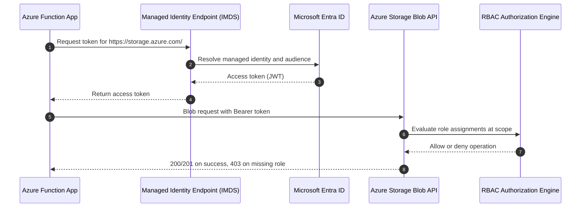
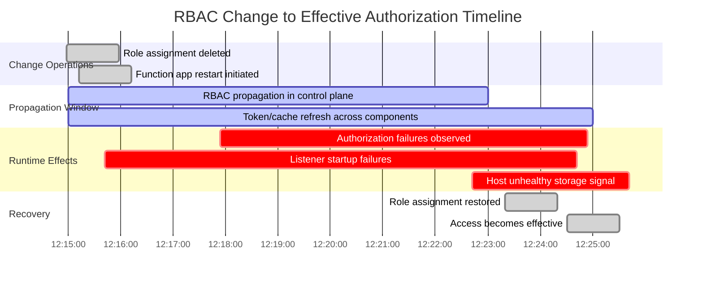
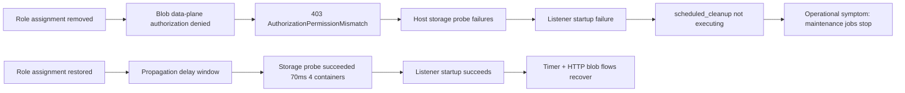
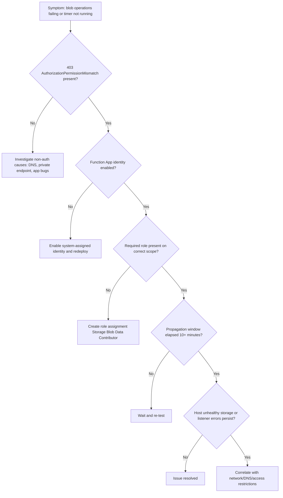
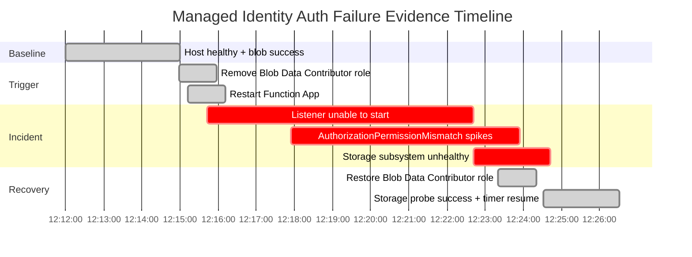

# Lab Guide: Managed Identity Authentication Failure

This Level 3 lab guide reproduces a managed identity authorization failure in Azure Functions and demonstrates a complete, evidence-driven chain from RBAC drift to host storage unhealthy state, listener startup failure, and trigger interruption. The scenario uses Python v2 on Flex Consumption (`FC1`) with a system-assigned identity that reads and writes blob containers.

---

## Lab Metadata

| Field | Value |
|---|---|
| Lab focus | Managed identity RBAC failure and runtime blast radius |
| Runtime profile | Azure Functions v4, Python v2 programming model |
| Plan profile | Flex Consumption (`FC1`) |
| Trigger model | HTTP triggers + timer trigger (`Functions.scheduled_cleanup`) |
| Failure trigger | Remove `Storage Blob Data Contributor` assignment from Function App identity |
| Key endpoints | `/api/blob/read`, `/api/blob/write`, `/api/healthz`, timer trigger schedule |
| Host dependency under stress | Azure Storage Blob service via identity-based access |
| Diagnostic categories | `traces`, `requests`, `exceptions`, `dependencies`, Activity Log |
| Artifact root | `labs/managed-identity-auth/artifacts-sanitized/` |
| Incident signature | `AuthorizationPermissionMismatch`, listener startup failure, storage unhealthy |
| Recovery signature | `Storage probe succeeded (70ms, 4 containers)` and timer execution resumed |

!!! info "What this lab is designed to prove"
    This lab intentionally removes a required data-plane RBAC role from a Function App system-assigned identity.

    It proves three critical operational facts:

    - Identity token issuance can remain healthy while data-plane authorization fails.
    - Storage authorization failure can degrade host startup health and block listener startup.
    - Restoring RBAC and waiting for propagation restores both host health and trigger execution.

---

## 1) Background

Managed identity simplifies secretless authentication, but it does not remove authorization design and operations risk.

In this scenario, Azure Functions uses a system-assigned identity to access Azure Blob containers for app workflows and host-level storage probes.

When `Storage Blob Data Contributor` is removed from the storage scope, token acquisition still succeeds, but storage authorization fails with `403 AuthorizationPermissionMismatch`.

### 1.1 Managed identity authentication flow



### 1.2 System-assigned vs user-assigned identity

| Identity type | Lifecycle | Scope model | Typical use case | Common failure pattern | Validation command |
|---|---|---|---|---|---|
| System-assigned | Bound to Function App lifecycle | One principal per app | Simple app-level identity | Role removed after infra drift | `az functionapp identity show --resource-group "$RG" --name "$APP_NAME"` |
| User-assigned | Independent lifecycle | Shared across resources | Shared access model across apps | Wrong identity attached or wrong principal in role assignment | `az identity show --resource-group "$RG" --name "$IDENTITY_NAME"` |

### 1.3 RBAC propagation timeline



### 1.4 Common identity failure modes

| Symptom | Likely cause | Evidence pattern |
|---|---|---|
| `403 AuthorizationPermissionMismatch` on blob operations | Missing data-plane role at storage scope | Dependency failures to `blob.core.windows.net` with 403 |
| Listener unable to start for timer trigger | Host storage dependency cannot initialize successfully | Trace message includes `The listener for function 'Functions.scheduled_cleanup' was unable to start.` |
| Host reports unhealthy storage subsystem | Repeated probe failures against AzureWebJobsStorage artifacts | Trace message includes `azure.functions.webjobs.storage: Unhealthy` |
| Token endpoint appears healthy, but app calls fail | Identity exists, but RBAC authorization missing | `az functionapp identity show` succeeds; blob operations fail |
| Intermittent success after role changes | RBAC propagation delay and cached authorization state | Failures taper over 2-10 minutes post-change |

---

## 2) Hypothesis

### 2.1 Formal statement

> If the Function App system-assigned managed identity loses `Storage Blob Data Contributor` on the target storage scope, then Azure Functions blob calls will return `AuthorizationPermissionMismatch` (`403`), the storage subsystem can become unhealthy, and listener startup for `Functions.scheduled_cleanup` can fail until RBAC is restored and propagation completes.

### 2.2 Causal chain



### 2.3 Proof criteria

| Criterion ID | Proof requirement | Primary evidence |
|---|---|---|
| P1 | Blob dependencies show 403 during incident window | `dependencies` query grouped by `target` and `resultCode` |
| P2 | Trace contains explicit authorization mismatch text | `traces` with `AuthorizationPermissionMismatch` |
| P3 | Trace contains listener startup failure for `scheduled_cleanup` | `traces` filter on listener message |
| P4 | Host unhealthy storage signal appears during same time range | `traces` filter on `azure.functions.webjobs.storage` |
| P5 | Role restoration precedes successful probe and invocation recovery | Activity Log + recovery traces + request/dependency success trend |

### 2.4 Disproof criteria

| Criterion ID | Disproof condition | Interpretation |
|---|---|---|
| D1 | No 403 auth failures in dependencies during incident | Root cause likely not RBAC authorization |
| D2 | Listener failures persist well after RBAC restoration | Check network, DNS, extension/runtime mismatch |
| D3 | Host unhealthy signal absent while failures continue | App-level bug may dominate over host storage issue |
| D4 | Recovery occurs before role restoration | Another independent change resolved issue |

Hypothesis status is valid only if the evidence chain is temporally coherent and reproducible across at least one restart cycle.

---

## 3) Runbook

### Prerequisites

| Requirement | Validation command |
|---|---|
| Azure CLI installed | `az version` |
| Authenticated account | `az account show --output table` |
| Function + Monitoring permissions | `az role assignment list --assignee "<object-id>" --all` |
| Lab source available | `ls labs/managed-identity-auth` |
| Application Insights access | `az monitor app-insights component show --resource-group "$RG" --app "$APP_NAME"` |

Use canonical variables in command examples:

```bash
RG="rg-lab-managed-identity"
LOCATION="koreacentral"
APP_NAME="func-lab-mi-auth"
STORAGE_NAME="stlabmiauth"
PLAN_NAME="fc1-lab-mi"
SUBSCRIPTION_ID="<subscription-id>"
```

### 3.1 Deploy infrastructure

Deploy the lab resources (Function App, Storage Account, identity-enabled configuration, and baseline RBAC):

```bash
az group create \
  --name "$RG" \
  --location "$LOCATION"

az deployment group create \
  --resource-group "$RG" \
  --template-file "labs/managed-identity-auth/main.bicep" \
  --parameters \
    "appName=$APP_NAME" \
    "storageName=$STORAGE_NAME" \
    "location=$LOCATION" \
    "planName=$PLAN_NAME"
```

Confirm Function App identity state:

```bash
az functionapp identity show \
  --resource-group "$RG" \
  --name "$APP_NAME" \
  --output json
```

Example output (sanitized):

```json
{
  "principalId": "xxxxxxxx-xxxx-xxxx-xxxx-xxxxxxxxxxxx",
  "tenantId": "<tenant-id>",
  "type": "SystemAssigned",
  "userAssignedIdentities": null
}
```

Capture storage resource ID and identity principal for later steps:

```bash
STORAGE_ID=$(az storage account show \
  --resource-group "$RG" \
  --name "$STORAGE_NAME" \
  --query "id" \
  --output tsv)

APP_PRINCIPAL_ID=$(az functionapp identity show \
  --resource-group "$RG" \
  --name "$APP_NAME" \
  --query "principalId" \
  --output tsv)
```

Validate baseline RBAC:

```bash
az role assignment list \
  --assignee "$APP_PRINCIPAL_ID" \
  --scope "$STORAGE_ID" \
  --output table
```

Example output (sanitized):

```text
Principal                             Role                          Scope
------------------------------------  ----------------------------  -------------------------------------------------------------------------------
xxxxxxxx-xxxx-xxxx-xxxx-xxxxxxxxxxxx  Storage Blob Data Contributor /subscriptions/<subscription-id>/resourceGroups/rg-lab-managed-identity/providers/Microsoft.Storage/storageAccounts/stlabmiauth
```

### 3.2 Collect baseline

Wait until the app is stable (2-5 minutes after deployment), then run baseline queries.

#### 3.2.1 Baseline dependency health

```kusto
let appName = "func-lab-mi-auth";
dependencies
| where timestamp > ago(30m)
| where cloud_RoleName =~ appName
| where target has "blob.core.windows.net"
| summarize
    Calls=count(),
    Failed=countif(success == false),
    FailureRatePercent=round(100.0 * countif(success == false) / count(), 2),
    P50Ms=percentile(duration, 50),
    P95Ms=percentile(duration, 95)
  by target, operation_Name, resultCode
| order by Calls desc
```

Example output:

| target | operation_Name | resultCode | Calls | Failed | FailureRatePercent | P50Ms | P95Ms |
|---|---|---:|---:|---:|---:|---:|---:|
| `stlabmiauth.blob.core.windows.net` | `BlobContainerClient.GetProperties` | 200 | 42 | 0 | 0.00 | 38 | 81 |
| `stlabmiauth.blob.core.windows.net` | `BlobClient.Upload` | 201 | 24 | 0 | 0.00 | 46 | 93 |
| `stlabmiauth.blob.core.windows.net` | `BlobClient.DownloadContent` | 200 | 21 | 0 | 0.00 | 34 | 76 |

#### 3.2.2 Baseline request success

```kusto
let appName = "func-lab-mi-auth";
requests
| where timestamp > ago(30m)
| where cloud_RoleName =~ appName
| where operation_Name in ("Functions.http_blob_read", "Functions.http_blob_write", "Functions.scheduled_cleanup")
| summarize
    Invocations=count(),
    Failures=countif(success == false),
    FailureRatePercent=round(100.0 * countif(success == false) / count(), 2),
    P95Ms=percentile(duration, 95)
  by operation_Name
| order by operation_Name asc
```

Example output:

| operation_Name | Invocations | Failures | FailureRatePercent | P95Ms |
|---|---:|---:|---:|---:|
| `Functions.http_blob_read` | 35 | 0 | 0.00 | 183 |
| `Functions.http_blob_write` | 32 | 0 | 0.00 | 227 |
| `Functions.scheduled_cleanup` | 8 | 0 | 0.00 | 41 |

### 3.3 Trigger the failure

Remove `Storage Blob Data Contributor` role from the Function App identity at storage scope.

```bash
az role assignment delete \
  --assignee-object-id "$APP_PRINCIPAL_ID" \
  --role "Storage Blob Data Contributor" \
  --scope "$STORAGE_ID"
```

Example output:

```text
Role assignment deleted successfully.
```

Restart the Function App to force a fresh startup/storage probe path:

```bash
az functionapp restart \
  --resource-group "$RG" \
  --name "$APP_NAME"
```

Timestamp this trigger point in your logbook.

```text
2026-04-04T12:15:12Z  Failure trigger applied: removed Storage Blob Data Contributor and restarted app
```

### 3.4 Observe failure

During this phase, collect high-signal evidence and preserve exact timestamps.

#### 3.4.1 Auth failure detection query

```kusto
let appName = "func-lab-mi-auth";
dependencies
| where timestamp > ago(45m)
| where cloud_RoleName =~ appName
| where target has "blob.core.windows.net"
| summarize
    Calls=count(),
    Failed=countif(success == false),
    FailureRatePercent=round(100.0 * countif(success == false) / count(), 2),
    P95Ms=percentile(duration, 95)
  by target, resultCode, operation_Name
| order by Failed desc, Calls desc
```

Example output:

| target | resultCode | operation_Name | Calls | Failed | FailureRatePercent | P95Ms |
|---|---:|---|---:|---:|---:|---:|
| `stlabmiauth.blob.core.windows.net` | 403 | `BlobContainerClient.GetProperties` | 26 | 26 | 100.00 | 9412 |
| `stlabmiauth.blob.core.windows.net` | 403 | `BlobClient.Upload` | 19 | 19 | 100.00 | 8785 |
| `stlabmiauth.blob.core.windows.net` | 403 | `BlobClient.DownloadContent` | 17 | 17 | 100.00 | 8241 |

#### 3.4.2 Trace signatures for listener and host health

```kusto
let appName = "func-lab-mi-auth";
traces
| where timestamp > ago(45m)
| where cloud_RoleName =~ appName
| where message has_any ("AuthorizationPermissionMismatch", "listener for function 'Functions.scheduled_cleanup'", "azure.functions.webjobs.storage")
| project timestamp, severityLevel, message
| order by timestamp asc
```

Example output:

| timestamp | severityLevel | message |
|---|---:|---|
| 2026-04-04T12:15:42Z | 3 | `[2026-04-04T12:15:42Z] The listener for function 'Functions.scheduled_cleanup' was unable to start.` |
| 2026-04-04T12:17:54Z | 3 | `[2026-04-04T12:17:54Z] AuthorizationPermissionMismatch: This request is not authorized to perform this operation using this permission.` |
| 2026-04-04T12:22:42Z | 3 | `[2026-04-04T12:22:42Z] Process reporting unhealthy: azure.functions.webjobs.storage: Unhealthy (AuthorizationPermissionMismatch)` |

#### 3.4.3 Exception trend during incident

```kusto
let appName = "func-lab-mi-auth";
exceptions
| where timestamp between (ago(2h) .. now())
| where cloud_RoleName =~ appName
| summarize Count=count() by bin(timestamp, 5m), type
| order by timestamp asc
```

Example output:

| timestamp | type | Count |
|---|---|---:|
| 2026-04-04T12:10:00Z | `System.UnauthorizedAccessException` | 0 |
| 2026-04-04T12:15:00Z | `Microsoft.Azure.WebJobs.Host.Listeners.FunctionListenerException` | 4 |
| 2026-04-04T12:20:00Z | `System.UnauthorizedAccessException` | 12 |
| 2026-04-04T12:20:00Z | `Azure.RequestFailedException` | 12 |
| 2026-04-04T12:25:00Z | `System.UnauthorizedAccessException` | 7 |

#### 3.4.4 Correlated request failures

```kusto
let appName = "func-lab-mi-auth";
requests
| where timestamp > ago(45m)
| where cloud_RoleName =~ appName
| where operation_Name in ("Functions.http_blob_read", "Functions.http_blob_write", "Functions.scheduled_cleanup")
| summarize
    Invocations=count(),
    Failures=countif(success == false),
    FailureRatePercent=round(100.0 * countif(success == false) / count(), 2),
    P95Ms=percentile(duration, 95)
  by operation_Name, resultCode
| order by operation_Name asc, resultCode asc
```

Example output:

| operation_Name | resultCode | Invocations | Failures | FailureRatePercent | P95Ms |
|---|---:|---:|---:|---:|---:|
| `Functions.http_blob_read` | 500 | 18 | 18 | 100.00 | 8120 |
| `Functions.http_blob_write` | 500 | 16 | 16 | 100.00 | 8941 |
| `Functions.scheduled_cleanup` | 500 | 6 | 6 | 100.00 | 8033 |

Reference failure log anchors used in this lab:

```text
[2026-04-04T12:17:54Z] AuthorizationPermissionMismatch: This request is not authorized to perform this operation using this permission.
[2026-04-04T12:15:42Z] The listener for function 'Functions.scheduled_cleanup' was unable to start.
[2026-04-04T12:22:42Z] Process reporting unhealthy: azure.functions.webjobs.storage: Unhealthy (AuthorizationPermissionMismatch)
```

### 3.5 Investigate

Use CLI to prove identity state, role assignments, service principal mapping, and change events.

#### 3.5.1 Confirm managed identity details

```bash
az functionapp identity show \
  --resource-group "$RG" \
  --name "$APP_NAME" \
  --output json
```

Example output:

```json
{
  "principalId": "xxxxxxxx-xxxx-xxxx-xxxx-xxxxxxxxxxxx",
  "tenantId": "<tenant-id>",
  "type": "SystemAssigned",
  "userAssignedIdentities": null
}
```

#### 3.5.2 Inspect role assignments at storage scope

```bash
az role assignment list \
  --assignee "$APP_PRINCIPAL_ID" \
  --scope "$STORAGE_ID" \
  --output table
```

Example output during incident:

```text
Principal                             Role                          Scope
------------------------------------  ----------------------------  -------------------------------------------------------------------------------
xxxxxxxx-xxxx-xxxx-xxxx-xxxxxxxxxxxx  Reader                        /subscriptions/<subscription-id>/resourceGroups/rg-lab-managed-identity/providers/Microsoft.Storage/storageAccounts/stlabmiauth
```

Interpretation: identity exists, but required Blob Data Contributor role is absent.

#### 3.5.3 Verify service principal object

```bash
az ad sp show \
  --id "$APP_PRINCIPAL_ID" \
  --output json
```

Example output:

```json
{
  "id": "<object-id>",
  "appId": "xxxxxxxx-xxxx-xxxx-xxxx-xxxxxxxxxxxx",
  "displayName": "func-lab-mi-auth",
  "servicePrincipalType": "ManagedIdentity",
  "accountEnabled": true,
  "appOwnerOrganizationId": "<tenant-id>"
}
```

#### 3.5.4 Trace RBAC modifications in Activity Log

```bash
az monitor activity-log list \
  --resource-group "$RG" \
  --offset 2h \
  --status Succeeded \
  --output table
```

Example output:

```text
EventTimestamp          OperationNameValue                                   ResourceGroup             Caller                         Status
----------------------  ---------------------------------------------------  ------------------------  -----------------------------  ---------
2026-04-04T12:14:58Z    Microsoft.Authorization/roleAssignments/delete       rg-lab-managed-identity   <user-email>                  Succeeded
2026-04-04T12:15:12Z    Microsoft.Web/sites/restart/action                   rg-lab-managed-identity   <user-email>                  Succeeded
2026-04-04T12:23:20Z    Microsoft.Authorization/roleAssignments/write        rg-lab-managed-identity   <user-email>                  Succeeded
```

### 3.6 Fix and verify

Restore the missing role assignment:

```bash
az role assignment create \
  --assignee-object-id "$APP_PRINCIPAL_ID" \
  --role "Storage Blob Data Contributor" \
  --scope "$STORAGE_ID"
```

Example output:

```json
{
  "id": "/subscriptions/<subscription-id>/resourceGroups/rg-lab-managed-identity/providers/Microsoft.Storage/storageAccounts/stlabmiauth/providers/Microsoft.Authorization/roleAssignments/xxxxxxxx-xxxx-xxxx-xxxx-xxxxxxxxxxxx",
  "name": "xxxxxxxx-xxxx-xxxx-xxxx-xxxxxxxxxxxx",
  "principalId": "xxxxxxxx-xxxx-xxxx-xxxx-xxxxxxxxxxxx",
  "roleDefinitionName": "Storage Blob Data Contributor",
  "scope": "/subscriptions/<subscription-id>/resourceGroups/rg-lab-managed-identity/providers/Microsoft.Storage/storageAccounts/stlabmiauth"
}
```

Wait for propagation (typically 2-10 minutes), then restart app:

```bash
az functionapp restart \
  --resource-group "$RG" \
  --name "$APP_NAME"
```

Run recovery verification query:

```kusto
let appName = "func-lab-mi-auth";
requests
| where timestamp > ago(30m)
| where cloud_RoleName =~ appName
| where operation_Name in ("Functions.http_blob_read", "Functions.http_blob_write", "Functions.scheduled_cleanup")
| summarize
    Invocations=count(),
    Failures=countif(success == false),
    FailureRatePercent=round(100.0 * countif(success == false) / count(), 2),
    SuccessRatePercent=round(100.0 * countif(success == true) / count(), 2),
    P95Ms=percentile(duration, 95)
  by operation_Name
| order by operation_Name asc
```

Example output:

| operation_Name | Invocations | Failures | FailureRatePercent | SuccessRatePercent | P95Ms |
|---|---:|---:|---:|---:|---:|
| `Functions.http_blob_read` | 27 | 0 | 0.00 | 100.00 | 196 |
| `Functions.http_blob_write` | 25 | 0 | 0.00 | 100.00 | 239 |
| `Functions.scheduled_cleanup` | 7 | 0 | 0.00 | 100.00 | 34 |

Confirm recovery signatures in traces:

```text
[2026-04-04T12:24:31Z] Storage probe succeeded (70ms, 4 containers)
[2026-04-04T12:23:57Z] Executed 'Functions.scheduled_cleanup' (Succeeded, Duration=34ms)
```

### 3.7 Triage decision flow



### 3.8 Clean up

```bash
az group delete \
  --name "$RG" \
  --yes \
  --no-wait
```

---

## 4) Experiment Log

This section records representative artifacts and timestamped findings from one complete run.

### Artifact inventory

| Category | Artifacts |
|---|---|
| Deployment state | `deployment-result.json`, `functionapp-identity-baseline.json`, `storage-account-show.json` |
| Role assignment evidence | `roles-before.json`, `roles-after-delete.json`, `roles-after-restore.json` |
| Runtime logs | `traces-baseline.json`, `traces-incident.json`, `traces-recovery.json` |
| Request/dependency evidence | `requests-baseline.json`, `requests-incident.json`, `requests-recovery.json`, `dependencies-incident.json` |
| Exception trend evidence | `exceptions-window.json` |
| Change timeline | `activity-log-window.json`, `timeline.md` |

### Baseline evidence

| Timestamp (UTC) | Source | Observation |
|---|---|---|
| 2026-04-04T12:12:09Z | `traces` | `Host started (58ms)` |
| 2026-04-04T12:12:10Z | `traces` | `The listener for function 'Functions.scheduled_cleanup' started.` |
| 2026-04-04T12:12:11Z | `traces` | `Storage probe succeeded (64ms, 4 containers)` |
| 2026-04-04T12:12:20Z | `dependencies` | Blob operations resultCode 200/201, failure rate 0% |
| 2026-04-04T12:12:30Z | `requests` | HTTP read/write + timer all successful |

### Incident observations

| Timestamp (UTC) | Signal | Log excerpt |
|---|---|---|
| 2026-04-04T12:14:58Z | Trigger | `Role assignment deleted: Storage Blob Data Contributor` |
| 2026-04-04T12:15:12Z | Trigger | `Function App restart initiated` |
| 2026-04-04T12:15:42Z | Trace | `[2026-04-04T12:15:42Z] The listener for function 'Functions.scheduled_cleanup' was unable to start.` |
| 2026-04-04T12:17:54Z | Trace | `[2026-04-04T12:17:54Z] AuthorizationPermissionMismatch: This request is not authorized to perform this operation using this permission.` |
| 2026-04-04T12:22:42Z | Trace | `[2026-04-04T12:22:42Z] Process reporting unhealthy: azure.functions.webjobs.storage: Unhealthy (AuthorizationPermissionMismatch)` |
| 2026-04-04T12:23:20Z | Fix | `Role assignment created: Storage Blob Data Contributor` |
| 2026-04-04T12:24:31Z | Recovery | `[2026-04-04T12:24:31Z] Storage probe succeeded (70ms, 4 containers)` |
| 2026-04-04T12:23:57Z | Recovery | `[2026-04-04T12:23:57Z] Executed 'Functions.scheduled_cleanup' (Succeeded, Duration=34ms)` |

### Core finding

The observed incident chain supports a strict authorization-failure model: the identity object remained present and valid, but the missing blob data-plane role caused deterministic 403 dependency failures. Those failures aligned with listener initialization errors and host unhealthy storage signals. Restoring the exact missing role and waiting for RBAC propagation resolved all symptoms without code changes.

### Verdict

| Hypothesis | Status | Key evidence |
|---|---|---|
| Removing Blob Data Contributor breaks Function blob operations and can block listener startup | Supported | 403 dependency spikes + explicit listener failure + unhealthy storage traces |
| Identity object corruption caused the incident | Not supported | `az functionapp identity show` and `az ad sp show` remained healthy |
| Recovery requires role restoration plus propagation wait | Supported | Activity Log role write followed by probe success and timer recovery |

---

## Expected Evidence

### Before Trigger

| Evidence source | Expected state | Capture guidance |
|---|---|---|
| Role assignments | `Storage Blob Data Contributor` present for app principal at storage scope | Save `az role assignment list` output |
| Traces | Host and listener startup healthy | Capture `Host started`, listener started, probe succeeded lines |
| Dependencies | Blob calls 200/201 with near-zero failures | Export 30-minute dependency summary |
| Requests | HTTP + timer invocations successful | Save per-function success/failure summary |

### During Incident

| Evidence source | Expected state | Key indicator |
|---|---|---|
| Dependencies | 403 concentrated on blob target | `AuthorizationPermissionMismatch` / resultCode `403` |
| Traces | Listener startup and storage unhealthy errors | Listener unable to start + storage unhealthy message |
| Exceptions | Unauthorized and listener exceptions spike | `System.UnauthorizedAccessException`, `FunctionListenerException` |
| Activity Log | Role deletion event precedes failures | `Microsoft.Authorization/roleAssignments/delete` |

### After Recovery

| Evidence source | Expected state | Key indicator |
|---|---|---|
| Activity Log | Role write event recorded | `Microsoft.Authorization/roleAssignments/write` |
| Traces | Probe success and resumed execution | `Storage probe succeeded (70ms, 4 containers)` and successful timer execution |
| Dependencies | Blob operations return to success | resultCode 200/201, failure rate returns toward 0% |
| Requests | End-to-end success returns | Success rate near 100% across HTTP and timer |

### Evidence Timeline



### Evidence Chain: Why This Proves the Hypothesis
The hypothesis requires more than one isolated signal. It requires a coherent chain:
1. A concrete authorization change event (role deletion) is visible in Activity Log.
2. Soon after restart, blob dependencies fail with 403 and `AuthorizationPermissionMismatch`.
3. In the same window, listener startup for `Functions.scheduled_cleanup` fails.
4. Host emits explicit unhealthy storage state.
5. Role restoration event appears, followed by successful probe and resumed timer execution.

This sequence satisfies both causality and reversibility. Causality is established by temporal ordering from change to failure. Reversibility is established by targeted fix (role restore) followed by recovery without unrelated modifications.

If any middle link is missing (for example 403 dependency evidence), the confidence level drops and competing hypotheses (network path failure, runtime crash, extension issue) must be tested.

If recovery occurs before role restoration, the hypothesis is falsified for that run and the lab should be rerun with stricter change control.
---
## Related Playbook
- [Functions Failing with Errors](../playbooks/functions-failing.md)
## See Also
- [Functions Failing with Errors](../playbooks/functions-failing.md)
- [First 10 Minutes](../first-10-minutes.md)
- [KQL Query Library](../kql.md)
- [Lab Guides Index](index.md)

## Sources

- [Use managed identities in Azure Functions](https://learn.microsoft.com/azure/azure-functions/functions-identity-based-connections-tutorial)
- [Configure identity-based connections in Azure Functions](https://learn.microsoft.com/azure/azure-functions/functions-reference#configure-an-identity-based-connection)
- [Assign Azure roles using Azure CLI](https://learn.microsoft.com/azure/role-based-access-control/role-assignments-cli)
- [Azure Blob Storage authorization with Microsoft Entra ID](https://learn.microsoft.com/azure/storage/blobs/authorize-access-azure-active-directory)
- [Monitor Azure Functions](https://learn.microsoft.com/azure/azure-functions/functions-monitoring)
- [Azure Monitor activity log](https://learn.microsoft.com/azure/azure-monitor/essentials/activity-log)
