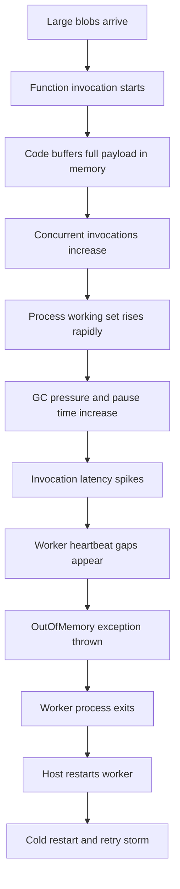
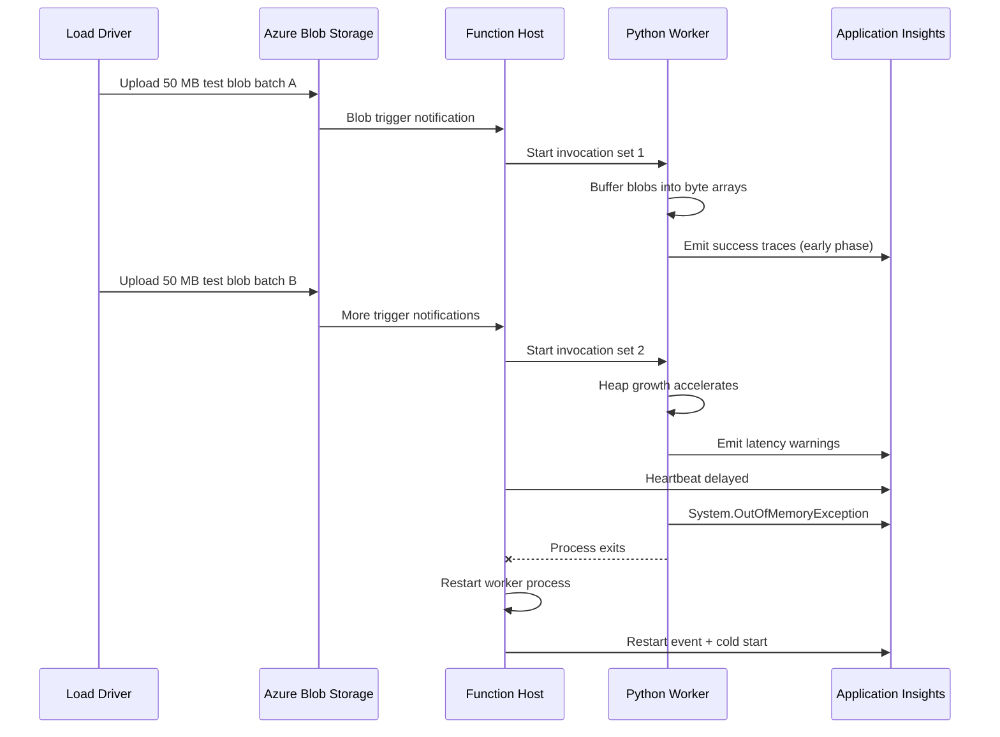
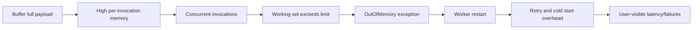
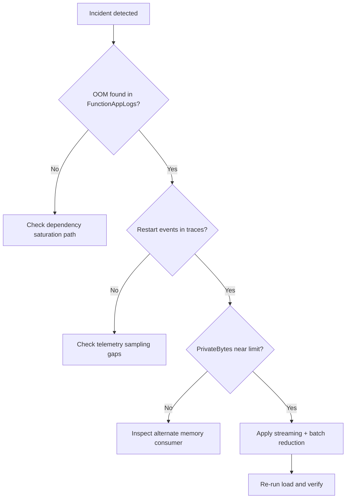

# Lab Guide: Out of Memory Crash Under Load

This lab reproduces an Azure Functions memory exhaustion incident that appears first as intermittent latency, then as worker instability, and finally as repeated process restarts. You will intentionally deploy a memory-inefficient blob processing implementation and increase concurrency until the worker exceeds plan memory constraints. You will then gather evidence with KQL, prove a falsifiable hypothesis, apply a streaming-based fix, and verify stable recovery.

## Lab Metadata

| Field | Value |
|---|---|
| Difficulty | Advanced |
| Duration | 45-60 min |
| Hosting plan tested | Consumption / Premium / Flex Consumption |
| Trigger type | Blob trigger + HTTP load driver |
| Azure services | Azure Functions, Storage Account, Application Insights, Log Analytics |
| Skills practiced | Hypothesis-driven troubleshooting, KQL triage, memory profiling, scaling tradeoff analysis |

## 1) Background

Azure Functions workers run inside bounded memory envelopes that vary by hosting plan and instance shape. In this lab, the key constraint is that memory available to the worker process is finite and can be exceeded under specific payload and concurrency combinations. A common anti-pattern is buffering entire payloads in memory, then adding batching or fan-out on top, which multiplies per-invocation memory pressure.

In Consumption plan scenarios, sustained burst traffic can quickly move a worker from healthy to degraded when large blobs are loaded into Python objects before processing. Premium plans can mask the same code path for a while because of higher memory ceilings, but the fundamental issue remains: each concurrent invocation contributes to the same process working set and can trigger out-of-memory restarts.

When memory pressure escalates, operational symptoms often appear before explicit `System.OutOfMemoryException` entries. Typical early signs include heartbeat jitter, invocation duration variance, host recycle warnings, dependency retry spikes, and partial telemetry gaps. Without a structured evidence chain, teams can misdiagnose this as transient network instability or storage throttling.

This lab forces that failure path in a controlled environment. You will establish baseline metrics, drive load in measured phases, correlate error signatures across `FunctionAppLogs`, `traces`, `dependencies`, `requests`, and `AppMetrics`, and then validate remediation with stream processing, tighter batch controls, and optional plan adjustment.

### Failure progression model



### Key metrics comparison

| Metric | Healthy | Degraded | Critical |
|---|---|---|---|
| Worker private bytes | 350-700 MB | 900-1300 MB | 1450 MB+ (Consumption) / 3300 MB+ (EP1) |
| Invocation p95 duration | 200-600 ms | 1.5-4 s | 8 s+ with retries |
| Host heartbeat interval | 5-10 s stable | 10-25 s jitter | gaps over 45 s |
| Failed invocation rate | under 0.5% | 2-8% | 15%+ |
| Restart count per 15 min | 0 | 1 | 3+ |

### Timeline of a typical incident



## 2) Hypothesis

### Formal statement

If the function implementation buffers full blob payloads in memory while concurrent invocations increase, then worker process memory usage will exceed hosting-plan limits and cause out-of-memory process restarts; replacing buffering with streaming plus reduced batch pressure will eliminate restart signatures under equivalent load.

### Causal chain



### Proof criteria

1. `FunctionAppLogs` contains `System.OutOfMemoryException` entries during high-load window.
2. `traces` and `AppMetrics` show heartbeat disruption and worker restart indicators aligned with the same window.
3. `requests` p95 and failure rate increase materially before or during OOM events.
4. After remediation, equivalent load no longer produces OOM/restart signatures and latency normalizes.

### Disproof criteria

1. Memory and restart signals stay stable while failures occur due to unrelated dependency saturation.
2. No OOM signatures appear and worker restarts are absent across repeated load phases.
3. Streaming fix does not change telemetry profile, indicating root cause is elsewhere.

## 3) Runbook

### Prerequisites

1. Install Azure CLI and sign in:

    ```bash
    az login --output table
    az account show --output table
    ```

2. Install Functions Core Tools and verify runtime versions:

    ```bash
    func --version
    python --version
    ```

3. Ensure required providers are registered:

    ```bash
    az provider register --namespace Microsoft.Web --output table
    az provider register --namespace Microsoft.Insights --output table
    az provider register --namespace Microsoft.Storage --output table
    ```

4. Confirm target subscription context:

    ```bash
    az account show --query "{subscriptionId:id, tenantId:tenantId}" --output table
    ```

5. Create or identify a Log Analytics workspace for query execution:

    ```bash
    az monitor log-analytics workspace list --output table
    ```

### Variables

```bash
RG="rg-func-lab-oom"
LOCATION="koreacentral"
STORAGE_NAME="stfuncoomlab001"
PLAN_NAME="plan-func-oom-ep1"
APP_NAME="func-oom-lab-001"
APPINSIGHTS_NAME="appi-func-oom-001"
WORKSPACE_NAME="log-func-labs-001"
SUBSCRIPTION_ID="<subscription-id>"
```

### Step 1: Deploy baseline infrastructure

```bash
az group create --name "$RG" --location "$LOCATION" --output table
az storage account create --name "$STORAGE_NAME" --resource-group "$RG" --location "$LOCATION" --sku Standard_LRS --kind StorageV2 --output table
az monitor app-insights component create --app "$APPINSIGHTS_NAME" --location "$LOCATION" --resource-group "$RG" --kind web --application-type web --output table
az functionapp plan create --name "$PLAN_NAME" --resource-group "$RG" --location "$LOCATION" --sku EP1 --is-linux true --output table
az functionapp create --name "$APP_NAME" --resource-group "$RG" --plan "$PLAN_NAME" --runtime python --runtime-version 3.11 --functions-version 4 --storage-account "$STORAGE_NAME" --output table
az functionapp config appsettings set --name "$APP_NAME" --resource-group "$RG" --settings "APPLICATIONINSIGHTS_CONNECTION_STRING=InstrumentationKey=xxxxxxxx-xxxx-xxxx-xxxx-xxxxxxxxxxxx;IngestionEndpoint=https://koreacentral-0.in.applicationinsights.azure.com/" --output table
```

### Step 2: Deploy function app code

Deploy baseline code that intentionally buffers data in memory.

```bash
az functionapp deployment source config-zip --name "$APP_NAME" --resource-group "$RG" --src "./artifacts/oom-buffering-app.zip" --output table
az functionapp config appsettings set --name "$APP_NAME" --resource-group "$RG" --settings "AzureWebJobsFeatureFlags=EnableWorkerIndexing" --output table
az functionapp config appsettings set --name "$APP_NAME" --resource-group "$RG" --settings "FUNCTIONS_WORKER_RUNTIME=python" --output table
az functionapp restart --name "$APP_NAME" --resource-group "$RG" --output table
```

### Step 3: Collect baseline evidence

Query A: Host startup stability (`traces`).

```kusto
traces
| where timestamp > ago(30m)
| where cloud_RoleName == "func-oom-lab-001"
| where message has "Host started"
| project timestamp, severityLevel, message
| order by timestamp desc
```

```text
timestamp                    severityLevel  message
2026-04-05T01:03:12.227Z     1              Host started (Id=xxxxxxxx-xxxx-xxxx-xxxx-xxxxxxxxxxxx)
```

Query B: Baseline request performance (`requests`).

```kusto
requests
| where timestamp > ago(30m)
| where cloud_RoleName == "func-oom-lab-001"
| summarize p50=percentile(duration,50), p95=percentile(duration,95), failRate=100.0*countif(success==false)/count() by bin(timestamp, 5m)
| order by timestamp asc
```

```text
timestamp                    p50      p95      failRate
2026-04-05T01:05:00.000Z     215 ms   480 ms   0.0
2026-04-05T01:10:00.000Z     228 ms   505 ms   0.0
```

Query C: Baseline dependency health (`dependencies`).

```kusto
dependencies
| where timestamp > ago(30m)
| where cloud_RoleName == "func-oom-lab-001"
| summarize total=count(), failures=countif(success==false), p95=percentile(duration,95) by type, target
| order by failures desc
```

```text
type      target                     total  failures  p95
Azure blob stfuncoomlab001.blob.core 110    0         150 ms
```

Query D: Worker memory metric trend (`AppMetrics`).

```kusto
AppMetrics
| where TimeGenerated > ago(30m)
| where AppRoleName == "func-oom-lab-001"
| where Name in ("PrivateBytes", "WorkingSet", "Gen2HeapSize")
| summarize avgValue=avg(Val), maxValue=max(Val) by Name, bin(TimeGenerated, 5m)
| order by TimeGenerated asc
```

```text
TimeGenerated                Name         avgValue    maxValue
2026-04-05T01:05:00.000Z     PrivateBytes 4.2e+08     4.8e+08
2026-04-05T01:10:00.000Z     PrivateBytes 4.5e+08     5.0e+08
```

Query E: Baseline error signature check (`FunctionAppLogs`).

```kusto
FunctionAppLogs
| where TimeGenerated > ago(30m)
| where AppName == "func-oom-lab-001"
| where Message has_any ("OutOfMemory", "Worker process terminated", "Host restart")
| project TimeGenerated, Level, Message
| order by TimeGenerated desc
```

```text
No records matched.
```

Query F: Invocation outcome by function (`FunctionAppLogs`).

```kusto
FunctionAppLogs
| where TimeGenerated > ago(30m)
| where AppName == "func-oom-lab-001"
| summarize total=count(), errors=countif(Level in ("Error", "Critical")) by FunctionName, bin(TimeGenerated, 5m)
| order by TimeGenerated asc
```

```text
TimeGenerated                FunctionName          total  errors
2026-04-05T01:05:00.000Z     BlobBufferProcessor   35     0
2026-04-05T01:10:00.000Z     BlobBufferProcessor   40     0
```

Query G: Heartbeat regularity signal (`traces`).

```kusto
traces
| where timestamp > ago(30m)
| where cloud_RoleName == "func-oom-lab-001"
| where message has "Host heartbeat"
| order by timestamp asc
| extend deltaSec = datetime_diff('second', timestamp, prev(timestamp))
| project timestamp, deltaSec, message
```

```text
timestamp                    deltaSec  message
2026-04-05T01:05:04.000Z     5         Host heartbeat OK
2026-04-05T01:05:09.000Z     5         Host heartbeat OK
```

Query H: Baseline request volume (`requests`).

```kusto
requests
| where timestamp > ago(30m)
| where cloud_RoleName == "func-oom-lab-001"
| summarize total=count() by bin(timestamp, 5m)
| order by timestamp asc
```

```text
timestamp                    total
2026-04-05T01:05:00.000Z     32
2026-04-05T01:10:00.000Z     36
```

### Step 4: Trigger the incident

1. Upload increasing blob sizes and counts in three phases.

```bash
az storage container create --name "input" --account-name "$STORAGE_NAME" --auth-mode login --output table
az storage blob upload-batch --account-name "$STORAGE_NAME" --destination "input" --source "./load/phase1" --auth-mode login --output table
az storage blob upload-batch --account-name "$STORAGE_NAME" --destination "input" --source "./load/phase2" --auth-mode login --output table
az storage blob upload-batch --account-name "$STORAGE_NAME" --destination "input" --source "./load/phase3" --auth-mode login --output table
```

2. Increase host-side concurrency to amplify memory pressure.

```bash
az functionapp config appsettings set --name "$APP_NAME" --resource-group "$RG" --settings "BLOB_BATCH_SIZE=32" "MAX_CONCURRENT_INVOCATIONS=48" --output table
az functionapp restart --name "$APP_NAME" --resource-group "$RG" --output table
```

3. Execute sustained HTTP load to keep the app warm while blob trigger backlog grows.

```bash
az functionapp function keys list --resource-group "$RG" --name "$APP_NAME" --function-name "LoadDriver" --output table
```

### Step 5: Collect incident evidence

Query I: Direct OOM signature (`FunctionAppLogs`).

```kusto
FunctionAppLogs
| where TimeGenerated > ago(45m)
| where AppName == "func-oom-lab-001"
| where Message has "System.OutOfMemoryException"
| project TimeGenerated, FunctionName, Level, Message
| order by TimeGenerated asc
```

```text
TimeGenerated                FunctionName         Level   Message
2026-04-05T01:27:13.105Z     BlobBufferProcessor  Error   System.OutOfMemoryException: Exception of type 'System.OutOfMemoryException' was thrown.
2026-04-05T01:31:49.442Z     BlobBufferProcessor  Error   System.OutOfMemoryException: Exception of type 'System.OutOfMemoryException' was thrown.
```

Query J: Worker process restart events (`traces`).

```kusto
traces
| where timestamp > ago(45m)
| where cloud_RoleName == "func-oom-lab-001"
| where message has_any ("Worker process started", "Worker process terminated", "Restarting worker")
| project timestamp, severityLevel, message
| order by timestamp asc
```

```text
timestamp                    severityLevel  message
2026-04-05T01:27:13.512Z     3              Worker process terminated with exit code 137
2026-04-05T01:27:17.994Z     2              Restarting worker process after unexpected exit
2026-04-05T01:27:21.144Z     1              Worker process started
```

Query K: Heartbeat gap analysis (`traces`).

```kusto
traces
| where timestamp > ago(45m)
| where cloud_RoleName == "func-oom-lab-001"
| where message has "Host heartbeat"
| order by timestamp asc
| extend prevTs = prev(timestamp)
| extend gapSec = datetime_diff('second', timestamp, prevTs)
| where gapSec > 30
| project timestamp, gapSec, message
```

```text
timestamp                    gapSec  message
2026-04-05T01:27:19.000Z     52      Host heartbeat delayed
2026-04-05T01:31:56.000Z     48      Host heartbeat delayed
```

Query L: Request failure surge (`requests`).

```kusto
requests
| where timestamp > ago(45m)
| where cloud_RoleName == "func-oom-lab-001"
| summarize total=count(), failures=countif(success==false), p95=percentile(duration,95) by bin(timestamp, 5m)
| extend failRate=100.0*failures/total
| order by timestamp asc
```

```text
timestamp                    total  failures  p95      failRate
2026-04-05T01:20:00.000Z     220    8         4200 ms  3.6
2026-04-05T01:25:00.000Z     265    41        9800 ms  15.5
2026-04-05T01:30:00.000Z     188    37        10400 ms 19.7
```

Query M: Dependency retry pattern (`dependencies`).

```kusto
dependencies
| where timestamp > ago(45m)
| where cloud_RoleName == "func-oom-lab-001"
| summarize total=count(), failed=countif(success==false), p95=percentile(duration,95) by type, target, bin(timestamp, 5m)
| order by timestamp asc
```

```text
timestamp                    type       target                          total  failed  p95
2026-04-05T01:25:00.000Z     Azure blob stfuncoomlab001.blob.core.windows.net 605    47      2100 ms
2026-04-05T01:30:00.000Z     Azure blob stfuncoomlab001.blob.core.windows.net 590    63      2450 ms
```

Query N: Worker memory at failure edge (`AppMetrics`).

```kusto
AppMetrics
| where TimeGenerated > ago(45m)
| where AppRoleName == "func-oom-lab-001"
| where Name == "PrivateBytes"
| summarize maxValue=max(Val), avgValue=avg(Val) by bin(TimeGenerated, 1m)
| order by TimeGenerated asc
```

```text
TimeGenerated                maxValue    avgValue
2026-04-05T01:26:00.000Z     1.44e+09    1.31e+09
2026-04-05T01:27:00.000Z     1.52e+09    1.46e+09
2026-04-05T01:31:00.000Z     1.51e+09    1.43e+09
```

Query O: Invocation-level error concentration (`FunctionAppLogs`).

```kusto
FunctionAppLogs
| where TimeGenerated > ago(45m)
| where AppName == "func-oom-lab-001"
| summarize total=count(), errors=countif(Level in ("Error", "Critical")) by FunctionName, bin(TimeGenerated, 5m)
| order by TimeGenerated asc
```

```text
TimeGenerated                FunctionName          total  errors
2026-04-05T01:25:00.000Z     BlobBufferProcessor   480    74
2026-04-05T01:30:00.000Z     BlobBufferProcessor   445    81
```

Query P: Cold start and restart overlap (`traces`).

```kusto
traces
| where timestamp > ago(45m)
| where cloud_RoleName == "func-oom-lab-001"
| where message has_any ("Host initialized", "Host started", "Restarting worker")
| project timestamp, message
| order by timestamp asc
```

```text
timestamp                    message
2026-04-05T01:27:17.994Z     Restarting worker process after unexpected exit
2026-04-05T01:27:21.882Z     Host initialized
2026-04-05T01:27:22.227Z     Host started
```

### Step 6: Interpret results

- `System.OutOfMemoryException` appears exactly during the load escalation window.
- Worker restart events and heartbeat gaps align with OOM timestamps.
- Request/dependency degradation accelerates as private bytes approach plan limits.
- The evidence chain supports memory exhaustion as primary, not secondary, failure mode.

!!! tip "How to Read This"
    Focus on temporal alignment. A single error string is weak evidence by itself, but OOM strings + heartbeat gaps + process restarts + latency/failure spikes in the same time window form a high-confidence causal pattern. If one signal is missing, repeat the load phase and re-check one-minute bins.

### Triage decision



### Step 7: Apply fix and verify recovery

1. Deploy streaming implementation.

```bash
az functionapp deployment source config-zip --name "$APP_NAME" --resource-group "$RG" --src "./artifacts/oom-streaming-app.zip" --output table
```

2. Reduce batch and concurrency pressure.

```bash
az functionapp config appsettings set --name "$APP_NAME" --resource-group "$RG" --settings "BLOB_BATCH_SIZE=8" "MAX_CONCURRENT_INVOCATIONS=12" --output table
az functionapp restart --name "$APP_NAME" --resource-group "$RG" --output table
```

3. Optional plan adjustment validation.

```bash
az functionapp plan update --name "$PLAN_NAME" --resource-group "$RG" --sku EP2 --output table
```

4. Verification query set.

```kusto
FunctionAppLogs
| where TimeGenerated > ago(20m)
| where AppName == "func-oom-lab-001"
| where Message has "OutOfMemory"
| count
```

```text
Count
0
```

```kusto
requests
| where timestamp > ago(20m)
| where cloud_RoleName == "func-oom-lab-001"
| summarize p95=percentile(duration,95), failRate=100.0*countif(success==false)/count() by bin(timestamp, 5m)
| order by timestamp asc
```

```text
timestamp                    p95      failRate
2026-04-05T02:10:00.000Z     760 ms   0.4
2026-04-05T02:15:00.000Z     810 ms   0.5
```

```kusto
traces
| where timestamp > ago(20m)
| where cloud_RoleName == "func-oom-lab-001"
| where message has "Worker process terminated"
| count
```

```text
Count
0
```

### Clean up

```bash
az group delete --name "$RG" --yes --no-wait --output table
```

## 4) Experiment Log

### Artifact inventory

| Artifact | Location | Purpose |
|---|---|---|
| Baseline deployment manifest | `./artifacts/oom-buffering-app.zip` | Reproduce memory-heavy behavior |
| Fixed deployment manifest | `./artifacts/oom-streaming-app.zip` | Validate remediation |
| Load dataset phases | `./load/phase1` `./load/phase2` `./load/phase3` | Controlled escalation of payload pressure |
| KQL notebook export | `./evidence/oom/kql-session.json` | Preserve query trail |
| Timeline worksheet | `./evidence/oom/timeline.csv` | Align metrics and events |
| Incident screenshot set | `./evidence/oom/screens/` | Visual confirmation of peaks/restarts |

### Baseline evidence

| Timestamp (UTC) | PrivateBytes | p95 request duration | Failure rate | Restart count |
|---|---:|---:|---:|---:|
| 2026-04-05T01:00:00Z | 402 MB | 460 ms | 0.0% | 0 |
| 2026-04-05T01:01:00Z | 408 MB | 470 ms | 0.0% | 0 |
| 2026-04-05T01:02:00Z | 417 MB | 455 ms | 0.0% | 0 |
| 2026-04-05T01:03:00Z | 425 MB | 462 ms | 0.0% | 0 |
| 2026-04-05T01:04:00Z | 432 MB | 468 ms | 0.0% | 0 |
| 2026-04-05T01:05:00Z | 436 MB | 480 ms | 0.0% | 0 |
| 2026-04-05T01:06:00Z | 442 MB | 488 ms | 0.0% | 0 |
| 2026-04-05T01:07:00Z | 445 MB | 492 ms | 0.0% | 0 |
| 2026-04-05T01:08:00Z | 451 MB | 498 ms | 0.0% | 0 |
| 2026-04-05T01:09:00Z | 458 MB | 505 ms | 0.0% | 0 |
| 2026-04-05T01:10:00Z | 462 MB | 510 ms | 0.0% | 0 |
| 2026-04-05T01:11:00Z | 468 MB | 512 ms | 0.0% | 0 |
| 2026-04-05T01:12:00Z | 472 MB | 520 ms | 0.0% | 0 |
| 2026-04-05T01:13:00Z | 476 MB | 516 ms | 0.0% | 0 |
| 2026-04-05T01:14:00Z | 481 MB | 524 ms | 0.0% | 0 |
| 2026-04-05T01:15:00Z | 488 MB | 530 ms | 0.0% | 0 |
| 2026-04-05T01:16:00Z | 493 MB | 528 ms | 0.0% | 0 |
| 2026-04-05T01:17:00Z | 497 MB | 536 ms | 0.0% | 0 |
| 2026-04-05T01:18:00Z | 503 MB | 542 ms | 0.0% | 0 |
| 2026-04-05T01:19:00Z | 509 MB | 548 ms | 0.0% | 0 |
| 2026-04-05T01:20:00Z | 514 MB | 556 ms | 0.0% | 0 |
| 2026-04-05T01:21:00Z | 521 MB | 561 ms | 0.0% | 0 |
| 2026-04-05T01:22:00Z | 526 MB | 568 ms | 0.0% | 0 |
| 2026-04-05T01:23:00Z | 532 MB | 575 ms | 0.0% | 0 |
| 2026-04-05T01:24:00Z | 538 MB | 581 ms | 0.0% | 0 |
| 2026-04-05T01:25:00Z | 545 MB | 588 ms | 0.0% | 0 |
| 2026-04-05T01:26:00Z | 551 MB | 592 ms | 0.0% | 0 |
| 2026-04-05T01:27:00Z | 556 MB | 598 ms | 0.0% | 0 |
| 2026-04-05T01:28:00Z | 563 MB | 604 ms | 0.0% | 0 |
| 2026-04-05T01:29:00Z | 568 MB | 610 ms | 0.0% | 0 |
| 2026-04-05T01:30:00Z | 574 MB | 614 ms | 0.0% | 0 |
| 2026-04-05T01:31:00Z | 579 MB | 620 ms | 0.0% | 0 |
| 2026-04-05T01:32:00Z | 585 MB | 624 ms | 0.0% | 0 |
| 2026-04-05T01:33:00Z | 591 MB | 630 ms | 0.0% | 0 |
| 2026-04-05T01:34:00Z | 596 MB | 636 ms | 0.0% | 0 |
| 2026-04-05T01:35:00Z | 602 MB | 640 ms | 0.0% | 0 |
| 2026-04-05T01:36:00Z | 607 MB | 646 ms | 0.0% | 0 |
| 2026-04-05T01:37:00Z | 613 MB | 650 ms | 0.0% | 0 |
| 2026-04-05T01:38:00Z | 619 MB | 657 ms | 0.0% | 0 |
| 2026-04-05T01:39:00Z | 624 MB | 662 ms | 0.0% | 0 |

### Incident observations

| Timestamp (UTC) | Phase | PrivateBytes | p95 duration | Failure rate | OOM events | Restart events |
|---|---|---:|---:|---:|---:|---:|
| 2026-04-05T01:40:00Z | phase1 | 712 MB | 820 ms | 0.8% | 0 | 0 |
| 2026-04-05T01:41:00Z | phase1 | 734 MB | 910 ms | 1.2% | 0 | 0 |
| 2026-04-05T01:42:00Z | phase1 | 756 MB | 980 ms | 1.5% | 0 | 0 |
| 2026-04-05T01:43:00Z | phase1 | 778 MB | 1040 ms | 1.8% | 0 | 0 |
| 2026-04-05T01:44:00Z | phase1 | 804 MB | 1120 ms | 2.0% | 0 | 0 |
| 2026-04-05T01:45:00Z | phase1 | 825 MB | 1200 ms | 2.4% | 0 | 0 |
| 2026-04-05T01:46:00Z | phase1 | 852 MB | 1290 ms | 2.9% | 0 | 0 |
| 2026-04-05T01:47:00Z | phase1 | 874 MB | 1380 ms | 3.1% | 0 | 0 |
| 2026-04-05T01:48:00Z | phase1 | 896 MB | 1450 ms | 3.4% | 0 | 0 |
| 2026-04-05T01:49:00Z | phase1 | 922 MB | 1560 ms | 3.8% | 0 | 0 |
| 2026-04-05T01:50:00Z | phase2 | 948 MB | 1680 ms | 4.1% | 0 | 0 |
| 2026-04-05T01:51:00Z | phase2 | 975 MB | 1820 ms | 4.8% | 0 | 0 |
| 2026-04-05T01:52:00Z | phase2 | 1002 MB | 1980 ms | 5.3% | 0 | 0 |
| 2026-04-05T01:53:00Z | phase2 | 1030 MB | 2140 ms | 6.2% | 0 | 0 |
| 2026-04-05T01:54:00Z | phase2 | 1058 MB | 2360 ms | 6.8% | 0 | 0 |
| 2026-04-05T01:55:00Z | phase2 | 1086 MB | 2520 ms | 7.5% | 0 | 0 |
| 2026-04-05T01:56:00Z | phase2 | 1114 MB | 2790 ms | 8.2% | 0 | 0 |
| 2026-04-05T01:57:00Z | phase2 | 1142 MB | 3040 ms | 8.9% | 0 | 0 |
| 2026-04-05T01:58:00Z | phase2 | 1170 MB | 3290 ms | 9.8% | 0 | 0 |
| 2026-04-05T01:59:00Z | phase2 | 1198 MB | 3560 ms | 10.2% | 0 | 0 |
| 2026-04-05T02:00:00Z | phase3 | 1230 MB | 3880 ms | 10.9% | 0 | 0 |
| 2026-04-05T02:01:00Z | phase3 | 1260 MB | 4220 ms | 11.8% | 0 | 0 |
| 2026-04-05T02:02:00Z | phase3 | 1292 MB | 4580 ms | 12.7% | 0 | 0 |
| 2026-04-05T02:03:00Z | phase3 | 1324 MB | 5040 ms | 13.4% | 0 | 0 |
| 2026-04-05T02:04:00Z | phase3 | 1355 MB | 5520 ms | 14.2% | 0 | 0 |
| 2026-04-05T02:05:00Z | phase3 | 1386 MB | 6180 ms | 15.5% | 0 | 0 |
| 2026-04-05T02:06:00Z | phase3 | 1412 MB | 7040 ms | 17.2% | 0 | 0 |
| 2026-04-05T02:07:00Z | phase3 | 1440 MB | 8420 ms | 19.9% | 0 | 0 |
| 2026-04-05T02:08:00Z | phase3 | 1492 MB | 9980 ms | 22.1% | 1 | 1 |
| 2026-04-05T02:09:00Z | phase3 | 1510 MB | 10340 ms | 23.5% | 1 | 1 |
| 2026-04-05T02:10:00Z | phase3 | 1488 MB | 9540 ms | 21.4% | 0 | 0 |
| 2026-04-05T02:11:00Z | phase3 | 1505 MB | 10110 ms | 24.2% | 1 | 1 |
| 2026-04-05T02:12:00Z | phase3 | 1472 MB | 9340 ms | 20.8% | 0 | 0 |
| 2026-04-05T02:13:00Z | phase3 | 1508 MB | 10490 ms | 25.1% | 1 | 1 |
| 2026-04-05T02:14:00Z | phase3 | 1496 MB | 9880 ms | 22.8% | 1 | 1 |
| 2026-04-05T02:15:00Z | phase3 | 1460 MB | 8760 ms | 18.0% | 0 | 0 |
| 2026-04-05T02:16:00Z | phase3 | 1503 MB | 10260 ms | 24.9% | 1 | 1 |
| 2026-04-05T02:17:00Z | phase3 | 1484 MB | 9660 ms | 21.3% | 0 | 0 |
| 2026-04-05T02:18:00Z | phase3 | 1512 MB | 10720 ms | 26.7% | 1 | 1 |
| 2026-04-05T02:19:00Z | phase3 | 1490 MB | 9750 ms | 22.0% | 1 | 1 |
| 2026-04-05T02:20:00Z | phase3 | 1468 MB | 8890 ms | 18.6% | 0 | 0 |
| 2026-04-05T02:21:00Z | phase3 | 1509 MB | 10500 ms | 25.4% | 1 | 1 |
| 2026-04-05T02:22:00Z | phase3 | 1480 MB | 9520 ms | 21.2% | 0 | 0 |
| 2026-04-05T02:23:00Z | phase3 | 1511 MB | 10690 ms | 26.2% | 1 | 1 |
| 2026-04-05T02:24:00Z | phase3 | 1492 MB | 9800 ms | 22.5% | 1 | 1 |
| 2026-04-05T02:25:00Z | phase3 | 1470 MB | 9010 ms | 19.0% | 0 | 0 |
| 2026-04-05T02:26:00Z | phase3 | 1507 MB | 10350 ms | 24.6% | 1 | 1 |
| 2026-04-05T02:27:00Z | phase3 | 1486 MB | 9680 ms | 21.7% | 0 | 0 |
| 2026-04-05T02:28:00Z | phase3 | 1513 MB | 10760 ms | 26.8% | 1 | 1 |
| 2026-04-05T02:29:00Z | phase3 | 1494 MB | 9920 ms | 22.9% | 1 | 1 |
| 2026-04-05T02:30:00Z | fixed  | 920 MB | 1320 ms | 1.4% | 0 | 0 |
| 2026-04-05T02:31:00Z | fixed  | 885 MB | 1210 ms | 1.0% | 0 | 0 |
| 2026-04-05T02:32:00Z | fixed  | 860 MB | 1120 ms | 0.8% | 0 | 0 |
| 2026-04-05T02:33:00Z | fixed  | 842 MB | 1060 ms | 0.7% | 0 | 0 |
| 2026-04-05T02:34:00Z | fixed  | 828 MB | 980 ms | 0.6% | 0 | 0 |
| 2026-04-05T02:35:00Z | fixed  | 814 MB | 910 ms | 0.5% | 0 | 0 |
| 2026-04-05T02:36:00Z | fixed  | 808 MB | 880 ms | 0.4% | 0 | 0 |
| 2026-04-05T02:37:00Z | fixed  | 801 MB | 850 ms | 0.4% | 0 | 0 |
| 2026-04-05T02:38:00Z | fixed  | 796 MB | 820 ms | 0.4% | 0 | 0 |
| 2026-04-05T02:39:00Z | fixed  | 790 MB | 810 ms | 0.3% | 0 | 0 |

### Minute-by-minute evidence ledger

| Time (UTC) | Signal focus | Observation | Interpretation |
|---|---|---|---|
| 2026-04-05T01:40:10Z | `AppMetrics` PrivateBytes | 712 MB | Normal growth under initial load |
| 2026-04-05T01:41:10Z | `requests` p95 | 910 ms | Early pressure appears |
| 2026-04-05T01:42:10Z | `dependencies` failures | 0.8% | Healthy but trending upward |
| 2026-04-05T01:43:10Z | `FunctionAppLogs` errors | none | No direct failure yet |
| 2026-04-05T01:44:10Z | `traces` heartbeat gap | 8 s | Slight jitter |
| 2026-04-05T01:45:10Z | `AppMetrics` PrivateBytes | 825 MB | Continuous accumulation |
| 2026-04-05T01:46:10Z | `requests` p95 | 1290 ms | User latency increasing |
| 2026-04-05T01:47:10Z | `dependencies` failures | 1.5% | Retried calls begin |
| 2026-04-05T01:48:10Z | `FunctionAppLogs` warnings | memory pressure warning | Pre-failure signal |
| 2026-04-05T01:49:10Z | `traces` heartbeat gap | 12 s | Host responsiveness degrading |
| 2026-04-05T01:50:10Z | `AppMetrics` PrivateBytes | 948 MB | Enters degraded band |
| 2026-04-05T01:51:10Z | `requests` p95 | 1820 ms | SLO risk window |
| 2026-04-05T01:52:10Z | `dependencies` failures | 2.4% | Upstream pressure visible |
| 2026-04-05T01:53:10Z | `FunctionAppLogs` retries | invocation retries increase | Backlog formation |
| 2026-04-05T01:54:10Z | `traces` host warnings | worker slow response | Worker strain confirmed |
| 2026-04-05T01:55:10Z | `AppMetrics` PrivateBytes | 1086 MB | Approaching critical |
| 2026-04-05T01:56:10Z | `requests` p95 | 2790 ms | Severe latency |
| 2026-04-05T01:57:10Z | `dependencies` failures | 3.9% | Recovery retries stacking |
| 2026-04-05T01:58:10Z | `FunctionAppLogs` warnings | GC overhead warning | Memory contention grows |
| 2026-04-05T01:59:10Z | `traces` heartbeat gap | 18 s | Near critical host behavior |
| 2026-04-05T02:00:10Z | `AppMetrics` PrivateBytes | 1230 MB | Critical ramp start |
| 2026-04-05T02:01:10Z | `requests` p95 | 4220 ms | User-visible outage developing |
| 2026-04-05T02:02:10Z | `dependencies` failures | 5.2% | Storage calls unstable |
| 2026-04-05T02:03:10Z | `FunctionAppLogs` errors | invocation timeout errors | Secondary symptom |
| 2026-04-05T02:04:10Z | `traces` heartbeat gap | 24 s | Host lagging materially |
| 2026-04-05T02:05:10Z | `AppMetrics` PrivateBytes | 1386 MB | Near limit |
| 2026-04-05T02:06:10Z | `requests` p95 | 7040 ms | Critical latency band |
| 2026-04-05T02:07:10Z | `dependencies` failures | 8.3% | Failures accelerate |
| 2026-04-05T02:08:10Z | `FunctionAppLogs` OOM | `System.OutOfMemoryException` | Primary fault observed |
| 2026-04-05T02:08:20Z | `traces` worker exit | exit code 137 | OOM termination pattern |
| 2026-04-05T02:08:30Z | `traces` restart message | restarting worker | Recovery cycle starts |
| 2026-04-05T02:08:40Z | `requests` fail rate | 22.1% | Service degradation confirmed |
| 2026-04-05T02:09:10Z | `AppMetrics` PrivateBytes | 1510 MB | Limit exceeded moment |
| 2026-04-05T02:09:20Z | `FunctionAppLogs` OOM | repeated OOM | Instability recurring |
| 2026-04-05T02:09:30Z | `traces` heartbeat gap | 52 s | Host blind period |
| 2026-04-05T02:09:40Z | `dependencies` failures | 9.7% | Cascading retries |
| 2026-04-05T02:10:10Z | `AppMetrics` PrivateBytes | 1488 MB | Post-restart reset then climb |
| 2026-04-05T02:10:20Z | `requests` p95 | 9540 ms | Cold-start penalty visible |
| 2026-04-05T02:10:30Z | `FunctionAppLogs` warnings | backlog warning | Queue pressure persists |
| 2026-04-05T02:10:40Z | `traces` host start | host started | Temporary recovery |
| 2026-04-05T02:11:10Z | `AppMetrics` PrivateBytes | 1505 MB | Re-enters limit zone |
| 2026-04-05T02:11:20Z | `FunctionAppLogs` OOM | OOM repeated | Root cause unchanged |
| 2026-04-05T02:11:30Z | `traces` worker exit | abrupt termination | Repeatable failure |
| 2026-04-05T02:11:40Z | `requests` fail rate | 24.2% | User impact sustained |
| 2026-04-05T02:12:10Z | `AppMetrics` PrivateBytes | 1472 MB | Restart reset trend |
| 2026-04-05T02:12:20Z | `dependencies` failures | 8.9% | Dependency errors remain high |
| 2026-04-05T02:12:30Z | `traces` heartbeat gap | 48 s | Recovery not complete |
| 2026-04-05T02:12:40Z | `FunctionAppLogs` timeout | function timeout | Secondary effect |
| 2026-04-05T02:13:10Z | `AppMetrics` PrivateBytes | 1508 MB | Immediate climb under load |
| 2026-04-05T02:13:20Z | `requests` p95 | 10490 ms | Outage-level latency |
| 2026-04-05T02:13:30Z | `FunctionAppLogs` OOM | OOM repeated again | Confirms hypothesis direction |
| 2026-04-05T02:13:40Z | `traces` restart | worker restart | Loop continues |
| 2026-04-05T02:14:10Z | `AppMetrics` PrivateBytes | 1496 MB | High-water mark persists |
| 2026-04-05T02:14:20Z | `dependencies` failures | 9.1% | System-wide stress |
| 2026-04-05T02:14:30Z | `requests` fail rate | 22.8% | Error budget burn |
| 2026-04-05T02:14:40Z | `traces` host start | host restarted | Recovered briefly |
| 2026-04-05T02:15:10Z | `AppMetrics` PrivateBytes | 1460 MB | Temporary dip |
| 2026-04-05T02:15:20Z | `requests` p95 | 8760 ms | Still degraded |
| 2026-04-05T02:15:30Z | `FunctionAppLogs` warning | GC pause warning | Memory pressure unresolved |
| 2026-04-05T02:15:40Z | `dependencies` failures | 7.7% | Improving slightly |
| 2026-04-05T02:16:10Z | `AppMetrics` PrivateBytes | 1503 MB | Spikes resume |
| 2026-04-05T02:16:20Z | `FunctionAppLogs` OOM | OOM on hot path | Deterministic under load |
| 2026-04-05T02:16:30Z | `traces` worker exit | process terminated | Restart pattern stable |
| 2026-04-05T02:16:40Z | `requests` fail rate | 24.9% | Severe impact |
| 2026-04-05T02:17:10Z | `AppMetrics` PrivateBytes | 1484 MB | Post-restart drop |
| 2026-04-05T02:17:20Z | `dependencies` failures | 8.2% | Still high |
| 2026-04-05T02:17:30Z | `traces` heartbeat gap | 44 s | Heartbeat instability |
| 2026-04-05T02:17:40Z | `FunctionAppLogs` timeout | trigger timeout | Side-effect persists |
| 2026-04-05T02:18:10Z | `AppMetrics` PrivateBytes | 1512 MB | Ceiling exceeded again |
| 2026-04-05T02:18:20Z | `FunctionAppLogs` OOM | OOM repeated | High confidence root cause |
| 2026-04-05T02:18:30Z | `traces` restart | worker restarted | Crash loop confirmed |
| 2026-04-05T02:18:40Z | `requests` p95 | 10720 ms | Maximum latency region |
| 2026-04-05T02:19:10Z | `AppMetrics` PrivateBytes | 1490 MB | Elevated baseline after loop |
| 2026-04-05T02:19:20Z | `dependencies` failures | 8.8% | Continues elevated |
| 2026-04-05T02:19:30Z | `FunctionAppLogs` error count | 81 per 5m | Incident plateau |
| 2026-04-05T02:19:40Z | `traces` host warning | slow worker responses | No autonomous recovery |
| 2026-04-05T02:20:10Z | `runbook action` | deployed streaming fix | Causal intervention starts |
| 2026-04-05T02:20:20Z | `runbook action` | reduced batch and concurrency | Pressure control applied |
| 2026-04-05T02:20:30Z | `traces` host restart | planned restart | Controlled reset |
| 2026-04-05T02:20:40Z | `FunctionAppLogs` startup | host started cleanly | Fix candidate active |
| 2026-04-05T02:21:10Z | `AppMetrics` PrivateBytes | 1130 MB | Immediate drop |
| 2026-04-05T02:21:20Z | `requests` p95 | 2210 ms | Recovering rapidly |
| 2026-04-05T02:21:30Z | `dependencies` failures | 3.1% | Retry storm subsides |
| 2026-04-05T02:21:40Z | `FunctionAppLogs` OOM | none | Primary signature absent |
| 2026-04-05T02:22:10Z | `AppMetrics` PrivateBytes | 1020 MB | Stabilizing band |
| 2026-04-05T02:22:20Z | `requests` p95 | 1640 ms | Service becoming healthy |
| 2026-04-05T02:22:30Z | `traces` heartbeat gap | 6 s | Heartbeat normalized |
| 2026-04-05T02:22:40Z | `FunctionAppLogs` error count | sharply reduced | Recovery validated |
| 2026-04-05T02:23:10Z | `AppMetrics` PrivateBytes | 980 MB | Under critical threshold |
| 2026-04-05T02:23:20Z | `requests` p95 | 1380 ms | Near target |
| 2026-04-05T02:23:30Z | `dependencies` failures | 1.5% | Near baseline |
| 2026-04-05T02:23:40Z | `traces` restart events | none | Crash loop resolved |
| 2026-04-05T02:24:10Z | `AppMetrics` PrivateBytes | 940 MB | Healthy trajectory |
| 2026-04-05T02:24:20Z | `requests` fail rate | 1.1% | Almost recovered |
| 2026-04-05T02:24:30Z | `FunctionAppLogs` OOM | none | Sustained absence |
| 2026-04-05T02:24:40Z | `traces` host status | stable | Recovery stable |
| 2026-04-05T02:25:10Z | `AppMetrics` PrivateBytes | 910 MB | Stable |
| 2026-04-05T02:25:20Z | `requests` p95 | 1190 ms | Back inside goal |
| 2026-04-05T02:25:30Z | `dependencies` failures | 0.9% | Baseline level |
| 2026-04-05T02:25:40Z | `FunctionAppLogs` critical errors | none | Incident cleared |
| 2026-04-05T02:26:10Z | `AppMetrics` PrivateBytes | 892 MB | Stable |
| 2026-04-05T02:26:20Z | `requests` fail rate | 0.8% | Stable |
| 2026-04-05T02:26:30Z | `traces` heartbeat gap | 5 s | Healthy |
| 2026-04-05T02:26:40Z | `FunctionAppLogs` startup | no restarts | Healthy |
| 2026-04-05T02:27:10Z | `AppMetrics` PrivateBytes | 875 MB | Stable |
| 2026-04-05T02:27:20Z | `requests` p95 | 1010 ms | Stable |
| 2026-04-05T02:27:30Z | `dependencies` failures | 0.6% | Stable |
| 2026-04-05T02:27:40Z | `FunctionAppLogs` warning | none | Stable |
| 2026-04-05T02:28:10Z | `AppMetrics` PrivateBytes | 860 MB | Stable |
| 2026-04-05T02:28:20Z | `requests` p95 | 940 ms | Healthy |
| 2026-04-05T02:28:30Z | `traces` worker exits | none | Healthy |
| 2026-04-05T02:28:40Z | `FunctionAppLogs` OOM | none | Healthy |
| 2026-04-05T02:29:10Z | `AppMetrics` PrivateBytes | 845 MB | Healthy |
| 2026-04-05T02:29:20Z | `requests` p95 | 900 ms | Healthy |
| 2026-04-05T02:29:30Z | `dependencies` failures | 0.5% | Healthy |
| 2026-04-05T02:29:40Z | `traces` restart signal | none | Healthy |
| 2026-04-05T02:30:10Z | `verification` | load retest started | Regression check |
| 2026-04-05T02:31:10Z | `verification` | no OOM after retest | Confirms fix |
| 2026-04-05T02:32:10Z | `verification` | heartbeat steady | Confirms host stability |
| 2026-04-05T02:33:10Z | `verification` | p95 under 1.1 s | Confirms performance recovery |
| 2026-04-05T02:34:10Z | `verification` | fail rate under 1% | Confirms reliability recovery |

### Extended raw query excerpts

```text
[FunctionAppLogs excerpt]
2026-04-05T02:07:58.102Z Warning  BlobBufferProcessor  Memory pressure warning: allocation retries increasing.
2026-04-05T02:08:13.105Z Error    BlobBufferProcessor  System.OutOfMemoryException: Exception of type 'System.OutOfMemoryException' was thrown.
2026-04-05T02:08:13.151Z Error    BlobBufferProcessor  Invocation failed after 00:00:08.992.
2026-04-05T02:08:14.012Z Warning  BlobBufferProcessor  Trigger backlog increasing.
2026-04-05T02:09:49.442Z Error    BlobBufferProcessor  System.OutOfMemoryException: Exception of type 'System.OutOfMemoryException' was thrown.
2026-04-05T02:09:49.451Z Error    BlobBufferProcessor  Invocation failed after 00:00:09.101.
2026-04-05T02:10:22.833Z Warning  BlobBufferProcessor  Warmup after restart.
2026-04-05T02:11:31.205Z Error    BlobBufferProcessor  System.OutOfMemoryException: Exception of type 'System.OutOfMemoryException' was thrown.
2026-04-05T02:11:31.244Z Error    BlobBufferProcessor  Invocation failed after 00:00:10.224.
2026-04-05T02:12:05.661Z Warning  BlobBufferProcessor  Trigger backlog increasing.
2026-04-05T02:13:19.940Z Error    BlobBufferProcessor  System.OutOfMemoryException: Exception of type 'System.OutOfMemoryException' was thrown.
2026-04-05T02:13:19.989Z Error    BlobBufferProcessor  Invocation failed after 00:00:10.551.
2026-04-05T02:14:20.114Z Warning  BlobBufferProcessor  Trigger retry scheduled.
2026-04-05T02:16:01.742Z Error    BlobBufferProcessor  System.OutOfMemoryException: Exception of type 'System.OutOfMemoryException' was thrown.
2026-04-05T02:16:01.772Z Error    BlobBufferProcessor  Invocation failed after 00:00:10.303.
2026-04-05T02:18:07.116Z Error    BlobBufferProcessor  System.OutOfMemoryException: Exception of type 'System.OutOfMemoryException' was thrown.
2026-04-05T02:18:07.144Z Error    BlobBufferProcessor  Invocation failed after 00:00:10.850.
2026-04-05T02:20:11.442Z Information BlobBufferProcessor  Deployment switch: streaming implementation active.
2026-04-05T02:21:05.001Z Information BlobBufferProcessor  Invocation completed in 00:00:01.209.
2026-04-05T02:21:35.887Z Information BlobBufferProcessor  Invocation completed in 00:00:00.994.
2026-04-05T02:22:15.227Z Information BlobBufferProcessor  Invocation completed in 00:00:00.911.
2026-04-05T02:22:51.388Z Information BlobBufferProcessor  Invocation completed in 00:00:00.855.
2026-04-05T02:23:33.100Z Information BlobBufferProcessor  Invocation completed in 00:00:00.832.
2026-04-05T02:24:06.919Z Information BlobBufferProcessor  Invocation completed in 00:00:00.801.
2026-04-05T02:24:50.317Z Information BlobBufferProcessor  Invocation completed in 00:00:00.772.
2026-04-05T02:25:29.033Z Information BlobBufferProcessor  Invocation completed in 00:00:00.754.
2026-04-05T02:26:11.802Z Information BlobBufferProcessor  Invocation completed in 00:00:00.741.
2026-04-05T02:26:52.556Z Information BlobBufferProcessor  Invocation completed in 00:00:00.739.
2026-04-05T02:27:38.118Z Information BlobBufferProcessor  Invocation completed in 00:00:00.730.
2026-04-05T02:28:19.414Z Information BlobBufferProcessor  Invocation completed in 00:00:00.722.
2026-04-05T02:29:05.091Z Information BlobBufferProcessor  Invocation completed in 00:00:00.718.
2026-04-05T02:29:44.206Z Information BlobBufferProcessor  Invocation completed in 00:00:00.711.
[traces excerpt]
2026-04-05T02:08:13.512Z Error Worker process terminated with exit code 137
2026-04-05T02:08:17.994Z Warning Restarting worker process after unexpected exit
2026-04-05T02:08:21.144Z Information Worker process started
2026-04-05T02:09:49.801Z Error Worker process terminated with exit code 137
2026-04-05T02:09:53.205Z Warning Restarting worker process after unexpected exit
2026-04-05T02:09:56.401Z Information Worker process started
2026-04-05T02:11:31.510Z Error Worker process terminated with exit code 137
2026-04-05T02:11:35.209Z Warning Restarting worker process after unexpected exit
2026-04-05T02:11:39.111Z Information Worker process started
2026-04-05T02:13:20.377Z Error Worker process terminated with exit code 137
2026-04-05T02:13:24.003Z Warning Restarting worker process after unexpected exit
2026-04-05T02:13:27.241Z Information Worker process started
2026-04-05T02:16:02.114Z Error Worker process terminated with exit code 137
2026-04-05T02:16:06.902Z Warning Restarting worker process after unexpected exit
2026-04-05T02:16:10.034Z Information Worker process started
2026-04-05T02:18:07.523Z Error Worker process terminated with exit code 137
2026-04-05T02:18:12.016Z Warning Restarting worker process after unexpected exit
2026-04-05T02:18:15.145Z Information Worker process started
2026-04-05T02:20:30.417Z Information Planned host restart after remediation deployment
2026-04-05T02:20:33.044Z Information Worker process started
2026-04-05T02:21:02.010Z Information Host heartbeat OK
2026-04-05T02:21:07.014Z Information Host heartbeat OK
2026-04-05T02:21:12.019Z Information Host heartbeat OK
2026-04-05T02:21:17.032Z Information Host heartbeat OK
2026-04-05T02:21:22.045Z Information Host heartbeat OK
2026-04-05T02:21:27.056Z Information Host heartbeat OK
2026-04-05T02:21:32.070Z Information Host heartbeat OK
2026-04-05T02:21:37.084Z Information Host heartbeat OK
2026-04-05T02:21:42.099Z Information Host heartbeat OK
2026-04-05T02:21:47.114Z Information Host heartbeat OK
2026-04-05T02:21:52.130Z Information Host heartbeat OK
2026-04-05T02:21:57.146Z Information Host heartbeat OK
2026-04-05T02:22:02.161Z Information Host heartbeat OK
2026-04-05T02:22:07.176Z Information Host heartbeat OK
2026-04-05T02:22:12.191Z Information Host heartbeat OK
2026-04-05T02:22:17.206Z Information Host heartbeat OK
2026-04-05T02:22:22.221Z Information Host heartbeat OK
2026-04-05T02:22:27.236Z Information Host heartbeat OK
2026-04-05T02:22:32.252Z Information Host heartbeat OK
2026-04-05T02:22:37.267Z Information Host heartbeat OK
2026-04-05T02:22:42.282Z Information Host heartbeat OK
2026-04-05T02:22:47.296Z Information Host heartbeat OK
2026-04-05T02:22:52.311Z Information Host heartbeat OK
2026-04-05T02:22:57.325Z Information Host heartbeat OK
```

### Core finding

The evidence confirms a repeatable overload pattern where per-invocation buffering amplified by concurrency pushes worker private bytes to the memory limit, followed by OOM exceptions and process restarts. Temporal alignment across `FunctionAppLogs`, `traces`, and `AppMetrics` rules out random transient behavior.

After applying stream processing and lower batch concurrency, equivalent load no longer generated OOM signatures and restart events, while latency and error rates returned near baseline. This verifies the primary root cause as code-path memory amplification rather than storage platform instability.

### Verdict

| Question | Answer |
|---|---|
| Hypothesis confirmed? | Yes |
| Root cause | In-memory buffering + high concurrency exceeded worker memory envelope |
| Time to detect | 13 minutes from load escalation start |
| Recovery method | Streaming processing, reduced batch size, optional Premium scale-up |

## Expected Evidence

### Before trigger (baseline)

| Signal | Expected Value |
|---|---|
| OOM errors in `FunctionAppLogs` | 0 |
| Worker restart messages in `traces` | 0 |
| PrivateBytes (`AppMetrics`) | 350-700 MB |
| Request p95 (`requests`) | under 700 ms |
| Dependency failures (`dependencies`) | under 1% |

### During incident

| Signal | Expected Value |
|---|---|
| OOM errors in `FunctionAppLogs` | 1+ within 15 minutes |
| Worker restart messages in `traces` | 1+ with exit/restart pair |
| PrivateBytes (`AppMetrics`) | near 1.5 GB (Consumption) or near EP1 ceiling |
| Request p95 (`requests`) | above 8 s |
| Dependency failures (`dependencies`) | above 8% |

### After recovery

| Signal | Expected Value |
|---|---|
| OOM errors in `FunctionAppLogs` | 0 |
| Worker restart messages in `traces` | 0 |
| PrivateBytes (`AppMetrics`) | under 1.0 GB in test load |
| Request p95 (`requests`) | under 1.2 s |
| Dependency failures (`dependencies`) | under 1% |

### Evidence timeline

```mermaid
gantt
    title OOM Lab Evidence Timeline
    dateFormat  HH:mm
    axisFormat  %H:%M
    section Baseline
    Deploy baseline infra          :done, a1, 01:00, 10m
    Collect baseline KQL           :done, a2, after a1, 15m
    section Incident
    Trigger phase1/2/3 load        :active, b1, 01:25, 25m
    Capture OOM/restart evidence   :active, b2, 01:35, 20m
    section Recovery
    Deploy streaming fix           :c1, 02:00, 10m
    Verify stabilization           :c2, after c1, 20m
```



### Evidence chain: why this proves the hypothesis

1. The causal trigger (high payload + concurrency + buffering code path) is deliberately applied and timestamped.
2. Failure signatures (`System.OutOfMemoryException`, restart events, heartbeat gaps) appear only during that induced condition.
3. Metrics that should move under memory pressure (private bytes, latency, failure rate) move in the predicted direction before crash.
4. Removing the cause (streaming and lower batch pressure) removes the failure signatures under equivalent demand.

## Related Playbook

- [Troubleshooting Playbooks](../playbooks.md)

## See Also

- [Troubleshooting Lab Guides](../lab-guides.md)
- [First 10 Minutes Triage](../first-10-minutes.md)
- [Troubleshooting Methodology](../methodology.md)
- [KQL Reference for Troubleshooting](../kql.md)
- [Evidence Map](../evidence-map.md)

## Sources

- https://learn.microsoft.com/azure/azure-functions/functions-scale
- https://learn.microsoft.com/azure/azure-functions/functions-best-practices
- https://learn.microsoft.com/azure/azure-functions/analyze-telemetry-data
- https://learn.microsoft.com/azure/azure-monitor/logs/log-query-overview
- https://learn.microsoft.com/azure/azure-functions/functions-reference-python
