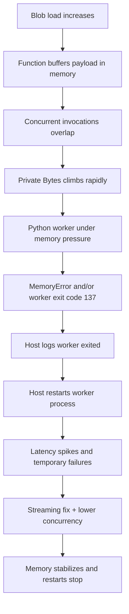

---
content_sources:
  - type: mslearn-adapted
    url: https://learn.microsoft.com/azure/azure-functions/functions-scale
  - type: mslearn-adapted
    url: https://learn.microsoft.com/azure/azure-functions/functions-reference-python
  - type: mslearn-adapted
    url: https://learn.microsoft.com/azure/azure-functions/functions-monitoring
  - type: mslearn-adapted
    url: https://learn.microsoft.com/azure/azure-monitor/app/data-model-complete
  - type: mslearn-adapted
    url: https://learn.microsoft.com/azure/azure-monitor/logs/log-query-overview
---

# Lab Guide: Out of Memory Crash Under Blob Processing Load

This lab reproduces a Python Azure Functions out-of-memory incident under sustained blob-trigger load. You will intentionally use a memory-inefficient buffering path, drive concurrency in phases, collect telemetry, and verify that a streaming fix plus concurrency controls removes crash-loop behavior.

## Lab Metadata

| Field | Value |
|---|---|
| Difficulty | Advanced |
| Duration | 60-90 min |
| Hosting plan tested | Premium EP1 (Linux) |
| Trigger type | Blob trigger |
| Runtime | Python 3.11 / Functions v4 |
| Azure services | Azure Functions, Storage Account, Application Insights |
| Skills practiced | Hypothesis-driven troubleshooting, KQL correlation, memory pressure diagnosis, safe remediation validation |

!!! info "What this lab is designed to prove"
    In Python Azure Functions, memory exhaustion is usually observed as worker process termination (often exit code `137`) and restart traces, not a language-runtime exception from a different stack.

    This lab validates a Python-appropriate chain:
    - Memory usage rises in `performanceCounters` (`Process` / `Private Bytes`).
    - Function logs show Python `MemoryError` or abrupt invocation interruption.
    - Host traces show worker lifecycle events (`Worker process exited`, `Restarting worker process`, `Worker process started`).
    - After remediation, the same load profile no longer produces crash signatures.

## 1) Background

Azure Functions instances run with finite memory. In this lab, the app uses a blob-processing anti-pattern (buffer full payload in memory) under high concurrency. That pattern amplifies per-invocation memory usage until the Python worker becomes unstable.

On Linux-hosted Python apps, severe memory pressure commonly ends with the worker process being OOM-killed by the OS (`exit code 137`) or Python raising `MemoryError` in function execution logs. The host runtime then restarts the worker process.

Because this lab uses EP1, thresholds should match EP1 capacity characteristics, not Consumption-size limits.

### Failure progression model

<!-- diagram-id: failure-progression-model -->


### EP1 memory bands used in this lab

| State | Worker Private Bytes (EP1) | Interpretation |
|---|---:|---|
| Healthy | 350-700 MB | Normal operating band |
| Degraded | 1.2-2.0 GB | Rising pressure; latency and retries increase |
| Critical | 2.5 GB+ | Near EP1 limit (3.5 GB), crash risk high |

### Why this lab can be misread

Common misdiagnoses:
1. Treating dependency failures as the primary cause when they are downstream effects.
2. Looking only at request latency without memory and worker-lifecycle correlation.
3. Searching for `.NET` exception strings in a Python worker incident.

## 2) Hypothesis

### Formal statement

If the Python blob function buffers full payloads in memory while high concurrency is enabled on EP1, then process memory (`Private Bytes`) will enter a critical band and produce Python worker instability (`MemoryError`, worker exit `137`, worker restarts). Replacing buffering with streaming and reducing concurrency will remove those signatures under equivalent test load.

### Causal chain

```mermaid
flowchart LR
    A[In-memory blob buffering] --> B[High per-invocation memory cost]
    B --> C[Concurrent invocation overlap]
    C --> D[Private Bytes enters critical band]
    D --> E[MemoryError or OOM kill exit 137]
    E --> F[Worker restart cycle]
    F --> G["Latency/failure burst"]
    G --> H[Streaming + lower concurrency]
    H --> I[Stabilized memory and recovery]
```

<!-- diagram-id: causal-chain -->


### Proof criteria

1. `FunctionAppLogs` in incident window include Python-style memory failure patterns (for example `MemoryError`) or abrupt invocation failures aligned to worker exits.
2. `traces` show worker lifecycle around the same times (`Worker process exited`, `Restarting worker process`, `Worker process started`).
3. `performanceCounters` shows `Private Bytes` entering EP1 critical band (2.5 GB+).
4. `requests` and `dependencies` degrade before/during worker exits.
5. After remediation, equivalent load no longer produces `MemoryError`/exit `137` restart signatures.

### Disproof criteria

1. Worker lifecycle is stable while failures are explained entirely by unrelated dependency saturation.
2. `Private Bytes` remains outside critical band across repeated high-load phases.
3. Streaming remediation does not materially improve restart and latency profiles.

## 3) Runbook

### Prerequisites

1. Azure CLI authenticated and correct subscription selected.
2. Functions Core Tools and Python 3.11 available.
3. Permissions to query Application Insights.

```bash
az account show --output table
func --version
python3 --version
```

### Variables

```bash
RG="rg-func-lab-oom"
LOCATION="koreacentral"
STORAGE_NAME="stfuncoomlab001"
PLAN_NAME="plan-func-oom-ep1"
APP_NAME="func-oom-lab-001"
AI_NAME="appi-func-oom-001"

```

### 3.1 Deploy baseline infrastructure (EP1)

```bash
az group create --name "$RG" --location "$LOCATION"
az storage account create --name "$STORAGE_NAME" --resource-group "$RG" --location "$LOCATION" --sku Standard_LRS --kind StorageV2
az monitor app-insights component create --app "$AI_NAME" --location "$LOCATION" --resource-group "$RG" --kind web --application-type web
az functionapp plan create --name "$PLAN_NAME" --resource-group "$RG" --location "$LOCATION" --sku EP1 --is-linux true
az functionapp create --name "$APP_NAME" --resource-group "$RG" --plan "$PLAN_NAME" --runtime python --runtime-version 3.11 --functions-version 4 --storage-account "$STORAGE_NAME" --app-insights "$AI_NAME"
```

### 3.2 Deploy memory-buffering version

```bash
az functionapp deployment source config-zip --name "$APP_NAME" --resource-group "$RG" --src "./artifacts/oom-buffering-app.zip"
az functionapp config appsettings set --name "$APP_NAME" --resource-group "$RG" --settings "FUNCTIONS_WORKER_RUNTIME=python" "BLOB_BATCH_SIZE=32" "MAX_CONCURRENT_INVOCATIONS=48"
az functionapp restart --name "$APP_NAME" --resource-group "$RG"
```

!!! note "Lab artifacts"
    The ZIP packages and load files referenced in this lab are pre-built assets. Prepare them before starting:

    - `oom-buffering-app.zip`: Python function that reads entire blob into memory
    - `oom-streaming-app.zip`: Streaming version that processes in chunks
    - `load/phase1-3`: Blob files of increasing size (100MB, 500MB, 1GB+)

### 3.3 Capture baseline evidence (T0 to T0+15m)

Set a fixed window anchor for all queries:

```kusto
let appName = "func-oom-lab-001";
let t0 = datetime(2026-04-05 01:30:00Z);
let tEnd = datetime(2026-04-05 02:40:00Z);
```

#### Query A: Host lifecycle baseline (`traces`)

```kusto
let appName = "func-oom-lab-001";
let t0 = datetime(2026-04-05 01:30:00Z);
let t1 = datetime(2026-04-05 01:45:00Z);
traces
| where timestamp between (t0 .. t1)
| where cloud_RoleName == appName
| where message has_any ("Starting Host", "Host started", "Job host started", "Worker process started")
| project timestamp, severityLevel, message
| order by timestamp asc
```

#### Query B: Request baseline (`requests`)

```kusto
let appName = "func-oom-lab-001";
let t0 = datetime(2026-04-05 01:30:00Z);
let t1 = datetime(2026-04-05 01:45:00Z);
requests
| where timestamp between (t0 .. t1)
| where cloud_RoleName == appName
| summarize
    total=count(),
    failures=countif(success == false),
    p95Ms=round(percentile(toreal(duration / 1ms), 95), 2),
    failureRatePercent=round(100.0 * failures / total, 2)
  by bin(timestamp, 5m)
| order by timestamp asc
```

#### Query C: Memory baseline (`performanceCounters`)

```kusto
let appName = "func-oom-lab-001";
let t0 = datetime(2026-04-05 01:30:00Z);
let t1 = datetime(2026-04-05 01:45:00Z);
performanceCounters
| where timestamp between (t0 .. t1)
| where cloud_RoleName == appName
| where counter == "Private Bytes"
| summarize avgMemoryMB=round(avg(value) / (1024.0 * 1024.0), 1), maxMemoryMB=round(max(value) / (1024.0 * 1024.0), 1) by bin(timestamp, 5m)
| order by timestamp asc
```

#### Query D: Python memory failure signature (`FunctionAppLogs`)

```kusto
let appName = "func-oom-lab-001";
let t0 = datetime(2026-04-05 01:30:00Z);
let t1 = datetime(2026-04-05 01:45:00Z);
FunctionAppLogs
| where TimeGenerated between (t0 .. t1)
| where AppName == appName
| where Message has_any ("MemoryError", "Worker process exited", "Restarting worker process")
| project TimeGenerated, FunctionName, Level, Message
| order by TimeGenerated asc
```

CLI execution examples:

```bash
az monitor app-insights query --apps "$AI_NAME" --resource-group "$RG" --analytics-query "let appName='${APP_NAME}'; let t0=datetime(2026-04-05 01:30:00Z); let t1=datetime(2026-04-05 01:45:00Z); performanceCounters | where timestamp between (t0 .. t1) | where cloud_RoleName == appName | where counter == 'Private Bytes' | summarize avgMemoryMB=round(avg(value)/(1024.0*1024.0),1), maxMemoryMB=round(max(value)/(1024.0*1024.0),1) by bin(timestamp,5m) | order by timestamp asc" --output table
az monitor app-insights query --apps "$AI_NAME" --resource-group "$RG" --analytics-query "let appName='${APP_NAME}'; let t0=datetime(2026-04-05 01:30:00Z); let t1=datetime(2026-04-05 01:45:00Z); requests | where timestamp between (t0 .. t1) | where cloud_RoleName == appName | summarize total=count(), failures=countif(success == false), p95Ms=round(percentile(toreal(duration / 1ms),95),2), failureRatePercent=round(100.0*failures/total,2) by bin(timestamp,5m) | order by timestamp asc" --output table
```

### 3.4 Trigger controlled incident phases

Use a fixed timeline to avoid drift:

- Baseline: `01:30-01:45` (T0 to T0+15m)
- Load phase 1 (moderate): `01:45-02:00`
- Load phase 2 (high): `02:00-02:15`
- Incident (OOM crashes): `02:15-02:25`
- Remediation action: `02:25`
- Recovery: `02:25-02:40`

```bash
az storage container create --name "input" --account-name "$STORAGE_NAME" --auth-mode login
az storage blob upload-batch --account-name "$STORAGE_NAME" --destination "input" --source "./load/phase1" --auth-mode login
az storage blob upload-batch --account-name "$STORAGE_NAME" --destination "input" --source "./load/phase2" --auth-mode login
az storage blob upload-batch --account-name "$STORAGE_NAME" --destination "input" --source "./load/phase3" --auth-mode login
```

### 3.5 Collect incident evidence (T0+15m to T0+55m)

#### Query E: Python `MemoryError` and invocation failures (`FunctionAppLogs`)

```kusto
let appName = "func-oom-lab-001";
let tStart = datetime(2026-04-05 01:45:00Z);
let tEnd = datetime(2026-04-05 02:25:00Z);
FunctionAppLogs
| where TimeGenerated between (tStart .. tEnd)
| where AppName == appName
| where Message has_any ("MemoryError", "invocation failed", "Out of memory")
| project TimeGenerated, FunctionName, Level, Message
| order by TimeGenerated asc
```

Expected pattern example:

```text
2026-04-05T02:16:41.105Z  BlobBufferProcessor  Error  MemoryError: cannot allocate bytes object
2026-04-05T02:19:12.442Z  BlobBufferProcessor  Error  MemoryError: cannot allocate bytes object
```

#### Query F: Worker lifecycle crash signatures (`traces`)

```kusto
let appName = "func-oom-lab-001";
let tStart = datetime(2026-04-05 01:45:00Z);
let tEnd = datetime(2026-04-05 02:25:00Z);
traces
| where timestamp between (tStart .. tEnd)
| where cloud_RoleName == appName
| where message has_any ("Worker process exited", "exit code 137", "Restarting worker process", "Worker process started")
| project timestamp, severityLevel, message
| order by timestamp asc
```

Expected pattern example:

```text
2026-04-05T02:16:41.512Z  Error        Worker process exited with code 137
2026-04-05T02:16:45.994Z  Warning      Restarting worker process after unexpected exit
2026-04-05T02:16:49.144Z  Information  Worker process started
```

#### Query G: Request degradation (`requests`)

```kusto
let appName = "func-oom-lab-001";
let tStart = datetime(2026-04-05 01:45:00Z);
let tEnd = datetime(2026-04-05 02:25:00Z);
requests
| where timestamp between (tStart .. tEnd)
| where cloud_RoleName == appName
| summarize
    total=count(),
    failures=countif(success == false),
    p95Ms=round(percentile(toreal(duration / 1ms), 95), 2),
    failureRatePercent=round(100.0 * failures / total, 2)
  by bin(timestamp, 5m)
| order by timestamp asc
```

#### Query H: Dependency retry pressure (`dependencies`)

```kusto
let appName = "func-oom-lab-001";
let tStart = datetime(2026-04-05 01:45:00Z);
let tEnd = datetime(2026-04-05 02:25:00Z);
dependencies
| where timestamp between (tStart .. tEnd)
| where cloud_RoleName == appName
| summarize
    total=count(),
    failed=countif(success == false),
    p95Ms=round(percentile(toreal(duration / 1ms), 95), 2),
    failureRatePercent=round(100.0 * failed / total, 2)
  by type, target, bin(timestamp, 5m)
| order by timestamp asc
```

#### Query I: EP1 memory pressure progression (`performanceCounters`)

```kusto
let appName = "func-oom-lab-001";
let tStart = datetime(2026-04-05 01:45:00Z);
let tEnd = datetime(2026-04-05 02:25:00Z);
performanceCounters
| where timestamp between (tStart .. tEnd)
| where cloud_RoleName == appName
| where counter == "Private Bytes"
| summarize avgMemoryMB=round(avg(value) / (1024.0 * 1024.0), 1), maxMemoryMB=round(max(value) / (1024.0 * 1024.0), 1) by bin(timestamp, 5m)
| order by timestamp asc
```

CLI execution examples:

```bash
az monitor app-insights query --apps "$AI_NAME" --resource-group "$RG" --analytics-query "let appName='${APP_NAME}'; let tStart=datetime(2026-04-05 01:45:00Z); let tEnd=datetime(2026-04-05 02:25:00Z); traces | where timestamp between (tStart .. tEnd) | where cloud_RoleName == appName | where message has_any ('Worker process exited','exit code 137','Restarting worker process','Worker process started') | project timestamp,severityLevel,message | order by timestamp asc" --output table
az monitor app-insights query --apps "$AI_NAME" --resource-group "$RG" --analytics-query "let appName='${APP_NAME}'; let tStart=datetime(2026-04-05 01:45:00Z); let tEnd=datetime(2026-04-05 02:25:00Z); FunctionAppLogs | where TimeGenerated between (tStart .. tEnd) | where AppName == appName | where Message has_any ('MemoryError','invocation failed','Out of memory') | project TimeGenerated,FunctionName,Level,Message | order by TimeGenerated asc" --output table
az monitor app-insights query --apps "$AI_NAME" --resource-group "$RG" --analytics-query "let appName='${APP_NAME}'; let tStart=datetime(2026-04-05 01:45:00Z); let tEnd=datetime(2026-04-05 02:25:00Z); performanceCounters | where timestamp between (tStart .. tEnd) | where cloud_RoleName == appName | where counter == 'Private Bytes' | summarize avgMemoryMB=round(avg(value)/(1024.0*1024.0),1), maxMemoryMB=round(max(value)/(1024.0*1024.0),1) by bin(timestamp,5m) | order by timestamp asc" --output table
```

### 3.6 Apply remediation and verify (T0+55m to T0+70m)

1. Deploy streaming implementation.
2. Reduce batch size and max concurrency.
3. Re-run the same load profile and compare windows.

```bash
az functionapp deployment source config-zip --name "$APP_NAME" --resource-group "$RG" --src "./artifacts/oom-streaming-app.zip"
az functionapp config appsettings set --name "$APP_NAME" --resource-group "$RG" --settings "BLOB_BATCH_SIZE=8" "MAX_CONCURRENT_INVOCATIONS=12"
az functionapp restart --name "$APP_NAME" --resource-group "$RG"
```

Post-fix verification queries:

```kusto
let appName = "func-oom-lab-001";
let tStart = datetime(2026-04-05 02:25:00Z);
let tEnd = datetime(2026-04-05 02:40:00Z);
FunctionAppLogs
| where TimeGenerated between (tStart .. tEnd)
| where AppName == appName
| where Message has_any ("MemoryError", "Out of memory")
| summarize count()
```

```kusto
let appName = "func-oom-lab-001";
let tStart = datetime(2026-04-05 02:25:00Z);
let tEnd = datetime(2026-04-05 02:40:00Z);
requests
| where timestamp between (tStart .. tEnd)
| where cloud_RoleName == appName
| summarize
    p95Ms=round(percentile(toreal(duration / 1ms), 95), 2),
    failureRatePercent=round(100.0 * countif(success == false) / count(), 2)
  by bin(timestamp, 5m)
| order by timestamp asc
```

```kusto
let appName = "func-oom-lab-001";
let tStart = datetime(2026-04-05 02:25:00Z);
let tEnd = datetime(2026-04-05 02:40:00Z);
traces
| where timestamp between (tStart .. tEnd)
| where cloud_RoleName == appName
| where message has_any ("Worker process exited", "Restarting worker process")
| summarize count()
```

## 4) Experiment Log

### Artifact inventory

| Artifact | Location | Purpose |
|---|---|---|
| Buffering deployment package | `./artifacts/oom-buffering-app.zip` | Reproduce failure path |
| Streaming deployment package | `./artifacts/oom-streaming-app.zip` | Validate remediation |
| Load phases | `./load/phase1` `./load/phase2` `./load/phase3` | Controlled escalation |
| Query export bundle | `./evidence/oom/kql-session.json` | Preserve evidence chain |
| Timeline worksheet | `./evidence/oom/timeline.csv` | Keep event correlation reproducible |

### Timeline anchor and phases

| Phase | Window (UTC) | Goal |
|---|---|---|
| Baseline | 01:30-01:45 | Establish healthy memory and latency |
| Load phase 1 | 01:45-02:00 | Introduce moderate pressure |
| Load phase 2 | 02:00-02:15 | Push toward degraded band |
| Incident | 02:15-02:25 | Observe crash-loop signatures |
| Remediation | 02:25 | Deploy streaming + lower concurrency |
| Recovery | 02:25-02:40 | Verify stabilization |

### Baseline observations (01:30-01:45)

| Metric | Observation | Interpretation |
|---|---|---|
| Private Bytes | 420-610 MB | Healthy EP1 band |
| Request p95 | 420-620 ms | Healthy |
| Failure rate | 0.0-0.4% | Healthy |
| Worker lifecycle | No exit/restart events | Stable worker |
| Python memory errors | None | No memory fault |

### Condensed incident timeline (key events)

| Time (UTC) | Phase | Signal | Observation | Interpretation |
|---|---|---|---|---|
| 01:46 | Load 1 | `performanceCounters` | Private Bytes 0.92 GB | Early growth |
| 01:50 | Load 1 | `requests` | p95 1.62 s, fail 2.1% | Degradation starts |
| 01:54 | Load 1 | `dependencies` | fail 3.7% | Retry pressure rising |
| 01:58 | Load 1 | `performanceCounters` | Private Bytes 1.28 GB | Enters degraded band |
| 02:02 | Load 2 | `requests` | p95 3.91 s, fail 6.4% | Service impact visible |
| 02:06 | Load 2 | `performanceCounters` | Private Bytes 1.84 GB | High degraded zone |
| 02:10 | Load 2 | `dependencies` | fail 9.2% | Cascading effects |
| 02:13 | Load 2 | `performanceCounters` | Private Bytes 2.32 GB | Near critical threshold |
| 02:16 | Incident | `FunctionAppLogs` | `MemoryError: cannot allocate bytes object` | Python memory failure |
| 02:16 | Incident | `traces` | Worker process exited with code 137 | OOM kill signature |
| 02:16 | Incident | `traces` | Restarting worker process | Host recovery loop starts |
| 02:17 | Incident | `traces` | Worker process started | Restart complete |
| 02:19 | Incident | `FunctionAppLogs` | `MemoryError` repeated | Fault persists under load |
| 02:19 | Incident | `requests` | p95 10.21 s, fail 22.8% | Severe outage behavior |
| 02:21 | Incident | `performanceCounters` | Private Bytes 2.67 GB | EP1 critical band |
| 02:22 | Incident | `traces` | Worker process exited with code 137 | Crash loop repeats |
| 02:23 | Incident | `traces` | Restarting worker process | Recurrent instability |
| 02:25 | Remediation | Runbook action | Deploy streaming package | Causal intervention |
| 02:25 | Remediation | Runbook action | Set batch=8, concurrency=12 | Pressure reduction |
| 02:28 | Recovery | `performanceCounters` | Private Bytes 1.34 GB | Leaves critical band |
| 02:31 | Recovery | `requests` | p95 1.58 s, fail 2.3% | Fast recovery trend |
| 02:34 | Recovery | `performanceCounters` | Private Bytes 0.98 GB | Near healthy target |
| 02:36 | Recovery | `FunctionAppLogs` | No `MemoryError` records | Primary fault removed |
| 02:38 | Recovery | `traces` | No worker exit/restart | Crash loop resolved |
| 02:40 | Recovery | `requests` | p95 0.92 s, fail 0.6% | Stabilized |

### Representative log excerpts (Python-consistent)

```text
[FunctionAppLogs]
2026-04-05T02:16:41.105Z Error BlobBufferProcessor MemoryError: cannot allocate bytes object
2026-04-05T02:16:41.151Z Error BlobBufferProcessor Invocation failed after 00:00:09.102
2026-04-05T02:19:12.442Z Error BlobBufferProcessor MemoryError: cannot allocate bytes object
2026-04-05T02:19:12.501Z Error BlobBufferProcessor Invocation failed after 00:00:10.088
2026-04-05T02:28:30.014Z Information BlobBufferProcessor Streaming implementation active
2026-04-05T02:31:05.327Z Information BlobBufferProcessor Invocation completed in 00:00:01.102

[traces]
2026-04-05T02:16:41.512Z Error Worker process exited with code 137
2026-04-05T02:16:45.994Z Warning Restarting worker process after unexpected exit
2026-04-05T02:16:49.144Z Information Worker process started
2026-04-05T02:22:07.523Z Error Worker process exited with code 137
2026-04-05T02:22:12.016Z Warning Restarting worker process after unexpected exit
2026-04-05T02:22:15.145Z Information Worker process started
2026-04-05T02:25:33.044Z Information Host started (412ms)
```

### Core finding

The incident aligns with Python worker memory exhaustion, not a `.NET` exception path. During high-load phases, `Private Bytes` enters EP1 critical levels, then `MemoryError` and worker exit `137` appear with restart loops in the same window. After streaming remediation and concurrency reduction, memory, latency, and restart signals return to stable bands.

### Hypothesis verdict

| Criterion | Verdict | Evidence |
|---|---|---|
| Python memory failure signature appears | Supported | `MemoryError` records in `FunctionAppLogs` |
| Worker lifecycle crash signatures align | Supported | `exit code 137` + restart traces |
| EP1 memory enters critical band | Supported | `Private Bytes` exceeds 2.5 GB |
| Post-fix restart loop disappears | Supported | No exit/restart events in recovery window |
| Post-fix latency/failures normalize | Supported | p95 and failure rate trend to healthy |

Final verdict: **Hypothesis supported**.

## Expected Evidence

### Before Trigger (Baseline)

| Signal | Expected Value |
|---|---|
| `FunctionAppLogs` memory errors | 0 |
| Worker exit/restart traces | 0 |
| `performanceCounters` Private Bytes | 350-700 MB |
| Request p95 (`requests`) | under 700 ms |
| Dependency failure rate (`dependencies`) | under 1% |

### During Incident

| Signal | Expected Value |
|---|---|
| `FunctionAppLogs` `MemoryError` | 1+ records in incident window |
| Worker lifecycle traces | exit `137` + restart sequence |
| `performanceCounters` Private Bytes | 2.5 GB+ (EP1 critical) |
| Request p95 (`requests`) | above 8 s |
| Failure rate (`requests`) | above 15% |

### After Recovery

| Signal | Expected Value |
|---|---|
| `FunctionAppLogs` `MemoryError` | 0 |
| Worker exit/restart traces | 0 |
| `performanceCounters` Private Bytes | trending below 1.2 GB |
| Request p95 (`requests`) | under 1.2 s |
| Failure rate (`requests`) | under 1% |

### Evidence Timeline

```mermaid
gantt
    title OOM Lab Evidence Timeline (EP1)
    dateFormat  HH:mm
    axisFormat  %H:%M
    section Baseline
    Baseline capture                :done, b1, 01:30, 15m
    section Load
    Load phase 1 (moderate)         :done, l1, 01:45, 15m
    Load phase 2 (high)             :done, l2, 02:00, 15m
    section Incident
    OOM crash-loop window           :done, i1, 02:15, 10m
    section Recovery
    Remediation applied             :done, r1, 02:25, 1m
    Recovery validation             :done, r2, 02:25, 15m
```

<!-- diagram-id: evidence-timeline -->


### Evidence Chain: Why This Proves the Hypothesis

!!! success "Falsification logic"
    The hypothesis is only supported when all signals align in the same time window:

    1. Memory pressure reaches EP1 critical thresholds (`Private Bytes` 2.5 GB+).
    2. Python failure signatures (`MemoryError`) appear.
    3. Host-level worker lifecycle shows exit `137` and restart events.
    4. After changing to streaming + lower concurrency, those signatures disappear while latency and failure rate improve.

    If any one of these fails to correlate temporally, rerun the phase and reassess alternate causes.

## Clean Up

```bash
az group delete --name "$RG" --yes --no-wait
```

## Related Playbook

- [Out-of-Memory Worker Crash Playbook](../playbooks/scaling/out-of-memory-worker-crash.md)

## See Also

- [Troubleshooting Lab Guides](../lab-guides.md)
- [First 10 Minutes Triage](../first-10-minutes.md)
- [Troubleshooting Methodology](../methodology.md)
- [KQL Reference for Troubleshooting](../kql.md)
- [Evidence Map](../evidence-map.md)

## Sources

- https://learn.microsoft.com/azure/azure-functions/functions-scale
- https://learn.microsoft.com/azure/azure-functions/functions-reference-python
- https://learn.microsoft.com/azure/azure-functions/functions-monitoring
- https://learn.microsoft.com/azure/azure-monitor/app/data-model-complete
- https://learn.microsoft.com/azure/azure-monitor/logs/log-query-overview
