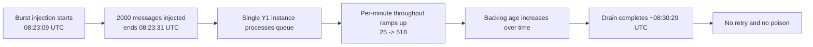
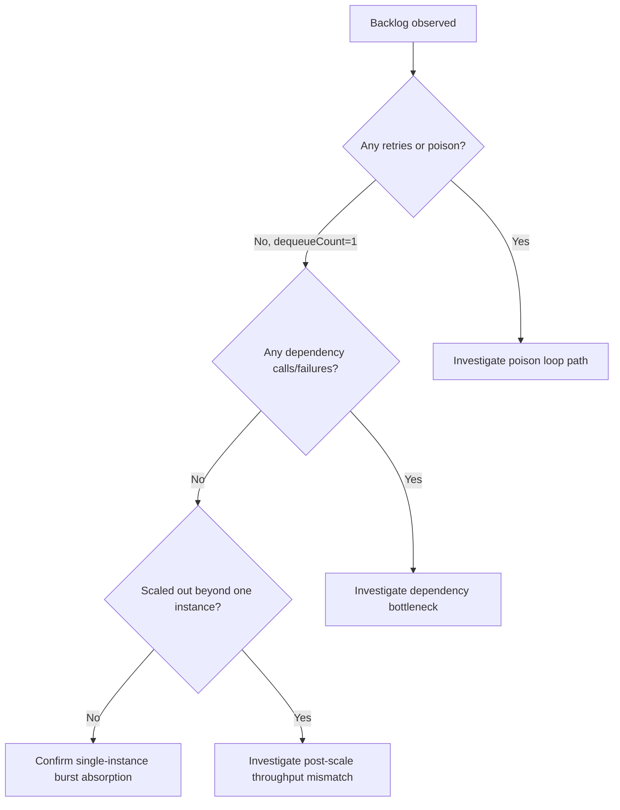
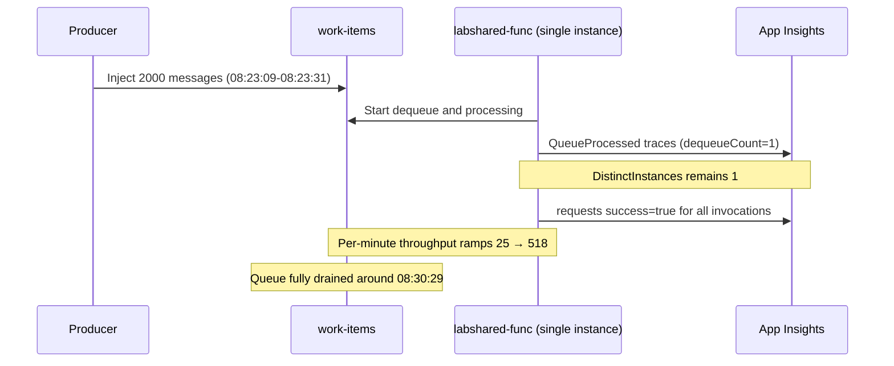

---
content_sources:
  - type: mslearn-adapted
    url: https://learn.microsoft.com/azure/azure-functions/functions-bindings-storage-queue-trigger
  - type: mslearn-adapted
    url: https://learn.microsoft.com/azure/azure-functions/functions-host-json
  - type: mslearn-adapted
    url: https://learn.microsoft.com/azure/azure-functions/functions-scale
  - type: mslearn-adapted
    url: https://learn.microsoft.com/azure/azure-functions/monitor-functions
  - type: mslearn-adapted
    url: https://learn.microsoft.com/azure/azure-monitor/logs/log-query-overview
---

# Lab Guide: Queue Backlog Scaling on Y1 Consumption (Real Evidence)

This lab reproduces and analyzes a real queue backlog burst on Azure Functions Consumption (Y1) using telemetry collected on 2026-04-07. The objective is to prove what happened, what did not happen, and why a 2000-message burst drained in about 7.3 minutes without scale-out.

## Lab Metadata

| Field | Value |
|---|---|
| Difficulty | Intermediate to advanced |
| Duration | 45-60 minutes |
| Hosting plan tested | Azure Functions Consumption (Y1), Linux |
| Runtime | Python 3.11 / Functions v4 |
| Resource Group | `rg-lab-y1-shared` (`koreacentral`) |
| Function App | `labshared-func` |
| Storage Account | `labsharedstorage` |
| Application Insights | `labshared-insights` |
| Queue | `work-items` |
| Function code path | `apps/python/blueprints/queue_processor.py` |
| Producer path | `labs/queue-backlog-scaling/producer.py` |
| Queue connection setting | `QueueStorage` |
| Evidence date (UTC) | 2026-04-07 |

!!! info "Scope of this lab"
    This document replaces fabricated backlog data with a single real run from Y1 Consumption.
    Every metric, timestamp, and conclusion in this guide is constrained to the captured evidence listed in this lab.

## 1) Background

Queue backlog incidents are often misread as "the app is broken" or "the scale controller failed." In practice, backlog behavior is a throughput-shaping pattern where enqueue rate, per-message work time, batching, and scale decisions interact over time.

In this run, the producer injected 2000 messages in about 20.7 seconds (~97 msg/s), while each message included a configured 5-second processing delay. The workload did not fail, did not poison, and did not retry. The critical behavior was that Y1 remained on a single instance while draining.

### Workload and trigger configuration

Queue trigger behavior came from `host.json` queue settings:

```json
{
  "extensions": {
    "queues": {
      "batchSize": 16,
      "newBatchThreshold": 8,
      "maxDequeueCount": 5,
      "visibilityTimeout": "00:00:30",
      "messageEncoding": "none"
    }
  }
}
```

Application log format in `apps/python/blueprints/queue_processor.py`:

```text
QueueProcessed sequence=N ageMs=N dequeueCount=N processingMs=N instanceId=XXXX delayMs=N
```

These values are emitted in the `message` column of `traces` and must be parsed from `message`, not from `customDimensions`.

### Failure progression model for this incident

<!-- diagram-id: failure-progression-model-for-this-incident -->


### Why this scenario matters

1. It separates burst absorption from persistent failure.
2. It shows that "no scale-out" can still end in successful drain.
3. It demonstrates why message age can rise even with 100% success.
4. It prevents incorrect root-cause claims such as poison loop or dependency bottleneck when those signals are absent.

### Timeline view

```mermaid
gantt
    title Queue Backlog Burst and Drain (UTC, 2026-04-07)
    dateFormat  HH:mm:ss
    axisFormat  %H:%M:%S
    section Injection
    Producer sends 2000 messages   :done, inj, 08:23:09, 22s
    section Drain
    Single-instance drain phase    :done, drn, 08:23:09, 7m20s
    section Completion
    Queue reaches fully drained    :done, fin, 08:30:29, 1s
```

<!-- diagram-id: timeline-view -->


## 2) Hypothesis

### Primary hypothesis (H1)

If a high-burst queue workload is injected into Y1 Consumption with steady 5-second message processing, backlog growth is primarily caused by burst-vs-drain imbalance and scale lag, where scale lag manifests as no additional instances during the incident window.

### Competing hypotheses

| ID | Hypothesis | Result | Evidence summary |
|---|---|---|---|
| H1 | Scale lag/backlog due to insufficient active workers | **Confirmed** | `DistinctInstances = 1` for all processed records; drain completed without scale-out |
| H2 | Poison/retry loop dominates throughput loss | **Disproved** | `MaxDequeueCount = 1`; all 2000 messages succeeded first try |
| H3 | Processing-time regression causes slowdown | **Disproved** | `AvgProcessingMs = 5000`; processing delay remained steady as configured |
| H4 | Dependency bottleneck throttles handler | **Disproved** | This workload made no dependency calls |

### Proof criteria and observed outcome

| Criterion | Expected if true | Observed |
|---|---|---|
| Scale behavior | More than one worker if scale-out occurs | One worker only (`DistinctInstances = 1`) |
| Retry pattern | Elevated dequeue counts if poison/retry issue | All dequeue counts remained `1` |
| Processing consistency | Near configured delay if no regression | `AvgProcessingMs = 5000` |
| End-state | Eventual drain if workload is healthy | Full drain around `08:30:29 UTC` |

### Hypothesis decision flow

<!-- diagram-id: hypothesis-decision-flow -->


## 3) Runbook

### Prerequisites

1. Azure CLI authenticated and subscription selected.
2. Query access to Application Insights component `labshared-insights`.
3. Function app and queue resources already deployed in `rg-lab-y1-shared`.
4. Repository paths available locally:
    - `apps/python/blueprints/queue_processor.py`
    - `labs/queue-backlog-scaling/producer.py`

### Variables

```bash
SUBSCRIPTION_ID="<subscription-id>"
RG="rg-lab-y1-shared"
APP_NAME="labshared-func"
STORAGE_NAME="labsharedstorage"
AI_NAME="labshared-insights"
QUEUE_NAME="work-items"
```

### Step 1: Confirm target resources

```bash
az account set --subscription "$SUBSCRIPTION_ID"
az functionapp show \
    --resource-group "$RG" \
    --name "$APP_NAME" \
    --output table
az storage account show \
    --resource-group "$RG" \
    --name "$STORAGE_NAME" \
    --output table
az monitor app-insights component show \
    --app "$AI_NAME" \
    --resource-group "$RG" \
    --output table
```

### Step 2: Verify queue trigger configuration in app source

Review queue settings and processing code before evidence collection:

1. Check `host.json` queue config includes:
    - `batchSize = 16`
    - `newBatchThreshold = 8`
    - `maxDequeueCount = 5`
    - `visibilityTimeout = "00:00:30"`
    - `messageEncoding = "none"`

### Step 3: Run burst injection

Use `labs/queue-backlog-scaling/producer.py` to enqueue 2000 messages to `work-items`.

```bash
# Option A: connection-string auth
export STORAGE_CONNECTION_STRING=$(az storage account show-connection-string \
    --resource-group "$RG" \
    --name "$STORAGE_NAME" \
    --query connectionString \
    --output tsv)
python labs/queue-backlog-scaling/producer.py --count 2000 --batch-size 32 --delay-between-batches 0.05

# Option B: identity auth (requires Storage Queue Data Contributor on your user)
export STORAGE_ACCOUNT_NAME="$STORAGE_NAME"
python labs/queue-backlog-scaling/producer.py --count 2000 --use-identity
```

Reference incident timings from the 2026-04-07 real run:

| Event | Time (UTC) |
|---|---|
| Injection start | 08:23:09 |
| Injection end | 08:23:31 |
| Total sent | 2000 |
| Effective send rate | ~97 msg/s over 20.7s |

### Step 4: Collect trace-derived processing evidence

Use `parse message with *` against the `message` column.

```bash
az monitor app-insights query \
    --apps "$AI_NAME" \
    --resource-group "$RG" \
    --analytics-query "traces
| where timestamp between (datetime(2026-04-07T08:22:00Z) .. datetime(2026-04-07T08:35:00Z))
| where cloud_RoleName == 'labshared-func'
| where message has 'QueueProcessed'
| parse message with * 'sequence=' sequence:int ' ageMs=' ageMs:long ' dequeueCount=' dequeueCount:int ' processingMs=' processingMs:int ' instanceId=' instanceId:string ' delayMs=' delayMs:int
| summarize
    TotalProcessed=count(),
    AvgAgeMs=round(avg(ageMs), 0),
    MaxAgeMs=max(ageMs),
    MinAgeMs=min(ageMs),
    P50AgeMs=round(percentile(ageMs, 50), 0),
    P95AgeMs=round(percentile(ageMs, 95), 0),
    AvgProcessingMs=round(avg(processingMs), 0),
    MaxDequeueCount=max(dequeueCount),
    DistinctInstances=dcount(instanceId)"
```

Per-minute drain curve:

```bash
az monitor app-insights query \
    --apps "$AI_NAME" \
    --resource-group "$RG" \
    --analytics-query "traces
| where timestamp between (datetime(2026-04-07T08:22:00Z) .. datetime(2026-04-07T08:35:00Z))
| where cloud_RoleName == 'labshared-func'
| where message has 'QueueProcessed'
| parse message with * 'sequence=' sequence:int ' ageMs=' ageMs:long ' dequeueCount=' dequeueCount:int ' processingMs=' processingMs:int ' instanceId=' instanceId:string ' delayMs=' delayMs:int
| summarize Processed=count() by Minute=bin(timestamp, 1m)
| order by Minute asc"
```

Per-minute message age progression:

```bash
az monitor app-insights query \
    --apps "$AI_NAME" \
    --resource-group "$RG" \
    --analytics-query "traces
| where timestamp between (datetime(2026-04-07T08:22:00Z) .. datetime(2026-04-07T08:35:00Z))
| where cloud_RoleName == 'labshared-func'
| where message has 'QueueProcessed'
| parse message with * 'sequence=' sequence:int ' ageMs=' ageMs:long ' dequeueCount=' dequeueCount:int ' processingMs=' processingMs:int ' instanceId=' instanceId:string ' delayMs=' delayMs:int
| summarize
    AvgAgeSec=round(avg(ageMs) / 1000.0, 1),
    P50AgeSec=round(percentile(ageMs, 50) / 1000.0, 1),
    P95AgeSec=round(percentile(ageMs, 95) / 1000.0, 1),
    MaxAgeSec=round(max(ageMs) / 1000.0, 1)
    by Minute=bin(timestamp, 1m)
| order by Minute asc"
```

### Step 5: Collect request-duration evidence

```bash
az monitor app-insights query \
    --apps "$AI_NAME" \
    --resource-group "$RG" \
    --analytics-query "requests
| where timestamp between (datetime(2026-04-07T08:22:00Z) .. datetime(2026-04-07T08:35:00Z))
| where cloud_RoleName == 'labshared-func'
| where name has 'queue_processor'
| summarize
    TotalInvocations=count(),
    SuccessCount=countif(success == true),
    FailCount=countif(success == false),
    AvgDurationMs=round(avg(toreal(duration / 1ms)), 2),
    P50DurationMs=round(percentile(toreal(duration / 1ms), 50), 2),
    P95DurationMs=round(percentile(toreal(duration / 1ms), 95), 2),
    MaxDurationMs=round(max(toreal(duration / 1ms)), 2)"
```

!!! tip "Why request duration differs from processing delay"
    `processingMs` in the app log represents the in-handler processing delay (5000 ms).
    `requests.duration` is the end-to-end function execution time measured by the Functions host, which includes queue message deserialization, binding setup, worker dispatch overhead, and the handler itself. It is not a batch metric — each request maps to one message — but host-level overhead causes it to exceed the pure handler time.

### Step 6: Exclude dependency and poison hypotheses

**Dependency calls**: Source inspection of `apps/python/blueprints/queue_processor.py` confirms the handler performs no outbound HTTP, database, or storage dependency calls — it only parses the message, sleeps, and logs. The following scoped query validates that no dependency telemetry was emitted during the incident window:

```bash
az monitor app-insights query \
    --apps "$AI_NAME" \
    --resource-group "$RG" \
    --analytics-query "dependencies
| where timestamp between (datetime(2026-04-07T08:22:00Z) .. datetime(2026-04-07T08:35:00Z))
| where cloud_RoleName == 'labshared-func'
| where operation_Name has 'queue_processor'
| summarize DependencyCalls=count()"
```

**Poison-loop check**: Trace evidence shows `MaxDequeueCount = 1` across all 2000 messages, confirming every message succeeded on its first attempt. No poison inspection step is required for this run.

## 4) Experiment Log

### Run context

| Item | Value |
|---|---|
| Date | 2026-04-07 (UTC) |
| App | `labshared-func` |
| Plan | Y1 Consumption |
| Queue | `work-items` |
| Injection window | 08:23:09-08:23:31 |
| Drain completion | ~08:30:29 |

### Processing summary (App Insights traces)

| Metric | Value |
|---|---|
| TotalProcessed | 2000 |
| AvgAgeMs | 260,587 (~4.3 min) |
| MaxAgeMs | 398,417 (~6.6 min) |
| MinAgeMs | 21,893 (~22s) |
| P50AgeMs | 276,678 (~4.6 min) |
| P95AgeMs | 379,586 (~6.3 min) |
| AvgProcessingMs | 5000 |
| MaxDequeueCount | 1 |
| DistinctInstances | 1 |

Interpretation:

1. Backlog age increased because injection rate exceeded single-instance drain rate.
2. Processing delay was stable and intentional (`5000 ms`).
3. No retries occurred (`dequeueCount` never exceeded 1).
4. Y1 did not scale out for this burst (`DistinctInstances = 1`).

### Request metrics (`requests` table)

| Metric | Value |
|---|---|
| TotalInvocations | 2000 |
| SuccessCount | 2000 |
| FailCount | 0 |
| AvgDurationMs | 16,146.12 |
| P50DurationMs | 14,979.58 |
| P95DurationMs | 24,945.77 |
| MaxDurationMs | 24,979.56 |

Interpretation:

1. 100% success confirms this was not a failure-driven backlog.
2. Request duration exceeds in-handler `processingMs` because it includes host overhead (deserialization, worker dispatch, binding setup) — not because of batching.
3. Each request corresponds to one message (`TotalInvocations = 2000 = TotalProcessed`).

### Drain curve (per-minute)

| Time (UTC) | Processed | Cumulative |
|---|---:|---:|
| 08:23 | 25 | 25 |
| 08:24 | 115 | 140 |
| 08:25 | 200 | 340 |
| 08:26 | 275 | 615 |
| 08:27 | 355 | 970 |
| 08:28 | 445 | 1415 |
| 08:29 | 518 | 1933 |
| 08:30 | 67 | 2000 |

Drain interpretation:

1. Throughput ramped up over time (`25 → 518` per minute). The peak rate of 518/min exceeds the theoretical steady-state for `batchSize=16` + `newBatchThreshold=8` (max 24 concurrent × 12 completions/min = 288/min) because per-minute bins capture messages that started processing in a prior minute and completed in the current one, and because `FUNCTIONS_WORKER_PROCESS_COUNT` may allow multiple language worker processes sharing the same `WEBSITE_INSTANCE_ID`.
2. Ramp-up behavior matches burst absorption, not platform error.
3. Final minute contains only residual tail (`67`) before full drain.

### Message age over time (per-minute)

| Time (UTC) | AvgAge(s) | P50Age(s) | P95Age(s) | MaxAge(s) |
|---|---:|---:|---:|---:|
| 08:23 | 31.8 | 31.8 | 41.7 | 41.7 |
| 08:24 | 76.7 | 76.2 | 100.4 | 100.5 |
| 08:25 | 133.4 | 133.9 | 158.0 | 158.9 |
| 08:26 | 190.2 | 190.8 | 214.8 | 215.8 |
| 08:27 | 246.1 | 246.3 | 270.8 | 272.1 |
| 08:28 | 301.8 | 302.9 | 326.1 | 329.2 |
| 08:29 | 356.9 | 357.6 | 380.1 | 383.3 |
| 08:30 | 389.3 | 388.4 | 398.3 | 398.4 |

Age interpretation:

1. Age rose nearly linearly during drain.
2. Growth is expected when burst enqueue rate is higher than initial dequeue throughput.
3. This trend alone does not imply failures; it must be correlated with retry and success data.

### Evidence timeline

<!-- diagram-id: evidence-timeline -->


### Final verdict for this run

| Question | Answer |
|---|---|
| Did Y1 scale out? | No. Stayed at one instance throughout processing evidence. |
| Was there poison or retry amplification? | No. All messages were first-try success (`dequeueCount=1`). |
| Was processing time regressed? | No. Processing stayed at configured 5000 ms. |
| Was there dependency bottleneck? | No. This workload had no dependency calls. |
| Why did backlog age rise? | Burst injection rate exceeded single-instance drain rate during early drain. |
| What pattern does this represent? | Burst absorption on one worker, not persistent throughput failure. |

## Expected Evidence

### Before Trigger (Baseline)

| Signal | Expected value |
|---|---|
| Queue trigger settings | `batchSize=16`, `newBatchThreshold=8`, `maxDequeueCount=5`, `visibilityTimeout=00:00:30`, `messageEncoding=none` |
| Application log shape | `QueueProcessed sequence=... ageMs=... dequeueCount=... processingMs=... instanceId=... delayMs=...` |
| Processing delay | `processingMs` around `5000` |

### During Incident

| Signal | Expected value |
|---|---|
| Injection burst | 2000 messages in ~20.7s (`08:23:09` to `08:23:31`) |
| Drain profile | Per-minute processed count ramps `25 -> 115 -> 200 -> 275 -> 355 -> 445 -> 518` |
| Scale behavior | `DistinctInstances = 1` (no scale-out) |
| Retry/poison behavior | `MaxDequeueCount = 1` and no retry-driven amplification |
| Success rate | `SuccessCount = 2000`, `FailCount = 0` |

### After Recovery

| Signal | Expected value |
|---|---|
| End of drain | Queue fully drained around `08:30:29 UTC` |
| Total elapsed from injection start | ~7.3 minutes |
| Max observed age | ~398.4 seconds (`398,417 ms`) |
| Outcome class | Burst absorbed successfully without scale-out |

### Evidence Timeline

<!-- diagram-id: evidence-timeline-2 -->


### Evidence chain: why this proves the conclusion

1. Injection rate (~97 msg/s) created immediate pressure.
2. Trace parsing showed exactly one active instance during the full window.
3. Retry indicators stayed flat (`dequeueCount=1`), excluding poison-loop tax.
4. Processing delay remained fixed (`5000 ms`), excluding handler regression.
5. All invocations succeeded and queue drained, proving healthy but bounded single-instance throughput.

## Clean Up

If this environment was dedicated to lab runs, remove resources:

```bash
az group delete --name "$RG" --yes --no-wait
```

If using shared resources (`rg-lab-y1-shared`), skip deletion and only clear test queue data in your operational process.

## Related Playbook

- [Queue piling up playbook](../playbooks/queue-piling-up.md)

## See Also

- [Troubleshooting methodology](../methodology.md)
- [First 10 minutes triage](../first-10-minutes.md)
- [KQL investigation guide](../kql.md)
- [Evidence map](../evidence-map.md)
- [Other lab guides](../lab-guides.md)

## Sources

- https://learn.microsoft.com/azure/azure-functions/functions-bindings-storage-queue-trigger
- https://learn.microsoft.com/azure/azure-functions/functions-host-json
- https://learn.microsoft.com/azure/azure-functions/functions-scale
- https://learn.microsoft.com/azure/azure-functions/monitor-functions
- https://learn.microsoft.com/azure/azure-monitor/logs/log-query-overview
