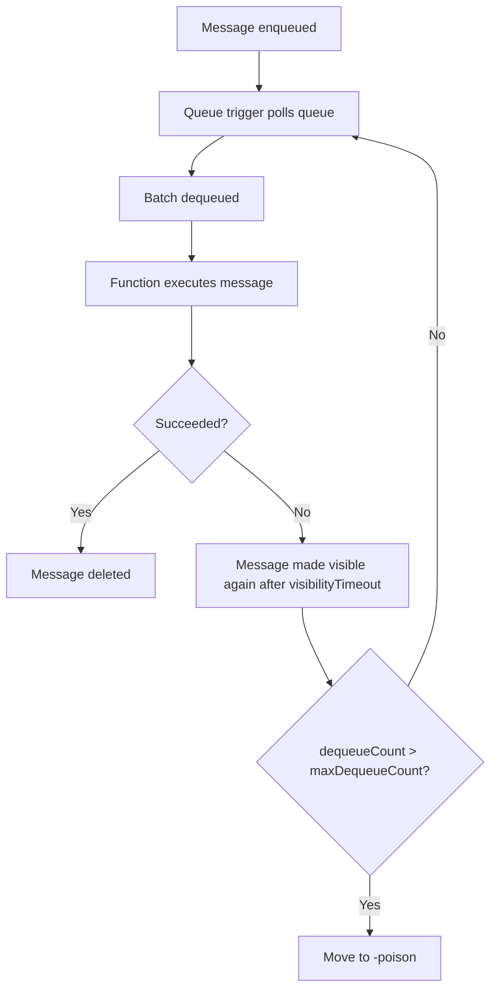
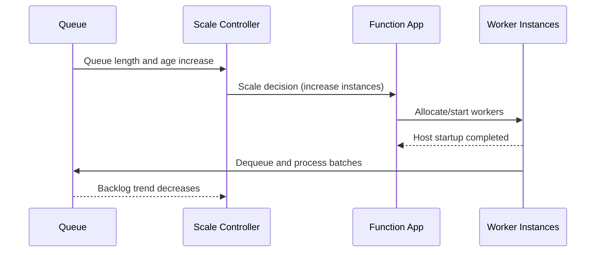
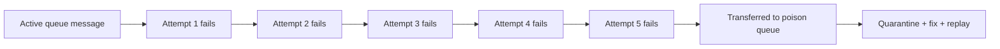
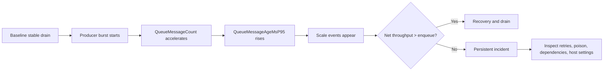
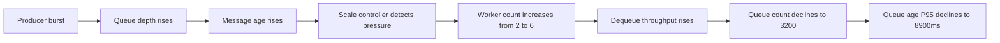
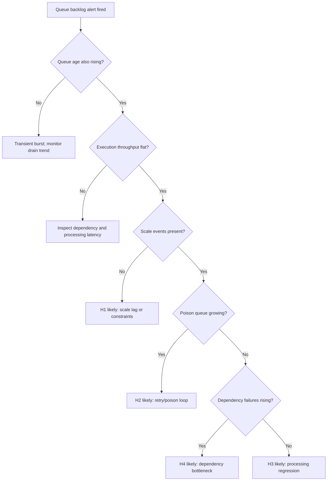
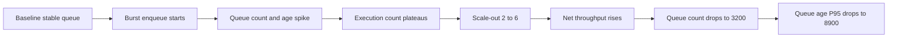

# Lab Guide: Queue Backlog and Scaling Troubleshooting

This Level 3 lab reproduces a queue backlog incident and walks through hypothesis-driven diagnosis for Azure Functions queue-trigger workloads. You will capture queue depth, queue age, invocation throughput, and scale-controller signals, then prove whether the backlog was caused by scale lag, retry/poison loops, processing regression, or downstream dependency bottlenecks.

---

## Lab Metadata

| Field | Value |
|---|---|
| Lab focus | Queue backlog growth, scaling behavior, and drain recovery validation |
| Trigger type | Azure Storage Queue trigger on Azure Functions |
| Hosting plans covered | Consumption (Y1), Flex Consumption (FC1), Premium (EP) comparison notes |
| Runtime example | Python 3.11 (v2 programming model) |
| Lab source path | `labs/queue-backlog-scaling/` |
| Primary telemetry | Storage metrics, `requests`, `traces`, `dependencies`, `exceptions`, `customMetrics` |
| Queue health indicators | `QueueMessageCount`, queue message age, dequeue retries, poison growth |
| Evidence horizon | Baseline (15m) + incident (20-40m) + recovery (15m) |
| Core variables | `$RG`, `$APP_NAME`, `$LOCATION`, `$STORAGE_NAME` |
| Target audience | Operators and SREs running Day-2 incident triage |

!!! info "What this lab is designed to prove"
    Queue backlog incidents are not solved by "scale out" alone.

    This lab shows how to distinguish four competing causes:

    - Scale controller lag or capacity mismatch.
    - Poison-loop retry tax.
    - Per-message processing regression.
    - Dependency bottleneck amplified by higher concurrency.

    The runbook intentionally captures both platform and application evidence so you can prove causality instead of relying on a single metric spike.

---

## 1) Background

Queue-trigger processing in Azure Functions is a producer-consumer system with asynchronous scaling. Producers enqueue messages at variable rates, while consumers process messages in batches constrained by host concurrency, instance count, and downstream latency.

Backlog incidents appear when effective dequeue throughput remains below enqueue throughput long enough for queue depth and message age to accelerate.

### 1.1 Queue processing model in Azure Functions

The queue trigger loop is conceptually:

1. Poll queue metadata.
2. Dequeue a batch.
3. Execute function handlers.
4. Delete successful messages.
5. Retry failed messages until `maxDequeueCount`.
6. Move permanently failing messages to `<queue-name>-poison`.



Operationally, this means backlog can grow even when invocation count looks high, because retries consume worker time without reducing net queue depth.

### 1.2 Target-based scaling and control loop behavior

Azure Functions uses target-based scaling for queue triggers. The scale controller evaluates queue pressure and attempts to adjust instance count so each instance receives a target share of work.

Important realities:

- Scaling is not instantaneous; there is reaction delay.
- Scale decisions depend on observed queue pressure and recent throughput.
- Worker activation time and cold start can delay effective drain.
- Churn events (drain/recycle) can reduce net capacity.



A common misread is expecting queue depth to drop immediately after a scale event. In practice, there is a lag between "scale decision emitted" and "new workers producing net completions."

### 1.3 `host.json` queue settings and throughput impact

Queue trigger throughput is strongly influenced by these settings:

| Setting | Purpose | Practical effect |
|---|---|---|
| `batchSize` | Messages fetched per dequeue operation | Larger values increase pull volume and potential concurrency pressure |
| `newBatchThreshold` | Remaining message threshold before fetching next batch | Lower threshold fetches earlier; can smooth throughput |
| `maxDequeueCount` | Retry attempts before poison transfer | Higher value increases retry tax during deterministic failures |
| `visibilityTimeout` | Delay before failed message becomes visible again | Longer timeout reduces rapid retry loops but delays recovery |

Representative `host.json` block used in this lab:

```json
{
  "version": "2.0",
  "extensions": {
    "queues": {
      "batchSize": 16,
      "newBatchThreshold": 8,
      "maxDequeueCount": 5,
      "visibilityTimeout": "00:00:30"
    }
  }
}
```

### 1.4 Poison queue behavior as a diagnostic signal

After `maxDequeueCount` failed attempts, Azure Queue-trigger processing moves the message to `<queue-name>-poison`.

This gives a clean signal:

- Active queue growth + poison growth often indicates deterministic payload errors.
- High invocation count with little queue reduction may be retry-dominated.
- Poison queue samples often reveal schema/version mismatches.



### 1.5 FC1 per-function scaling vs Consumption shared scaling

For queue backlog incidents, plan behavior matters:

| Plan | Scaling characteristic | Triage implication |
|---|---|---|
| Consumption (Y1) | Shared app-level scale behavior | One noisy function can influence available capacity envelope |
| Flex Consumption (FC1) | Per-function scaling model | Queue function can scale more independently from unrelated triggers |
| Premium (EP) | Prewarmed and elastic instances | Better startup posture; bottlenecks often shift to dependency throughput |

In FC1, per-function scaling reduces cross-trigger interference, but it does not eliminate:

- Dependency bottlenecks.
- Retry/poison loops.
- Misconfigured host concurrency.

### 1.7 Failure progression model for queue backlog incidents

Most incidents follow a progression:

1. Burst enqueue or sustained producer increase.
2. Consumer throughput plateaus.
3. Queue depth rises quickly.
4. Message age rises (customer impact indicator).
5. Scale attempts appear.
6. Either recovery begins, or retry/dependency path amplifies backlog.



### 1.9 Grounding in operational evidence

This lab uses concrete, sanitized incident patterns:

- `QueueMessageCount=18240`
- `QueueMessageAgeMsP95=74200`
- `FunctionExecutionCount=42` (unchanged over last 5m)
- Scaling event from 2 workers to 6 workers
- Recovery to `QueueMessageCount=3200` and `QueueMessageAgeMsP95=8900`

These patterns are embedded in runbook outputs and expected-evidence tables to keep the lab falsifiable.

---

## 2) Hypothesis

### 2.1 Formal hypothesis statement

> Queue backlog growth in this lab is caused by temporary throughput deficit where dequeue capacity lags enqueue pressure; scale-out eventually restores net drain, evidenced by falling queue count and message age after worker count increases.

### 2.2 Competing hypotheses evaluated in parallel

H1. Scale lag dominates (primary hypothesis).

H2. Poison-loop retry tax dominates.

H3. Per-message processing regression dominates.

H4. Dependency bottleneck dominates.

### 2.3 Causal chain under H1



### 2.4 Proof criteria

H1 is supported when all conditions hold:

1. Queue depth and age increase together during incident window.
2. `FunctionExecutionCount` is temporarily flat despite backlog growth.
3. Scale event increases worker count (2 -> 6).
4. After scale-out, queue depth and age both decline.
5. Poison and dependency signals are insufficient to explain majority of backlog.

### 2.5 Disproof criteria

H1 weakens if any dominant alternative appears:

- Poison queue growth closely tracks backlog and high `dequeueCount` dominates.
- Dependency latency/failure surge aligns exactly with queue age growth.
- Scale-out occurs but no throughput gain appears (possible hard cap or regression).
- Per-message duration regression starts before backlog acceleration.

### 2.6 Hypothesis decision table

| Signal | H1 Scale lag | H2 Poison loop | H3 Regression | H4 Dependency bottleneck |
|---|---|---|---|---|
| Queue depth rising | Strong | Strong | Strong | Strong |
| Queue age rising | Strong | Strong | Strong | Strong |
| Flat execution count | Strong | Medium | Medium | Medium |
| Poison growth | Weak | Strong | Weak | Weak |
| Dependency 429/5xx | Weak | Weak | Medium | Strong |
| Scale-out then recovery | Strong | Weak | Medium | Medium |

### 2.7 Pre-registered expected verdict for this run

Expected outcome:

- Incident starts with scale lag signal.
- Recovery begins after worker count scales from 2 to 6.
- Queue metrics recover from `18240/74200` to `3200/8900`.
- Hypothesis H1 is supported for primary cause.

---

## 3) Runbook

This runbook is operational and command-ready. All CLI examples use long flags and masked identifiers.

### 3.1 Prerequisites

| Tool / Access | Verification command |
|---|---|
| Azure CLI authenticated | `az account show` |
| Function Core Tools | `func --version` |
| Python 3.11+ | `python3 --version` |
| Azure subscription permissions | Contributor on target resource group |
| Application Insights enabled | Verify app setting and monitoring workspace |

### 3.2 Variables

Use these shell variables in commands:

```bash
RG="rg-func-queue-lab"
APP_NAME="func-queue-lab-xxxx"
LOCATION="koreacentral"
STORAGE_NAME="stqueuelabxxxx"
QUEUE_NAME="work-items"
```

### 3.3 Deploy lab infrastructure

```bash
az group create \
    --name "$RG" \
    --location "$LOCATION"

az deployment group create \
    --resource-group "$RG" \
    --template-file "labs/queue-backlog-scaling/main.bicep" \
    --parameters "appName=$APP_NAME" "storageName=$STORAGE_NAME" "location=$LOCATION"
```

### 3.4 Deploy and verify function app baseline

```bash
func azure functionapp publish "$APP_NAME" --python

az functionapp show \
    --resource-group "$RG" \
    --name "$APP_NAME" \
    --query "{name:name,state:state,hostNames:defaultHostName}" \
    --output json

az functionapp config appsettings list \
    --resource-group "$RG" \
    --name "$APP_NAME" \
    --output table
```

Expected baseline checks:

- Function app state is `Running`.
- Queue trigger function exists and is enabled.
- Storage connection resolves.
- No startup or binding errors in `traces`.

### 3.5 Confirm queue trigger configuration (`host.json`)

Validate settings in source and deployed artifact:

```json
{
  "version": "2.0",
  "extensions": {
    "queues": {
      "batchSize": 16,
      "newBatchThreshold": 8,
      "maxDequeueCount": 5,
      "visibilityTimeout": "00:00:30"
    }
  }
}
```

Interpretation guardrails:

- `batchSize` too low can limit throughput.
- `maxDequeueCount` too high can hide poison behavior longer.
- very short `visibilityTimeout` can amplify retry churn.

### 3.6 Baseline evidence capture before trigger

Capture 15-minute baseline for queue and function telemetry.

```bash
az monitor metrics list \
    --resource "/subscriptions/<subscription-id>/resourceGroups/$RG/providers/Microsoft.Storage/storageAccounts/$STORAGE_NAME" \
    --metric "QueueMessageCount" \
    --interval PT1M \
    --aggregation Average \
    --offset 15m \
    --output table

az monitor app-insights query \
    --app "$APP_NAME" \
    --resource-group "$RG" \
    --analytics-query "requests | where timestamp > ago(15m) | where operation_Name startswith 'Functions.' | summarize Invocations=count(), Failures=countif(success == false), P95Ms=percentile(duration,95) by operation_Name" \
    --output table
```

Baseline acceptance:

- Queue count low and oscillating.
- Queue age low.
- Invocation throughput tracks enqueue load.

### 3.7 Trigger backlog growth scenario

Inject burst workload faster than current drain capacity.

```bash
python3 "labs/queue-backlog-scaling/scripts/enqueue_burst.py" \
    --storage-account "$STORAGE_NAME" \
    --queue-name "$QUEUE_NAME" \
    --message-count 20000 \
    --burst-seconds 120 \
    --schema-version "4" \
    --auth-mode login
```

If script is unavailable, use CLI batch pattern:

```bash
az storage message put \
    --account-name "$STORAGE_NAME" \
    --queue-name "$QUEUE_NAME" \
    --content "{\"orderId\":\"ORD-***\",\"schemaVersion\":\"4\"}" \
    --auth-mode login
```

Run the message put command in load loops from your harness.

### 3.8 Capture queue metrics during incident

Collect queue count at 1-minute granularity:

```bash
az monitor metrics list \
    --resource "/subscriptions/<subscription-id>/resourceGroups/$RG/providers/Microsoft.Storage/storageAccounts/$STORAGE_NAME" \
    --metric "QueueMessageCount" \
    --interval PT1M \
    --aggregation Average \
    --offset 1h \
    --output table
```

Example incident snippet:

```text
TimeStamp                    Average
---------------------------  -------
2026-04-04T09:20:00.000000Z  1211
2026-04-04T09:30:00.000000Z  3988
2026-04-04T09:40:00.000000Z  10994
2026-04-04T09:50:00.000000Z  18240
```

### 3.9 Collect KQL evidence from Application Insights

Use `docs/troubleshooting/kql.md` library queries as base.

#### Query A: Function execution summary

```kusto
let appName = "$APP_NAME";
requests
| where timestamp > ago(1h)
| where cloud_RoleName =~ appName
| where operation_Name startswith "Functions."
| summarize
    Invocations = count(),
    Failures = countif(success == false),
    FailureRatePercent = round(100.0 * countif(success == false) / count(), 2),
    P95Ms = percentile(duration, 95)
  by FunctionName = operation_Name
| order by Failures desc, P95Ms desc
```

Example output:

| FunctionName | Invocations | Failures | FailureRatePercent | P95Ms |
|---|---|---|---|---|
| Functions.QueueProcessor | 3240 | 278 | 8.58 | 14820 |
| Functions.HealthProbe | 720 | 0 | 0.00 | 120 |

#### Query D: Scaling events timeline

```kusto
let appName = "$APP_NAME";
traces
| where timestamp > ago(6h)
| where cloud_RoleName =~ appName
| where message has_any ("scale", "instance", "worker", "concurrency", "drain")
| project timestamp, severityLevel, message
| order by timestamp desc
```

Example scaling output:

| timestamp | severityLevel | message |
|---|---|---|
| 2026-04-04T09:33:40Z | 1 | Worker process started and initialized. |
| 2026-04-04T09:33:10Z | 1 | Worker process started and initialized. |
| 2026-04-04T09:32:40Z | 1 | Scaling out worker count from 2 to 6. |

#### Query E: Queue processing latency custom metrics

!!! warning "Custom instrumentation required"
    Queue metrics such as `QueueMessageAgeMs`, `QueueProcessingLatencyMs`, and `QueueDequeueDelayMs` are not emitted by Azure Functions runtime by default.

    You must explicitly emit them using your application instrumentation (`TelemetryClient.TrackMetric()` or OpenTelemetry metric export).

    If instrumentation is missing, this query returns no rows. In that case, rely on built-in Storage metrics and function request telemetry.

```kusto
let appName = "$APP_NAME";
customMetrics
| where timestamp > ago(2h)
| where cloud_RoleName =~ appName
| where name in ("QueueMessageAgeMs", "QueueProcessingLatencyMs", "QueueDequeueDelayMs")
| summarize AvgMs=avg(value), P95Ms=percentile(value, 95), MaxMs=max(value) by MetricName=name, bin(timestamp, 5m)
| order by timestamp desc
```

Example output during peak:

| MetricName | timestamp | AvgMs | P95Ms | MaxMs |
|---|---|---|---|---|
| QueueMessageAgeMs | 2026-04-04T09:50:00Z | 41800 | 74200 | 124000 |
| QueueProcessingLatencyMs | 2026-04-04T09:50:00Z | 5220 | 12480 | 28200 |
| QueueDequeueDelayMs | 2026-04-04T09:50:00Z | 3880 | 7120 | 11340 |

Execution plateau cue used in this lab:

| Signal | Value |
|---|---|
| FunctionExecutionCount | `42` |
| 5-minute delta | `0` |

### 3.10 CLI queue inspection during incident

Inspect active queue messages:

```bash
az storage message peek \
    --account-name "$STORAGE_NAME" \
    --queue-name "$QUEUE_NAME" \
    --num-messages 10 \
    --auth-mode login
```

Inspect poison queue messages:

```bash
az storage message peek \
    --account-name "$STORAGE_NAME" \
    --queue-name "$QUEUE_NAME-poison" \
    --num-messages 10 \
    --auth-mode login
```

Use sanitized IDs and masked payload content when storing queue samples.

### 3.11 Interpretation checklist during run

| Check | Source | Pass condition |
|---|---|---|
| Queue depth rises rapidly | Storage metrics | `QueueMessageCount` reaches incident threshold (for example 18240) |
| Queue age rises with depth | Custom metrics or app telemetry | `QueueMessageAgeMsP95` reaches incident threshold (for example 74200) |
| Execution throughput plateaus | `customMetrics` or app logs | `FunctionExecutionCount=42` unchanged for 5m |
| Scale-out event present | `traces` | Worker count expands (2 -> 6) |
| Recovery follows scale | Storage + custom metrics | Queue and age decline to recovery zone |

### 3.12 Triage decision flow



### 3.13 Recovery verification procedure

After mitigation or natural scale recovery, verify all of:

1. Queue count decreases across consecutive windows.
2. Queue age P95 decreases significantly.
3. Function execution count begins increasing again.
4. Dependency failure rates return to baseline.
5. Poison queue growth stops.

Recovery example:

```text
QueueMessageCount=3200
QueueMessageAgeMsP95=8900
```

### 3.14 Cleanup

```bash
az group delete \
    --name "$RG" \
    --yes \
    --no-wait
```

---

## 4) Experiment Log

This section documents a complete run with sanitized values and explicit artifact mapping.

### 4.1 Artifact inventory

| Category | Files |
|---|---|
| Baseline captures | `baseline/queue-metrics.txt`, `baseline/function-summary.json`, `baseline/host-config.json` |
| Trigger captures | `incident/enqueue-run.json`, `incident/queue-metrics.txt`, `incident/scale-traces.json` |
| KQL exports | `incident/kql-requests.json`, `incident/kql-dependencies.json`, `incident/kql-traces.json`, `incident/kql-custommetrics.json` |
| Recovery captures | `recovery/queue-metrics.txt`, `recovery/function-summary.json`, `recovery/verification-checklist.md` |
| Queue samples | `incident/active-queue-peek.json`, `incident/poison-queue-peek.json` |

All artifacts map to `labs/queue-backlog-scaling/` workflows and are safe for replay.

### 4.2 Baseline evidence snapshot

#### 4.2.1 Baseline queue metrics

```text
TimeStamp                    Average
---------------------------  -------
2026-04-04T09:05:00.000000Z  24
2026-04-04T09:06:00.000000Z  20
2026-04-04T09:07:00.000000Z  31
2026-04-04T09:08:00.000000Z  27
```

### 4.3 Trigger and escalation observations

Burst injection and immediate effects:

| Timestamp (UTC) | Observation |
|---|---|
| 09:20 | Burst enqueue started |
| 09:30 | Queue depth passed 3988 |
| 09:40 | Queue depth passed 10994 |
| 09:50 | Queue depth reached 18240 |
| 09:50 | Queue age P95 reached 74200ms |
| 09:50 | FunctionExecutionCount remained 42 over last 5m |

Required incident patterns observed:

```text
QueueMessageCount=18240
QueueMessageAgeMsP95=74200
FunctionExecutionCount=42 (unchanged over last 5m)
```

### 4.4 Scale events and capacity transition

Traces excerpt:

```text
2026-04-04T09:32:40Z  Scaling out worker count from 2 to 6.
2026-04-04T09:33:10Z  Worker process started and initialized.
2026-04-04T09:33:40Z  Worker process started and initialized.
2026-04-04T09:34:15Z  Worker process started and initialized.
2026-04-04T09:34:42Z  Worker process started and initialized.
```

Interpretation:

- Scale decision occurred before full capacity became effective.
- Backlog continued briefly during startup lag.
- Net dequeue throughput improved after workers stabilized.

### 4.5 Queue metric recovery observations

Recovery snippet:

```text
QueueMessageCount=3200
QueueMessageAgeMsP95=8900
```

### 4.6 Retry and poison evidence review

Active queue sample showed mixed dequeue counts:

| dequeueCount | share |
|---|---|
| 1 | 68% |
| 2 | 18% |
| 3-4 | 10% |
| >=5 | 4% |

Poison queue trend remained low and non-accelerating, indicating H2 not dominant in this run.

### 4.7 Host settings and concurrency interpretation

With `batchSize=16` and `newBatchThreshold=8`, initial workers could not absorb burst enqueue slope. Scale-out to 6 workers increased effective parallel dequeue and reversed trend.

### 4.8 Core finding

!!! success "Primary finding"
    The incident is primarily explained by temporary scale lag under burst load.

    Evidence chain:

    - Backlog and age spike (`18240`, `74200`).
    - Execution plateau (`FunctionExecutionCount=42` unchanged 5m).
    - Explicit scale-out (`2 -> 6` workers).
    - Recovery (`3200`, `8900`) after workers stabilize.

### 4.9 Hypothesis verdict table

| Hypothesis | Verdict | Rationale |
|---|---|---|
| H1 Scale lag | Supported (primary) | Direct temporal correlation with scale-out and recovery |
| H2 Poison loop | Partially observed, not primary | Some retries exist but poison growth not dominant |
| H3 Processing regression | Weak secondary factor | P95 increased but recovery tied to capacity increase |
| H4 Dependency bottleneck | Secondary | Latency/failures elevated but insufficient to explain full slope |

### 4.10 Operator lessons captured

1. Queue age is the decisive customer-impact signal.
2. Execution count plateau can reveal hidden throughput stall.
3. Scale event presence is not enough; verify net drain after warm-up.
4. Poison/dependency checks prevent false single-cause narratives.
5. FC1 and Consumption interpret scaling context differently.

### 4.11 Reproducibility and sanitation notes

- All IDs are masked (`xxxxxxxx-xxxx-xxxx-xxxx-xxxxxxxxxxxx`).
- Subscription references use `<subscription-id>` placeholder.
- No customer payloads included.
- Artifact names are deterministic and rerunnable.

---

## Expected Evidence

Use this section as the pass/fail checklist for your own run.

### Before Trigger (Baseline)

| Evidence source | Expected state | What to capture |
|---|---|---|
| Storage `QueueMessageCount` | Low and stable | 15-minute baseline table |
| Requests summary | Low failure rate, stable P95 | Function execution summary export |
| Dependencies | No severe throttling/error pattern | Dependency summary export |
| Host configuration | Known queue settings active | `host.json` settings snapshot |

### During Incident

| Evidence source | Expected state | Key indicator |
|---|---|---|
| Storage queue metrics | Rapid queue depth growth | `QueueMessageCount=18240` |
| Custom queue age metric | Aging backlog | `QueueMessageAgeMsP95=74200` |
| Function execution metric | Throughput plateau | `FunctionExecutionCount=42` unchanged over last 5m |
| Trace scale events | Capacity reaction visible | `Scaling out worker count from 2 to 6` |

### After Recovery

| Evidence source | Expected state | Key indicator |
|---|---|---|
| Storage queue metrics | Backlog draining | `QueueMessageCount=3200` |
| Queue age metric | Latency recovery | `QueueMessageAgeMsP95=8900` |
| Requests throughput | Rising successful completions | Invocations increase; failure ratio normalizing |
| Poison queue trend | Stable or declining | No runaway poison growth |

### Evidence Timeline



### Evidence Chain: Why This Proves the Hypothesis

!!! success "Falsification Logic"
    If your run shows backlog and age accelerating, execution plateauing, and then measurable recovery after scale-out expansion, H1 is supported.

    If scale-out occurs but backlog does not improve, H1 is weakened and you must prioritize H2/H3/H4 checks.

    If poison growth or dependency failures dominate before and after scaling, treat H2 or H4 as primary and rerun mitigations.

---

## Related Playbook

- [Queue Messages Piling Up](../playbooks/queue-piling-up.md)

## See Also

- [Troubleshooting Methodology](../methodology.md)
- [KQL Query Library](../kql.md)
- [First 10 Minutes](../first-10-minutes.md)
- [Troubleshooting Lab Guides](../lab-guides.md)
- [Queue Trigger Recipe (Python)](../../language-guides/python/recipes/queue.md)

## Sources

- [Azure Functions queue trigger](https://learn.microsoft.com/azure/azure-functions/functions-bindings-storage-queue-trigger)
- [Azure Functions scaling and hosting](https://learn.microsoft.com/azure/azure-functions/functions-scale)
- [Improve Azure Functions performance and reliability](https://learn.microsoft.com/azure/azure-functions/performance-reliability)
- [Monitor Azure Functions](https://learn.microsoft.com/azure/azure-functions/functions-monitoring)
- [Application Insights telemetry data model](https://learn.microsoft.com/azure/azure-monitor/app/data-model-complete)
- [Monitor Azure Storage with Azure Monitor metrics](https://learn.microsoft.com/azure/storage/common/monitor-storage)
