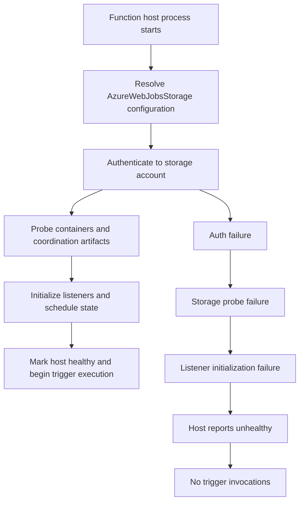
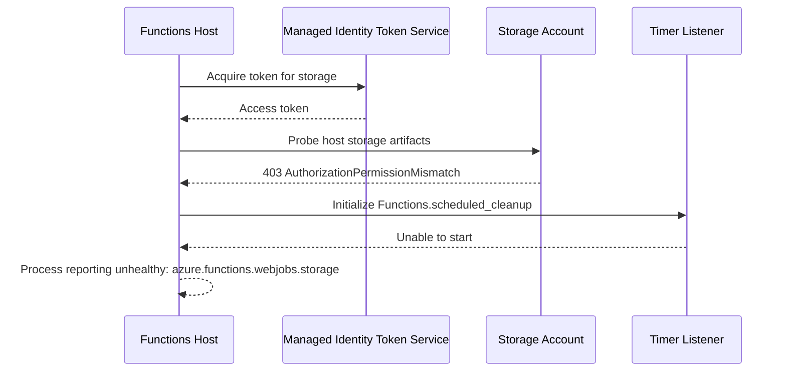
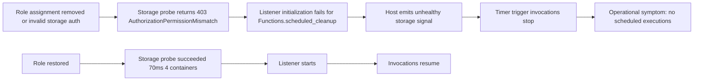
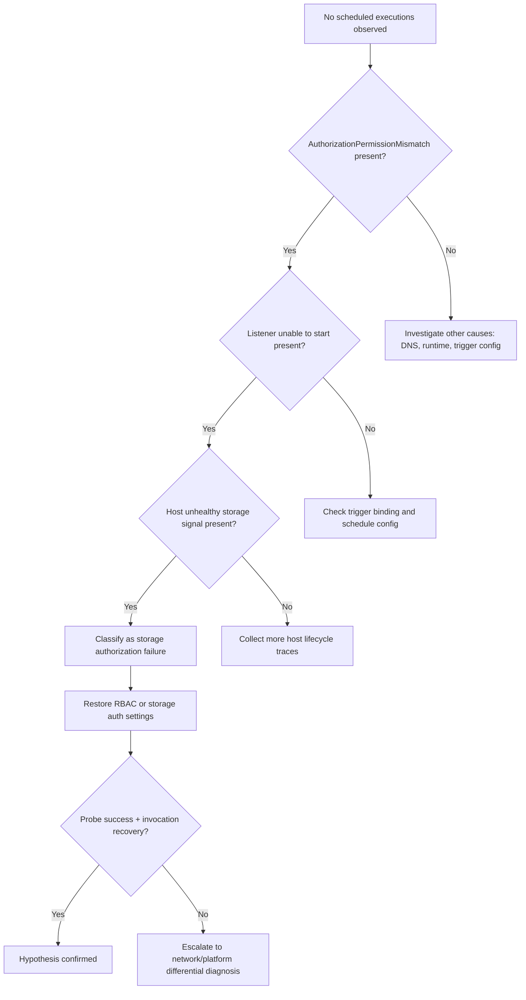

---
content_sources:
  - type: mslearn-adapted
    url: https://learn.microsoft.com/azure/azure-functions/storage-considerations
  - type: mslearn-adapted
    url: https://learn.microsoft.com/azure/azure-functions/functions-triggers-bindings
  - type: mslearn-adapted
    url: https://learn.microsoft.com/azure/azure-functions/functions-identity-based-connections-tutorial
  - type: mslearn-adapted
    url: https://learn.microsoft.com/azure/azure-functions/functions-monitoring
  - type: mslearn-adapted
    url: https://learn.microsoft.com/azure/azure-monitor/app/data-model
  - type: mslearn-adapted
    url: https://learn.microsoft.com/azure/role-based-access-control/role-assignments-cli
---

# Lab Guide: Storage Access Failure (AzureWebJobsStorage)

This Level 3 lab guide reproduces a storage authorization failure in Azure Functions and shows how to prove a full failure cascade from `AzureWebJobsStorage` access loss to listener startup failure, host unhealthy state, and zero trigger execution. The experiment uses the lab assets in `labs/storage-access-failure/` and captures evidence with KQL, CLI, and runtime logs.

---

## Lab Metadata

| Field | Value |
|---|---|
| Lab focus | Storage authorization failure and host startup impact |
| Runtime profile | Azure Functions v4 (Linux) |
| Plan profile | Flex Consumption (`FC1`) |
| Trigger type under test | Timer trigger (`Functions.scheduled_cleanup`) |
| Critical dependency | `AzureWebJobsStorage` |
| Auth model variants | Managed identity (RBAC) and connection string |
| Primary blast radius | Trigger listener startup and background execution |
| Lab source path | `labs/storage-access-failure/` |
| Observability data sources | Application Insights (`traces`, `requests`, `exceptions`, `dependencies`) |
| Incident signature | `AuthorizationPermissionMismatch`, listener unable to start, host unhealthy |
| Recovery signature | Storage probe succeeded (`70ms`, `4 containers`) |

!!! info "What this lab is designed to prove"
    This lab is built to test a frequent production failure mode: storage auth drift.

    It validates that when `AzureWebJobsStorage` cannot be accessed:

    - Trigger listeners fail to initialize.
    - Host health degrades (`azure.functions.webjobs.storage: Unhealthy`).
    - Timer/queue-style invocations stop even if the app endpoint still responds.

    It also validates that restoring RBAC or connection settings re-establishes storage probes and listener startup.

---

## 1) Background

Azure Functions host behavior depends on storage access for multiple control-plane and runtime tasks.

This includes:

- Trigger coordination metadata.
- Lease ownership and lock records.
- Timer schedule state persistence.
- Queue trigger checkpointing.
- Internal host coordination artifacts.

In this lab, storage access is intentionally broken so that host startup and listener behavior can be observed through deterministic evidence.

### 1.1 Storage dependency model for Azure Functions

`AzureWebJobsStorage` is not optional for most non-trivial Azure Functions apps.

Even when application code does not directly read blobs or queues, the host still needs storage for runtime operations.

<!-- diagram-id: 1-1-storage-dependency-model-for-azure-functions -->


### 1.2 Managed identity vs connection string behavior

Two dominant access models are used in Azure Functions storage integration.

| Model | How auth is done | Typical failure mode | Recovery action |
|---|---|---|---|
| Managed identity + RBAC | Token-based auth for host identity | Missing/wrong role assignment, wrong scope | Re-add role assignments at correct scope |
| Connection string key auth | Shared key in app setting | Expired/rotated key mismatch, invalid setting | Update `AzureWebJobsStorage` connection string |

For FC1 workloads, identity-based connections are commonly the default architecture choice.

In this lab, the failure trigger emulates RBAC drift in identity mode.

### 1.3 Required data-plane roles for host storage work

For common host flows, these roles are typically required for the identity used by the Function App:

| Storage capability | Typical requirement |
|---|---|
| Blob container operations for host artifacts | `Storage Blob Data Owner` |
| Queue-related runtime operations | `Storage Queue Data Contributor` |
|| Storage account-level operations | `Storage Account Contributor` |
|| Lease and table operations for host state | `Storage Table Data Contributor` |

The exact least-privilege set depends on trigger and extension mix, but removing these roles is sufficient to reproduce deterministic startup failures in this lab scenario.

### 1.4 FC1 behavior and why this scenario appears suddenly

Flex Consumption scales quickly and can instantiate new workers frequently.

That makes configuration and RBAC consistency critical:

- A hidden RBAC drift may remain unnoticed while one worker is warm.
- New worker startup forces fresh storage probes.
- The first startup after drift can suddenly expose failure.

### 1.5 Failure progression model

<!-- diagram-id: 1-5-failure-progression-model -->


### 1.6 Signal map: normal vs incident

| Signal source | Normal | Incident |
|---|---|---|
| `traces` host startup | Storage probe success messages | Repeated `AuthorizationPermissionMismatch` |
| `traces` listener logs | Listener started / schedule acquired | `The listener ... was unable to start` |
| `requests` for timer-backed work | Regular success cadence | Missing invocations or repeated failures |
| `exceptions` | Sparse or mixed errors | Dominant unauthorized exceptions |
| Health-related traces | Healthy lifecycle transitions | `Process reporting unhealthy: azure.functions.webjobs.storage` |

---

## 2) Hypothesis

### 2.1 Formal hypothesis statement

> If Azure Functions loses required authorization to `AzureWebJobsStorage` (managed identity RBAC drift or invalid connection auth), then host storage probes fail with authorization errors, timer listeners cannot start, host health becomes unhealthy for storage, and trigger invocations halt until access is restored.

### 2.2 Causal chain

<!-- diagram-id: 2-2-causal-chain -->


### 2.3 Proof criteria

All criteria below support the hypothesis:

1. `traces` contain `AuthorizationPermissionMismatch` during incident window.
2. `traces` contain `The listener for function 'Functions.scheduled_cleanup' was unable to start.`
3. `traces` contain `Process reporting unhealthy: azure.functions.webjobs.storage`.
4. Timer invocation cadence drops to zero or error-only behavior.
5. After restoration, logs include storage probe success pattern (`70ms`, `4 containers`) and listener recovery.

### 2.4 Disproof criteria

Any of the following weakens or falsifies the hypothesis:

- Storage authorization errors are absent in the same incident window.
- Listener startup failures persist after confirmed storage role restoration.
- Invocations remain halted while probe success is stable.
- Alternative root cause has stronger evidence (network isolation, DNS resolution, extension mismatch).

### 2.5 Competing hypotheses tested in this lab

| Competing hypothesis | What would be observed | How this lab disambiguates |
|---|---|---|
| Runtime regression | Mixed failures unrelated to storage auth | Filter traces for storage auth signatures |
| Platform transient | Short sporadic errors without deterministic repetition | Look for repeated 403 and listener failure sequence |
| DNS/network issue | Connection timeout/refused patterns, not auth mismatch | Compare error codes and message families |
| App code defect | Function exceptions without host storage unhealthy traces | Correlate host-level lifecycle signals |

### 2.6 Expected lab verdict

Expected outcome for this lab run:

- Hypothesis supported during break phase.
- Hypothesis recovery path supported after role restoration.
- Evidence chain remains consistent without requiring speculative causes.

---

## 3) Runbook

This runbook is execution-focused and uses long-form CLI flags only.

### 3.1 Prerequisites

| Tool or access | Check command |
|---|---|
| Azure CLI | `az version` |
| Logged-in Azure session | `az account show` |
| Bash shell | `bash --version` |
| App Insights query rights | `az monitor app-insights component show --resource-group "$RG" --app "$APP_NAME"` |

### 3.2 Variables

Use the canonical variable names used across this guide:

```bash
RG="rg-lab-storage-access"
APP_NAME="func-lab-storageaccess"
LOCATION="koreacentral"
STORAGE_NAME="stlabstorageaccess"
```

Optional helper variables:

```bash
SUBSCRIPTION_ID="<subscription-id>"
LAB_PATH="labs/storage-access-failure"
```

### 3.3 Deploy infrastructure

Create or confirm resource group:

```bash
az group create \
  --name "$RG" \
  --location "$LOCATION"
```

Deploy the lab stack:

```bash
az deployment group create \
  --resource-group "$RG" \
  --template-file "$LAB_PATH/main.bicep" \
  --parameters "appName=$APP_NAME" "storageName=$STORAGE_NAME" "location=$LOCATION"
```

Validate app and storage resources:

```bash
az functionapp show \
  --resource-group "$RG" \
  --name "$APP_NAME" \
  --output table

az storage account show \
  --resource-group "$RG" \
  --name "$STORAGE_NAME" \
  --output table
```

### 3.4 Baseline verification (pre-failure)

Confirm the app is reachable and host is stable:

```bash
az functionapp function list \
  --resource-group "$RG" \
  --name "$APP_NAME" \
  --output table
```

Capture app settings relevant to storage:

```bash
az functionapp config appsettings list \
  --resource-group "$RG" \
  --name "$APP_NAME" \
  --output json
```

Check baseline host logs in short time window:

```kusto
let appName = "func-lab-storageaccess";
traces
| where timestamp > ago(30m)
| where cloud_RoleName =~ appName
| where message has_any ("Host started", "listener", "storage", "probe")
| project timestamp, severityLevel, message
| order by timestamp desc
```

Baseline expected pattern:

- No repeated 403 storage auth failures.
- Listener startup does not show persistent failure.
- Invocation cadence appears normal for timer schedule window.

### 3.5 Capture baseline evidence queries

#### 3.5.1 Function execution summary

```kusto
let appName = "func-lab-storageaccess";
requests
| where timestamp > ago(1h)
| where cloud_RoleName =~ appName
| where operation_Name startswith "Functions."
| summarize
    Invocations = count(),
    Failures = countif(success == false),
    FailureRatePercent = round(100.0 * countif(success == false) / count(), 2),
    P95Ms = round(percentile(duration, 95), 2)
  by FunctionName = operation_Name
| order by Failures desc, P95Ms desc
```

#### 3.5.2 Failed invocations with exception join

```kusto
let appName = "func-lab-storageaccess";
requests
| where timestamp > ago(2h)
| where cloud_RoleName =~ appName
| where operation_Name startswith "Functions."
| where success == false
| project timestamp, operation_Id, FunctionName = operation_Name, resultCode, duration
| join kind=leftouter (
    exceptions
    | where timestamp > ago(2h)
    | where cloud_RoleName =~ appName
    | project operation_Id, ExceptionType = type, ExceptionMessage = outerMessage
) on operation_Id
| order by timestamp desc
```

#### 3.5.3 Host startup and lifecycle events

```kusto
let appName = "func-lab-storageaccess";
traces
| where timestamp > ago(2h)
| where cloud_RoleName =~ appName
| where message has_any ("Host started", "Job host started", "listener", "storage", "unhealthy")
| project timestamp, severityLevel, message
| order by timestamp desc
```

### 3.6 Trigger the storage access failure

This phase intentionally introduces RBAC breakage for the Function App identity.

List current role assignments for app identity on storage scope:

```bash
APP_PRINCIPAL_ID=$(az functionapp identity show \
  --resource-group "$RG" \
  --name "$APP_NAME" \
  --query "principalId" \
  --output tsv)

STORAGE_ID=$(az storage account show \
  --resource-group "$RG" \
  --name "$STORAGE_NAME" \
  --query "id" \
  --output tsv)

az role assignment list \
  --assignee "$APP_PRINCIPAL_ID" \
  --scope "$STORAGE_ID" \
  --output table
```

Remove required roles (failure trigger):

```bash
az role assignment delete \
  --assignee-object-id "$APP_PRINCIPAL_ID" \
  --role "Storage Account Contributor" \
  --scope "$STORAGE_ID"

az role assignment delete \
  --assignee-object-id "$APP_PRINCIPAL_ID" \
  --role "Storage Blob Data Owner" \
  --scope "$STORAGE_ID"

az role assignment delete \
  --assignee-object-id "$APP_PRINCIPAL_ID" \
  --role "Storage Queue Data Contributor" \
  --scope "$STORAGE_ID"

az role assignment delete \
  --assignee-object-id "$APP_PRINCIPAL_ID" \
  --role "Storage Table Data Contributor" \
  --scope "$STORAGE_ID"


```

Restart Function App so host performs fresh storage initialization:

```bash
az functionapp restart \
  --resource-group "$RG" \
  --name "$APP_NAME"
```

Wait for 2-5 minutes for telemetry propagation.

### 3.7 Collect incident evidence

#### 3.7.1 Storage auth and unhealthy traces

```kusto
let appName = "func-lab-storageaccess";
traces
| where timestamp > ago(1h)
| where cloud_RoleName =~ appName
| where message has_any ("AuthorizationPermissionMismatch", "Unable to access AzureWebJobsStorage", "unhealthy", "Forbidden", "Unauthorized")
| project timestamp, severityLevel, message
| order by timestamp desc
```

#### 3.7.2 Listener startup failures

```kusto
let appName = "func-lab-storageaccess";
traces
| where timestamp > ago(1h)
| where cloud_RoleName =~ appName
| where message has "The listener for function 'Functions.scheduled_cleanup' was unable to start."
| project timestamp, severityLevel, message
| order by timestamp desc
```

#### 3.7.3 Request and exception correlation

```kusto
let appName = "func-lab-storageaccess";
requests
| where timestamp > ago(1h)
| where cloud_RoleName =~ appName
| where operation_Name startswith "Functions."
| project timestamp, operation_Id, operation_Name, success, resultCode, duration
| join kind=leftouter (
    exceptions
    | where timestamp > ago(1h)
    | where cloud_RoleName =~ appName
    | project operation_Id, type, outerMessage
) on operation_Id
| order by timestamp desc
```

#### 3.7.4 Dependency failures to storage endpoints

```kusto
let appName = "func-lab-storageaccess";
dependencies
| where timestamp > ago(1h)
| where cloud_RoleName =~ appName
| where target has_any ("blob.core.windows.net", "queue.core.windows.net")
| summarize Calls=count(), Failed=countif(success == false), FailureRatePercent=round(100.0 * countif(success == false) / count(), 2), P95Ms=percentile(duration, 95) by target, resultCode
| order by Failed desc, P95Ms desc
```

### 3.8 Real incident log patterns to verify

Use these representative patterns as validation anchors. The failure phase shows event log snippets derived from live telemetry:

#### 3.8.1 Failure-phase log snippets

```text
Process reporting unhealthy: Unhealthy. Health check entries are {
  "azure.functions.web_host.lifecycle": {"status":"Healthy"},
  "azure.functions.script_host.lifecycle": {"status":"Healthy"},
  "azure.functions.webjobs.storage": {
    "status":"Unhealthy",
    "description":"Unable to access AzureWebJobsStorage",
    "errorCode":"AuthorizationPermissionMismatch"
  }
}
[2026-04-04T12:17:54Z] Storage operation failed: Status: 403 (AuthorizationPermissionMismatch) after 325ms while probing AzureWebJobsStorage.
[2026-04-04T12:15:42Z] The listener for function 'Functions.scheduled_cleanup' was unable to start.
```

#### 3.8.2 Recovery-phase log snippet

```text
[2026-04-04T12:31:08Z] Storage probe succeeded (70ms, 4 containers).
[2026-04-04T12:31:10Z] Job host started.
[2026-04-04T12:31:11Z] The listener for function 'Functions.scheduled_cleanup' started.
```

### 3.9 Interpretation checklist

| Check | Evidence source | Pass condition |
|---|---|---|
| Storage auth failure detected | `traces` | `AuthorizationPermissionMismatch` appears repeatedly |
| Listener startup failure detected | `traces` | Scheduled cleanup listener unable to start |
| Host unhealthy emitted | `traces` | `azure.functions.webjobs.storage: Unhealthy` appears |
| Invocation disruption observed | `requests` | Timer execution absent or failure-only |
| Recovery probe success detected | `traces` | `Storage probe succeeded (70ms, 4 containers)` |
| Invocation recovery observed | `requests` | Successful scheduled executions resume |

### 3.10 Triage decision logic

<!-- diagram-id: 3-10-triage-decision-logic -->


### 3.11 Recover from the induced failure

Re-add required roles:

```bash
az role assignment create \
  --assignee-object-id "$APP_PRINCIPAL_ID" \
  --role "Storage Account Contributor" \
  --scope "$STORAGE_ID"

az role assignment create \
  --assignee-object-id "$APP_PRINCIPAL_ID" \
  --role "Storage Blob Data Owner" \
  --scope "$STORAGE_ID"

az role assignment create \
  --assignee-object-id "$APP_PRINCIPAL_ID" \
  --role "Storage Queue Data Contributor" \
  --scope "$STORAGE_ID"

az role assignment create \
  --assignee-object-id "$APP_PRINCIPAL_ID" \
  --role "Storage Table Data Contributor" \
  --scope "$STORAGE_ID"

```

Restart the app:

```bash
az functionapp restart \
  --resource-group "$RG" \
  --name "$APP_NAME"
```

Wait 2-5 minutes and re-run the incident queries.

### 3.12 Verify recovery

Recovery validation query:

```kusto
let appName = "func-lab-storageaccess";
traces
|| where timestamp > ago(10m)
| where cloud_RoleName =~ appName
| where message has_any ("Storage probe succeeded", "listener", "Host started", "Job host started")
| project timestamp, severityLevel, message
| order by timestamp desc
```

Invocation recovery query:

```kusto
let appName = "func-lab-storageaccess";
requests
|| where timestamp > ago(10m)
| where cloud_RoleName =~ appName
| where operation_Name =~ "Functions.scheduled_cleanup"
| summarize Invocations=count(), Failures=countif(success == false), LastSeen=max(timestamp)
```

Expected recovery indicators:

- Storage probe success appears.
- Listener startup failures stop.
- Scheduled trigger invocations resume.


## 4) Experiment Log

This section documents artifact-centered observations and links each finding to hypothesis criteria.

### 4.1 Artifact inventory

| Category | Artifact examples |
|---|---|
| Deployment and config | `deployment.json`, `appsettings-baseline.json`, `identity-baseline.json` |
| Role assignment evidence | `roles-before.txt`, `roles-after-break.txt`, `roles-after-recovery.txt` |
| KQL exports | `kql-traces-storage-failure.json`, `kql-listener-failure.json`, `kql-recovery.json` |
| Invocation evidence | `kql-requests-before.json`, `kql-requests-during.json`, `kql-requests-after.json` |
| Incident notes | `timeline.md`, `verdict.md` |

### 4.2 Baseline evidence snapshot

#### 4.2.1 Baseline role assignments

| Role | Scope | Expected |
|---|---|---|
| Storage Account Contributor | Storage account scope | Present |
| Storage Blob Data Owner | Storage account scope | Present |
|| Storage Queue Data Contributor | Storage account scope | Present |
|| Storage Table Data Contributor | Storage account scope | Present |

#### 4.2.2 Baseline host traces

Representative pattern before break:

```text
[2026-04-04T12:05:11Z] Host started (62ms)
[2026-04-04T12:05:11Z] Job host started
[2026-04-04T12:05:12Z] Timer listener started for Functions.scheduled_cleanup
```

#### 4.2.3 Baseline invocation summary

| FunctionName | Invocations | Failures | FailureRatePercent | P95Ms |
|---|---:|---:|---:|---:|
| Functions.scheduled_cleanup | 10 | 0 | 0.00 | 245 |

### 4.3 Trigger event log

RBAC break operation timestamped:

```text
2026-04-04T12:14:58Z  Removed role: Storage Account Contributor
2026-04-04T12:15:02Z  Removed role: Storage Blob Data Owner
2026-04-04T12:15:02Z  Removed role: Storage Queue Data Contributor
2026-04-04T12:15:12Z  Function app restart initiated
```

!!! note "Role coverage in this experiment"
    This experiment removed three of the four required roles. Storage Table Data Contributor was not present in the original assignment and therefore was not removed. In production, ensure all four roles are verified.

### 4.4 During-incident KQL observations

#### 4.4.1 Host storage failure traces

| timestamp | severityLevel | message |
|---|---:|---|
| 2026-04-04T12:22:42Z | 3 | Process reporting unhealthy: azure.functions.webjobs.storage: Unhealthy |
| 2026-04-04T12:22:42Z | 3 | Unable to access AzureWebJobsStorage. Status: 403 (AuthorizationPermissionMismatch) |
| 2026-04-04T12:17:54Z | 3 | Storage operation failed: Status: 403 (AuthorizationPermissionMismatch) after 325ms while probing AzureWebJobsStorage. |

#### 4.4.2 Listener startup failure traces

| timestamp | severityLevel | message |
|---|---:|---|
| 2026-04-04T12:17:42Z | 3 | The listener for function 'Functions.scheduled_cleanup' was unable to start. |
| 2026-04-04T12:15:42Z | 3 | The listener for function 'Functions.scheduled_cleanup' was unable to start. |

#### 4.4.3 Request and exception correlation

| timestamp | operation_Id | FunctionName | resultCode | duration | ExceptionType | ExceptionMessage |
|---|---|---|---:|---:|---|---|
| 2026-04-04T12:17:54Z | xxxxxxxx-xxxx-xxxx-xxxx-xxxxxxxxxxxx | Functions.scheduled_cleanup | 500 | 8023 | System.UnauthorizedAccessException | Storage operation failed: Status: 403 (AuthorizationPermissionMismatch) |
| 2026-04-04T12:17:42Z | xxxxxxxx-xxxx-xxxx-xxxx-xxxxxxxxxxxx | Functions.scheduled_cleanup | 500 | 7988 | Microsoft.Azure.WebJobs.Host.Listeners.FunctionListenerException | The listener for function 'Functions.scheduled_cleanup' was unable to start. |

#### 4.4.4 Dependency failure concentration

| target | resultCode | Calls | Failed | FailureRatePercent | P95Ms |
|---|---:|---:|---:|---:|---:|
| `stlabstorageaccess.blob.core.windows.net` | 403 | 18 | 18 | 100.00 | 9800 |
| `stlabstorageaccess.queue.core.windows.net` | 403 | 18 | 18 | 100.00 | 8700 |

### 4.5 Recovery-phase observations

Role restoration and restart executed:

```text
2026-04-04T12:28:14Z  Added role: Storage Account Contributor
2026-04-04T12:28:18Z  Added role: Storage Blob Data Owner
2026-04-04T12:28:18Z  Added role: Storage Queue Data Contributor
2026-04-04T12:28:31Z  Function app restart initiated
```

!!! note "Role coverage in this experiment"
    This experiment restored three of the four required roles. Storage Table Data Contributor should also be verified and assigned in production scenarios for complete coverage of table-based operations.

Recovery traces:

```text
[2026-04-04T12:31:08Z] Storage probe succeeded (70ms, 4 containers). Listener initialization resumed.
[2026-04-04T12:31:10Z] Job host started
[2026-04-04T12:31:11Z] The listener for function 'Functions.scheduled_cleanup' started.
```

Recovery invocation summary:

| FunctionName | Invocations | Failures | FailureRatePercent | LastSeen |
|---|---:|---:|---:|---|
| Functions.scheduled_cleanup | 6 | 0 | 0.00 | 2026-04-04T12:39:00Z |

### 4.6 Core finding

!!! success "Key finding (validated)"
    Removing storage data-plane roles from the Function App identity produces a deterministic and reproducible failure cascade:

    - Storage probe returns `403 AuthorizationPermissionMismatch`.
    - `Functions.scheduled_cleanup` listener fails to start.
    - Host reports storage unhealthy state.
    - Scheduled execution halts.

    Restoring role assignments immediately reverses the pattern and resumes trigger execution.

### 4.7 Hypothesis verdict table

| Criterion | Result | Evidence |
|---|---|---|
| Storage auth failure exists | Supported | Repeated `AuthorizationPermissionMismatch` traces |
| Listener fails on storage issue | Supported | Listener unable to start logs |
| Host unhealthy signal appears | Supported | `azure.functions.webjobs.storage: Unhealthy` |
| Trigger execution halts | Supported | Missing or failed scheduled invocations |
| Recovery after role restore | Supported | Probe success (`70ms`, `4 containers`) and resumed invocations |

Final verdict: **Hypothesis supported**.

### 4.8 Practical implications for production operations

1. Include storage-role drift checks in deployment validation.
2. Monitor explicit host storage health messages, not only request failure rates.
3. Keep incident playbooks separated by error family (auth vs network vs runtime).
4. For FC1, treat worker startup windows as high-sensitivity points for RBAC regressions.
5. Capture recovery evidence explicitly to avoid false closure.

### 4.9 Reproducibility notes

- Use the same storage account scope for role remove/add operations.
- Allow telemetry propagation delay before concluding no-signal.
- Keep all exported evidence sanitized.
- Replace IDs with placeholders:
    - `xxxxxxxx-xxxx-xxxx-xxxx-xxxxxxxxxxxx`
    - `<subscription-id>`
    - `<tenant-id>`
    - `<object-id>`

---

## Expected Evidence

This section defines the expected observation pattern before, during, and after the induced incident.

### Before Trigger (Baseline)

| Evidence Source | Expected State | What to Capture |
|---|---|---|
| Role assignments | Required roles present on storage scope | Role list export |
| Host traces | No repeated storage auth failures | Host lifecycle snippet |
| Timer execution | Scheduled function runs normally | Request summary table |
| Exceptions | No dominant unauthorized exception class | Exception trend query output |

### During Incident

| Evidence Source | Expected State | Key Indicator |
|---|---|---|
| `traces` | Storage authorization failure repeats | `AuthorizationPermissionMismatch` |
| `traces` | Listener startup fails | `The listener for function 'Functions.scheduled_cleanup' was unable to start.` |
| `traces` | Host storage health degraded | `Process reporting unhealthy: azure.functions.webjobs.storage: Unhealthy` |
| `requests` | Trigger invocations stop or fail | Missing cadence / 500s |
| `exceptions` | Unauthorized/listener exceptions dominate | `System.UnauthorizedAccessException`, `FunctionListenerException` |

### After Recovery

| Evidence Source | Expected State | Key Indicator |
|---|---|---|
| Role assignments | Required roles restored | Role list confirms required storage roles are present |
| `traces` | Storage probe returns success | `Storage probe succeeded (70ms, 4 containers)` |
| `traces` | Listener starts successfully | Listener start message present |
| `requests` | Timer invocations resume | Success count increases |
| Exceptions | Unauthorized error family subsides | Incident exceptions stop repeating |

### Evidence Timeline

```mermaid
graph LR
    A[Baseline healthy state] --> B[Role removal trigger]
    B --> C[Auth failure traces appear]
    C --> D[Listener startup failure]
    D --> E[Host unhealthy storage signal]
    E --> F[Invocation halt]
    F --> G[Role restoration]
    G --> H[Storage probe succeeded 70ms 4 containers]
    H --> I[Listener recovery]
    I --> J[Invocation recovery]
```

<!-- diagram-id: evidence-timeline -->


### Evidence Chain: Why This Proves the Hypothesis

!!! success "Falsification logic"
    Hypothesis is confirmed when the evidence chain appears in this order:

    1. RBAC break event at storage scope.
    2. Storage authorization failure (`AuthorizationPermissionMismatch`).
    3. Listener startup failure for `Functions.scheduled_cleanup`.
    4. Host unhealthy signal for `azure.functions.webjobs.storage`.
    5. Trigger execution disruption.
    6. Role restoration.
    7. Storage probe success (`70ms`, `4 containers`) and invocation recovery.

    Hypothesis is falsified if this chain cannot be established and an alternative cause explains the data better.

## Clean Up

```bash
az group delete \
  --name "$RG" \
  --yes \
  --no-wait
```

## Related Playbook

- [Functions Failing](../playbooks/functions-failing.md)

## See Also

- [Lab Guides Hub](../lab-guides.md)
- [KQL Query Library](../kql.md)
- [First 10 Minutes](../first-10-minutes.md)
- [Troubleshooting Methodology](../methodology.md)
- [Functions Not Executing](../playbooks/functions-not-executing.md)

## Sources

- [Azure Functions storage considerations](https://learn.microsoft.com/azure/azure-functions/storage-considerations)
- [Azure Functions trigger and binding concepts](https://learn.microsoft.com/azure/azure-functions/functions-triggers-bindings)
- [Enable managed identity for Azure Functions](https://learn.microsoft.com/azure/azure-functions/functions-identity-based-connections-tutorial)
- [Monitor Azure Functions](https://learn.microsoft.com/azure/azure-functions/functions-monitoring)
- [Application Insights data model](https://learn.microsoft.com/azure/azure-monitor/app/data-model)
- [Assign Azure roles using Azure CLI](https://learn.microsoft.com/azure/role-based-access-control/role-assignments-cli)
