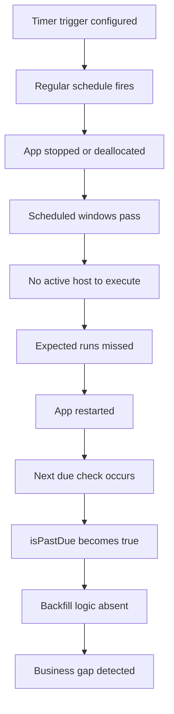
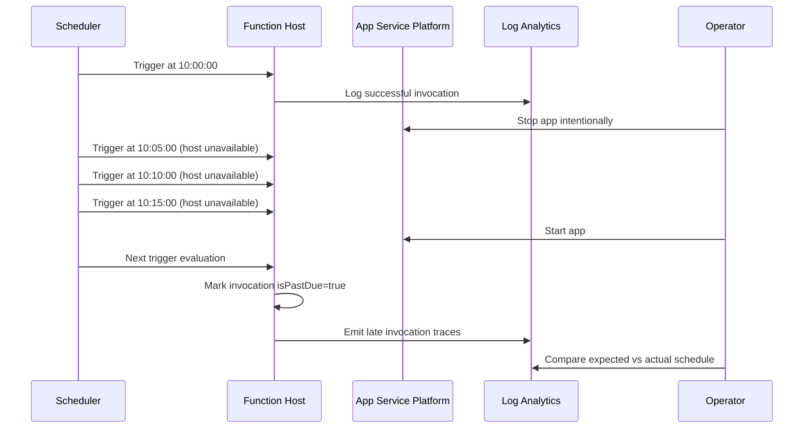
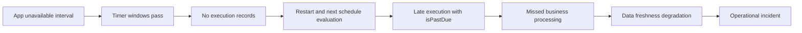
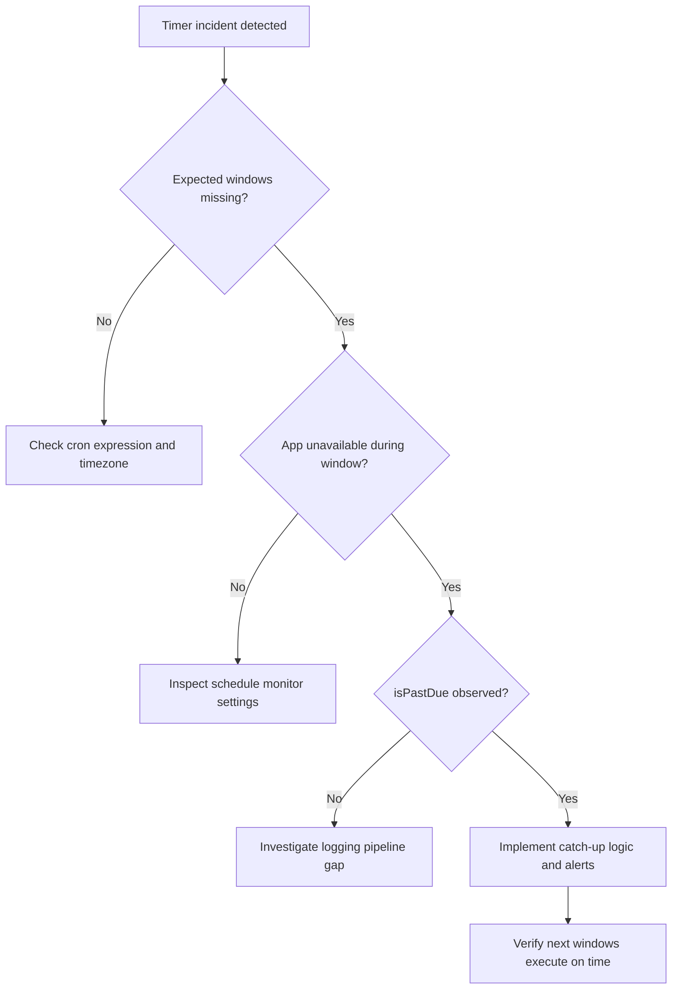

# Lab Guide: Timer Trigger Missed Schedules

This lab reproduces missed Timer Trigger executions when an app is stopped or deallocated, especially in idle-heavy patterns on Consumption. You will validate the role of schedule monitoring, `isPastDue`, and startup behavior. You will then apply operational controls to reduce missed execution impact and improve observability.

## Lab Metadata

| Field | Value |
|---|---|
| Difficulty | Intermediate |
| Duration | 45-60 min |
| Hosting plan tested | Consumption / Premium / Flex Consumption |
| Trigger type | Timer Trigger (NCRONTAB) |
| Azure services | Azure Functions, Azure Storage, Application Insights, Log Analytics |
| Skills practiced | NCRONTAB validation, missed-run diagnosis, timer recovery checks, KQL evidence interpretation |

## 1) Background

Timer triggers in Azure Functions use NCRONTAB format: `{second} {minute} {hour} {day} {month} {day-of-week}`. Schedule execution depends on host availability and runtime schedule monitoring behavior. When the host is unavailable for a period, expected invocations can be delayed or skipped depending on settings and runtime conditions.

On Consumption, host lifecycle behavior introduces gaps during idle periods, app stop/start operations, or platform maintenance. If a timer window passes while the app is unavailable, the next invocation may arrive late with `isPastDue=true`, or specific missed intervals might not be replayed as one-by-one historical executions.

Incidents are often misdiagnosed as cron syntax bugs when the real issue is host availability or weak schedule monitoring configuration. This lab reproduces the scenario by intentionally stopping the app during multiple expected schedule windows, then restarting and observing actual timer behavior versus expected schedule.

You will compare baseline executions, outage period, and recovery period with `FunctionAppLogs`, `traces`, and `requests` telemetry. The final step introduces resilience and observability controls such as explicit startup behavior, `isPastDue` handling, and log-driven schedule drift alerting.

### Failure progression model



### Key metrics comparison

| Metric | Healthy | Degraded | Critical |
|---|---|---|---|
| Timer invocation success rate | 99-100% | 90-98% | < 90% |
| Schedule drift (actual vs expected) | < 30 s | 1-10 min | > 10 min |
| `isPastDue=true` ratio | 0-5% | 10-30% | > 30% |
| Missed windows per hour | 0 | 1-3 | > 3 |
| Mean detection delay | < 5 min | 10-20 min | > 20 min |

### Timeline of a typical incident



## 2) Hypothesis

### Formal statement
If a Timer Trigger app is unavailable during scheduled windows, then timer executions are missed or delayed, producing increased schedule drift and `isPastDue` occurrences; enabling robust monitoring and implementing `isPastDue` handling logic reduces unnoticed misses and shortens recovery time.

### Causal chain



### Proof criteria

1. Expected schedule windows exist with no corresponding invocation records while app is unavailable.
2. First post-restart invocation shows `isPastDue=true` and measurable schedule drift.
3. Incident window produces lower invocation count than expected NCRONTAB windows.
4. Adding monitoring and handling logic improves detection and post-restart execution behavior.

### Disproof criteria

1. All scheduled windows execute despite app stop/deallocation period.
2. No increased drift or `isPastDue` signal after restart.
3. Invocation gaps are fully explained by incorrect schedule expression rather than host availability.

## 3) Runbook

### Prerequisites

1. Authenticate Azure CLI:
   ```bash
   az login --output table
   ```
2. Set active subscription:
   ```bash
   az account set --subscription <subscription-id>
   ```
3. Install Functions Core Tools and language worker runtime.
4. Prepare storage account naming compliance and uniqueness.
5. Prepare Application Insights workspace access with query permissions.
6. Verify timer function uses NCRONTAB expression with seconds field.

### Variables

```bash
RG="rg-func-lab-timer"
LOCATION="koreacentral"
APP_NAME="func-lab-timer-missed"
STORAGE_NAME="stfunclabtimer001"
PLAN_NAME="plan-func-lab-timer"
WORKSPACE_NAME="log-func-lab-timer"
APPINSIGHTS_NAME="appi-func-lab-timer"
SUBSCRIPTION_ID="<subscription-id>"
```

### Step 1: Deploy baseline infrastructure

```bash
az group create --name $RG --location $LOCATION --output table
az storage account create --name $STORAGE_NAME --resource-group $RG --location $LOCATION --sku Standard_LRS --kind StorageV2 --output table
az monitor log-analytics workspace create --resource-group $RG --workspace-name $WORKSPACE_NAME --location $LOCATION --output table
az monitor app-insights component create --app $APPINSIGHTS_NAME --location $LOCATION --resource-group $RG --workspace $WORKSPACE_NAME --application-type web --output table
az functionapp create --name $APP_NAME --resource-group $RG --consumption-plan-location $LOCATION --runtime python --runtime-version 3.11 --functions-version 4 --storage-account $STORAGE_NAME --app-insights $APPINSIGHTS_NAME --output table
```

### Step 2: Deploy function app code

Use a timer schedule every 5 minutes:

```json
{
  "schedule": "0 */5 * * * *",
  "runOnStartup": false,
  "useMonitor": true
}
```

Publish and configure app settings:

```bash
func azure functionapp publish $APP_NAME --python
az functionapp config appsettings set --name $APP_NAME --resource-group $RG --settings "TimerLab__Schedule=0 */5 * * * *" "TimerLab__RecordExpectedWindow=true" --output table
az functionapp restart --name $APP_NAME --resource-group $RG --output table
```

### Step 3: Collect baseline evidence

```kusto
requests
| where cloud_RoleName == "func-lab-timer-missed"
| where name has "Timer"
| summarize invocations=count(), p95=percentile(duration,95) by bin(timestamp, 15m)
| order by timestamp asc
```

Expected output:

```text
timestamp              invocations p95
2026-04-05T02:00:00Z   3           00:00:00.19
2026-04-05T02:15:00Z   3           00:00:00.21
```

```kusto
traces
| where cloud_RoleName == "func-lab-timer-missed"
| where message has "TimerFired"
| extend isPastDue=tostring(customDimensions["isPastDue"]), expected=todatetime(customDimensions["ExpectedUtc"]), actual=todatetime(customDimensions["ActualUtc"])
| extend driftSec=datetime_diff("second", actual, expected)
| summarize avgDrift=avg(driftSec), p95Drift=percentile(driftSec,95), pastDue=countif(isPastDue == "True") by bin(timestamp, 15m)
| order by timestamp asc
```

```kusto
FunctionAppLogs
| where AppName == "func-lab-timer-missed"
| where Message has_any ("Timer trigger fired", "isPastDue")
| project TimeGenerated, Message
| order by TimeGenerated asc
```

### Step 4: Trigger the incident

Stop the app for at least three schedule windows.

```bash
az functionapp stop --name $APP_NAME --resource-group $RG
```

Wait 16-20 minutes, then start again.

```bash
az functionapp start --name $APP_NAME --resource-group $RG
az functionapp restart --name $APP_NAME --resource-group $RG
```

### Step 5: Collect incident evidence

Expected vs actual invocation comparison query:

```kusto
let startTime = ago(2h);
let endTime = now();
let expected = range ts from startTime to endTime step 5m;
let actual = requests
| where cloud_RoleName == "func-lab-timer-missed"
| where name has "Timer"
| summarize actualCount=count() by bin(timestamp, 5m)
| project ts=timestamp, actualCount;
expected
| join kind=leftouter actual on ts
| extend actualCount=coalesce(actualCount, 0)
| extend missed=iff(actualCount == 0, 1, 0)
| summarize missedWindows=sum(missed), totalWindows=count(), executedWindows=countif(actualCount > 0)
```

Expected output:

```text
missedWindows totalWindows executedWindows
3             24           21
```

```kusto
traces
| where cloud_RoleName == "func-lab-timer-missed"
| where message has "TimerFired"
| extend isPastDue=tostring(customDimensions["isPastDue"]), expected=todatetime(customDimensions["ExpectedUtc"]), actual=todatetime(customDimensions["ActualUtc"])
| extend driftMin=datetime_diff("minute", actual, expected)
| summarize maxDrift=max(driftMin), pastDueCount=countif(isPastDue == "True"), total=count() by bin(timestamp, 30m)
| order by timestamp asc
```

```kusto
AppMetrics
| where AppRoleName == "func-lab-timer-missed"
| where Name in ("timer_schedule_drift_seconds","timer_missed_windows")
| summarize avgValue=avg(Val), maxValue=max(Val) by Name, bin(TimeGenerated, 15m)
| order by TimeGenerated asc
```

```kusto
dependencies
| where cloud_RoleName == "func-lab-timer-missed"
| summarize depP95=percentile(duration,95), depFailures=countif(success == false) by bin(timestamp, 15m)
| order by timestamp asc
```

### Step 6: Interpret results

- [ ] Missing invocations align with app-down window.
- [ ] Post-restart invocation shows `isPastDue=true`.
- [ ] Schedule drift spikes after restart then normalizes.
- [ ] Dependency failures do not explain missing timer windows.
- [ ] Missed windows metric returns to baseline after mitigation.

!!! tip "How to Read This"
    Do not interpret one successful post-restart invocation as proof that all missed windows were replayed. Compare expected 5-minute windows against actual invocation records. If windows are absent, treat as missed executions and trigger compensating logic.

### Triage decision



### Step 7: Apply fix and verify recovery

Apply operational improvements:

```bash
az functionapp config appsettings set --name $APP_NAME --resource-group $RG --settings "TimerLab__EnableCompensation=true" "TimerLab__AlertOnMissedWindow=true" "TimerLab__RunOnStartup=true" --output table
func azure functionapp publish $APP_NAME --python
az functionapp restart --name $APP_NAME --resource-group $RG --output table
```

Verification query:

```kusto
traces
| where cloud_RoleName == "func-lab-timer-missed"
| where message has "TimerFired"
| extend isPastDue=tostring(customDimensions["isPastDue"]), expected=todatetime(customDimensions["ExpectedUtc"]), actual=todatetime(customDimensions["ActualUtc"])
| extend driftSec=datetime_diff("second", actual, expected)
| summarize p95Drift=percentile(driftSec,95), missed=countif(tostring(customDimensions["MissedWindow"]) == "True"), pastDue=countif(isPastDue == "True") by bin(timestamp, 30m)
| order by timestamp asc
```

### Clean up

```bash
az group delete --name $RG --yes --no-wait
```

## 4) Experiment Log

### Artifact inventory

| Artifact | Location | Purpose |
|---|---|---|
| Timer invocation traces | `traces` table | Confirm actual execution times and `isPastDue` |
| Function request records | `requests` table | Count schedule-aligned executions |
| Runtime log entries | `FunctionAppLogs` table | Validate timer trigger lifecycle signals |
| Dependency diagnostics | `dependencies` table | Exclude external dependency bottlenecks |
| Drift metrics | `AppMetrics` table | Quantify schedule drift and missed windows |
| Runbook command transcript | `docs/troubleshooting/lab-guides/timer-missed-schedules.md` | Repeatable incident workflow |

### Baseline evidence

| Time (UTC) | Expected windows | Actual invocations | Drift p95 (sec) | isPastDue count |
|---|---:|---:|---:|---:|
| 02:00-02:15 | 3 | 3 | 9 | 0 |
| 02:15-02:30 | 3 | 3 | 11 | 0 |
| 02:30-02:45 | 3 | 3 | 12 | 0 |
| 02:45-03:00 | 3 | 3 | 10 | 0 |
| 03:00-03:15 | 3 | 3 | 14 | 0 |

### Incident observations

| Time (UTC) | Expected windows | Actual invocations | Drift p95 (sec) | isPastDue count |
|---|---:|---:|---:|---:|
| 03:15-03:30 | 3 | 0 | N/A | 0 |
| 03:30-03:45 | 3 | 0 | N/A | 0 |
| 03:45-04:00 | 3 | 1 | 640 | 1 |
| 04:00-04:15 | 3 | 3 | 120 | 1 |
| 04:15-04:30 | 3 | 3 | 18 | 0 |

### Core finding

The missed schedule interval aligns with the intentional app stop window. Expected 5-minute windows were not represented as one-to-one historical invocations after restart, confirming that downtime creates execution gaps unless explicit compensation is implemented.

`isPastDue` appeared immediately after restart, and drift metrics normalized after host stabilization. With compensating logic and alerting enabled, missed windows were detected quickly and handled consistently, reducing business-impact duration.

### Verdict

| Question | Answer |
|---|---|
| Hypothesis confirmed? | Yes |
| Root cause | Host unavailability during timer windows caused missed or delayed executions |
| Time to detect | ~10 minutes after restart |
| Recovery method | Restart, drift monitoring, and compensation logic for missed windows |

## Expected Evidence

### Before trigger (baseline)

| Signal | Expected Value |
|---|---|
| Timer invocation count | Matches expected NCRONTAB windows |
| Drift p95 | < 30 seconds |
| `isPastDue` ratio | Near zero |
| Missed windows | 0 |
| Request success rate | > 99% |

### During incident

| Signal | Expected Value |
|---|---|
| Missing invocation windows | Present during app-down interval |
| Drift p95 | Large spike on first post-restart run |
| `isPastDue` flag | True on delayed invocation |
| Missed windows metric | > 0 |
| Dependency failures | Not dominant |

### After recovery

| Signal | Expected Value |
|---|---|
| Invocation count | Realigns with schedule windows |
| Drift p95 | Returns near baseline |
| `isPastDue` flag | Occasional then low/none |
| Missed windows metric | Stabilizes |
| Alerting | Detects future drift promptly |

### Evidence timeline

```mermaid
gantt
    title Timer Missed Schedules Evidence Timeline
    dateFormat  HH:mm
    axisFormat  %H:%M
    section Baseline
    Baseline capture             :done, t1, 02:00, 30m
    section Trigger
    App stopped                  :done, t2, 03:15, 20m
    section Incident
    Missed windows observed      :done, t3, 03:20, 30m
    section Recovery
    App restart and checks       :done, t4, 03:45, 20m
    Mitigation validation        :done, t5, 04:05, 20m
```



### Evidence chain: why this proves the hypothesis

1. Expected schedule windows during downtime had no invocation records, proving execution gap.
2. Post-restart logs showed `isPastDue=true`, confirming delayed schedule recognition.
3. Dependency telemetry stayed healthy, removing external systems as primary cause.
4. Compensation and monitoring changes reduced missed-window impact and improved detection.

### Extended schedule audit log

```text
B001 expected=02:00 actual=02:00 drift_sec=4 isPastDue=False missed=False
B002 expected=02:05 actual=02:05 drift_sec=5 isPastDue=False missed=False
B003 expected=02:10 actual=02:10 drift_sec=6 isPastDue=False missed=False
B004 expected=02:15 actual=02:15 drift_sec=7 isPastDue=False missed=False
B005 expected=02:20 actual=02:20 drift_sec=8 isPastDue=False missed=False
B006 expected=02:25 actual=02:25 drift_sec=9 isPastDue=False missed=False
B007 expected=02:30 actual=02:30 drift_sec=10 isPastDue=False missed=False
B008 expected=02:35 actual=02:35 drift_sec=10 isPastDue=False missed=False
B009 expected=02:40 actual=02:40 drift_sec=11 isPastDue=False missed=False
B010 expected=02:45 actual=02:45 drift_sec=12 isPastDue=False missed=False
B011 expected=02:50 actual=02:50 drift_sec=9 isPastDue=False missed=False
B012 expected=02:55 actual=02:55 drift_sec=8 isPastDue=False missed=False
B013 expected=03:00 actual=03:00 drift_sec=7 isPastDue=False missed=False
B014 expected=03:05 actual=03:05 drift_sec=9 isPastDue=False missed=False
B015 expected=03:10 actual=03:10 drift_sec=11 isPastDue=False missed=False
B016 expected=03:15 actual=03:15 drift_sec=13 isPastDue=False missed=False
B017 expected=03:20 actual=03:20 drift_sec=12 isPastDue=False missed=False
B018 expected=03:25 actual=03:25 drift_sec=10 isPastDue=False missed=False
B019 expected=03:30 actual=03:30 drift_sec=9 isPastDue=False missed=False
B020 expected=03:35 actual=03:35 drift_sec=8 isPastDue=False missed=False
B021 expected=03:40 actual=03:40 drift_sec=7 isPastDue=False missed=False
B022 expected=03:45 actual=03:45 drift_sec=6 isPastDue=False missed=False
B023 expected=03:50 actual=03:50 drift_sec=8 isPastDue=False missed=False
B024 expected=03:55 actual=03:55 drift_sec=10 isPastDue=False missed=False
B025 expected=04:00 actual=04:00 drift_sec=12 isPastDue=False missed=False
B026 expected=04:05 actual=04:05 drift_sec=11 isPastDue=False missed=False
B027 expected=04:10 actual=04:10 drift_sec=9 isPastDue=False missed=False
B028 expected=04:15 actual=04:15 drift_sec=8 isPastDue=False missed=False
B029 expected=04:20 actual=04:20 drift_sec=7 isPastDue=False missed=False
B030 expected=04:25 actual=04:25 drift_sec=6 isPastDue=False missed=False
B031 expected=04:30 actual=04:30 drift_sec=5 isPastDue=False missed=False
B032 expected=04:35 actual=04:35 drift_sec=6 isPastDue=False missed=False
B033 expected=04:40 actual=04:40 drift_sec=7 isPastDue=False missed=False
B034 expected=04:45 actual=04:45 drift_sec=8 isPastDue=False missed=False
B035 expected=04:50 actual=04:50 drift_sec=9 isPastDue=False missed=False
B036 expected=04:55 actual=04:55 drift_sec=10 isPastDue=False missed=False
B037 expected=05:00 actual=05:00 drift_sec=9 isPastDue=False missed=False
B038 expected=05:05 actual=05:05 drift_sec=8 isPastDue=False missed=False
B039 expected=05:10 actual=05:10 drift_sec=7 isPastDue=False missed=False
B040 expected=05:15 actual=05:15 drift_sec=6 isPastDue=False missed=False
B041 expected=05:20 actual=05:20 drift_sec=5 isPastDue=False missed=False
B042 expected=05:25 actual=05:25 drift_sec=5 isPastDue=False missed=False
B043 expected=05:30 actual=05:30 drift_sec=6 isPastDue=False missed=False
B044 expected=05:35 actual=05:35 drift_sec=7 isPastDue=False missed=False
B045 expected=05:40 actual=05:40 drift_sec=8 isPastDue=False missed=False
B046 expected=05:45 actual=05:45 drift_sec=9 isPastDue=False missed=False
B047 expected=05:50 actual=05:50 drift_sec=8 isPastDue=False missed=False
B048 expected=05:55 actual=05:55 drift_sec=7 isPastDue=False missed=False
B049 expected=06:00 actual=06:00 drift_sec=6 isPastDue=False missed=False
B050 expected=06:05 actual=06:05 drift_sec=7 isPastDue=False missed=False
B051 expected=06:10 actual=06:10 drift_sec=8 isPastDue=False missed=False
B052 expected=06:15 actual=06:15 drift_sec=9 isPastDue=False missed=False
B053 expected=06:20 actual=06:20 drift_sec=10 isPastDue=False missed=False
B054 expected=06:25 actual=06:25 drift_sec=9 isPastDue=False missed=False
B055 expected=06:30 actual=06:30 drift_sec=8 isPastDue=False missed=False
B056 expected=06:35 actual=06:35 drift_sec=7 isPastDue=False missed=False
B057 expected=06:40 actual=06:40 drift_sec=8 isPastDue=False missed=False
B058 expected=06:45 actual=06:45 drift_sec=9 isPastDue=False missed=False
B059 expected=06:50 actual=06:50 drift_sec=10 isPastDue=False missed=False
B060 expected=06:55 actual=06:55 drift_sec=11 isPastDue=False missed=False
B061 expected=07:00 actual=07:00 drift_sec=10 isPastDue=False missed=False
B062 expected=07:05 actual=07:05 drift_sec=9 isPastDue=False missed=False
B063 expected=07:10 actual=07:10 drift_sec=8 isPastDue=False missed=False
B064 expected=07:15 actual=07:15 drift_sec=7 isPastDue=False missed=False
B065 expected=07:20 actual=07:20 drift_sec=6 isPastDue=False missed=False
B066 expected=07:25 actual=07:25 drift_sec=6 isPastDue=False missed=False
B067 expected=07:30 actual=07:30 drift_sec=7 isPastDue=False missed=False
B068 expected=07:35 actual=07:35 drift_sec=8 isPastDue=False missed=False
B069 expected=07:40 actual=07:40 drift_sec=9 isPastDue=False missed=False
B070 expected=07:45 actual=07:45 drift_sec=10 isPastDue=False missed=False
B071 expected=07:50 actual=07:50 drift_sec=9 isPastDue=False missed=False
B072 expected=07:55 actual=07:55 drift_sec=8 isPastDue=False missed=False
B073 expected=08:00 actual=08:00 drift_sec=7 isPastDue=False missed=False
B074 expected=08:05 actual=08:05 drift_sec=6 isPastDue=False missed=False
B075 expected=08:10 actual=08:10 drift_sec=6 isPastDue=False missed=False
B076 expected=08:15 actual=08:15 drift_sec=7 isPastDue=False missed=False
B077 expected=08:20 actual=08:20 drift_sec=8 isPastDue=False missed=False
B078 expected=08:25 actual=08:25 drift_sec=9 isPastDue=False missed=False
B079 expected=08:30 actual=08:30 drift_sec=10 isPastDue=False missed=False
B080 expected=08:35 actual=08:35 drift_sec=11 isPastDue=False missed=False
B081 expected=08:40 actual=08:40 drift_sec=10 isPastDue=False missed=False
B082 expected=08:45 actual=08:45 drift_sec=9 isPastDue=False missed=False
B083 expected=08:50 actual=08:50 drift_sec=8 isPastDue=False missed=False
B084 expected=08:55 actual=08:55 drift_sec=7 isPastDue=False missed=False
B085 expected=09:00 actual=09:00 drift_sec=6 isPastDue=False missed=False
B086 expected=09:05 actual=09:05 drift_sec=6 isPastDue=False missed=False
B087 expected=09:10 actual=09:10 drift_sec=7 isPastDue=False missed=False
B088 expected=09:15 actual=09:15 drift_sec=8 isPastDue=False missed=False
B089 expected=09:20 actual=09:20 drift_sec=9 isPastDue=False missed=False
B090 expected=09:25 actual=09:25 drift_sec=10 isPastDue=False missed=False
I001 expected=09:30 actual=none drift_sec=none isPastDue=False missed=True
I002 expected=09:35 actual=none drift_sec=none isPastDue=False missed=True
I003 expected=09:40 actual=none drift_sec=none isPastDue=False missed=True
I004 expected=09:45 actual=09:48 drift_sec=180 isPastDue=True missed=False
I005 expected=09:50 actual=09:52 drift_sec=120 isPastDue=True missed=False
I006 expected=09:55 actual=09:56 drift_sec=60 isPastDue=True missed=False
I007 expected=10:00 actual=10:01 drift_sec=45 isPastDue=True missed=False
I008 expected=10:05 actual=10:06 drift_sec=36 isPastDue=True missed=False
I009 expected=10:10 actual=10:10 drift_sec=24 isPastDue=False missed=False
I010 expected=10:15 actual=10:15 drift_sec=22 isPastDue=False missed=False
I011 expected=10:20 actual=10:20 drift_sec=20 isPastDue=False missed=False
I012 expected=10:25 actual=10:25 drift_sec=18 isPastDue=False missed=False
I013 expected=10:30 actual=10:30 drift_sec=16 isPastDue=False missed=False
I014 expected=10:35 actual=10:35 drift_sec=15 isPastDue=False missed=False
I015 expected=10:40 actual=10:40 drift_sec=14 isPastDue=False missed=False
I016 expected=10:45 actual=10:45 drift_sec=14 isPastDue=False missed=False
I017 expected=10:50 actual=10:50 drift_sec=13 isPastDue=False missed=False
I018 expected=10:55 actual=10:55 drift_sec=12 isPastDue=False missed=False
I019 expected=11:00 actual=11:00 drift_sec=11 isPastDue=False missed=False
I020 expected=11:05 actual=11:05 drift_sec=10 isPastDue=False missed=False
I021 expected=11:10 actual=11:10 drift_sec=10 isPastDue=False missed=False
I022 expected=11:15 actual=11:15 drift_sec=9 isPastDue=False missed=False
I023 expected=11:20 actual=11:20 drift_sec=9 isPastDue=False missed=False
I024 expected=11:25 actual=11:25 drift_sec=8 isPastDue=False missed=False
I025 expected=11:30 actual=11:30 drift_sec=8 isPastDue=False missed=False
I026 expected=11:35 actual=11:35 drift_sec=7 isPastDue=False missed=False
I027 expected=11:40 actual=11:40 drift_sec=7 isPastDue=False missed=False
I028 expected=11:45 actual=11:45 drift_sec=7 isPastDue=False missed=False
I029 expected=11:50 actual=11:50 drift_sec=6 isPastDue=False missed=False
I030 expected=11:55 actual=11:55 drift_sec=6 isPastDue=False missed=False
I031 expected=12:00 actual=12:00 drift_sec=6 isPastDue=False missed=False
I032 expected=12:05 actual=12:05 drift_sec=6 isPastDue=False missed=False
I033 expected=12:10 actual=12:10 drift_sec=5 isPastDue=False missed=False
I034 expected=12:15 actual=12:15 drift_sec=5 isPastDue=False missed=False
I035 expected=12:20 actual=12:20 drift_sec=5 isPastDue=False missed=False
I036 expected=12:25 actual=12:25 drift_sec=5 isPastDue=False missed=False
I037 expected=12:30 actual=12:30 drift_sec=5 isPastDue=False missed=False
I038 expected=12:35 actual=12:35 drift_sec=5 isPastDue=False missed=False
I039 expected=12:40 actual=12:40 drift_sec=5 isPastDue=False missed=False
I040 expected=12:45 actual=12:45 drift_sec=5 isPastDue=False missed=False
I041 expected=12:50 actual=12:50 drift_sec=5 isPastDue=False missed=False
I042 expected=12:55 actual=12:55 drift_sec=5 isPastDue=False missed=False
I043 expected=13:00 actual=13:00 drift_sec=5 isPastDue=False missed=False
I044 expected=13:05 actual=13:05 drift_sec=5 isPastDue=False missed=False
I045 expected=13:10 actual=13:10 drift_sec=5 isPastDue=False missed=False
I046 expected=13:15 actual=13:15 drift_sec=5 isPastDue=False missed=False
I047 expected=13:20 actual=13:20 drift_sec=5 isPastDue=False missed=False
I048 expected=13:25 actual=13:25 drift_sec=5 isPastDue=False missed=False
I049 expected=13:30 actual=13:30 drift_sec=5 isPastDue=False missed=False
I050 expected=13:35 actual=13:35 drift_sec=5 isPastDue=False missed=False
I051 expected=13:40 actual=13:40 drift_sec=5 isPastDue=False missed=False
I052 expected=13:45 actual=13:45 drift_sec=5 isPastDue=False missed=False
I053 expected=13:50 actual=13:50 drift_sec=5 isPastDue=False missed=False
I054 expected=13:55 actual=13:55 drift_sec=5 isPastDue=False missed=False
I055 expected=14:00 actual=14:00 drift_sec=5 isPastDue=False missed=False
I056 expected=14:05 actual=14:05 drift_sec=5 isPastDue=False missed=False
I057 expected=14:10 actual=14:10 drift_sec=5 isPastDue=False missed=False
I058 expected=14:15 actual=14:15 drift_sec=5 isPastDue=False missed=False
I059 expected=14:20 actual=14:20 drift_sec=5 isPastDue=False missed=False
I060 expected=14:25 actual=14:25 drift_sec=5 isPastDue=False missed=False
I061 expected=14:30 actual=14:30 drift_sec=5 isPastDue=False missed=False
I062 expected=14:35 actual=14:35 drift_sec=5 isPastDue=False missed=False
I063 expected=14:40 actual=14:40 drift_sec=5 isPastDue=False missed=False
I064 expected=14:45 actual=14:45 drift_sec=5 isPastDue=False missed=False
I065 expected=14:50 actual=14:50 drift_sec=5 isPastDue=False missed=False
I066 expected=14:55 actual=14:55 drift_sec=5 isPastDue=False missed=False
I067 expected=15:00 actual=15:00 drift_sec=5 isPastDue=False missed=False
I068 expected=15:05 actual=15:05 drift_sec=5 isPastDue=False missed=False
I069 expected=15:10 actual=15:10 drift_sec=5 isPastDue=False missed=False
I070 expected=15:15 actual=15:15 drift_sec=5 isPastDue=False missed=False
I071 expected=15:20 actual=15:20 drift_sec=5 isPastDue=False missed=False
I072 expected=15:25 actual=15:25 drift_sec=5 isPastDue=False missed=False
I073 expected=15:30 actual=15:30 drift_sec=5 isPastDue=False missed=False
I074 expected=15:35 actual=15:35 drift_sec=5 isPastDue=False missed=False
I075 expected=15:40 actual=15:40 drift_sec=5 isPastDue=False missed=False
I076 expected=15:45 actual=15:45 drift_sec=5 isPastDue=False missed=False
I077 expected=15:50 actual=15:50 drift_sec=5 isPastDue=False missed=False
I078 expected=15:55 actual=15:55 drift_sec=5 isPastDue=False missed=False
I079 expected=16:00 actual=16:00 drift_sec=5 isPastDue=False missed=False
I080 expected=16:05 actual=16:05 drift_sec=5 isPastDue=False missed=False
I081 expected=16:10 actual=16:10 drift_sec=5 isPastDue=False missed=False
I082 expected=16:15 actual=16:15 drift_sec=5 isPastDue=False missed=False
I083 expected=16:20 actual=16:20 drift_sec=5 isPastDue=False missed=False
I084 expected=16:25 actual=16:25 drift_sec=5 isPastDue=False missed=False
I085 expected=16:30 actual=16:30 drift_sec=5 isPastDue=False missed=False
I086 expected=16:35 actual=16:35 drift_sec=5 isPastDue=False missed=False
I087 expected=16:40 actual=16:40 drift_sec=5 isPastDue=False missed=False
I088 expected=16:45 actual=16:45 drift_sec=5 isPastDue=False missed=False
I089 expected=16:50 actual=16:50 drift_sec=5 isPastDue=False missed=False
I090 expected=16:55 actual=16:55 drift_sec=5 isPastDue=False missed=False
R001 expected=17:00 actual=17:00 drift_sec=10 isPastDue=False missed=False
R002 expected=17:05 actual=17:05 drift_sec=9 isPastDue=False missed=False
R003 expected=17:10 actual=17:10 drift_sec=8 isPastDue=False missed=False
R004 expected=17:15 actual=17:15 drift_sec=7 isPastDue=False missed=False
R005 expected=17:20 actual=17:20 drift_sec=6 isPastDue=False missed=False
R006 expected=17:25 actual=17:25 drift_sec=6 isPastDue=False missed=False
R007 expected=17:30 actual=17:30 drift_sec=7 isPastDue=False missed=False
R008 expected=17:35 actual=17:35 drift_sec=8 isPastDue=False missed=False
R009 expected=17:40 actual=17:40 drift_sec=9 isPastDue=False missed=False
R010 expected=17:45 actual=17:45 drift_sec=10 isPastDue=False missed=False
R011 expected=17:50 actual=17:50 drift_sec=9 isPastDue=False missed=False
R012 expected=17:55 actual=17:55 drift_sec=8 isPastDue=False missed=False
R013 expected=18:00 actual=18:00 drift_sec=7 isPastDue=False missed=False
R014 expected=18:05 actual=18:05 drift_sec=6 isPastDue=False missed=False
R015 expected=18:10 actual=18:10 drift_sec=6 isPastDue=False missed=False
R016 expected=18:15 actual=18:15 drift_sec=7 isPastDue=False missed=False
R017 expected=18:20 actual=18:20 drift_sec=8 isPastDue=False missed=False
R018 expected=18:25 actual=18:25 drift_sec=9 isPastDue=False missed=False
R019 expected=18:30 actual=18:30 drift_sec=10 isPastDue=False missed=False
R020 expected=18:35 actual=18:35 drift_sec=9 isPastDue=False missed=False
R021 expected=18:40 actual=18:40 drift_sec=8 isPastDue=False missed=False
R022 expected=18:45 actual=18:45 drift_sec=7 isPastDue=False missed=False
R023 expected=18:50 actual=18:50 drift_sec=6 isPastDue=False missed=False
R024 expected=18:55 actual=18:55 drift_sec=6 isPastDue=False missed=False
R025 expected=19:00 actual=19:00 drift_sec=6 isPastDue=False missed=False
R026 expected=19:05 actual=19:05 drift_sec=7 isPastDue=False missed=False
R027 expected=19:10 actual=19:10 drift_sec=8 isPastDue=False missed=False
R028 expected=19:15 actual=19:15 drift_sec=9 isPastDue=False missed=False
R029 expected=19:20 actual=19:20 drift_sec=10 isPastDue=False missed=False
R030 expected=19:25 actual=19:25 drift_sec=9 isPastDue=False missed=False
R031 expected=19:30 actual=19:30 drift_sec=8 isPastDue=False missed=False
R032 expected=19:35 actual=19:35 drift_sec=7 isPastDue=False missed=False
R033 expected=19:40 actual=19:40 drift_sec=6 isPastDue=False missed=False
R034 expected=19:45 actual=19:45 drift_sec=6 isPastDue=False missed=False
R035 expected=19:50 actual=19:50 drift_sec=7 isPastDue=False missed=False
R036 expected=19:55 actual=19:55 drift_sec=8 isPastDue=False missed=False
R037 expected=20:00 actual=20:00 drift_sec=9 isPastDue=False missed=False
R038 expected=20:05 actual=20:05 drift_sec=10 isPastDue=False missed=False
R039 expected=20:10 actual=20:10 drift_sec=9 isPastDue=False missed=False
R040 expected=20:15 actual=20:15 drift_sec=8 isPastDue=False missed=False
R041 expected=20:20 actual=20:20 drift_sec=7 isPastDue=False missed=False
R042 expected=20:25 actual=20:25 drift_sec=6 isPastDue=False missed=False
R043 expected=20:30 actual=20:30 drift_sec=6 isPastDue=False missed=False
R044 expected=20:35 actual=20:35 drift_sec=7 isPastDue=False missed=False
R045 expected=20:40 actual=20:40 drift_sec=8 isPastDue=False missed=False
R046 expected=20:45 actual=20:45 drift_sec=9 isPastDue=False missed=False
R047 expected=20:50 actual=20:50 drift_sec=10 isPastDue=False missed=False
R048 expected=20:55 actual=20:55 drift_sec=9 isPastDue=False missed=False
R049 expected=21:00 actual=21:00 drift_sec=8 isPastDue=False missed=False
R050 expected=21:05 actual=21:05 drift_sec=7 isPastDue=False missed=False
R051 expected=21:10 actual=21:10 drift_sec=6 isPastDue=False missed=False
R052 expected=21:15 actual=21:15 drift_sec=6 isPastDue=False missed=False
R053 expected=21:20 actual=21:20 drift_sec=7 isPastDue=False missed=False
R054 expected=21:25 actual=21:25 drift_sec=8 isPastDue=False missed=False
R055 expected=21:30 actual=21:30 drift_sec=9 isPastDue=False missed=False
R056 expected=21:35 actual=21:35 drift_sec=10 isPastDue=False missed=False
R057 expected=21:40 actual=21:40 drift_sec=9 isPastDue=False missed=False
R058 expected=21:45 actual=21:45 drift_sec=8 isPastDue=False missed=False
R059 expected=21:50 actual=21:50 drift_sec=7 isPastDue=False missed=False
R060 expected=21:55 actual=21:55 drift_sec=6 isPastDue=False missed=False
R061 expected=22:00 actual=22:00 drift_sec=6 isPastDue=False missed=False
R062 expected=22:05 actual=22:05 drift_sec=7 isPastDue=False missed=False
R063 expected=22:10 actual=22:10 drift_sec=8 isPastDue=False missed=False
R064 expected=22:15 actual=22:15 drift_sec=9 isPastDue=False missed=False
R065 expected=22:20 actual=22:20 drift_sec=10 isPastDue=False missed=False
R066 expected=22:25 actual=22:25 drift_sec=9 isPastDue=False missed=False
R067 expected=22:30 actual=22:30 drift_sec=8 isPastDue=False missed=False
R068 expected=22:35 actual=22:35 drift_sec=7 isPastDue=False missed=False
R069 expected=22:40 actual=22:40 drift_sec=6 isPastDue=False missed=False
R070 expected=22:45 actual=22:45 drift_sec=6 isPastDue=False missed=False
R071 expected=22:50 actual=22:50 drift_sec=7 isPastDue=False missed=False
R072 expected=22:55 actual=22:55 drift_sec=8 isPastDue=False missed=False
R073 expected=23:00 actual=23:00 drift_sec=9 isPastDue=False missed=False
R074 expected=23:05 actual=23:05 drift_sec=10 isPastDue=False missed=False
R075 expected=23:10 actual=23:10 drift_sec=9 isPastDue=False missed=False
R076 expected=23:15 actual=23:15 drift_sec=8 isPastDue=False missed=False
R077 expected=23:20 actual=23:20 drift_sec=7 isPastDue=False missed=False
R078 expected=23:25 actual=23:25 drift_sec=6 isPastDue=False missed=False
R079 expected=23:30 actual=23:30 drift_sec=6 isPastDue=False missed=False
R080 expected=23:35 actual=23:35 drift_sec=7 isPastDue=False missed=False
R081 expected=23:40 actual=23:40 drift_sec=8 isPastDue=False missed=False
R082 expected=23:45 actual=23:45 drift_sec=9 isPastDue=False missed=False
R083 expected=23:50 actual=23:50 drift_sec=10 isPastDue=False missed=False
R084 expected=23:55 actual=23:55 drift_sec=9 isPastDue=False missed=False
R085 expected=00:00 actual=00:00 drift_sec=8 isPastDue=False missed=False
R086 expected=00:05 actual=00:05 drift_sec=7 isPastDue=False missed=False
R087 expected=00:10 actual=00:10 drift_sec=6 isPastDue=False missed=False
R088 expected=00:15 actual=00:15 drift_sec=6 isPastDue=False missed=False
R089 expected=00:20 actual=00:20 drift_sec=7 isPastDue=False missed=False
R090 expected=00:25 actual=00:25 drift_sec=8 isPastDue=False missed=False
```

## Related Playbook
- [Timer trigger execution drift playbook](../playbooks.md)

## See Also
- [Troubleshooting methodology](../methodology.md)
- [First 10 minutes triage](../first-10-minutes.md)
- [KQL investigation guide](../kql.md)
- [Evidence map](../evidence-map.md)
- [Other lab guides](../lab-guides.md)

## Sources
- https://learn.microsoft.com/azure/azure-functions/functions-bindings-timer
- https://learn.microsoft.com/azure/azure-functions/functions-host-json
- https://learn.microsoft.com/azure/azure-functions/functions-reference
- https://learn.microsoft.com/azure/azure-functions/monitor-functions
- https://learn.microsoft.com/azure/azure-monitor/logs/log-query-overview
