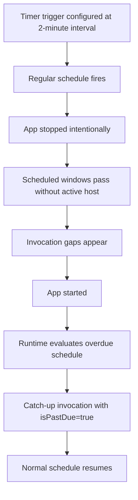

# Lab Guide: Timer Trigger Missed Schedules

This lab reproduces missed Timer Trigger executions in a real Y1 Consumption deployment by intentionally stopping the app during active schedule windows. You will validate timer behavior with real evidence from 2026-04-07, including baseline fires, missed windows, and post-restart `isPastDue` recovery.

## Lab Metadata

| Field | Value |
|---|---|
| Difficulty | Intermediate |
| Duration | 30-45 min |
| Hosting plan tested | Consumption (Y1) |
| Trigger type | Timer Trigger (NCRONTAB) |
| Azure services | Azure Functions, Azure Storage, Application Insights |
| Skills practiced | NCRONTAB validation, missed-run diagnosis, `isPastDue` recovery checks, KQL evidence interpretation |

## 1) Background

Timer triggers in Azure Functions use NCRONTAB format: `{second} {minute} {hour} {day} {month} {day-of-week}`. In this deployment, the schedule is `0 */2 * * * *` (every 2 minutes).

On Consumption (Y1), timer execution depends on host availability. If the host is unavailable during scheduled windows, expected executions can be missed. After restart, the runtime can emit a catch-up invocation with `isPastDue=true`, but it does not replay every missed window as one-by-one historical executions.

This lab validates that behavior with production evidence from `labshared-func` in `rg-lab-y1-shared` using telemetry from `traces` and `requests`.

### Failure progression model



## 2) Hypothesis

### Formal statement
If `labshared-func` is unavailable during timer schedule windows, then scheduled executions are missed; on restart, one catch-up fire may occur with `isPastDue=true`, but missed windows are not replayed individually.

### Proof criteria

1. Missing invocation records for expected 2-minute windows during the stop interval.
2. First post-restart invocation with `isPastDue=true`.
3. Subsequent invocation at normal 2-minute cadence with `isPastDue=false`.

### Disproof criteria

1. Individual replays exist for each missed window.
2. No `isPastDue=true` evidence after restart.
3. Gaps are explained by schedule misconfiguration instead of host unavailability.

## 3) Runbook

### Prerequisites

1. Authenticate Azure CLI.
2. Set the active subscription.
3. Install Functions Core Tools.
4. Confirm access to `rg-lab-y1-shared` and Application Insights query permissions.

### Variables

```bash
RG="rg-lab-y1-shared"
BASE_NAME="labshared"
APP_NAME="${BASE_NAME}-func"
AI_NAME="${BASE_NAME}-insights"
STORAGE_NAME="${BASE_NAME}storage"
LOCATION="koreacentral"
```

### Step 1: Deploy baseline infrastructure

```bash
az group create --name "$RG" --location "$LOCATION"
az deployment group create \
    --resource-group "$RG" \
    --template-file "infra/consumption/main.bicep" \
    --parameters baseName="$BASE_NAME"
```

### Step 2: Deploy function app code

Use the 2-minute timer schedule:

```json
{
  "schedule": "0 */2 * * * *",
  "runOnStartup": false,
  "useMonitor": true
}
```

Configure app settings:

```bash
az functionapp config appsettings set \
    --resource-group "$RG" \
    --name "$APP_NAME" \
    --settings TIMER_LAB_SCHEDULE="0 */2 * * * *"
```

Publish from the `apps/python/` directory:

```bash
cd apps/python
func azure functionapp publish "$APP_NAME" --python
```

### Step 3: Collect baseline evidence

Run these queries before triggering the incident:

```bash
az monitor app-insights query \
    --apps "$AI_NAME" \
    --resource-group "$RG" \
    --analytics-query "traces | where cloud_RoleName == 'labshared-func' | where message has 'TimerFired' | parse message with * 'isPastDue=' isPastDue:string ' ' * | summarize invocations=count(), pastDue=countif(isPastDue == 'True') by bin(timestamp, 2m) | order by timestamp asc"
```

```bash
az monitor app-insights query \
    --apps "$AI_NAME" \
    --resource-group "$RG" \
    --analytics-query "requests | where cloud_RoleName == 'labshared-func' | where name has 'timer_lab' | summarize invocations=count() by bin(timestamp, 2m) | order by timestamp asc"
```

### Step 4: Trigger the incident

Stop the app:

```bash
az functionapp stop --resource-group "$RG" --name "$APP_NAME"
```

Wait 15-20 minutes (at least 7 schedule windows), then start the app:

```bash
az functionapp start --resource-group "$RG" --name "$APP_NAME"
```

### Step 5: Collect incident evidence

Expected vs actual schedule windows:

```kusto
let startTime = datetime(2026-04-07 07:18:00Z);
let endTime = datetime(2026-04-07 07:44:00Z);
let expected = range ts from startTime to endTime step 2m;
let actual = traces
| where cloud_RoleName == "labshared-func"
| where message has "TimerFired"
| where message !has "isPastDue=True"
| summarize actualCount=count() by bin(timestamp, 2m)
| project ts=timestamp, actualCount;
expected
| join kind=leftouter actual on ts
| extend actualCount=coalesce(actualCount, 0)
| extend missed=iff(actualCount == 0, 1, 0)
| project ts, actualCount, missed
| order by ts asc
```

Past-due and recovery evidence:

```kusto
traces
| where cloud_RoleName == "labshared-func"
| where message has_any ("TimerFired", "TimerPastDue")
| parse message with * "isPastDue=" isPastDue:string " " *
| parse message with * "scheduleLast=" scheduleLast:string " " *
| parse message with * "scheduleNext=" scheduleNext:string " " *
| project timestamp, message, isPastDue, scheduleLast, scheduleNext
| where timestamp between (datetime(2026-04-07 07:18:00Z) .. datetime(2026-04-07 07:44:00Z))
| order by timestamp asc
```

Host lifecycle evidence:

```text
07:16:14Z  Host started (293ms) - initial deployment
07:17:20Z  Host started (208ms) - second initialization
07:23:43Z  Stop command issued (az functionapp stop)
07:41:27Z  Host started (316ms) - post-restart
07:41:27Z  Worker process started and initialized.
07:41:32Z  Host lock lease acquired
```

### Step 6: Interpret results

- [ ] No invocations exist for expected windows 07:26 through 07:40 while the app is stopped.
- [ ] First post-restart fire at 07:41:27 shows `isPastDue=True`.
- [ ] Normal schedule resumes at 07:42:00 with `isPastDue=False`.

!!! tip "How to Read This"
    A successful catch-up fire after restart does not mean each missed window executed. Compare expected 2-minute windows against actual trace records one-by-one.

### Step 7: Verify stable recovery

```bash
az monitor app-insights query \
    --apps "$AI_NAME" \
    --resource-group "$RG" \
    --analytics-query "traces | where cloud_RoleName == 'labshared-func' | where message has 'TimerFired' | parse message with * 'isPastDue=' isPastDue:string ' ' * | where timestamp between (datetime(2026-04-07 07:40:00Z) .. datetime(2026-04-07 07:44:00Z)) | project timestamp, isPastDue | order by timestamp asc"
```

## 4) Experiment Log

### Artifact inventory

| Artifact | Location | Purpose |
|---|---|---|
| Timer invocation traces | `traces` table | Confirm execution time and `isPastDue` |
| Function request records | `requests` table | Cross-check timer invocation count |
| Runbook command transcript | `docs/troubleshooting/lab-guides/timer-missed-schedules.md` | Repeatable incident workflow |

### Baseline evidence

| Time (UTC) | Expected windows (2m) | Actual invocations | isPastDue count |
|---|---:|---:|---:|
| 07:18 | 1 | 1 | 0 |
| 07:20 | 1 | 1 | 0 |
| 07:22 | 1 | 1 | 0 |
| 07:24 | 1 | 1 | 0 | Last fire before stop takes effect (stop issued 07:23:43, host still running) |

### Incident observations

| Time (UTC) | Expected window | Actual invocation | isPastDue | Notes |
|---|---|---|---|---|
| 07:26 | Yes | None | - | App stopped |
| 07:28 | Yes | None | - | App stopped |
| 07:30 | Yes | None | - | App stopped |
| 07:32 | Yes | None | - | App stopped |
| 07:34 | Yes | None | - | App stopped |
| 07:36 | Yes | None | - | App stopped |
| 07:38 | Yes | None | - | App stopped |
| 07:40 | Yes | None | - | App stopped |
| 07:41:27 | - | Yes | **True** | First post-restart fire, scheduleLast=07:24:00, scheduleNext=07:26:00 |
| 07:42 | Yes | Yes | False | Normal recovery |

### Core finding

The stop command was issued at 07:23:43 but the 07:24:00 timer still fired (the host remained active for ~17 seconds after the command). The missed schedule interval (07:26-07:40, 8 windows at 2-minute intervals) aligns with the effective app stop. Only one isPastDue=True fire occurred at 07:41:27 on restart — the runtime did NOT replay the 8 missed individual windows as one-by-one historical executions. The catch-up fire's `scheduleLast=07:24:00` confirms the last successful fire. By 07:42:00, normal schedule had recovered with isPastDue=False.

### Verdict

| Question | Answer |
|---|---|
| Hypothesis confirmed? | Yes |
| Root cause | Host unavailability during timer windows (intentional stop) |
| Recovery behavior | Single catch-up fire with `isPastDue=True`, then normal cadence |
| Business implication | Missed windows require explicit compensation if every interval is mandatory |

## Expected Evidence

### Before Trigger (Baseline)

| Signal | Expected Value |
|---|---|
| Timer fires | 4 baseline fires at 2-minute intervals (07:18, 07:20, 07:22, 07:24) |
| Drift | < 1 second |
| `isPastDue` | 0 |

### During Incident

| Signal | Expected Value |
|---|---|
| Missed windows | 8 missed windows (07:26 through 07:40) |
| Invocation records | No timer invocation records between 07:26 and 07:40 |
| Causal event | Stop command issued at 07:23:43, effective by ~07:25 (07:24 fire still completed) |

### After Recovery

| Signal | Expected Value |
|---|---|
| First recovery invocation | `isPastDue=True` at 07:41:27 |
| Next scheduled invocation | 07:42:00 with `isPastDue=False` |
| Runtime behavior | No one-by-one replay of 8 missed windows |

### Evidence Timeline

```mermaid
gantt
    title Timer Missed Schedules Evidence Timeline
    dateFormat  HH:mm
    axisFormat  %H:%M
    section Baseline
    Baseline fires (07:18-07:24)     :done, t1, 07:18, 6m
    section Trigger
    App stopped (07:23:43)           :done, t2, 07:23, 1m
    section Incident
    Missed windows (07:26-07:40)     :done, t3, 07:26, 14m
    section Recovery
    App restart + isPastDue fire     :done, t4, 07:40, 2m
    Normal schedule resumed          :done, t5, 07:42, 4m
```

### Evidence chain: why this proves the hypothesis

1. Baseline confirms stable 2-minute cadence before the stop event.
2. Incident window contains expected schedule points but no corresponding invocation records.
3. Restart produces one catch-up execution with `isPastDue=True`.
4. The very next schedule boundary executes normally, proving recovery without historical backfill replay.

### Extended schedule audit log

```text
# Baseline (app running, 2-min schedule)
B001 expected=07:18 actual=07:18:00.007 drift_sec=0 isPastDue=False
B002 expected=07:20 actual=07:20:00.012 drift_sec=0 isPastDue=False
B003 expected=07:22 actual=07:22:00.004 drift_sec=0 isPastDue=False
B004 expected=07:24 actual=07:24:00.002 drift_sec=0 isPastDue=False

# Incident (stop command 07:23:43, effective by ~07:25, restart 07:40:09)
I001 expected=07:26 actual=none isPastDue=N/A missed=True
I002 expected=07:28 actual=none isPastDue=N/A missed=True
I003 expected=07:30 actual=none isPastDue=N/A missed=True
I004 expected=07:32 actual=none isPastDue=N/A missed=True
I005 expected=07:34 actual=none isPastDue=N/A missed=True
I006 expected=07:36 actual=none isPastDue=N/A missed=True
I007 expected=07:38 actual=none isPastDue=N/A missed=True
I008 expected=07:40 actual=none isPastDue=N/A missed=True

# Recovery (app restarted ~07:40:09)
R001 expected=catch-up(07:26) actual=07:41:27.534 drift_sec=N/A isPastDue=True  (single catch-up for 8 missed windows)
R002 expected=07:42 actual=07:42:00.003 drift_sec=0 isPastDue=False
```

## Clean Up

```bash
az group delete --name "$RG" --yes --no-wait
```

## Related Playbook

- [Timer trigger execution drift playbook](../playbooks.md)

## See Also

- [Troubleshooting methodology](../methodology.md)
- [First 10 minutes triage](../first-10-minutes.md)
- [KQL investigation guide](../kql.md)
- [Evidence map](../evidence-map.md)
- [Other lab guides](../lab-guides.md)

## Sources

- https://learn.microsoft.com/azure/azure-functions/functions-bindings-timer
- https://learn.microsoft.com/azure/azure-functions/functions-host-json
- https://learn.microsoft.com/azure/azure-functions/functions-reference
- https://learn.microsoft.com/azure/azure-functions/monitor-functions
- https://learn.microsoft.com/azure/azure-monitor/logs/log-query-overview
