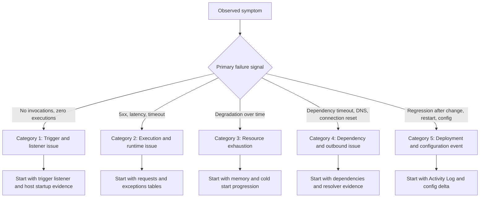
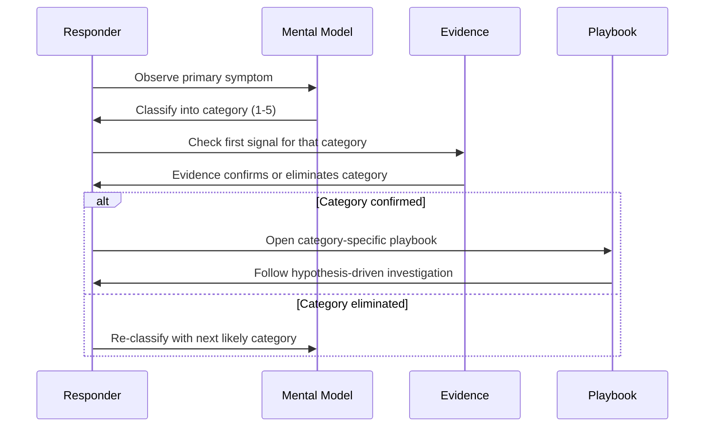

# Troubleshooting Mental Model

This page provides a classification model for Azure Functions incidents so you can start with the correct evidence source instead of guessing.

**Core idea**: classify the problem first, then investigate deeply.

## Why this model matters

Most incident delays come from category mistakes:

- trigger listener failures investigated as application code bugs
- outbound DNS/storage auth failures investigated as CPU problems
- deployment events ignored while symptoms are treated as random instability
- cold start behavior on Consumption plans mistaken for application regression

This classification helps you avoid looking at the wrong logs from the start.

## Classification flowchart



## Category summary matrix

| Category | Typical Symptoms | First Signal to Check | Common Mistake |
|---|---|---|---|
| Trigger/listener issue | Zero invocations, listener failed to start, function disabled | `traces` table: listener and host startup messages | Assuming function is running because the app is up |
| Execution/runtime issue | 5xx errors, timeouts, exception storms | `requests` + `exceptions` tables | Restarting app before collecting error evidence |
| Resource exhaustion | Gradual slowdown, worker crashes, cold start spikes | Memory metrics + `traces` for OOM/restart patterns | Looking only at CPU when memory is the bottleneck |
| Dependency/outbound issue | Connect timeout, 401/403, DNS failures | `dependencies` table + DNS resolver checks | Blaming function code when downstream is unreachable |
| Deployment/config event | Incident starts after deploy/config change/restart | Activity Log + `traces` for host lifecycle | Treating change-related incidents as random noise |

## 1) Category: Trigger and Listener Issue

Trigger issues are failures in the path from event source to function invocation.

### Typical symptom patterns

- Zero invocations despite active event source
- `listener ... unable to start` in traces
- Function shows as disabled in portal
- Blob trigger not firing on Flex Consumption (missing Event Grid subscription)

### First signal to check

```kusto
let appName = "func-myapp-prod";
traces
| where timestamp > ago(30m)
| where cloud_RoleName =~ appName
| where message has_any ("listener", "disabled", "unable to start", "trigger", "Host started")
| project timestamp, severityLevel, message
| order by timestamp desc
```

### Key differentiation

| Sub-pattern | Evidence | Resolution Direction |
|---|---|---|
| Function disabled | `IsDisabled=true` in function list | Remove disable setting |
| Listener auth failure | `403` or `401` in listener start error | Fix RBAC or connection string |
| Host not completing startup | `Host started` missing | Check app settings and runtime config |
| Source not delivering | Zero messages in source metrics | Fix upstream publisher or subscription |

### Related playbooks

- [Functions Not Executing](playbooks/functions-not-executing.md)
- [Blob Trigger Not Firing](playbooks/blob-trigger-not-firing.md)
- [App Settings Misconfiguration](playbooks/auth-config/app-settings-misconfiguration.md)

## 2) Category: Execution and Runtime Issue

Execution issues are failures during function invocation — the function starts but produces errors or exceeds time limits.

### Typical symptom patterns

- HTTP 5xx responses from function endpoints
- `RpcException` or application exceptions in logs
- Execution timeout exceeded messages
- High error rate on specific functions while others are healthy

### First signal to check

```kusto
let appName = "func-myapp-prod";
requests
| where timestamp > ago(1h)
| where cloud_RoleName =~ appName
| where operation_Name startswith "Functions."
| summarize
    Invocations = count(),
    Failures = countif(success == false),
    FailureRate = round(100.0 * countif(success == false) / count(), 2),
    P95Ms = percentile(duration, 95)
  by FunctionName = operation_Name
| order by Failures desc
```

### Key differentiation

| Sub-pattern | Evidence | Resolution Direction |
|---|---|---|
| Application exception | Dominant exception type in `exceptions` | Fix application code |
| Execution timeout | `Timeout value of ... exceeded` in traces | Reduce work or increase timeout |
| HTTP 230s load balancer timeout | HTTP trigger returns 502 after ~230s | Use Durable Functions async pattern |
| Poison message loop | Same message dequeued repeatedly then poisoned | Fix processing code or increase dequeue count |

### Related playbooks

- [Functions Failing](playbooks/functions-failing.md)
- [High Latency](playbooks/high-latency.md)
- [Timeout / Execution Limit Exceeded](playbooks/triggers/timeout-execution-limit.md)

## 3) Category: Resource Exhaustion

Resource exhaustion issues develop gradually as load increases or memory accumulates over time.

### Typical symptom patterns

- Increasing latency over hours
- Worker process crashes (OOM)
- Cold start frequency increasing
- `System.OutOfMemoryException` in exceptions

### First signal to check

```kusto
let appName = "func-myapp-prod";
exceptions
| where timestamp > ago(6h)
| where cloud_RoleName =~ appName
| where type has_any ("OutOfMemory", "StackOverflow", "ThreadAbort")
| summarize Count = count() by bin(timestamp, 15m), type
| order by timestamp desc
```

### Key differentiation

| Sub-pattern | Evidence | Resolution Direction |
|---|---|---|
| Memory pressure | OOM exceptions + worker restarts | Reduce memory usage or upgrade plan |
| Cold start cascade | High startup frequency + latency spikes | Pre-warm or use Premium plan |
| Thread pool exhaustion | Async deadlock patterns + growing latency | Fix sync-over-async code |
| GIL contention (Python) | CPU flat but latency high on CPU-bound work | Use multiprocessing or offload to Durable |

### Related playbooks

- [Out of Memory / Worker Crash](playbooks/scaling/out-of-memory-worker-crash.md)
- [Queue Piling Up](playbooks/queue-piling-up.md)

## 4) Category: Dependency and Outbound Issue

Dependency issues are failures in outbound calls to external services, storage, databases, or APIs.

### Typical symptom patterns

- `ConnectTimeout` or `ConnectionRefused` in dependency logs
- 401/403 from downstream services (managed identity issues)
- DNS resolution failures in VNet-integrated apps
- SNAT port exhaustion on Consumption plan

### First signal to check

```kusto
let appName = "func-myapp-prod";
dependencies
| where timestamp > ago(1h)
| where cloud_RoleName =~ appName
| where success == false
| summarize Count = count(), AvgDuration = avg(duration) by target, resultCode, type
| order by Count desc
```

### Key differentiation

| Sub-pattern | Evidence | Resolution Direction |
|---|---|---|
| Auth failure (managed identity) | 401/403 on specific targets | Fix role assignments or identity config |
| DNS resolution failure | DNS-related error messages in VNet app | Fix private DNS zones or DNS forwarding |
| Storage unreachable | Failed calls to blob/queue/table endpoints | Check firewall rules and network config |
| SNAT exhaustion | Intermittent outbound failures at scale | Use connection pooling, consider VNet integration |

### Related playbooks

- [Managed Identity / RBAC Failure](playbooks/auth-config/managed-identity-rbac-failure.md)
- [Deployment Failures](playbooks/deployment-failures.md)

## 5) Category: Deployment and Configuration Event

Configuration issues are failures triggered by recent changes — deployments, setting modifications, identity updates, or platform events.

### Typical symptom patterns

- Incident starts immediately after deployment or config change
- `No job functions found` after deploy
- Host startup failure after runtime version change
- Functions disappear after `FUNCTIONS_WORKER_RUNTIME` change

### First signal to check

```bash
az monitor activity-log list \
  --resource-group "$RG" \
  --offset 2h \
  --status Succeeded \
  --output table
```

### Key differentiation

| Sub-pattern | Evidence | Resolution Direction |
|---|---|---|
| Wrong runtime setting | `No job functions found` after deploy | Fix `FUNCTIONS_WORKER_RUNTIME` |
| Missing storage config | Host fails to start | Restore `AzureWebJobsStorage` |
| Extension bundle mismatch | Binding errors at startup | Update `extensionBundle` in host.json |
| Key Vault reference syntax error | Setting resolves to literal `@Microsoft.KeyVault(...)` | Fix reference URI syntax |

### Related playbooks

- [App Settings Misconfiguration](playbooks/auth-config/app-settings-misconfiguration.md)
- [Deployment Failures](playbooks/deployment-failures.md)

## Using this model during incidents



## Anti-patterns

| Anti-pattern | Why It Fails | Better Approach |
|---|---|---|
| Restart first, ask questions later | Destroys diagnostic state | Collect first signal, then restart if needed |
| Assume it is always code | Config and platform causes are equally common | Classify first, investigate accordingly |
| Check everything at once | Wastes time and creates noise | Use category to narrow first evidence source |
| Skip classification on familiar symptoms | Confirmation bias leads to wrong fix | Always validate classification with evidence |

## See Also

- [Decision Tree](decision-tree.md)
- [Troubleshooting Method](methodology/troubleshooting-method.md)
- [Detector Map](methodology/detector-map.md)
- [Architecture](architecture.md)
- [Evidence Map](evidence-map.md)
- [First 10 Minutes](first-10-minutes/index.md)

## Sources

- [Azure Functions diagnostics overview](https://learn.microsoft.com/azure/azure-functions/functions-diagnostics)
- [Monitor Azure Functions](https://learn.microsoft.com/azure/azure-functions/functions-monitoring)
- [Troubleshoot Azure Functions](https://learn.microsoft.com/azure/azure-functions/functions-recover-from-failed-host)
