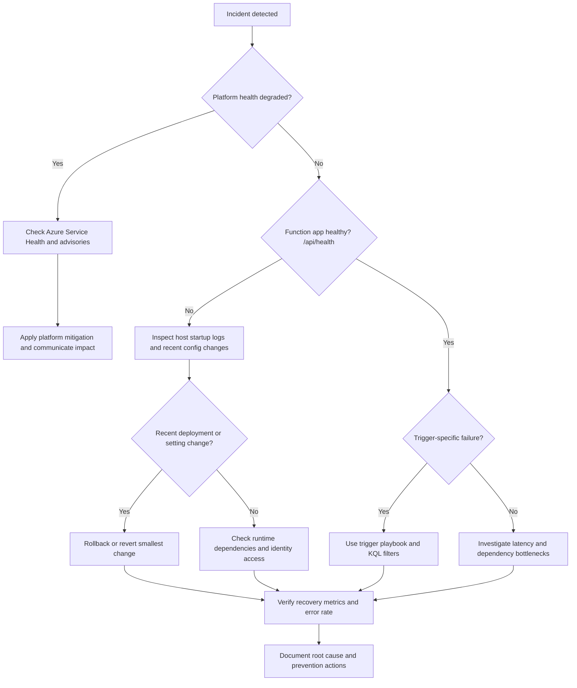

# Systematic Troubleshooting Methodology

Use this methodology for incidents that are not solved by a single quick check.
The sequence is **Observe → Hypothesize → Test → Fix → Verify** and is aligned with Azure Monitor and Azure Functions guidance from Microsoft Learn.

## Why a method matters

Unstructured debugging increases MTTR and creates risky changes during outages.
A repeatable method helps teams:

- preserve evidence,
- avoid guess-driven configuration changes,
- and produce reusable runbooks after resolution.

!!! tip "Operations Guide"
    For monitoring setup and alert configuration, see [Monitoring](../operations/monitoring.md) and [Alerts](../operations/alerts.md).

## 1) Observe

Start with facts, not assumptions.
Capture the incident window, blast radius, impacted triggers, and user-facing symptoms.

Primary telemetry sources:

- Metrics: request rate, failures, latency, execution count.
- Logs (`traces`): host lifecycle, trigger listener status, runtime warnings.
- Exceptions: top exception types and first-seen timestamps.
- Dependencies: failed or slow external calls.
- Alerts: who was notified, what threshold fired, and when.

Evidence checklist:

1. Start time and detection source.
2. Affected environments and regions.
3. Last known good time.
4. Most recent deployment or config change.
5. Current customer impact.

## 2) Hypothesize

Convert observations into explicit, testable hypotheses.
Good hypotheses target one component at a time.

Examples:

- "Queue trigger listener is unhealthy because storage auth changed."
- "Latency is caused by dependency timeout, not function runtime."
- "Blob trigger failed after Flex migration because Event Grid subscription is missing."

Prioritize hypotheses by:

- impact severity,
- likelihood given recent change history,
- speed and safety of validation.

## 3) Test

Use a minimal set of diagnostic queries and commands that can prove or disprove a hypothesis.
Avoid broad, expensive "search everything" approaches during active incidents.

Testing rules:

1. Define expected result before running a query.
2. Keep time range tight (`ago(15m)`, `ago(1h)`).
3. Compare against baseline if available.
4. Log findings in incident notes.

Common test tools:

- [KQL Query Library](kql.md)
- `az monitor metrics list`
- `az monitor log-analytics query`
- health endpoint (`/api/health`)

## 4) Fix

Apply the **smallest safe change** that addresses the validated cause.
During incidents, controlled reversibility is more important than broad refactoring.

Fix guidance:

- Prefer rollback when a fresh deployment introduced regression.
- If changing app settings, record before/after values (without secrets).
- Avoid simultaneous multi-variable changes.
- Use staged rollout when possible.

Examples of minimal fixes:

- Re-enable one disabled function.
- Restore one missing app setting.
- Recreate one missing Event Grid subscription.
- Roll back one deployment artifact.

## 5) Verify

Verification confirms both restoration and recurrence prevention.

Immediate verification:

- Failure rate returns to baseline.
- Throughput catches up with incoming demand.
- Health endpoint and key user paths succeed.
- No new high-severity alerts fire in observation window.

Post-incident verification:

- Add alerting for earlier detection.
- Add dashboards for leading indicators.
- Update playbook with confirmed signal and fix steps.

## Troubleshooting decision tree

## Anti-patterns to avoid

- Restarting repeatedly without collecting evidence.
- Expanding incident scope without data.
- Applying multiple config changes at once.
- Declaring resolved without observing stability window.

## See Also

- [First 10 Minutes](first-10-minutes.md)
- [Playbooks](playbooks.md)
- [KQL Query Library](kql.md)
- [Azure Monitor overview](https://learn.microsoft.com/azure/azure-monitor/overview)
- [Azure Functions monitoring](https://learn.microsoft.com/azure/azure-functions/functions-monitoring)
