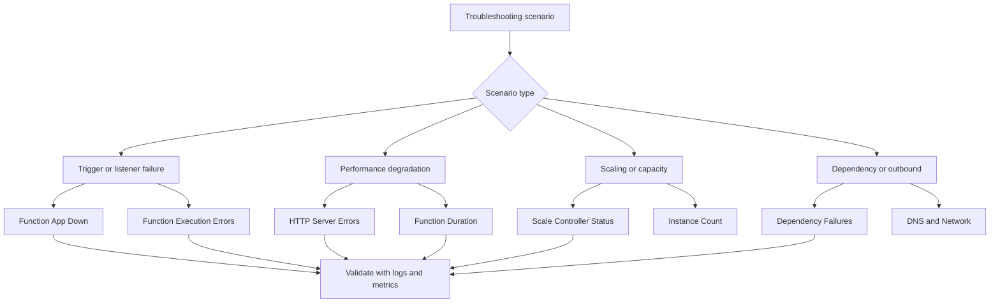

---
content_sources:
  - type: mslearn-adapted
    url: https://learn.microsoft.com/azure/azure-functions/functions-diagnostics
  - type: mslearn-adapted
    url: https://learn.microsoft.com/azure/azure-functions/functions-monitoring
  - type: mslearn-adapted
    url: https://learn.microsoft.com/azure/azure-monitor/essentials/data-platform-metrics
---

# Detector Map

Quick reference for Azure Functions Diagnostics detectors and monitoring tools relevant to serverless troubleshooting.

<!-- diagram-id: detector-map -->


## How to Access

Navigate to your Function App in the Azure Portal → **Diagnose and solve problems**.

The diagnostics interface provides built-in detectors that analyze your function app's health without requiring custom queries.

## Detector Reference

| Detector | Category | What It Shows | When to Use | Related Playbook |
|---|---|---|---|---|
| Function App Down | Availability | Whether the function app is responding | App not loading, health check failures | [Functions Not Executing](../playbooks/functions-not-executing.md) |
| Function Execution Errors | Execution | Function invocation failures and error trends | Rising error rates, exception storms | [Functions Failing](../playbooks/functions-failing.md) |
| HTTP Server Errors | Performance | 5xx error trends for HTTP-triggered functions | HTTP trigger failures | [High Latency](../playbooks/high-latency.md) |
| Function App Performance | Performance | Execution duration and latency trends | Slow response investigation | [Timeout / Execution Limit](../playbooks/triggers/timeout-execution-limit.md) |
| Scale Controller Status | Scaling | Scale decisions and instance allocation | Queue backlog, scaling bottleneck | [Queue Piling Up](../playbooks/queue-piling-up.md) |
| Linux Memory | Resources | Process-level memory utilization | Memory pressure, OOM crashes | [Out of Memory / Worker Crash](../playbooks/scaling/out-of-memory-worker-crash.md) |
| Application Logs | Diagnostics | Function app stdout/stderr output | Runtime errors, startup investigation | All playbooks |
| Deployment Logs | Configuration | Deployment history and status | Post-deployment failures | [Deployment Failures](../playbooks/deployment-failures.md) |
| Configuration and Management | Configuration | App settings and configuration validation | Missing settings, runtime mismatch | [App Settings Misconfiguration](../playbooks/auth-config/app-settings-misconfiguration.md) |

## Azure Monitor Metrics Reference

In addition to diagnostics detectors, Azure Monitor provides metrics that can be queried via CLI or portal.

### Function App Metrics

| Metric | Aggregation | What It Shows | Plan Availability |
|---|---|---|---|
| `FunctionExecutionCount` | Total | Number of function executions | Y1, EP, Dedicated |
| `FunctionExecutionUnits` | Total | Execution units (MB-ms) | Y1, EP |
| `OnDemandFunctionExecutionCount` | Total | On-demand executions | FC1 only |
| `OnDemandFunctionExecutionUnits` | Total | On-demand execution units | FC1 only |
| `Requests` | Total | HTTP requests received | All plans |
| `Http5xx` | Total | Server error responses | All plans |
| `AverageResponseTime` | Average | Mean response time (ms) | All plans |
| `HealthCheckStatus` | Average | Health check probe result | EP, Dedicated |

### CLI Quick Reference

```bash
# Function execution metrics (traditional plans)
az monitor metrics list \
  --resource "/subscriptions/$SUBSCRIPTION_ID/resourceGroups/$RG/providers/Microsoft.Web/sites/$APP_NAME" \
  --metric "FunctionExecutionCount" "Requests" "Http5xx" "AverageResponseTime" \
  --interval PT1M \
  --aggregation Total Average \
  --offset 30m \
  --output table

# Function execution metrics (Flex Consumption)
az monitor metrics list \
  --resource "/subscriptions/$SUBSCRIPTION_ID/resourceGroups/$RG/providers/Microsoft.Web/sites/$APP_NAME" \
  --metric "OnDemandFunctionExecutionCount" "OnDemandFunctionExecutionUnits" \
  --interval PT1M \
  --aggregation Total \
  --offset 30m \
  --output table

# Storage metrics (for queue-triggered functions)
az monitor metrics list \
  --resource "/subscriptions/$SUBSCRIPTION_ID/resourceGroups/$RG/providers/Microsoft.Storage/storageAccounts/$STORAGE_NAME" \
  --metric "QueueMessageCount" \
  --interval PT1M \
  --aggregation Average \
  --offset 30m \
  --output table
```

## Application Insights Tables Reference

| Table | What It Contains | Primary Use |
|---|---|---|
| `requests` | Function invocations (HTTP triggers) | Execution success/failure/latency |
| `traces` | Host lifecycle, custom logs | Startup, listener, runtime events |
| `exceptions` | Error details with stack traces | Error classification and root cause |
| `dependencies` | Outbound calls to external services | Dependency health and latency |
| `customMetrics` | Custom-emitted and select runtime metrics | Business metrics, custom counters |
| `customEvents` | Custom-tracked events | Application flow tracking |

## Detector Limitations

- **Data refresh delay**: 5–15 minute lag between an event and its appearance in diagnostics.
- **Sampling**: High-volume detectors may sample events rather than capturing every occurrence.
- **Consumption plan gaps**: Some detectors have limited data on Consumption plan due to cold start/deallocation behavior.
- **Platform-level focus**: Detectors see function execution and host events but cannot inspect application memory or stack without Application Insights.
- **Time scope**: Some detectors only analyze the last 24 hours — use Log Analytics directly for older data.
- **Starting point, not conclusion**: Detector output is a hypothesis generator. Always validate with logs and metrics from the [KQL Query Library](../kql/index.md).

## Detector vs KQL Decision Guide

| Situation | Use Detector | Use KQL |
|---|---|---|
| Quick visual health check | ✅ | |
| Specific time window analysis | | ✅ |
| Cross-table correlation | | ✅ |
| Sharing evidence with team | | ✅ |
| First triage (no KQL experience) | ✅ | |
| Detailed hypothesis validation | | ✅ |

## See Also

- [Troubleshooting Method](troubleshooting-method.md)
- [Decision Tree](../decision-tree.md)
- [Mental Model](../mental-model.md)
- [KQL Query Library](../kql/index.md)
- [Evidence Map](../evidence-map.md)

## Sources

- [Azure Functions diagnostics overview](https://learn.microsoft.com/azure/azure-functions/functions-diagnostics)
- [Monitor Azure Functions](https://learn.microsoft.com/azure/azure-functions/functions-monitoring)
- [Azure Monitor metrics overview](https://learn.microsoft.com/azure/azure-monitor/essentials/data-platform-metrics)
