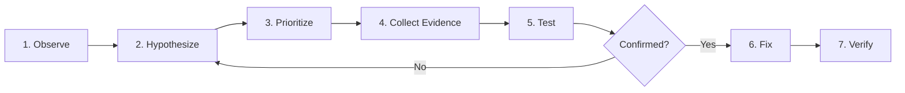
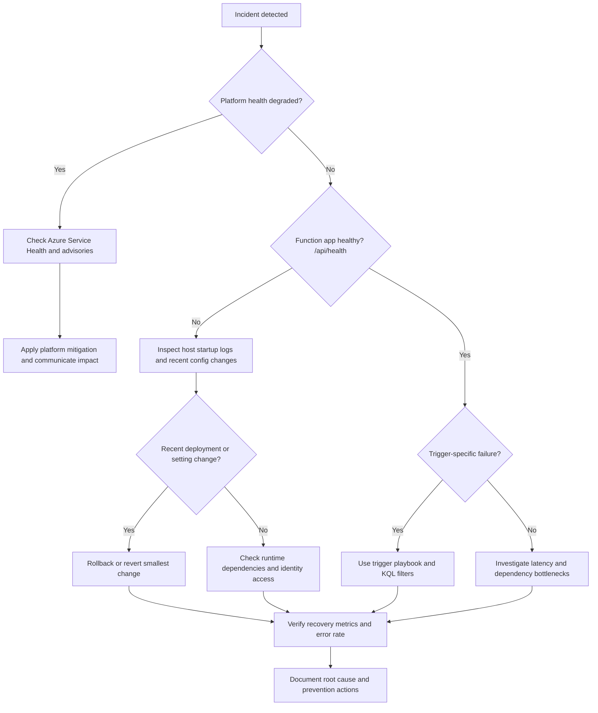

---
content_sources:
  - type: mslearn-adapted
    url: https://learn.microsoft.com/azure/azure-functions/functions-monitoring
  - type: mslearn-adapted
    url: https://learn.microsoft.com/azure/azure-functions/configure-monitoring
  - type: mslearn-adapted
    url: https://learn.microsoft.com/azure/azure-functions/functions-recover-from-failed-host
---

# Troubleshooting Method

Troubleshooting complex issues in Azure Functions requires more than just a list of steps. It requires a mindset that treats every failure as a mystery to be solved with evidence. The hypothesis-driven method documented here is designed to move you from ambiguous symptoms to concrete, data-backed conclusions. This structured approach is essential for identifying root causes in a serverless platform where trigger, host, and platform events can often look like application-level errors.

## Why Hypothesis-Driven Troubleshooting?

When a function fails in production, it is tempting to jump to the most familiar cause or the easiest mitigation. However, Azure Functions incidents often have multiple, overlapping causes for the same symptom.

- **Ambiguity and complexity**: A zero-invocation pattern could mean a disabled function, a broken trigger listener, a storage auth failure, or a missing Event Grid subscription.
- **Multiple causes**: Sometimes, a problem is not caused by one single failure but by a combination of configuration errors and unexpected load.
- **Checklists alone are insufficient**: While checklists are useful for ensuring basic configuration is correct, they cannot resolve complex, multi-cause scenarios. They do not handle the ambiguity of many production issues.
- **Avoiding bias**: Engineers naturally gravitate toward the last issue they solved. A structured method forces you to consider alternative explanations you might otherwise overlook.
- **Efficiency**: By listing and prioritizing hypotheses, you avoid "rabbit holes" and focus your effort on the most likely or easiest-to-test causes first.
- **Structured approach**: This methodology ensures that you do not reach a premature conclusion based on a single, misleading signal.

## The Method Step-by-Step

The following seven steps form the foundation of every investigation in this repository.

<!-- diagram-id: the-method-step-by-step -->

### 1. Observe the Symptom

The first step is to describe what you see, not what you think is happening. Avoid using labels like "the function is broken" or "it's slow." Instead, record specific observations.

- **What is happening?**: For example, "Queue trigger function has zero invocations in the last 30 minutes despite 500 messages in the queue."
- **When is it happening?**: Is the issue constant, or does it spike at a specific time of day?
- **What is the scope?**: Does it affect all functions, or only one trigger type? Is only one plan affected?
- **Be precise**: Use metrics and log timestamps to define the window of the issue. Avoid premature labeling or jumping to conclusions at this stage.

Evidence checklist:

1. Start time and detection source.
2. Affected environments and regions.
3. Last known good time.
4. Most recent deployment or config change.
5. Current customer impact.

### 2. List Competing Hypotheses

Once you have a clear symptom, generate at least two to four plausible causes. Do not settle for just one. Force yourself to consider different domains:

- **Trigger/Listener**: Is the trigger listener healthy? Is the function disabled? Is the source delivering events?
- **Application**: Is there an unhandled exception, a memory leak, or a timeout in the code?
- **Dependency**: Is storage slow? Is an external API timing out? Is DNS resolving correctly?
- **Configuration**: Did a recent deployment change an app setting, a host.json value, or an identity assignment?
- **Platform**: Is there a regional outage, a scaling limitation, or a plan-level constraint?

Each hypothesis must be independently falsifiable. This means you should be able to say, "If X is true, we will see Y in the logs." If Y is not present, the hypothesis is likely false.

### 3. Prioritize

You cannot investigate everything at once. Rank your hypotheses based on two criteria:

- **Likelihood**: How often have we seen this before? Does it match the observed signals?
- **Ease of validation**: Use the "cheapest test" principle. If one hypothesis can be checked in 30 seconds with a single CLI command, check it first, even if it is less likely than a more complex one.

### 4. Collect Evidence

Gather the data needed to test your hypotheses. In Azure Functions, this usually involves:

| Hypothesis Type | Evidence Needed | Tool | Example Query |
|---|---|---|---|
| Request failure is application logic | 5xx trend + top exception type | Log Analytics (`AppRequests`, `AppExceptions`) | `AppRequests \| where TimeGenerated > ago(30m) \| where ResultCode startswith "5" \| summarize count() by OperationName` |
| Host startup regression after change | Startup lifecycle logs + deploy timestamp | Log Analytics (`AppTraces`) + Activity Log | `AppTraces \| where TimeGenerated > ago(30m) \| where Message has "Host started" or Message has "Starting Host"` |
| Outbound dependency timeout | Failed dependency calls by target | Application Insights (`dependencies`) | `dependencies \| where timestamp > ago(30m) \| where success == false \| summarize count(), avg(duration) by target, type` |
| Trigger listener unhealthy | Listener/lock/trigger errors | Log Analytics (`AppTraces`) | `AppTraces \| where TimeGenerated > ago(30m) \| where Message has_any ("listener", "Host lock", "trigger")` |
| Scale bottleneck on event trigger | Backlog growth vs execution flatline | Azure Monitor Metrics | `az monitor metrics list --resource "..." --metric "FunctionExecutionCount" --interval PT1M --aggregation Total --offset 30m` |

!!! note "About customMetrics"
    Most metrics in the `customMetrics` table require explicit instrumentation from your application code. Only a few runtime metrics (for example, `FunctionExecutionCount`) are automatically emitted. Queue processing metrics, latency measurements, and business metrics must be explicitly tracked.

### 5. Test

Use a minimal set of diagnostic queries and commands that can prove or disprove a hypothesis. Avoid broad, expensive "search everything" approaches during active incidents.

Testing rules:

1. Define expected result before running a query.
2. Keep time range tight (`ago(15m)`, `ago(1h)`).
3. Compare against baseline if available.
4. Log findings in incident notes.

Common test tools:

- [KQL Query Library](../kql/index.md)
- `az monitor metrics list`
- `az monitor log-analytics query`
- Health endpoint (`/api/health`)

### 6. Fix

Apply the **smallest safe change** that addresses the validated cause. During incidents, controlled reversibility is more important than broad refactoring.

Fix guidance:

- Prefer rollback when a fresh deployment introduced regression.
- If changing app settings, record before/after values (without secrets).
- Avoid simultaneous multi-variable changes.
- Use staged rollout when possible.

Examples of minimal fixes:

- Re-enable one disabled function.
- Restore one missing app setting.
- Recreate one missing Event Grid subscription.
- Roll back one deployment artifact.
- Add one missing RBAC role assignment.

### 7. Verify

Verification confirms both restoration and recurrence prevention.

Immediate verification:

- Failure rate returns to baseline.
- Throughput catches up with incoming demand.
- Health endpoint and key user paths succeed.
- No new high-severity alerts fire in observation window.

Post-incident verification:

- Add alerting for earlier detection.
- Add dashboards for leading indicators.
- Update playbook with confirmed signal and fix steps.

## Anti-patterns to avoid

| Anti-pattern | Why It's Dangerous | Better Approach |
|---|---|---|
| Restarting without evidence | Destroys diagnostic state and erases startup timing clues | Collect `traces`, `exceptions`, and recent Activity Log first, then restart once if needed |
| Expanding incident scope without data | Pulls teams into unrelated systems and delays mitigation | Constrain scope to confirmed blast radius, then widen only with evidence |
| Applying multiple config changes at once | Creates attribution ambiguity and raises rollback risk | Apply one reversible change at a time and measure impact window |
| Declaring resolved without stability window | Causes incident reopen and underestimates latent failures | Observe at least one sustained low-error window before closeout |

## Troubleshooting decision tree

<!-- diagram-id: troubleshooting-decision-tree -->

## See Also

- [Detector Map](detector-map.md)
- [Decision Tree](../decision-tree.md)
- [Mental Model](../mental-model.md)
- [First 10 Minutes](../first-10-minutes/index.md)
- [Playbooks](../playbooks/index.md)
- [KQL Query Library](../kql/index.md)

## Sources

- [Monitor Azure Functions](https://learn.microsoft.com/azure/azure-functions/functions-monitoring)
- [Configure monitoring for Azure Functions](https://learn.microsoft.com/azure/azure-functions/configure-monitoring)
- [Troubleshoot Azure Functions](https://learn.microsoft.com/azure/azure-functions/functions-recover-from-failed-host)
