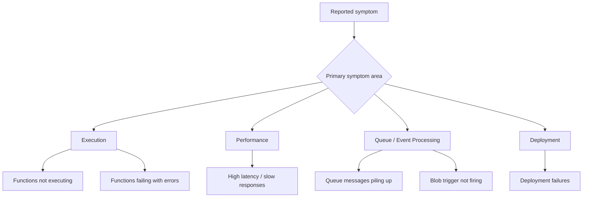

# Azure Functions Incident Playbooks

Symptom-oriented troubleshooting guides for Azure Functions incidents.
Each playbook follows a hypothesis-driven structure: **What you observe → Hypotheses → Checks → Interpretation → Fix**.



## Prerequisites

- Access to Azure CLI, Application Insights, and Log Analytics.
- Subscription and app context prepared.

```bash
RG="rg-myapp-prod"
APP_NAME="func-myapp-prod"
SUBSCRIPTION_ID="<subscription-id>"
WORKSPACE_ID="xxxxxxxx-xxxx-xxxx-xxxx-xxxxxxxxxxxx"
```

!!! tip "Operations Guide"
    For monitoring setup and alert configuration, see [Monitoring](../operations/monitoring.md) and [Alerts](../operations/alerts.md).

!!! tip "Troubleshooting workflow"
    Start with [First 10 Minutes](first-10-minutes.md), follow [Methodology](methodology.md), pull focused queries from [KQL Query Library](kql.md), and map hands-on practice from [Lab Guides](lab-guides.md).

---

## Functions not executing

Events arrive but invocation count is near zero. Triggers are configured but no function code runs.

**Hypotheses**: Host startup failure, storage backend issues, function disabled state, trigger misconfiguration.

→ **[Full playbook: Functions Not Executing](playbooks/functions-not-executing.md)**

---

## High latency / slow responses

P95 latency spikes and timeout rate increases. Responses are slow or timing out.

**Hypotheses**: Cold start delays, slow downstream dependency, concurrency saturation, plan-level resource limits.

→ **[Full playbook: High Latency / Slow Responses](playbooks/high-latency.md)**

---

## Functions failing with errors

Exception count and 5xx increase quickly. Functions execute but fail with errors.

**Hypotheses**: Auth failures to downstream resources, function timeout reached, memory pressure or runtime mismatch, deployment regression.

→ **[Full playbook: Functions Failing with Errors](playbooks/functions-failing.md)**

---

## Queue messages piling up

Queue depth and message age rise steadily. Processing cannot keep up with ingestion.

**Hypotheses**: Scale-out not keeping up, poison-message loop, per-message processing regression, downstream dependency bottleneck.

→ **[Full playbook: Queue Messages Piling Up](playbooks/queue-piling-up.md)**

---

## Blob trigger not firing

Blob uploads succeed but function invocations never appear.

**Hypotheses**: Event Grid subscription missing (FC1), polling scan delay, storage connection issues, container misconfiguration.

→ **[Full playbook: Blob Trigger Not Firing](playbooks/blob-trigger-not-firing.md)**

---

## Deployment failures

Deployment fails or app degrades immediately after release.

**Hypotheses**: Package build error, runtime version mismatch, missing app settings, slot swap configuration drift.

→ **[Full playbook: Deployment Failures](playbooks/deployment-failures.md)**

---

## How to Use These Playbooks

1. Identify the primary symptom your incident matches.
2. Open the corresponding playbook link above.
3. Follow the hypothesis-driven workflow in the full playbook.
4. Use inline KQL queries directly in each playbook — no need to switch to a separate query library.

## See Also

- [First 10 Minutes](first-10-minutes.md)
- [Methodology](methodology.md)
- [KQL Query Library](kql.md)
- [Lab Guides](lab-guides.md)
- [Evidence Map](evidence-map.md)

## Sources

- [Troubleshoot Azure Functions](https://learn.microsoft.com/azure/azure-functions/functions-recover-from-failed-host)
- [Monitor Azure Functions](https://learn.microsoft.com/azure/azure-functions/functions-monitoring)
- [Azure Functions host runtime troubleshooting](https://learn.microsoft.com/azure/azure-functions/functions-recover-from-failed-host)
