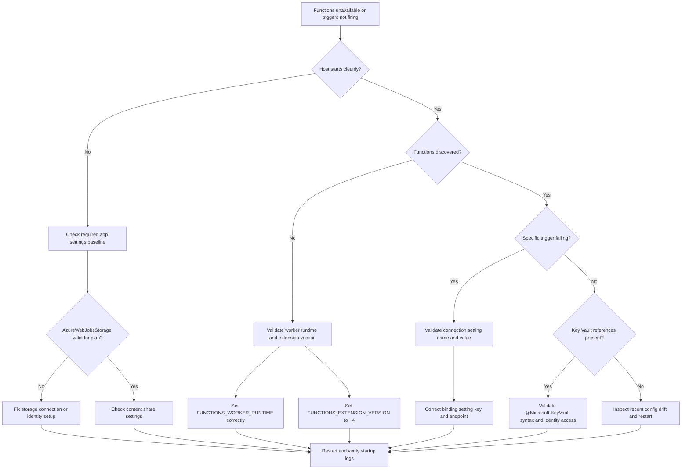
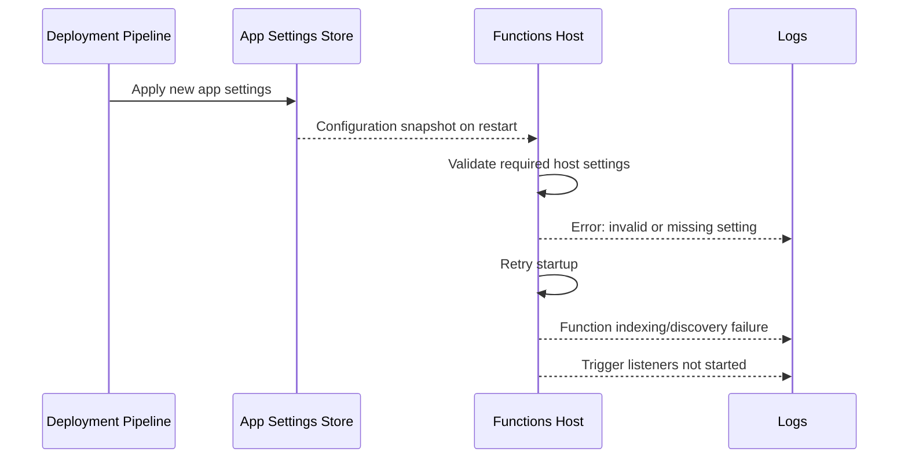

# App Settings Misconfiguration

## 1. Summary
This playbook addresses Azure Functions incidents caused by missing, malformed, or incorrect application settings. Common failure modes include missing `AzureWebJobsStorage`, wrong `FUNCTIONS_WORKER_RUNTIME`, incorrect `FUNCTIONS_EXTENSION_VERSION`, invalid content share settings on Consumption or Premium plans, and broken Key Vault reference syntax.

The objective is to restore host startup, function discovery, and trigger execution with minimal blast radius. Start with baseline required settings, validate plan-specific requirements, correlate startup and discovery errors, then apply narrowly scoped configuration fixes.

### Decision Flow


### Severity guidance
| Condition | Severity | Action priority |
|---|---|---|
| Production app cannot start host or discover functions | SEV-1 | Immediate rollback or hotfix settings |
| Subset of triggers failing due to one bad connection setting | SEV-2 | Restore in current shift and validate all bindings |
| Non-critical app has warning-only configuration drift | SEV-3 | Correct during planned maintenance window |

### Signal snapshot
| Signal | Normal | Incident |
|---|---|---|
| Host startup traces | `Host started` appears after restart | Startup loop with configuration errors |
| Function discovery | Expected function count loaded | Zero or reduced discovered functions |
| Dependency targets | Expected storage/account endpoints | Calls routed to wrong storage account |
| Key Vault reference resolution | Settings resolve without reference errors | `@Microsoft.KeyVault(...)` parse or access failures |
| Requests and invocations | Invocation trend follows event load | Flat or sharply reduced invocation trend |

### Startup failure progression


### Settings dependency map
```mermaid
flowchart LR
    S1[AzureWebJobsStorage] --> H[Host runtime state]
    S2[FUNCTIONS_WORKER_RUNTIME] --> I[Indexing and worker selection]
    S3[FUNCTIONS_EXTENSION_VERSION] --> E[Runtime extension bundle]
    S4[WEBSITE_CONTENTAZUREFILECONNECTIONSTRING] --> C[Content share mount]
    S5[WEBSITE_CONTENTSHARE] --> C
    S6[@Microsoft.KeyVault(...)] --> R[Reference resolver]
    R --> H
    H --> T[Trigger listeners]
    I --> T
    C --> T
```

## 2. Common Misreadings
| Misreading | Why incorrect | Correct interpretation |
|---|---|---|
| "The app is running, so settings are fine." | App process availability does not guarantee host readiness or listener startup. | Use startup and discovery traces to validate runtime health. |
| "Function not showing means code deployment failed." | Incorrect worker runtime can hide valid function code from discovery. | Check `FUNCTIONS_WORKER_RUNTIME` before redeploying code. |
| "Any storage account works for AzureWebJobsStorage." | Wrong account, network policy, or permission can break host operations. | Validate endpoint, reachability, and auth mode for the intended account. |
| "Key Vault reference errors are always access issues." | Syntax errors in reference value fail before authorization is evaluated. | Validate exact `@Microsoft.KeyVault(...)` format and secret URI. |
| "Content share settings are optional on all plans." | Consumption and Premium plans commonly require content share settings. | Confirm plan-specific requirements before removing content settings. |

## 3. Competing Hypotheses
| ID | Hypothesis | Confirming signal | Disproving signal |
|---|---|---|---|
| H1 | `AzureWebJobsStorage` missing, invalid, or points to wrong account | Host startup or listener errors reference storage/account mismatch | Host startup and storage operations succeed consistently |
| H2 | `FUNCTIONS_WORKER_RUNTIME` misconfigured | Function discovery count drops or zero; worker mismatch errors | Correct runtime set and expected functions discover |
| H3 | `FUNCTIONS_EXTENSION_VERSION` not `~4` or incompatible | Extension load/indexing warnings after restart | Extension version and bundle load normally |
| H4 | Content share settings missing or malformed (Consumption/Premium) | Startup logs indicate content mount/file share failure | Content share configured and mount is healthy |
| H5 | Key Vault reference syntax/access error in app settings | Reference parsing errors or denied secret resolution | Reference resolves and setting value becomes available |
| H6 | Non-config issue (code regression or dependency outage) | Config stable but errors begin exactly with code release or external outage | Issue resolves by correcting settings without code change |

## 4. What to Check First
1. Export current app settings and verify mandatory keys exist and are non-empty.
2. Validate plan-specific storage and content share requirements against current hosting plan.
3. Check startup and function indexing traces for explicit configuration error signatures.
4. Compare current settings snapshot with last known good deployment.

### Quick portal checks
- Function App -> Configuration: verify required keys and Key Vault reference status icons.
- Function App -> Functions: confirm expected functions are discovered and not missing.
- Application Insights -> Logs: inspect host startup, indexing, and configuration error traces.

### Quick CLI checks
```bash
az functionapp config appsettings list --name "$APP_NAME" --resource-group "$RG" --output table
az functionapp config show --name "$APP_NAME" --resource-group "$RG" --output json
az monitor app-insights query --app "$APP_NAME" --resource-group "$RG" --analytics-query "traces | where timestamp > ago(30m) | where cloud_RoleName =~ '$APP_NAME' | where message has_any ('Host started','Host initialization','WorkerConfig','FUNCTIONS_WORKER_RUNTIME','AzureWebJobsStorage','KeyVault','Error indexing method') | project timestamp, severityLevel, message | order by timestamp desc" --output table
```

### Example output
```text
Name                                      Value
----------------------------------------  ------------------------------------------------------------------------------------------------
FUNCTIONS_WORKER_RUNTIME                  node
FUNCTIONS_EXTENSION_VERSION               ~4
AzureWebJobsStorage                       DefaultEndpointsProtocol=https;AccountName=stwrongprod;AccountKey=***;EndpointSuffix=core.windows.net
WEBSITE_CONTENTAZUREFILECONNECTIONSTRING  DefaultEndpointsProtocol=https;AccountName=stwrongprod;AccountKey=***;EndpointSuffix=core.windows.net
WEBSITE_CONTENTSHARE                      func-prod-content
QueueConnection                           @Microsoft.KeyVault(SecretUri=https://kv-func-prod.vault.azure.net/secrets/queue-conn)

timestamp                    severityLevel  message
---------------------------  -------------  --------------------------------------------------------------------------------------------
2026-04-05T02:44:00.000000Z  3              The listener for function 'Functions.QueueProcessor' was unable to start.
2026-04-05T02:43:59.000000Z  3              Microsoft.Azure.WebJobs.Extensions.Storage.Blobs: Storage account 'stwrongprod' not found.
2026-04-05T02:43:57.000000Z  2              Error indexing method 'Functions.QueueProcessor'.
```

## 5. Evidence to Collect
| Source | Query/Command | Purpose |
|---|---|---|
| Current app settings snapshot | `az functionapp config appsettings list --name "$APP_NAME" --resource-group "$RG" --output json` | Capture exact key/value state at incident time |
| Function app site config | `az functionapp config show --name "$APP_NAME" --resource-group "$RG" --output json` | Identify runtime and plan-related config mismatch |
| Startup and indexing traces | `traces` query for startup/indexing/config keywords | Prove host startup and discovery outcomes |
| Host listener errors | `FunctionAppLogs` query for listener start failures | Confirm trigger-level impact from config issue |
| Invocation status | `requests` query grouped by operation name/result | Quantify blast radius and function impact |
| Dependency endpoint validation | `dependencies` query grouped by target and result | Detect wrong storage or service endpoint usage |
| Metric trend | `AppMetrics` for failed requests and cold starts | Verify mitigation effectiveness after change |
| Key Vault reference behavior | `traces` query for Key Vault resolution messages | Distinguish syntax error vs permission error |

## 6. Validation and Disproof by Hypothesis
### H1: AzureWebJobsStorage is missing, invalid, or wrong account
#### Confirming KQL
```kusto
let appName = "$APP_NAME";
traces
| where timestamp > ago(2h)
| where cloud_RoleName =~ appName
| where message has_any ("AzureWebJobsStorage", "Storage account", "Unable to resolve the Azure Storage connection named", "The listener for function")
| project timestamp, severityLevel, operation_Id, message
| order by timestamp desc
```

#### Expected output
```text
timestamp                    severityLevel  operation_Id                           message
---------------------------  -------------  ------------------------------------   --------------------------------------------------------------------------------------------------
2026-04-05T02:43:59.000000Z  3              xxxxxxxx-xxxx-xxxx-xxxx-xxxxxxxxxxxx   Microsoft.Azure.WebJobs.Extensions.Storage.Blobs: Storage account 'stwrongprod' not found.
2026-04-05T02:43:58.000000Z  3              xxxxxxxx-xxxx-xxxx-xxxx-xxxxxxxxxxxx   Unable to resolve the Azure Storage connection named 'AzureWebJobsStorage'.
2026-04-05T02:43:57.000000Z  2              xxxxxxxx-xxxx-xxxx-xxxx-xxxxxxxxxxxx   The listener for function 'Functions.QueueProcessor' was unable to start.
```

#### Disproving check
If host startup completes, listeners start, and storage dependencies return successful codes against the expected account endpoint, H1 is unlikely. Confirm by comparing `AzureWebJobsStorage` account name to intended environment naming standards.

### H2: FUNCTIONS_WORKER_RUNTIME mismatched to deployed app language
#### Confirming KQL
```kusto
let appName = "$APP_NAME";
traces
| where timestamp > ago(2h)
| where cloud_RoleName =~ appName
| where message has_any ("FUNCTIONS_WORKER_RUNTIME", "WorkerConfig", "No job functions found", "Worker process started and initialized")
| project timestamp, severityLevel, operation_Id, message
| order by timestamp desc
```

#### Expected output
```text
timestamp                    severityLevel  operation_Id                           message
---------------------------  -------------  ------------------------------------   --------------------------------------------------------------------------------------------
2026-04-05T02:41:15.000000Z  3              xxxxxxxx-xxxx-xxxx-xxxx-xxxxxxxxxxxx   No job functions found. Try making your job classes and methods public.
2026-04-05T02:41:14.000000Z  2              xxxxxxxx-xxxx-xxxx-xxxx-xxxxxxxxxxxx   WorkerConfig for runtime 'node' loaded, but function metadata expects 'python'.
2026-04-05T02:41:12.000000Z  2              xxxxxxxx-xxxx-xxxx-xxxx-xxxxxxxxxxxx   FUNCTIONS_WORKER_RUNTIME is set to 'node'.
```

#### Disproving check
When `FUNCTIONS_WORKER_RUNTIME` matches the application language and expected functions are discovered after restart, H2 is disproven. Verify function count with invocation activity in `requests`.

### H3: FUNCTIONS_EXTENSION_VERSION is incompatible or incorrect
#### Confirming KQL
```kusto
let appName = "$APP_NAME";
FunctionAppLogs
| where TimeGenerated > ago(2h)
| where AppName =~ appName
| where Message has_any ("FUNCTIONS_EXTENSION_VERSION", "Host initialization", "extension bundle", "incompatible")
| project TimeGenerated, Level, Message
| order by TimeGenerated desc
```

#### Expected output
```text
TimeGenerated                Level  Message
---------------------------  -----  -----------------------------------------------------------------------------------------------
2026-04-05T02:39:03.000000Z  Error  Host initialization failed: FUNCTIONS_EXTENSION_VERSION '3' is not supported for this app.
2026-04-05T02:39:02.000000Z  Error  Extension bundle loading failed due to incompatible runtime version.
2026-04-05T02:39:01.000000Z  Info   Starting Host (HostId=func-prod, Version=4.1047.100.26071, InstanceId=xxxxxxxx-xxxx-xxxx-xxxx-xxxxxxxxxxxx)
```

#### Disproving check
If extension version is `~4` and host initialization succeeds without extension bundle warnings, H3 is weak. Continue testing H4 and H5.

### H4: Content share settings invalid for Consumption or Premium
#### Confirming KQL
```kusto
let appName = "$APP_NAME";
traces
| where timestamp > ago(2h)
| where cloud_RoleName =~ appName
| where message has_any ("WEBSITE_CONTENTAZUREFILECONNECTIONSTRING", "WEBSITE_CONTENTSHARE", "content share", "Azure Files", "mount")
| project timestamp, severityLevel, operation_Id, message
| order by timestamp desc
```

#### Expected output
```text
timestamp                    severityLevel  operation_Id                           message
---------------------------  -------------  ------------------------------------   ------------------------------------------------------------------------------------------------------
2026-04-05T02:36:48.000000Z  3              xxxxxxxx-xxxx-xxxx-xxxx-xxxxxxxxxxxx   WEBSITE_CONTENTAZUREFILECONNECTIONSTRING is invalid or inaccessible.
2026-04-05T02:36:47.000000Z  3              xxxxxxxx-xxxx-xxxx-xxxx-xxxxxxxxxxxx   Unable to mount content share 'func-prod-content'.
2026-04-05T02:36:46.000000Z  2              xxxxxxxx-xxxx-xxxx-xxxx-xxxxxxxxxxxx   Host startup retry scheduled after content initialization failure.
```

#### Disproving check
If the hosting plan does not require content share settings, or if mount succeeds and startup is stable, H4 is not primary. Confirm plan type before making content-setting assumptions.

### H5: Key Vault reference syntax or permission failure
#### Confirming KQL
```kusto
let appName = "$APP_NAME";
traces
| where timestamp > ago(2h)
| where cloud_RoleName =~ appName
| where message has_any ("@Microsoft.KeyVault", "KeyVault", "SecretUri", "Unable to resolve app setting")
| project timestamp, severityLevel, operation_Id, message
| order by timestamp desc
```

#### Expected output
```text
timestamp                    severityLevel  operation_Id                           message
---------------------------  -------------  ------------------------------------   -----------------------------------------------------------------------------------------------------------------
2026-04-05T02:34:21.000000Z  3              xxxxxxxx-xxxx-xxxx-xxxx-xxxxxxxxxxxx   Unable to resolve app setting 'QueueConnection'. Invalid Key Vault reference syntax '@Microsoft.KeyVault(SecretUri=...)'.
2026-04-05T02:34:20.000000Z  3              xxxxxxxx-xxxx-xxxx-xxxx-xxxxxxxxxxxx   KeyVault reference resolution failed with Forbidden for secret URI https://kv-func-prod.vault.azure.net/secrets/queue-conn.
```

#### Disproving check
If settings use validated reference syntax and secret retrieval succeeds with the app identity, H5 is disconfirmed. Keep one canonical syntax template in platform standards to prevent recurrence.

### H6: Non-settings cause (code or platform dependency issue)
#### Confirming KQL
```kusto
let appName = "$APP_NAME";
requests
| where timestamp > ago(2h)
| where cloud_RoleName =~ appName
| summarize Invocations=count(), Failures=countif(success == false) by Operation=operation_Name
| join kind=leftouter (
    dependencies
    | where timestamp > ago(2h)
    | where cloud_RoleName =~ appName
    | summarize DepFailures=countif(resultCode startswith "5" or resultCode == "0") by operation_Name
) on $left.Operation == $right.operation_Name
| project Operation, Invocations, Failures, DepFailures
| order by Failures desc
```

#### Expected output
```text
Operation                    Invocations  Failures  DepFailures
---------------------------  -----------  --------  -----------
Functions.ProcessOrder       324          198       182
Functions.health             720          0         0
```

#### Disproving check
If setting rollback alone restores startup and invocation flow without code rollback, H6 is weak and configuration is primary. If failures persist after known-good settings restore, escalate to code/dependency investigation.

### Function discovery timeline
```mermaid
timeline
    title App settings incident timeline
    02:30 : Configuration deployment applied
    02:34 : First Key Vault reference parse error
    02:36 : Content share mount failures begin
    02:39 : Host initialization failures increase
    02:41 : Function discovery drops to zero
    02:45 : Settings corrected and host restarted
    02:49 : Functions rediscovered
    02:55 : Invocation rate returns to baseline
```

### Normal vs abnormal evidence matrix
| Dimension | Normal | Abnormal | Interpretation |
|---|---|---|---|
| Required keys present | Baseline keys exist and are non-empty | One or more mandatory keys missing | Startup/indexing failure likely |
| Runtime-language alignment | Worker runtime matches app language | Worker runtime set to different language | Discovery and execution mismatch |
| Extension behavior | Extension bundle loads and host starts | Incompatible extension warnings/errors | Runtime mismatch with host version |
| Storage endpoint selection | Dependencies target expected account | Dependencies hit non-production or unknown account | Wrong connection string/account drift |
| Key Vault references | References resolve and are cached | Syntax errors or access denied in resolver | Secret configuration break |

### Recovery verification queries
#### Host startup verification
```kusto
let appName = "$APP_NAME";
traces
| where timestamp > ago(30m)
| where cloud_RoleName =~ appName
| where message has_any ("Host started", "Job host started", "Starting Host")
| summarize Starts=count() by bin(timestamp, 5m)
| order by timestamp desc
```

#### Function discovery verification
```kusto
let appName = "$APP_NAME";
traces
| where timestamp > ago(30m)
| where cloud_RoleName =~ appName
| where message has_any ("Generating", "Found the following functions", "Error indexing method", "No job functions found")
| project timestamp, message
| order by timestamp desc
```

#### Verification output example
```text
timestamp                    Starts
---------------------------  ------
2026-04-05T03:00:00.000000Z  1
2026-04-05T02:55:00.000000Z  1

timestamp                    message
---------------------------  -------------------------------------------------------------------------
2026-04-05T03:00:07.000000Z  Found the following functions: Functions.QueueProcessor, Functions.health
2026-04-05T03:00:03.000000Z  Job host started
```

## 7. Likely Root Cause Patterns
| Pattern | Evidence signature | Frequency |
|---|---|---|
| Wrong `AzureWebJobsStorage` account in copied configuration | Startup storage errors and dependency target mismatch | High |
| `FUNCTIONS_WORKER_RUNTIME` changed during deployment | `No job functions found` and worker config mismatch traces | High |
| `FUNCTIONS_EXTENSION_VERSION` pinned incorrectly | Host initialization warnings on extension version | Medium |
| Missing content share settings on Consumption/Premium | Content mount errors and repeated host retries | Medium |
| Invalid Key Vault reference syntax in one connection setting | Resolver parse errors before authorization checks | Medium |

## 8. Immediate Mitigations
1. Restore baseline required app settings from last known good snapshot.
   ```bash
   az functionapp config appsettings set --name "$APP_NAME" --resource-group "$RG" --settings "FUNCTIONS_EXTENSION_VERSION=~4" "FUNCTIONS_WORKER_RUNTIME=$WORKER_RUNTIME" --output json
   ```
2. Correct `AzureWebJobsStorage` with the intended storage connection.
   ```bash
   az functionapp config appsettings set --name "$APP_NAME" --resource-group "$RG" --settings "AzureWebJobsStorage=$AZURE_WEBJOBS_STORAGE" --output json
   ```
3. For Consumption or Premium plans, set content share settings explicitly.
   ```bash
   az functionapp config appsettings set --name "$APP_NAME" --resource-group "$RG" --settings "WEBSITE_CONTENTAZUREFILECONNECTIONSTRING=$CONTENT_STORAGE_CONNECTION" "WEBSITE_CONTENTSHARE=$CONTENT_SHARE" --output json
   ```
4. Fix invalid Key Vault references by using canonical syntax.
   ```bash
   az functionapp config appsettings set --name "$APP_NAME" --resource-group "$RG" --settings "QueueConnection=@Microsoft.KeyVault(SecretUri=$SECRET_URI)" --output json
   ```
5. Restart the host to apply and validate corrected settings.
   ```bash
   az functionapp restart --name "$APP_NAME" --resource-group "$RG"
   ```
6. Verify startup and discovery recovery using a bounded query.
   ```bash
   az monitor app-insights query --app "$APP_NAME" --resource-group "$RG" --analytics-query "traces | where timestamp > ago(15m) | where cloud_RoleName =~ '$APP_NAME' | where message has_any ('Host started','Error indexing method','No job functions found') | project timestamp, message | order by timestamp desc" --output table
   ```

## 9. Prevention
1. Maintain an environment-specific settings contract and validate it during CI/CD.
2. Block deployment when required keys are missing, empty, or malformed.
3. Use typed configuration templates to prevent runtime and extension mismatches.
4. Add post-deployment health gates that confirm host startup and function discovery count.
5. Keep canonical Key Vault reference examples in shared runbooks and lint setting values before apply.

## See Also
- [Troubleshooting Architecture](../../architecture.md)
- [Troubleshooting Methodology](../../methodology.md)
- [KQL Query Guide](../../kql.md)
- [Troubleshooting Playbooks Index](../index.md)
- [Managed Identity and RBAC Authentication Failure](./managed-identity-rbac-failure.md)

## Sources
- [Azure Functions app settings reference](https://learn.microsoft.com/azure/azure-functions/functions-app-settings)
- [Azure Functions best practices for performance and reliability](https://learn.microsoft.com/azure/azure-functions/functions-best-practices)
- [Key Vault references for App Service and Azure Functions](https://learn.microsoft.com/azure/app-service/app-service-key-vault-references)
- [Monitor Azure Functions with Application Insights](https://learn.microsoft.com/azure/azure-functions/analyze-telemetry-data)
- [Azure Functions host versions and runtime support](https://learn.microsoft.com/azure/azure-functions/functions-versions)
