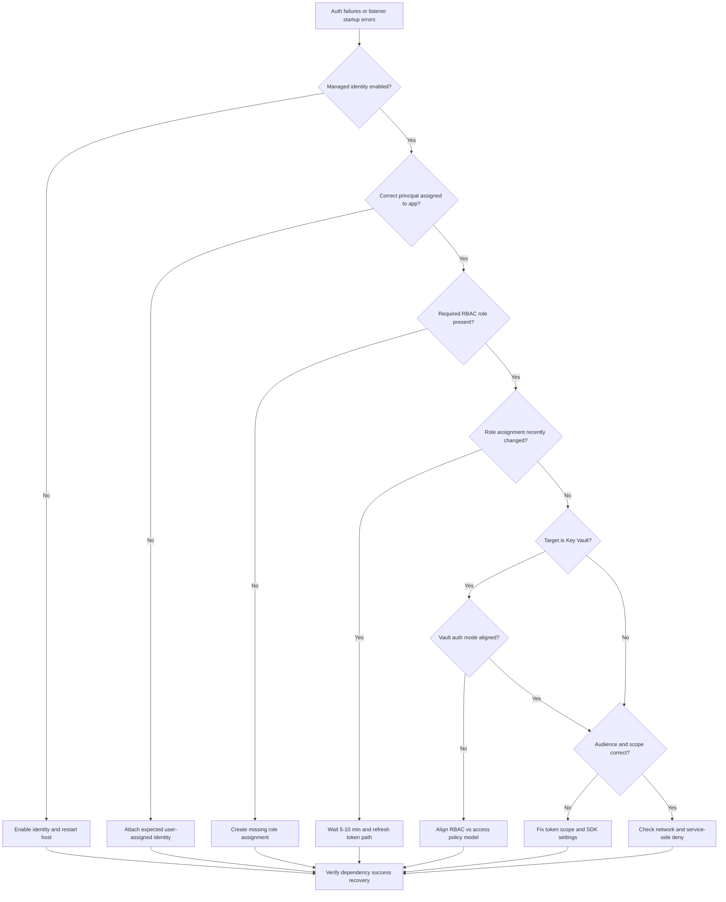
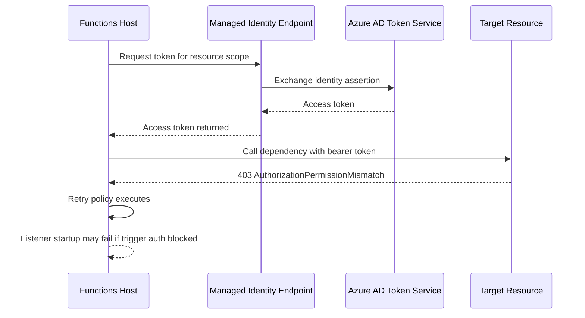
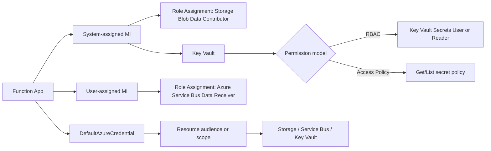
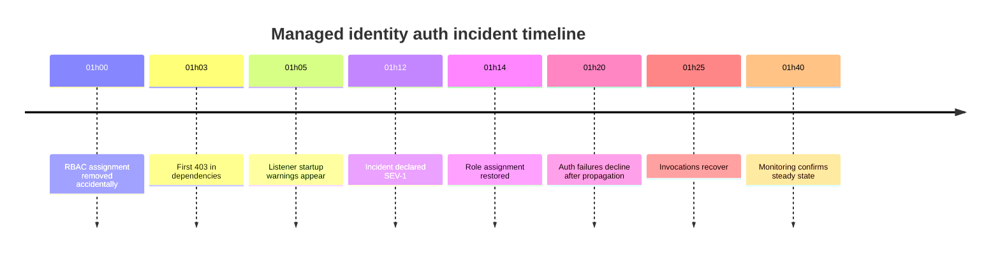

---
content_sources:
  - type: mslearn-adapted
    url: https://learn.microsoft.com/azure/azure-functions/functions-reference#configure-an-identity-based-connection
  - type: mslearn-adapted
    url: https://learn.microsoft.com/azure/app-service/overview-managed-identity
  - type: mslearn-adapted
    url: https://learn.microsoft.com/azure/role-based-access-control/role-assignments-cli
  - type: mslearn-adapted
    url: https://learn.microsoft.com/azure/key-vault/general/rbac-guide
  - type: mslearn-adapted
    url: https://learn.microsoft.com/dotnet/api/azure.identity.defaultazurecredential
---

# Managed Identity and RBAC Authentication Failure

## 1. Summary
This playbook is for incidents where Azure Functions cannot authenticate to downstream services by using managed identity, and requests fail with `401`, `403`, or host listener startup errors. It covers both system-assigned and user-assigned managed identities, role assignment drift, stale token cache windows after RBAC changes, Key Vault authorization mode mismatch, and token audience or scope mistakes when `DefaultAzureCredential` is used.

The goal is to restore trigger execution and outbound dependency access quickly, while separating identity-plane problems from application code regressions. Focus on proving or disproving six competing hypotheses in a bounded time window, then apply the smallest safe mitigation.

### Decision Flow
<!-- diagram-id: decision-flow -->


### Severity guidance
| Condition | Severity | Action priority |
|---|---|---|
| Production trigger pipeline blocked by auth errors | SEV-1 | Immediate mitigation, incident channel, 24x7 ownership |
| Partial function set impacted, fallback path exists | SEV-2 | Restore in current shift, preserve evidence pack |
| Non-critical integration degraded with retry success | SEV-3 | Schedule fix in planned window, monitor trend |

### Signal snapshot
| Signal | Normal | Incident |
|---|---|---|
| `dependencies` result codes | Mostly 2xx/3xx | Repeating 401/403 to same target |
| `traces` credential logs | Credential selected and token acquired | `ManagedIdentityCredential` unavailable/unauthorized |
| Trigger listener startup | `Listener started` after host start | `listener ... unable to start` with auth hint |
| Key Vault secret resolution | Reference resolves at startup | Secret retrieval denied or unresolved reference |
| Invocation continuity | Invocations correlate with source events | Source active, invocations drop to zero |

### Failure progression model
<!-- diagram-id: failure-progression-model -->


### Identity authorization map
<!-- diagram-id: identity-authorization-map -->


## 2. Common Misreadings
| Misreading | Why incorrect | Correct interpretation |
|---|---|---|
| "Managed identity is on, so auth must work." | Identity enablement alone does not grant data-plane rights. | Verify role assignment scope and role definition match trigger/resource needs. |
| "403 means network firewall issue." | 403 often indicates valid network path but failed authorization. | Correlate 403 messages with role claims and resource provider error text. |
| "Role was added, issue should clear immediately." | RBAC propagation and cached tokens can lag several minutes. | Allow 5-10 minutes, then re-test with fresh token attempt. |
| "Key Vault always uses RBAC now." | Many vaults still run with access policy mode. | Confirm vault permission model before interpreting denied events. |
| "DefaultAzureCredential picks the right audience automatically." | SDK can request wrong scope if client code sets incorrect resource URI. | Validate exact scope/audience string used per downstream service. |

## 3. Competing Hypotheses
| ID | Hypothesis | Confirming signal | Disproving signal |
|---|---|---|---|
| H1 | Managed identity not enabled or wrong identity attached | `az functionapp identity show` missing principalId or expected user identity absent | Principal exists and expected identity is attached |
| H2 | Required RBAC role missing at correct scope | `403` plus no matching role assignment for principal at resource scope | Required role assignment exists and is effective |
| H3 | RBAC propagation delay or stale token cache | Role recently changed and failures clear after delay/restart | Failures persist long after propagation window |
| H4 | Key Vault auth mode mismatch (RBAC vs access policy) | Vault mode conflicts with configured authorization mechanism | Vault mode and permissions are aligned |
| H5 | Audience or scope mismatch in token request | Dependency logs indicate invalid audience or unauthorized for resource | Same call succeeds when scope corrected |
| H6 | Non-auth root cause (network or resource outage) | Dependency timeout or DNS errors dominate over 401/403 | Authorization errors dominate and network checks pass |

## 4. What to Check First
1. Confirm which identity is active (system-assigned, user-assigned, or both) and capture principal IDs.
2. Validate that each impacted resource has the exact required role assignment at the proper scope.
3. Compare incident start time to recent RBAC or identity changes to detect propagation windows.
4. If Key Vault is involved, verify vault permission model and secret reference behavior.

### Quick portal checks
- Function App -> Identity: status is `On` and expected user-assigned identity appears.
- Target resource -> Access control (IAM): principal has least-privilege role at effective scope.
- Application Insights -> Logs: `ManagedIdentityCredential` and 401/403 burst aligns with outage window.

### Quick CLI checks
```bash
az functionapp identity show --name "$APP_NAME" --resource-group "$RG" --output json
az role assignment list --assignee "$PRINCIPAL_ID" --scope "$RESOURCE_ID" --output table
az keyvault show --name "$KV_NAME" --resource-group "$RG" --query "{name:name,enableRbacAuthorization:properties.enableRbacAuthorization}" --output table
```

### Example output
```text
{
  "principalId": "xxxxxxxx-xxxx-xxxx-xxxx-xxxxxxxxxxxx",
  "tenantId": "<tenant-id>",
  "type": "SystemAssigned, UserAssigned",
  "userAssignedIdentities": {
    "/subscriptions/<subscription-id>/resourceGroups/rg-functions-prod/providers/Microsoft.ManagedIdentity/userAssignedIdentities/mi-func-prod": {
      "clientId": "xxxxxxxx-xxxx-xxxx-xxxx-xxxxxxxxxxxx",
      "principalId": "xxxxxxxx-xxxx-xxxx-xxxx-xxxxxxxxxxxx"
    }
  }
}

Role                              Scope
--------------------------------  --------------------------------------------------------------------------------
Storage Blob Data Contributor     /subscriptions/<subscription-id>/resourceGroups/rg-functions-prod/providers/Microsoft.Storage/storageAccounts/stfuncprod
Azure Service Bus Data Receiver   /subscriptions/<subscription-id>/resourceGroups/rg-functions-prod/providers/Microsoft.ServiceBus/namespaces/sb-func-prod

Name            EnableRbacAuthorization
--------------  -----------------------
kv-func-prod    True
```

## 5. Evidence to Collect
| Source | Query/Command | Purpose |
|---|---|---|
| Function app identity | `az functionapp identity show --name "$APP_NAME" --resource-group "$RG" --output json` | Confirm active identity type and principal IDs |
| Resource IAM | `az role assignment list --assignee "$PRINCIPAL_ID" --scope "$RESOURCE_ID" --output json` | Verify effective role and scope correctness |
| Key Vault mode | `az keyvault show --name "$KV_NAME" --resource-group "$RG" --output json` | Determine RBAC vs access policy model |
| Dependency failures | `dependencies` query for 401/403 by target | Identify failing service and operation |
| Credential traces | `traces` query filtering `ManagedIdentityCredential` and `DefaultAzureCredential` | Pinpoint token acquisition and chain fallback behavior |
| Invocation health | `requests` query grouped by function and result | Measure blast radius and failed function set |
| Host startup traces | `FunctionAppLogs` query for listener startup errors | Detect trigger startup auth failures |
| App metrics | `AppMetrics` availability and error metrics | Validate recovery trend after mitigation |

## 6. Validation and Disproof by Hypothesis
### H1: Managed identity missing or wrong identity selected
#### Confirming KQL
```kusto
let appName = "$APP_NAME";
traces
| where timestamp > ago(2h)
| where cloud_RoleName =~ appName
| where message has_any ("ManagedIdentityCredential authentication unavailable", "No managed identity endpoint found", "User-assigned identity not found")
| project timestamp, severityLevel, operation_Id, message
| order by timestamp desc
```

#### Expected output
```text
timestamp                    severityLevel  operation_Id                           message
---------------------------  -------------  ------------------------------------   --------------------------------------------------------------------------------------
2026-04-05T01:14:52.000000Z  3              xxxxxxxx-xxxx-xxxx-xxxx-xxxxxxxxxxxx   ManagedIdentityCredential authentication unavailable. No managed identity endpoint found.
2026-04-05T01:14:51.000000Z  3              xxxxxxxx-xxxx-xxxx-xxxx-xxxxxxxxxxxx   User-assigned identity not found for clientId xxxxxxxx-xxxx-xxxx-xxxx-xxxxxxxxxxxx.
2026-04-05T01:14:49.000000Z  2              xxxxxxxx-xxxx-xxxx-xxxx-xxxxxxxxxxxx   DefaultAzureCredential failed to retrieve a token from the included credentials.
```

!!! tip "How to Read This"
    If `ManagedIdentityCredential authentication unavailable` appears first, identity enablement or endpoint availability is the primary fault domain.
    If only user-assigned identity errors appear, validate that the exact user-assigned identity resource ID is attached to the app.

#### Disproving check
If traces show successful token acquisition for the intended principal and there are no identity-unavailable messages in the same window, H1 is weakened. Confirm with `az functionapp identity show` that `principalId` and expected user-assigned identity IDs match deployment intent.

### H2: Missing or incorrect RBAC role assignment
#### Confirming KQL
```kusto
let appName = "$APP_NAME";
dependencies
| where timestamp > ago(2h)
| where cloud_RoleName =~ appName
| where resultCode in ("401", "403")
| summarize Failures=count(), Samples=make_set(tostring(target), 5) by DependencyType=type, Name=name, Result=resultCode
| order by Failures desc
```

#### Expected output
```text
DependencyType  Name                                 Result  Failures  Samples
--------------  -----------------------------------  ------  --------  --------------------------------------------------------------------
Azure blob      BlobContainerClient.GetProperties    403     182       ["stfuncprod.blob.core.windows.net"]
Azure ServiceBus ServiceBusReceiver.ReceiveMessages  403     146       ["sb-func-prod.servicebus.windows.net"]
Azure Key Vault SecretClient.GetSecret               403     91        ["kv-func-prod.vault.azure.net"]
```

!!! tip "How to Read This"
    Rank targets by `Failures` to identify the highest-impact missing role first.
    Consistent `403` across multiple dependency types usually indicates RBAC assignment gaps, not transient SDK or network behavior.

#### Disproving check
If required roles are present at the exact data-plane scope and 403 events disappear without role changes, H2 is unlikely. Validate with `az role assignment list --assignee "$PRINCIPAL_ID" --scope "$RESOURCE_ID" --output table` for each affected resource.

### H3: Propagation delay or stale token cache after RBAC update
#### Confirming KQL
```kusto
let appName = "$APP_NAME";
dependencies
| where timestamp > ago(4h)
| where cloud_RoleName =~ appName
| where resultCode in ("401", "403")
| summarize AuthFailures=count() by bin(timestamp, 5m)
| join kind=leftouter (
    traces
    | where timestamp > ago(4h)
    | where cloud_RoleName =~ appName
    | where message has_any ("Role assignment", "ManagedIdentityCredential", "token")
    | summarize TokenLogs=count() by bin(timestamp, 5m)
) on timestamp
| project timestamp, AuthFailures, TokenLogs
| order by timestamp asc
```

#### Expected output
```text
timestamp                    AuthFailures  TokenLogs
---------------------------  ------------  ---------
2026-04-05T01:00:00.000000Z  88            14
2026-04-05T01:05:00.000000Z  95            16
2026-04-05T01:10:00.000000Z  61            12
2026-04-05T01:15:00.000000Z  19            8
2026-04-05T01:20:00.000000Z  2             5
2026-04-05T01:25:00.000000Z  0             4
```

#### Disproving check
If failures continue beyond 30 minutes after confirmed RBAC updates and host recycle, propagation delay alone does not explain the incident. Continue with H2, H4, and H5 checks.

### H4: Key Vault permission model mismatch
#### Confirming KQL
```kusto
let appName = "$APP_NAME";
dependencies
| where timestamp > ago(2h)
| where cloud_RoleName =~ appName
| where target has "vault.azure.net"
| where resultCode in ("401", "403")
| project timestamp, operation_Id, name, resultCode, target, data
| order by timestamp desc
```

#### Expected output
```text
timestamp                    operation_Id                           name                  resultCode  target                     data
---------------------------  ------------------------------------   --------------------  ----------  -------------------------  -----------------------------------------------------------
2026-04-05T01:16:22.000000Z  xxxxxxxx-xxxx-xxxx-xxxx-xxxxxxxxxxxx   SecretClient.GetSecret 403         kv-func-prod.vault.azure.net ForbiddenByPolicy: Caller is not authorized by access policy.
2026-04-05T01:16:21.000000Z  xxxxxxxx-xxxx-xxxx-xxxx-xxxxxxxxxxxx   SecretClient.GetSecret 403         kv-func-prod.vault.azure.net ForbiddenByRbac: Principal does not have secrets/get permission.
```

#### Disproving check
When vault permission mode is known and matching permissions are granted (`enableRbacAuthorization=true` with RBAC roles, or false with access policies), and secret reads succeed in test calls, H4 is disconfirmed.

### H5: Audience or scope mismatch in token acquisition
#### Confirming KQL
```kusto
let appName = "$APP_NAME";
traces
| where timestamp > ago(2h)
| where cloud_RoleName =~ appName
| where message has_any ("invalid audience", "scope", "AADSTS500011", "The audience is invalid")
| project timestamp, severityLevel, operation_Id, message
| order by timestamp desc
```

#### Expected output
```text
timestamp                    severityLevel  operation_Id                           message
---------------------------  -------------  ------------------------------------   ----------------------------------------------------------------------------------------------
2026-04-05T01:18:02.000000Z  3              xxxxxxxx-xxxx-xxxx-xxxx-xxxxxxxxxxxx   AADSTS500011: The resource principal named https://storage.azure.com was not found.
2026-04-05T01:18:01.000000Z  3              xxxxxxxx-xxxx-xxxx-xxxx-xxxxxxxxxxxx   The audience is invalid for the requested token. Scope used: api://wrong-resource/.default
```

#### Disproving check
If dependency calls succeed after forcing the documented service scope (for example, `https://storage.azure.com/.default` or `https://servicebus.azure.net/.default`) and no audience errors remain, H5 was causal and now resolved.

### H6: Non-auth outage masquerading as auth failure
#### Confirming KQL
```kusto
let appName = "$APP_NAME";
dependencies
| where timestamp > ago(2h)
| where cloud_RoleName =~ appName
| summarize
    Auth=countif(resultCode in ("401", "403")),
    Timeout=countif(resultCode == "0" or tostring(data) has_any ("timeout", "Name or service not known", "No such host")),
    Server=countif(resultCode startswith "5")
  by Target=target
| order by Timeout desc, Auth desc
```

#### Expected output
```text
Target                               Auth  Timeout  Server
-----------------------------------  ----  -------  ------
sb-func-prod.servicebus.windows.net  6     188      0
stfuncprod.blob.core.windows.net     4     172      0
kv-func-prod.vault.azure.net         3     97       0
```

#### Disproving check
If timeout and DNS errors dominate while 401/403 are sparse, treat auth findings as secondary and execute network outage workflow first. H6 remains strongest until connectivity normalizes.

### Host startup correlation
<!-- diagram-id: host-startup-correlation -->


### Normal vs abnormal comparison
| Dimension | Normal | Abnormal | Interpretation |
|---|---|---|---|
| Identity metadata | Stable `principalId` and expected identity IDs | Missing principal or unexpected user-assigned identity | Wrong identity path selected |
| Blob dependency responses | Mostly 2xx with occasional retry | Sustained 403 with AuthorizationPermissionMismatch | Missing blob data-plane RBAC |
| Service Bus receive loop | Regular receive success and lock renewal | Continuous unauthorized receive failures | Missing Service Bus data receiver role |
| Key Vault secret fetch | Secret get success at startup and runtime | Forbidden responses with policy or RBAC errors | Vault permission model or role mismatch |
| Credential traces | Token acquired without credential chain fallthrough | Credential chain exhaustion or invalid audience errors | Scope/audience or identity availability issue |

### Evidence interpretation checklist
1. Verify the same principal ID appears across identity metadata, role assignments, and dependency call context.
2. Confirm the failure signature is authorization (`401`/`403`) rather than connectivity timeout (`resultCode` `0`).
3. Align incident start minute with IAM change history before declaring propagation delay.
4. For Key Vault, verify exactly one permission model expectation is used in operational runbooks.
5. Capture at least one post-mitigation query showing `AuthFailures=0` before closure.

## 7. Likely Root Cause Patterns
| Pattern | Evidence signature | Frequency |
|---|---|---|
| Identity disabled during config drift | `ManagedIdentityCredential authentication unavailable` and no principal ID | Medium |
| Missing `Storage Blob Data Contributor` for blob trigger path | Repeating blob 403 plus trigger startup failure | High |
| Missing `Azure Service Bus Data Receiver` for Service Bus trigger | Service Bus receive 401/403 while other dependencies succeed | High |
| Key Vault permission model mismatch | Mixed `ForbiddenByPolicy` and `ForbiddenByRbac` messages | Medium |
| Scope/audience misconfiguration in credential code | `AADSTS500011` or invalid audience trace errors | Low |

## 8. Immediate Mitigations
1. Re-enable or attach the expected managed identity.
   ```bash
   az functionapp identity assign --name "$APP_NAME" --resource-group "$RG" --output json

   # For user-assigned identity:
   az functionapp identity assign --resource-group "$RG" --name "$APP_NAME" \
     --identities "/subscriptions/$SUBSCRIPTION_ID/resourceGroups/$RG/providers/Microsoft.ManagedIdentity/userAssignedIdentities/$IDENTITY_NAME"
   ```
2. Grant missing blob data-plane permissions for blob-trigger workloads.
   ```bash
   az role assignment create --assignee-object-id "$PRINCIPAL_ID" --assignee-principal-type ServicePrincipal --role "Storage Blob Data Contributor" --scope "$STORAGE_RESOURCE_ID" --output json
   ```
3. Grant missing Service Bus data-plane permissions for Service Bus trigger workloads.
   ```bash
   az role assignment create --assignee-object-id "$PRINCIPAL_ID" --assignee-principal-type ServicePrincipal --role "Azure Service Bus Data Receiver" --scope "$SERVICEBUS_RESOURCE_ID" --output json
   ```
4. Align Key Vault permission mode and grants.
   !!! warning "Verify Before Switching"
       Switching from access-policy to RBAC authorization may break existing access-policy-based consumers.
       Verify all Key Vault consumers support RBAC before running this command.

   ```bash
   az keyvault update --name "$KV_NAME" --resource-group "$RG" --enable-rbac-authorization true --output json
   ```
5. Restart the function host after RBAC changes to reduce stale token persistence risk.
   ```bash
   az functionapp restart --name "$APP_NAME" --resource-group "$RG"
   ```
6. Validate recovery with bounded log checks before incident closure.
   ```bash
   az monitor log-analytics query --workspace "$WORKSPACE_ID" --analytics-query "dependencies | where timestamp > ago(15m) | summarize AuthFailures=countif(resultCode in ('401','403'))" --output table
   ```

## 9. Prevention
1. Standardize managed identity and RBAC assignments in infrastructure as code with review gates.
2. Add deployment checks that assert required roles per trigger type before slot swap.
3. Track IAM and identity changes in change management with explicit blast-radius notes.
4. Add alert rules on `dependencies` 401/403 rate and `ManagedIdentityCredential` trace spikes.
5. Document canonical token scopes for each dependency and enforce through shared SDK wrappers.
6. Run quarterly access reviews to remove stale assignments without breaking trigger identities.

## See Also
- [Troubleshooting Architecture](../../architecture.md)
- [Troubleshooting Methodology](../../methodology.md)
- [KQL Query Guide](../../kql/index.md)
- [Troubleshooting Lab Guides](../../lab-guides/index.md)
- [Managed Identity Authentication Lab](../../lab-guides/managed-identity-auth.md)
- [App Settings Misconfiguration Playbook](./app-settings-misconfiguration.md)

## Sources
- [Azure Functions identity-based connections](https://learn.microsoft.com/azure/azure-functions/functions-reference#configure-an-identity-based-connection)
- [Use managed identities for App Service and Azure Functions](https://learn.microsoft.com/azure/app-service/overview-managed-identity)
- [Assign Azure roles using Azure CLI](https://learn.microsoft.com/azure/role-based-access-control/role-assignments-cli)
- [Authorize access to Key Vault secrets](https://learn.microsoft.com/azure/key-vault/general/rbac-guide)
- [DefaultAzureCredential authentication flow](https://learn.microsoft.com/dotnet/api/azure.identity.defaultazurecredential)
