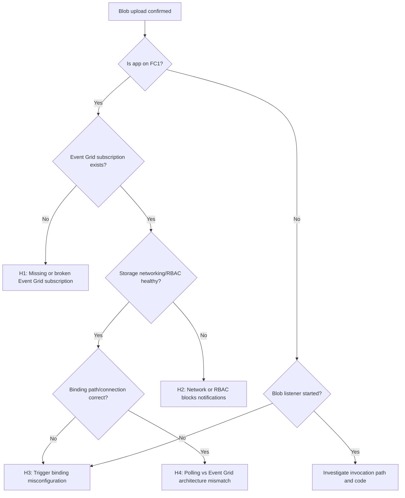

---
content_sources:
  - type: mslearn-adapted
    url: https://learn.microsoft.com/azure/azure-functions/functions-bindings-storage-blob-trigger
  - type: mslearn-adapted
    url: https://learn.microsoft.com/azure/azure-functions/flex-consumption-plan
  - type: mslearn-adapted
    url: https://learn.microsoft.com/azure/event-grid/concepts
  - type: mslearn-adapted
    url: https://learn.microsoft.com/azure/azure-functions/functions-monitoring
  - type: mslearn-adapted
    url: https://learn.microsoft.com/azure/azure-monitor/logs/log-query-overview
---

# Blob Trigger Not Firing

## 1. Summary

| Item | Detail |
|---|---|
| Incident class | Trigger pipeline outage |
| Primary symptom | Blob uploads succeed but blob-trigger function invocations do not appear |
| Most critical platform rule | Flex Consumption (`FC1`) requires Event Grid-based blob trigger wiring |
| Common impact | Ingestion backlog, delayed processing, stale downstream data |

<!-- diagram-id: 1-summary -->


- Treat this playbook as a hypothesis test, not a checklist-only exercise.
- On `FC1`, missing Event Grid subscription is a root-cause class by itself.
- Confirm plan model first, then event path, then binding path, then runtime evidence.

## 2. Common Misreadings

- "Upload succeeded, so trigger is healthy" confuses storage write success with event delivery success.
- "Function has no code errors" is irrelevant when the function never receives an event.
- "It worked before migration" often hides architecture mismatch after moving to `FC1`.
- "Function is enabled in portal" does not prove binding path, connection, or listener health.
- "No critical logs" may only mean diagnostics query scope is too narrow.

## 3. Competing Hypotheses (H1: Event Grid subscription missing, H2: Storage networking or RBAC blocks notifications, H3: Trigger binding misconfiguration, H4: Polling vs Event Grid architecture mismatch)

- **H1**: Event Grid subscription for blob-created events is missing, invalid, or not provisioned.
- **H2**: Storage networking, firewall, private endpoint DNS, or RBAC prevents notification flow.
- **H3**: Blob trigger binding path/connection/container mapping is wrong.
- **H4**: Team assumes polling behavior while runtime architecture requires Event Grid (`FC1`).

## 4. What to Check First

1. Confirm hosting plan behavior.
    - Verify whether app is Flex Consumption (`FC1`).
    - If `FC1`, treat Event Grid as mandatory trigger dependency.
2. Confirm Event Grid subscription status.
    - Check existence, provisioning state, and endpoint type.
3. Confirm listener startup traces.
    - Find `BlobTrigger listener started` and host startup traces.
4. Confirm binding alignment.
    - Ensure trigger path matches actual upload container and blob prefix.
5. Confirm network and RBAC path.
    - Validate access and delivery constraints around storage and function app.

## 5. Evidence to Collect

### Sample Log Patterns

```text
# Abnormal: no trigger after upload
[2026-04-05T09:20:04Z] BlobTrigger - function was not triggered for container 'incoming'.

# Abnormal: Event Grid subscription missing
[2026-04-05T09:20:06Z] Event Grid subscription not found for storage account '<storage-account-name>'.

# Abnormal: endpoint delivery/validation issue
[2026-04-05T09:22:18Z] EventSubscriptionValidationFailure: Endpoint returned non-success status code.

# Abnormal: binding mismatch
[2026-04-05T09:23:01Z] No blobs matched path pattern 'archive/{name}' for function 'BlobIngestor'.

# Normal: listener startup
[2026-04-05T09:24:00Z] BlobTrigger listener started for function 'BlobIngestor'.

# Normal: invocation appears
[2026-04-05T09:24:03Z] Executing 'Functions.BlobIngestor' (Reason='New blob detected: incoming/2026-04-05/sample.json', Id=xxxxxxxx-xxxx-xxxx-xxxx-xxxxxxxxxxxx)
```

### KQL Queries with Example Output

#### Query 1: Function execution summary

```kusto
let appName = "func-myapp-prod";
requests
| where timestamp > ago(1h)
| where cloud_RoleName =~ appName
| where operation_Name startswith "Functions."
| summarize
    Invocations = count(),
    Failures = countif(success == false),
    FailureRatePercent = round(100.0 * countif(success == false) / count(), 2),
    P95Ms = percentile(duration, 95)
  by FunctionName = operation_Name
| order by Failures desc, P95Ms desc
```

| FunctionName | Invocations | Failures | FailureRatePercent | P95Ms |
|---|---|---|---|---|
| Functions.HttpHealth | 102 | 0 | 0.00 | 193.81 |

#### Query 8: Host startup/shutdown events + trigger context

```kusto
let appName = "func-myapp-prod";
traces
| where timestamp > ago(12h)
| where cloud_RoleName =~ appName
| where message has_any (
    "Host started",
    "Job host started",
    "Host shutdown",
    "Host is shutting down",
    "Stopping JobHost",
    "BlobTrigger",
    "EventGrid"
)
| project timestamp, severityLevel, message
| order by timestamp desc
```

| timestamp | severityLevel | message |
|---|---|---|
| 2026-04-05T09:24:00Z | 1 | BlobTrigger listener started for function 'BlobIngestor'. |
| 2026-04-05T09:23:59Z | 1 | Host started (74ms) |
| 2026-04-05T09:20:06Z | 3 | Event Grid subscription not found for storage account '<storage-account-name>'. |

### CLI Investigation Commands

```bash
az eventgrid event-subscription list \
    --source-resource-id "/subscriptions/$SUBSCRIPTION_ID/resourceGroups/$RG/providers/Microsoft.Storage/storageAccounts/<storage-account-name>" \
    --output table

az functionapp function list \
    --name "$APP_NAME" \
    --resource-group "$RG" \
    --output json

az monitor log-analytics query \
    --workspace "$WORKSPACE_ID" \
    --analytics-query "traces | where timestamp > ago(1h) | where cloud_RoleName =~ '$APP_NAME' | where message has_any ('BlobTrigger','EventGrid','listener','subscription') | order by timestamp desc" \
    --output table
```

```text
# Event subscription list (normal)
Name                                ProvisioningState    DestinationEndpointType
----------------------------------  -------------------  -----------------------
func-myapp-prod-blob-created-sub    Succeeded            WebHook

# Event subscription list (abnormal)
[]

# Function list excerpt
[
  {
    "name": "BlobIngestor",
    "isDisabled": false,
    "config": {
      "bindings": [
        {
          "type": "blobTrigger",
          "path": "incoming/{name}",
          "connection": "AzureWebJobsStorage"
        }
      ]
    }
  }
]
```

## 6. Validation and Disproof by Hypothesis (inline KQL + CLI + example output for each)

### H1: Event Grid subscription missing

**Signals that support**

- Subscription list is empty for source storage account.
- Trace includes `subscription not found` or similar Event Grid errors.
- Upload activity exists but invocation count remains zero.

**Signals that weaken**

- Subscription exists and `ProvisioningState` is `Succeeded`.
- Listener starts and function invocations appear after test upload.
- No Event Grid error traces in incident window.

**What to verify**

KQL:

```kusto
let appName = "func-myapp-prod";
traces
| where timestamp > ago(2h)
| where cloud_RoleName =~ appName
| where message has_any ("Event Grid subscription", "subscription not found", "BlobTrigger")
| project timestamp, severityLevel, message
| order by timestamp desc
```

CLI:

```bash
az eventgrid event-subscription list \
    --source-resource-id "/subscriptions/$SUBSCRIPTION_ID/resourceGroups/$RG/providers/Microsoft.Storage/storageAccounts/<storage-account-name>" \
    --output table
```

Example output:

```text
# Abnormal
[]

# Normal
Name                                ProvisioningState    DestinationEndpointType
----------------------------------  -------------------  -----------------------
func-myapp-prod-blob-created-sub    Succeeded            WebHook
```

!!! tip "How to Read This"
    On `FC1`, empty subscription output is usually sufficient to explain "blob trigger not firing".
    Restore subscription first, then re-test with one controlled upload.

### H2: Storage networking or RBAC blocks notifications

**Signals that support**

- Subscription exists but endpoint validation fails.
- Trace/exception evidence includes `403`, authorization, or networking errors.
- Incident start aligns with firewall, private endpoint, DNS, or RBAC changes.

**Signals that weaken**

- Event delivery success and fresh invocation logs are present.
- No auth/network errors during incident window.
- Same identity/network path works for comparable apps in same segment.

**What to verify**

KQL:

```kusto
let appName = "func-myapp-prod";
union isfuzzy=true traces, exceptions
| where timestamp > ago(2h)
| where cloud_RoleName =~ appName
| where message has_any ("403", "Unauthorized", "forbidden", "private endpoint", "DNS")
    or outerMessage has_any ("403", "Unauthorized", "forbidden", "private endpoint", "DNS")
| project timestamp, severityLevel, message=tostring(coalesce(message, outerMessage))
| order by timestamp desc
```

CLI:

```bash
az monitor log-analytics query \
    --workspace "$WORKSPACE_ID" \
    --analytics-query "traces | where timestamp > ago(1h) | where cloud_RoleName =~ '$APP_NAME' | where message has_any ('403','Unauthorized','forbidden','private endpoint','DNS') | project timestamp, severityLevel, message | order by timestamp desc" \
    --output table
```

Example output:

```text
timestamp                     severityLevel    message
----------------------------  ---------------  ------------------------------------------------------------------------------------
2026-04-05T09:22:18.0000000Z 3                EventSubscriptionValidationFailure: Endpoint returned non-success status code.
2026-04-05T09:22:15.0000000Z 3                Authorization failed when validating trigger storage access. StatusCode=403.
```

!!! tip "How to Read This"
    If subscription exists but repeated `403`/validation failures appear, prioritize network and RBAC correction.
    Do not start by rewriting function code.

### H3: Trigger binding misconfiguration

**Signals that support**

- Binding path points to wrong container or prefix.
- Function uses incorrect storage connection setting.
- Host starts but trigger remains idle for matching uploads.

**Signals that weaken**

- Binding path and actual upload path are aligned.
- Function enabled state is true and listener startup is consistent.
- Test blob in expected path produces invocation.

**What to verify**

KQL:

```kusto
let appName = "func-myapp-prod";
traces
| where timestamp > ago(2h)
| where cloud_RoleName =~ appName
| where message has_any ("BlobTrigger", "listener started", "No blobs matched path", "not triggered")
| project timestamp, severityLevel, message
| order by timestamp desc
```

CLI:

```bash
az functionapp function list \
    --name "$APP_NAME" \
    --resource-group "$RG" \
    --output json
```

Example output:

```text
# Abnormal binding
{
  "name": "BlobIngestor",
  "isDisabled": false,
  "config": {
    "bindings": [
      {
        "type": "blobTrigger",
        "path": "archive/{name}",
        "connection": "AzureWebJobsStorage"
      }
    ]
  }
}

# Actual upload location
incoming/2026-04-05/sample.json
```

!!! tip "How to Read This"
    Correct binding/container mismatch is often the fastest fix when infra looks healthy.
    Compare observed blob path and binding path literally, character by character.

### H4: Polling vs Event Grid architecture mismatch

**Signals that support**

- Incident starts right after migration to `FC1`.
- Team runbooks refer to polling-era trigger assumptions.
- Event Grid subscription is absent while operations expect polling pickup.

**Signals that weaken**

- App is not on `FC1` and trigger model matches hosting plan behavior.
- Event Grid is correctly configured and tested for uploads.
- Post-migration tests explicitly validated Event Grid path.

**What to verify**

KQL:

```kusto
let appName = "func-myapp-prod";
traces
| where timestamp > ago(6h)
| where cloud_RoleName =~ appName
| where message has_any ("BlobTrigger", "EventGrid", "Host started", "listener")
| project timestamp, severityLevel, message
| order by timestamp desc
```

CLI:

```bash
az functionapp show \
    --name "$APP_NAME" \
    --resource-group "$RG" \
    --query "{name:name, kind:kind, state:state}" \
    --output table

az functionapp plan show \
    --resource-group "$RG" \
    --name "$PLAN_NAME" \
    --query "{name:name, sku:sku.name, tier:sku.tier}" \
    --output table

az eventgrid event-subscription list \
    --source-resource-id "/subscriptions/$SUBSCRIPTION_ID/resourceGroups/$RG/providers/Microsoft.Storage/storageAccounts/<storage-account-name>" \
    --output table
```

Example output:

```text
Name              Kind                State
----------------  ------------------  -------
func-myapp-prod   functionapp,linux   Running

Name               Sku  Tier
-----------------  ---  ----------------
plan-functions-fc  FC1  FlexConsumption

# Event subscription list
[]

# Trace excerpt
2026-04-05T09:20:04Z BlobTrigger - function was not triggered for container 'incoming'.
```

!!! tip "How to Read This"
    Confirm `FC1` from the plan check (`Sku=FC1`, `Tier=FlexConsumption`) and then interpret empty Event Grid subscriptions as architecture mismatch.
    Reintroduce Event Grid wiring before tuning host or function code.

## 7. Likely Root Cause Patterns

- Subscription drift after storage account recreation or IaC partial deployment.
- Security hardening introduced delivery or authorization break (`403`, endpoint validation failures).
- Refactor changed binding path without matching uploader destination changes.
- Migration to `FC1` done without Event Grid runbook updates.

### Normal vs Abnormal Comparison

| Signal | Normal | Abnormal | Interpretation |
|---|---|---|---|
| Plan-model expectation | Team knows `FC1` requires Event Grid | Team expects polling behavior on `FC1` | Architecture mismatch |
| Event Grid subscription | Present and `Succeeded` | Empty/failed/unhealthy | Event path broken |
| Listener traces | `BlobTrigger listener started` visible | No listener start or repeated not-triggered logs | Runtime not wired correctly |
| Invocation evidence | Upload followed by function execution | Upload with zero invocations | Trigger chain interruption |
| Binding alignment | Path matches upload container/prefix | Path mismatch (`archive` vs `incoming`) | Filter mismatch |

## 8. Immediate Mitigations

1. Recreate/repair Event Grid subscription for blob-created events.
2. Validate endpoint health and eliminate network/RBAC delivery blockers.
3. Correct trigger binding path and storage connection setting.
4. Execute canary upload and verify invocation in logs within expected latency.
5. Replay missed blobs once trigger flow is restored.

### Mitigation CLI sequence

```bash
az eventgrid event-subscription list \
    --source-resource-id "/subscriptions/$SUBSCRIPTION_ID/resourceGroups/$RG/providers/Microsoft.Storage/storageAccounts/<storage-account-name>" \
    --output table

az functionapp function list \
    --name "$APP_NAME" \
    --resource-group "$RG" \
    --output json

az monitor log-analytics query \
    --workspace "$WORKSPACE_ID" \
    --analytics-query "traces | where timestamp > ago(30m) | where cloud_RoleName =~ '$APP_NAME' | where message has_any ('BlobTrigger listener started','Executing ''Functions.BlobIngestor''') | order by timestamp desc" \
    --output table
```

## 9. Prevention

- Codify Event Grid subscription resources in IaC for every blob source.
- Add CI/CD guardrail: fail deployment if blob trigger binding or connection is missing.
- Add synthetic blob upload tests post-deploy and on schedule.
- Add alerts for upload-without-invocation pattern and subscription health failures.
- Update team runbooks with explicit `FC1` rule: no Event Grid, no blob trigger firing.

## See Also

- [Troubleshooting Architecture](../architecture.md)
- [First 10 Minutes](../first-10-minutes.md)
- [Troubleshooting KQL](../kql.md)
- [Troubleshooting Methodology](../methodology.md)
- [All Playbooks](../playbooks.md)
- [Related Labs: DNS and VNet Resolution](../lab-guides/dns-vnet-resolution.md)

## Sources

- [Azure Functions Blob trigger](https://learn.microsoft.com/azure/azure-functions/functions-bindings-storage-blob-trigger)
- [Azure Functions Flex Consumption plan](https://learn.microsoft.com/azure/azure-functions/flex-consumption-plan)
- [Azure Event Grid concepts](https://learn.microsoft.com/azure/event-grid/concepts)
- [Monitor Azure Functions](https://learn.microsoft.com/azure/azure-functions/functions-monitoring)
- [Azure Monitor log query overview](https://learn.microsoft.com/azure/azure-monitor/logs/log-query-overview)
