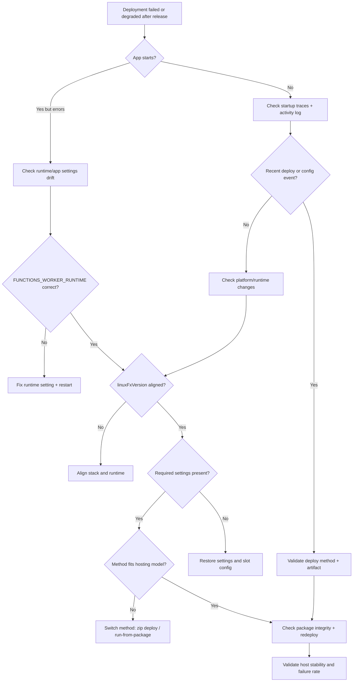

# Deployment Failures
## 1. Summary
Deployment failures in Azure Functions are often deployment-success-but-runtime-failure incidents.
Transport success (artifact uploaded) does not guarantee host startup, trigger indexing, or invocation health.
This playbook prioritizes fast triage of runtime settings, deployment model fit, and package integrity.

### Incident framing
- Common symptom: deployment command succeeds, but app returns `500`, `404`, or host loops on startup.
- Deployment concepts in scope: zip deploy, run-from-package, deployment slots, extension bundles, `FUNCTIONS_WORKER_RUNTIME`, `linuxFxVersion`.
- Use objective evidence first: traces, app settings snapshot, and activity log in the deployment window.
### Variables
```bash
RG="rg-functions-prod"
APP_NAME="func-orders-prod"
SUBSCRIPTION_ID="<subscription-id>"
WORKSPACE_ID="xxxxxxxx-xxxx-xxxx-xxxx-xxxxxxxxxxxx"
```
## 2. Common Misreadings
1. **"Deployment succeeded, so app is healthy"**
    - Upload success does not prove host startup success.
    - Always verify startup traces and first invocation outcomes.
2. **"404 after release is only routing"**
    - It can also indicate indexing failure or missing function metadata.
3. **"Staging is healthy, swap is safe"**
    - Slot-specific settings drift can break production immediately after swap.
4. **"Any artifact can run with current stack"**
    - `FUNCTIONS_WORKER_RUNTIME` and `linuxFxVersion` must align with artifact language/runtime.
5. **"Extension bundle issues are rare and harmless"**
    - Bundle retrieval/version issues can prevent trigger listeners from loading.
## 3. Competing Hypotheses
### H1: Runtime mismatch
- Artifact language/runtime does not match app runtime configuration.
- Typical examples:
    - Python package + `FUNCTIONS_WORKER_RUNTIME=node`
    - Node package + unsupported Linux stack image
    - .NET isolated package with incompatible host/runtime assumptions
### H2: Missing required app settings
- Required settings are missing, empty, stale, or not sticky in slot swaps.
- Commonly implicated settings:
    - `AzureWebJobsStorage`
    - `FUNCTIONS_WORKER_RUNTIME`
    - `WEBSITE_RUN_FROM_PACKAGE`
    - trigger connection setting keys referenced in bindings
### H3: Deployment method not suited to hosting model
- Deployment strategy conflicts with plan/runtime behavior.
- Frequent patterns:
    - mutable copy style deployment where package mount is expected
    - slot swap without settings stickiness policy
    - zip deploy sequence without verification of final mount/index state
### H4: Artifact corruption or incomplete upload
- Uploaded package is incomplete/corrupted or CI artifact differs from deployed payload.
- Typical indicators:
    - missing `host.json` at package root
    - missing/transient dependency folders
    - package hash mismatch between CI and deployment metadata
## 4. What to Check First
### First 5-minute checklist
1. Identify the exact release path: zip deploy, run-from-package URL, or slot swap.
2. Snapshot app metadata (`state`, `kind`, `linuxFxVersion`) and key settings.
3. Inspect activity log around deployment timestamp for failed config writes.
4. Check startup/shutdown traces for crash loop behavior.
5. If slots are used, diff staging vs production settings.
### Metadata snapshot command
```bash
az functionapp show \
    --resource-group $RG \
    --name $APP_NAME \
    --subscription $SUBSCRIPTION_ID \
    --query "{state:state, kind:kind, reserved:reserved, linuxFxVersion:siteConfig.linuxFxVersion}" \
    --output json
```
Expected read:
- `state` should settle at `Running`.
- `linuxFxVersion` should match intended runtime.
- Linux app should report `reserved: true`.
### Slot-focused quick checks
- confirm sticky settings policy for production-critical values
- confirm `WEBSITE_RUN_FROM_PACKAGE` value validity per slot
- confirm connection settings required by bindings exist in target slot
## 5. Evidence to Collect
### Sample Log Patterns
```text
2026-04-04T07:15:02.214Z info  Starting Host (HostId=func-orders-prod, InstanceId=xxxxxxxx-xxxx-xxxx-xxxx-xxxxxxxxxxxx)
2026-04-04T07:15:02.921Z info  Loading functions metadata
2026-04-04T07:15:03.104Z warn  WorkerConfig for runtime:python not found; configured runtime is node
2026-04-04T07:15:03.370Z error A host error has occurred during startup operation 'xxxxxxxx-xxxx-xxxx-xxxx-xxxxxxxxxxxx'
2026-04-04T07:15:03.371Z error Microsoft.Azure.WebJobs.Script: Did not find functions with language [python]
2026-04-04T07:15:08.122Z info  Stopping JobHost
2026-04-04T07:15:08.601Z info  Host started (4210ms)
2026-04-04T07:15:10.019Z warn  Failed to load extension bundle from [https://functionscdn.azureedge.net/public/ExtensionBundles/...]
2026-04-04T07:15:12.443Z error Executed 'Functions.HttpTrigger' (Failed, Id=xxxxxxxx-xxxx-xxxx-xxxx-xxxxxxxxxxxx, Duration=12ms)
```
### KQL Queries with Example Output
#### Query 1: Function execution summary (KQL library query 1)
```kusto
let appName = "func-orders-prod";
requests
| where timestamp > ago(1h)
| where cloud_RoleName =~ appName
| where operation_Name startswith "Functions."
| summarize
    Invocations = count(),
    Failures = countif(success == false),
    FailureRatePercent = round(100.0 * countif(success == false) / count(), 2),
    P95Ms = percentile(duration, 95)
  by FunctionName = operation_Name
| order by Failures desc, P95Ms desc
```
Example output:
| FunctionName | Invocations | Failures | FailureRatePercent | P95Ms |
|---|---:|---:|---:|---:|
| Functions.HttpTrigger | 42 | 39 | 92.86 | 3110.42 |
| Functions.TimerCleanup | 6 | 0 | 0.00 | 109.35 |
#### Query 2: Exceptions concentrated after deployment
```kusto
let appName = "func-orders-prod";
exceptions
| where timestamp > ago(2h)
| where cloud_RoleName =~ appName
| summarize Count=count() by type, outerMessage
| order by Count desc
```
Example output:
| type | outerMessage | Count |
|---|---|---:|
| Microsoft.Azure.WebJobs.Script.Workers.Rpc.RpcException | Exception while executing function: Functions.HttpTrigger | 61 |
| System.InvalidOperationException | Worker runtime does not match deployed payload | 48 |
#### Query 3: Host startup/shutdown timeline (adapted from KQL library query 8)
```kusto
let appName = "func-orders-prod";
traces
| where timestamp > ago(12h)
| where cloud_RoleName =~ appName
| where message has_any ("Host started", "Job host started", "Host shutdown", "Host is shutting down", "Stopping JobHost")
| project timestamp, severityLevel, message
| order by timestamp desc
```
Example output:
| timestamp | severityLevel | message |
|---|---:|---|
| 2026-04-04T07:15:08Z | 1 | Host started (4210ms) |
| 2026-04-04T07:15:08Z | 1 | Job host started |
| 2026-04-04T07:15:03Z | 3 | A host error has occurred during startup operation 'xxxxxxxx-xxxx-xxxx-xxxx-xxxxxxxxxxxx' |
### CLI Investigation Commands
#### Runtime and host metadata
```bash
az functionapp show \
    --resource-group $RG \
    --name $APP_NAME \
    --subscription $SUBSCRIPTION_ID \
    --output json
```
Example output:
```json
{
  "name": "func-orders-prod",
  "state": "Running",
  "kind": "functionapp,linux",
  "siteConfig": {
    "linuxFxVersion": "PYTHON|3.11"
  }
}
```
#### App settings inspection
```bash
az functionapp config appsettings list \
    --resource-group $RG \
    --name $APP_NAME \
    --subscription $SUBSCRIPTION_ID \
    --output table
```
Example output:
```text
Name                           Value
-----------------------------  -----------------------------------------
FUNCTIONS_WORKER_RUNTIME       python
AzureWebJobsStorage            DefaultEndpointsProtocol=https;...
WEBSITE_RUN_FROM_PACKAGE       1
APPINSIGHTS_INSTRUMENTATIONKEY xxxxxxxx-xxxx-xxxx-xxxx-xxxxxxxxxxxx
```
#### Control plane event history
```bash
az monitor activity-log list \
    --subscription $SUBSCRIPTION_ID \
    --resource-group $RG \
    --offset 2h \
    --status Failed \
    --output table
```
Example output:
```text
EventTimestamp              OperationNameValue                     Status  ResourceGroup
--------------------------  -------------------------------------  ------  -----------------
2026-04-04T07:14:51.000000Z Microsoft.Web/sites/config/write      Failed  rg-functions-prod
2026-04-04T07:14:30.000000Z Microsoft.Web/sites/publishxml/action Failed  rg-functions-prod
```
### Normal vs Abnormal Comparison
| Signal | Normal after release | Abnormal after release |
|---|---|---|
| Host startup cadence | One startup then stable | Frequent startup/shutdown cycle |
| Function indexing | All expected functions found | Missing functions or no language worker |
| `FUNCTIONS_WORKER_RUNTIME` | Matches artifact language | Mismatch with deployed package |
| `linuxFxVersion` | Compatible with package | Unsupported or drifted stack |
| `WEBSITE_RUN_FROM_PACKAGE` | Valid package setting/URL | Empty, broken, or inconsistent per slot |
| Activity log | Successful writes only | Failed config/deployment operations |
## 6. Validation and Disproof by Hypothesis
### H1: Runtime mismatch
#### Signals that support
- startup logs show worker mismatch or no functions discovered for configured runtime
- deployment appears successful but broad failures begin immediately
- `FUNCTIONS_WORKER_RUNTIME` conflicts with `linuxFxVersion`
#### Signals that weaken
- host starts cleanly and functions are indexed
- failures limited to one dependency path instead of all functions
- runtime metadata aligns with artifact language
#### What to verify
KQL:
```kusto
let appName = "func-orders-prod";
traces
| where timestamp > ago(2h)
| where cloud_RoleName =~ appName
| where message has_any ("WorkerConfig", "Did not find functions", "A host error has occurred during startup")
| project timestamp, severityLevel, message
| order by timestamp desc
```
CLI:
```bash
az functionapp show \
    --resource-group $RG \
    --name $APP_NAME \
    --subscription $SUBSCRIPTION_ID \
    --query "{linuxFxVersion:siteConfig.linuxFxVersion, kind:kind}" \
    --output json
az functionapp config appsettings list \
    --resource-group $RG \
    --name $APP_NAME \
    --subscription $SUBSCRIPTION_ID \
    --query "[?name=='FUNCTIONS_WORKER_RUNTIME']" \
    --output json
```
Example output:
```json
{
  "linuxFxVersion": "NODE|20",
  "kind": "functionapp,linux"
}
[
  {
    "name": "FUNCTIONS_WORKER_RUNTIME",
    "value": "python"
  }
]
```
!!! tip "How to Read This"
    Language mismatch between `linuxFxVersion` and `FUNCTIONS_WORKER_RUNTIME` is a high-confidence root cause.
    It typically causes broad failures across functions, not an isolated endpoint issue.
### H2: Missing required app settings
#### Signals that support
- startup/invocation errors mention missing or null configuration values
- storage/auth initialization fails after deployment
- swap happened and slot settings differ
#### Signals that weaken
- required settings exist with non-empty values in affected slot
- restoring known-good settings does not change behavior
- incident predates any settings change
#### What to verify
KQL:
```kusto
let appName = "func-orders-prod";
exceptions
| where timestamp > ago(2h)
| where cloud_RoleName =~ appName
| where outerMessage has_any ("Missing", "not configured", "AzureWebJobsStorage", "Value cannot be null")
| project timestamp, type, outerMessage
| order by timestamp desc
```
CLI:
```bash
az functionapp config appsettings list \
    --resource-group $RG \
    --name $APP_NAME \
    --subscription $SUBSCRIPTION_ID \
    --query "[?name=='AzureWebJobsStorage' || name=='FUNCTIONS_WORKER_RUNTIME' || name=='WEBSITE_RUN_FROM_PACKAGE']" \
    --output table
```
Example output:
```text
Name                      Value
------------------------  -----
FUNCTIONS_WORKER_RUNTIME  python
WEBSITE_RUN_FROM_PACKAGE  1
AzureWebJobsStorage
```
!!! tip "How to Read This"
    Empty `AzureWebJobsStorage` is usually enough to block startup or trigger initialization.
    When this appears after swap, check sticky settings and release variable scope first.
### H3: Deployment method not suited to hosting model
#### Signals that support
- host behavior becomes unstable immediately after method change
- swap succeeds but production degrades while staging looked healthy
- package mount semantics do not match deployment approach
#### Signals that weaken
- method is stable historically on same plan and runtime
- same artifact + same method redeploy works repeatedly
- no settings drift between staging and production
#### What to verify
KQL:
```kusto
let appName = "func-orders-prod";
traces
| where timestamp > ago(3h)
| where cloud_RoleName =~ appName
| where message has_any ("Host started", "Host shutdown", "Stopping JobHost", "Run-From-Package", "ZipDeploy")
| project timestamp, severityLevel, message
| order by timestamp desc
```
CLI:
```bash
az functionapp config appsettings list \
    --resource-group $RG \
    --name $APP_NAME \
    --subscription $SUBSCRIPTION_ID \
    --query "[?name=='WEBSITE_RUN_FROM_PACKAGE']" \
    --output json
az monitor activity-log list \
    --subscription $SUBSCRIPTION_ID \
    --resource-group $RG \
    --offset 3h \
    --output table
```
Example output:
```text
Name                     Value
-----------------------  ---------------------------------------------
WEBSITE_RUN_FROM_PACKAGE https://<storage-account>.blob.core.windows.net/deployments/app.zip?<sas>
EventTimestamp              OperationNameValue                         Status
--------------------------  -----------------------------------------  -------
2026-04-04T07:14:30.000000Z Microsoft.Web/sites/slots/slotsswap/action Succeeded
2026-04-04T07:13:58.000000Z Microsoft.Web/sites/config/write           Succeeded
```
!!! tip "How to Read This"
    If swap succeeded but startup loops continue, compare slot-specific settings and package URL accessibility.
    If deploy method changed recently, rollback method first before deeper code rollback.
### H4: Artifact corruption or incomplete upload
#### Signals that support
- function count drops or expected functions disappear after release
- indexing/load errors appear despite correct runtime configuration
- previous artifact rollback restores service quickly
#### Signals that weaken
- artifact hash matches CI and package inspection is clean
- same artifact works in another environment
- failure pattern points to downstream dependency outage
#### What to verify
KQL:
```kusto
let appName = "func-orders-prod";
traces
| where timestamp > ago(2h)
| where cloud_RoleName =~ appName
| where message has_any ("Loading functions metadata", "Error indexing method", "No job functions found", "Failed to load")
| project timestamp, severityLevel, message
| order by timestamp desc
```
CLI:
```bash
az monitor activity-log list \
    --subscription $SUBSCRIPTION_ID \
    --resource-group $RG \
    --offset 2h \
    --status Failed \
    --output table
az functionapp show \
    --resource-group $RG \
    --name $APP_NAME \
    --subscription $SUBSCRIPTION_ID \
    --query "{state:state, defaultHostName:defaultHostName}" \
    --output json
```
Example output:
```text
EventTimestamp              OperationNameValue                     Status  SubStatus
--------------------------  -------------------------------------  ------  ---------
2026-04-04T07:14:29.000000Z Microsoft.Web/sites/publishxml/action Failed  Conflict
{
  "state": "Running",
  "defaultHostName": "func-orders-prod.azurewebsites.net"
}
```
!!! tip "How to Read This"
    `state: Running` is not proof of package integrity.
    If indexing errors disappear after redeploying prior artifact, classify as package corruption/incomplete upload.
## 7. Likely Root Cause Patterns
1. **Runtime/config drift at release time**
    - stack changed (`linuxFxVersion`) without matching worker setting
    - worker setting changed without matching build target
2. **Slot configuration drift**
    - non-sticky settings differ between slots
    - run-from-package URL/token valid only in staging
3. **Extension bundle compatibility or retrieval failure**
    - host starts but specific triggers do not initialize
    - bundle version range incompatible with app/runtime expectation
4. **Artifact assembly/publish defect**
    - missing root files (`host.json`) or incomplete dependencies
    - CI artifact and deployed package hash differ
## 8. Immediate Mitigations
1. Roll back to last known-good artifact and release method.
2. Restore known-good app settings snapshot, then restart host.
3. If slots are used, swap back immediately.
4. Align runtime settings and stack:
    - set `FUNCTIONS_WORKER_RUNTIME` correctly
    - align `linuxFxVersion` with target runtime
5. Redeploy with validated package hash and immutable artifact source.
6. If extension bundle errors exist, pin known-good bundle range and redeploy.
Operational command examples:
```bash
az functionapp config appsettings set \
    --resource-group $RG \
    --name $APP_NAME \
    --subscription $SUBSCRIPTION_ID \
    --settings FUNCTIONS_WORKER_RUNTIME=python WEBSITE_RUN_FROM_PACKAGE=1
az functionapp restart \
    --resource-group $RG \
    --name $APP_NAME \
    --subscription $SUBSCRIPTION_ID
```
## 9. Prevention
1. Add CI/CD guardrails:
    - validate `FUNCTIONS_WORKER_RUNTIME`, `linuxFxVersion`, and artifact language compatibility
    - fail pipeline if required settings are missing
2. Use immutable deployment controls:
    - run-from-package with checksum verification
    - record artifact checksum and release metadata
3. Improve slot governance:
    - explicit sticky-setting policy
    - automated pre-swap settings diff check
4. Add post-deploy automated health gates:
    - startup trace validation in first 10 minutes
    - automatic rollback threshold on failure rate and startup loops
5. Manage extension bundle/runtime lifecycle intentionally:
    - pin supported extension bundle ranges
    - keep version compatibility matrix by app and plan
## See Also
- [First 10 Minutes](../first-10-minutes.md)
- [Methodology](../methodology.md)
- [KQL Query Library](../kql.md)
- [Deployment and release patterns](../../best-practices/deployment.md)
- Related Labs: [Cold Start Lab](../lab-guides/cold-start.md)
## Sources
- [Troubleshoot Azure Functions](https://learn.microsoft.com/azure/azure-functions/functions-recover-from-failed-host)
- [Deployment technologies in Azure Functions](https://learn.microsoft.com/azure/azure-functions/functions-deployment-technologies)
- [Run your functions from a package file](https://learn.microsoft.com/azure/azure-functions/run-functions-from-deployment-package)
- [Azure Functions app settings reference](https://learn.microsoft.com/azure/azure-functions/functions-app-settings)
- [Azure Functions hosting options](https://learn.microsoft.com/azure/azure-functions/functions-scale)
