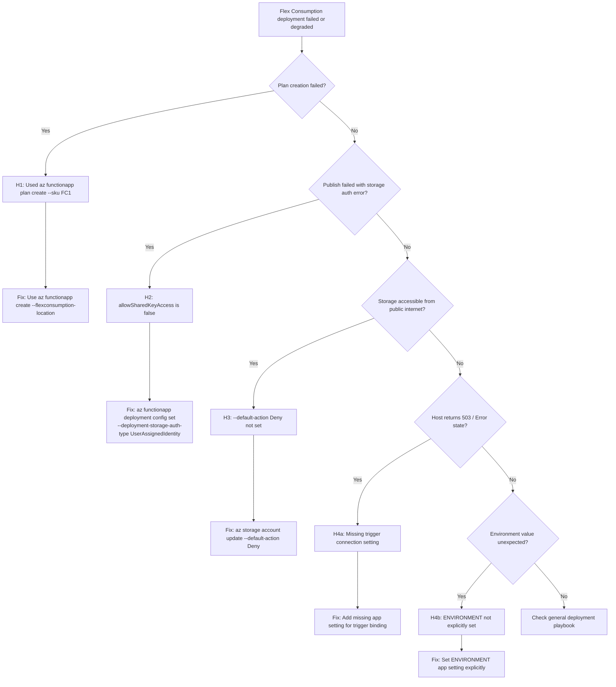

---
content_sources:
  - type: mslearn-adapted
    url: https://learn.microsoft.com/azure/azure-functions/flex-consumption-plan
  - type: mslearn-adapted
    url: https://learn.microsoft.com/azure/azure-functions/flex-consumption-how-to
  - type: mslearn-adapted
    url: https://learn.microsoft.com/azure/azure-functions/functions-deployment-technologies
  - type: mslearn-adapted
    url: https://learn.microsoft.com/azure/storage/common/storage-network-security
  - type: mslearn-adapted
    url: https://learn.microsoft.com/azure/azure-functions/functions-app-settings
content_validation:
  status: verified
  last_reviewed: 2026-04-12
  reviewer: agent
  core_claims:
    - claim: "Flex Consumption Deployment Gotchas 관련 핵심 진단 절차와 운영 판단 기준"
      source: https://learn.microsoft.com/azure/azure-functions/flex-consumption-plan
      verified: true
---

# Flex Consumption Deployment Gotchas

## 1. Summary

Flex Consumption (FC1) introduces a fundamentally different provisioning and deployment model compared to Consumption (Y1), Premium (EP), and Dedicated plans. Operators who carry over assumptions from those plans routinely encounter provisioning failures, deployment auth errors, and incomplete network lockdown — even when following documentation that appears correct for other plan types.

This playbook covers five specific issues discovered during hands-on deployment validation (2026-04-09, Azure CLI 2.83.0). Each maps to a competing hypothesis and includes evidence collection, validation, and mitigation steps.

<!-- diagram-id: 1-summary -->


### Incident framing

- Common symptom: provisioning command fails, publish returns auth error, or app deploys but host enters error state.
- Flex Consumption concepts in scope: `--flexconsumption-location`, deployment storage auth type, managed identity for storage, private endpoint network lockdown, host listener initialization.
- Use objective evidence first: CLI error messages, app settings snapshot, host state, and storage network rules.

### Variables

```bash
RG="rg-flexdemo"
APP_NAME="flexdemo-func"
STORAGE_NAME="flexdemostorage"
MI_NAME="flexdemo-identity"
SUBSCRIPTION_ID="<subscription-id>"
```

## 2. Common Misreadings

1. **"FC1 is just another SKU like Y1 or EP1"**
    - Flex Consumption does not use `az functionapp plan create`. The plan is created implicitly via `az functionapp create --flexconsumption-location`.
    - Attempting `--sku FC1` will fail with an invalid SKU error.

2. **"Private Endpoints mean storage is private"**
    - Creating private endpoints and DNS zones does NOT block public access. You must explicitly set `--default-action Deny` on the storage account.
    - Without this, data-plane requests from the public internet still succeed.

3. **"Managed Identity is configured, so deployment will use it"**
    - Assigning a managed identity to the function app does NOT change deployment storage authentication. By default, deployment storage uses connection string auth.
    - If `allowSharedKeyAccess: false`, publish fails unless you explicitly switch deployment storage to identity-based auth.

4. **"Azure sets ENVIRONMENT=production automatically"**
    - Azure does not set any `ENVIRONMENT` variable. Python code using `os.environ.get("ENVIRONMENT", "development")` will return `"development"` unless you set it explicitly.

5. **"Only the trigger's own function is affected by a missing connection setting"**
    - A missing connection string referenced in any trigger binding causes the entire Function host to enter Error state. ALL functions become inaccessible (HTTP 503), not just the one with the bad binding.

## 3. Competing Hypotheses

### H1: Provisioning model mismatch

- Operator uses the standard `az functionapp plan create --sku FC1` pattern.
- FC1 is not a recognized SKU value for App Service Plans.
- Flex Consumption requires `az functionapp create --flexconsumption-location` — no separate plan creation step.

### H2: Identity/auth configuration gap

- Storage account has `allowSharedKeyAccess: false` for security.
- Deployment storage defaults to connection string authentication.
- `func azure functionapp publish` fails with `InaccessibleStorageException`.
- Fix requires explicitly configuring deployment storage to use managed identity.

### H3: Network lockdown incomplete

- Private endpoints and DNS zones are correctly configured.
- But `--default-action` on the storage account is still `Allow` (default).
- Storage accepts data-plane requests from the public internet.
- PE setup creates a private path but does not remove the public path.

### H4: Missing app settings break host

- **H4a**: A trigger binding references a connection setting (e.g., `EventHubConnection`) that does not exist in app settings. The host fails to initialize trigger listeners and enters Error state (HTTP 503 for all endpoints).
- **H4b**: Application code reads `ENVIRONMENT` from environment variables with a `"development"` default. Azure does not set this variable, so it always returns `"development"`.

## 4. What to Check First

### First 5-minute checklist

1. Identify the exact error message from the failing CLI command or publish output.
2. Check whether the function app exists and its state:
    ```bash
    az functionapp show \
        --name $APP_NAME \
        --resource-group $RG \
        --query "{name:name, state:properties.state, sku:properties.sku}" \
        --output json
    ```
3. Check storage account security settings:
    ```bash
    az storage account show \
        --name $STORAGE_NAME \
        --resource-group $RG \
        --query "{allowSharedKeyAccess:allowSharedKeyAccess, defaultAction:networkRuleSet.defaultAction}" \
        --output json
    ```
4. Check deployment storage auth type:
    ```bash
    az functionapp deployment config show \
        --name $APP_NAME \
        --resource-group $RG \
        --query "deploymentStorage" \
        --output json
    ```
5. Check for missing app settings referenced by trigger bindings.

## 5. Evidence to Collect

### Sample Log Patterns

```text
# H1: Invalid SKU error
ERROR: 'FC1' is not a valid value for '--sku'. Allowed values: B1, B2, B3, D1, EP1, EP2, EP3, F1, FREE, I1, ...

# H2: Deployment storage auth failure
InaccessibleStorageException: Failed to access storage account for deployment: Key based authentication is not permitted on this storage account.

# H4a: Missing trigger connection setting — host error state
2026-04-09T05:15:02.214Z error  Microsoft.Azure.WebJobs.EventHubs: Value cannot be null. (Parameter 'connectionString')
2026-04-09T05:15:02.215Z error  A host error has occurred during startup operation '<object-id>'
2026-04-09T05:15:08.122Z info   Host is in error state.
```

### KQL Queries with Example Output

#### Query 1: Host startup errors after deployment

```kusto
let appName = "flexdemo-func";
traces
| where timestamp > ago(1h)
| where cloud_RoleName =~ appName
| where severityLevel >= 3
| where message has_any ("host error", "Error state", "Value cannot be null", "InaccessibleStorage")
| project timestamp, severityLevel, message
| order by timestamp desc
```

Example output:

| timestamp | severityLevel | message |
|---|---:|---|
| 2026-04-09T05:15:08Z | 3 | Host is in error state. |
| 2026-04-09T05:15:02Z | 3 | A host error has occurred during startup operation '<object-id\>' |
| 2026-04-09T05:15:02Z | 3 | Microsoft.Azure.WebJobs.EventHubs: Value cannot be null. (Parameter 'connectionString') |

#### Query 2: Function invocation failures after deployment

```kusto
let appName = "flexdemo-func";
requests
| where timestamp > ago(1h)
| where cloud_RoleName =~ appName
| where success == false
| summarize
    Count = count(),
    P95Ms = percentile(duration, 95)
  by resultCode
| order by Count desc
```

Example output:

| resultCode | Count | P95Ms |
|---|---:|---:|
| 503 | 42 | 102.30 |

!!! tip "How to Read This"
    A flood of `503` responses immediately after deployment strongly indicates a host-level failure. Check startup traces for the root cause — typically a missing connection setting or storage auth error.

### CLI Investigation Commands

#### Storage network rules

```bash
az storage account show \
    --name $STORAGE_NAME \
    --resource-group $RG \
    --query "{defaultAction:networkRuleSet.defaultAction, bypass:networkRuleSet.bypass, privateEndpointConnections:privateEndpointConnections[].{name:name,state:privateLinkServiceConnectionState.status}}" \
    --output json
```

Example output:

```json
{
  "bypass": "AzureServices",
  "defaultAction": "Allow",
  "privateEndpointConnections": [
    { "name": "pe-st-blob", "state": "Approved" },
    { "name": "pe-st-queue", "state": "Approved" },
    { "name": "pe-st-table", "state": "Approved" },
    { "name": "pe-st-file", "state": "Approved" }
  ]
}
```

!!! tip "How to Read This"
    `defaultAction: Allow` with approved private endpoints means the storage account accepts traffic from BOTH private endpoints AND the public internet. Set `--default-action Deny` to force traffic through private endpoints only.

#### Deployment storage configuration

```bash
az functionapp deployment config show \
    --name $APP_NAME \
    --resource-group $RG \
    --query "deploymentStorage" \
    --output json
```

Example output:

```json
{
  "authentication": {
    "type": "userassignedidentity",
    "userAssignedIdentityResourceId": "/subscriptions/<subscription-id>/resourcegroups/rg-flexdemo/providers/Microsoft.ManagedIdentity/userAssignedIdentities/flexdemo-identity"
  },
  "type": "blobcontainer",
  "value": "https://flexdemostorage.blob.core.windows.net/app-package-flexdemofunc-<id>"
}
```

### Normal vs Abnormal Comparison

| Signal | Normal (Flex Consumption) | Abnormal |
|---|---|---|
| Plan creation | `az functionapp create --flexconsumption-location` succeeds | `az functionapp plan create --sku FC1` fails |
| Deployment storage auth | `type: userassignedidentity` when shared key is disabled | `type: storageaccountconnectionstring` with shared key disabled |
| Storage network rules | `defaultAction: Deny` with approved PEs | `defaultAction: Allow` — public access still open |
| Host state after publish | `state: Running`, functions indexed | `state: Error` or HTTP 503 on all endpoints |
| `ENVIRONMENT` app setting | Explicitly set to desired value | Missing — defaults to `"development"` in code |

## 6. Validation and Disproof by Hypothesis

### H1: Provisioning model mismatch

#### Signals that support

- CLI returns "FC1 is not a valid value for '--sku'"
- No function app or plan is created
- Operator was following Consumption/Premium documentation

#### Signals that weaken

- Function app already exists and is running
- `az functionapp show` returns `sku: FlexConsumption`

#### What to verify

```bash
# Check if function app exists
az functionapp show \
    --name $APP_NAME \
    --resource-group $RG \
    --query "{name:name, sku:properties.sku}" \
    --output json
```

### H2: Identity/auth configuration gap

#### Signals that support

- `func azure functionapp publish` fails with `InaccessibleStorageException`
- Storage account has `allowSharedKeyAccess: false`
- Deployment config shows `type: storageaccountconnectionstring`

#### Signals that weaken

- Deployment config already shows `type: userassignedidentity`
- `allowSharedKeyAccess` is `true`
- Publish succeeds without error

#### What to verify

```bash
az storage account show \
    --name $STORAGE_NAME \
    --resource-group $RG \
    --query "allowSharedKeyAccess" \
    --output tsv

az functionapp deployment config show \
    --name $APP_NAME \
    --resource-group $RG \
    --query "deploymentStorage.authentication.type" \
    --output tsv
```

!!! tip "How to Read This"
    If `allowSharedKeyAccess` is `false` and deployment auth type is `storageaccountconnectionstring`, this is the root cause. Switch to managed identity auth before publishing.

### H3: Network lockdown incomplete

#### Signals that support

- Private endpoints exist and are approved
- `defaultAction` is still `Allow`
- Storage is accessible from local machine despite PE setup

#### Signals that weaken

- `defaultAction` is `Deny`
- Storage requests from outside VNet are rejected

#### What to verify

```bash
az storage account show \
    --name $STORAGE_NAME \
    --resource-group $RG \
    --query "networkRuleSet.defaultAction" \
    --output tsv
```

### H4: Missing app settings break host

#### Signals that support

- Host state is `Error` or all endpoints return 503
- Startup traces show "Value cannot be null" for a connection setting
- App code references a binding connection that has no matching app setting

#### Signals that weaken

- Host is `Running` and functions are indexed
- All connection settings referenced in bindings exist in app settings
- Error is limited to a single function, not host-wide

#### What to verify

KQL:

```kusto
let appName = "flexdemo-func";
traces
| where timestamp > ago(1h)
| where cloud_RoleName =~ appName
| where message has_any ("Value cannot be null", "connectionString", "listener", "Error state")
| project timestamp, severityLevel, message
| order by timestamp desc
```

CLI:

```bash
az functionapp config appsettings list \
    --name $APP_NAME \
    --resource-group $RG \
    --output table
```

## 7. Likely Root Cause Patterns

1. **Provisioning model confusion**
    - Operator applies Y1/EP1 pattern (`az functionapp plan create --sku FC1`) to Flex Consumption
    - Fix: use `az functionapp create --flexconsumption-location`

2. **Deployment storage auth mismatch**
    - Storage account locked down (`allowSharedKeyAccess: false`) but deployment storage still uses connection string
    - Fix: `az functionapp deployment config set --deployment-storage-auth-type UserAssignedIdentity`

3. **Private endpoint without public access lockdown**
    - PEs created and working, but storage still accepts public requests
    - Fix: `az storage account update --default-action Deny` (after PE + DNS + container creation)

4. **Missing trigger connection settings**
    - Any binding with a missing connection string crashes the entire host
    - Fix: add the required app setting (real value or placeholder if trigger is inactive)

5. **Implicit environment defaults**
    - Code assumes Azure sets `ENVIRONMENT` but it does not
    - Fix: set `ENVIRONMENT=production` explicitly in app settings

## 8. Immediate Mitigations

1. **FC1 SKU error**: Replace `az functionapp plan create --sku FC1` with `az functionapp create --flexconsumption-location "$LOCATION"`.

2. **Deployment storage auth error**: Run before publishing:
    ```bash
    az functionapp deployment config set \
        --name $APP_NAME \
        --resource-group $RG \
        --deployment-storage-auth-type UserAssignedIdentity \
        --deployment-storage-auth-value "$MI_ID"
    ```

3. **Storage public access**: Lock down after PE and DNS setup:
    ```bash
    az storage account update \
        --name $STORAGE_NAME \
        --resource-group $RG \
        --default-action Deny
    ```

4. **Missing connection setting**: Add the missing app setting:
    ```bash
    az functionapp config appsettings set \
        --name $APP_NAME \
        --resource-group $RG \
        --settings "EventHubConnection=<connection-string>"
    ```

5. **Environment variable**: Set explicitly:
    ```bash
    az functionapp config appsettings set \
        --name $APP_NAME \
        --resource-group $RG \
        --settings "ENVIRONMENT=production"
    ```

## 9. Prevention

1. **Use the Flex Consumption tutorial as reference**: Follow the validated step-by-step guide rather than adapting Y1/EP documentation.

2. **Always pair `allowSharedKeyAccess: false` with MI deployment storage**: Add the deployment config step to your provisioning runbook immediately after creating the function app.

3. **Lock down storage as a final provisioning step**: Create PE → DNS zones → blob container → THEN `--default-action Deny`. This ordering prevents locking yourself out during provisioning.

4. **Validate all trigger bindings have matching app settings**: Before publishing, compare `function.json` / decorator-declared bindings against current app settings.

5. **Set all environment variables explicitly**: Never rely on Azure to set environment-specific variables. Include `ENVIRONMENT`, `LOG_LEVEL`, and similar in your app settings template.

!!! warning "Order of operations matters"
    The sequence for Flex Consumption with full private networking is:

    1. Storage account (public access still allowed)
    2. Managed identity + RBAC roles
    3. VNet + subnets
    4. Private endpoints + DNS zones
    5. Deployment blob container
    6. **Lock down storage** (`--default-action Deny`)
    7. Function app creation
    8. Deployment storage → managed identity
    9. App settings (identity-based storage)
    10. VNet integration
    11. Publish

## See Also

- [General Deployment Failures](deployment-failures.md)
- [Managed Identity and RBAC Failure](auth-config/managed-identity-rbac-failure.md)
- [First 10 Minutes](../first-10-minutes/index.md)
- [Flex Consumption Tutorial — First Deploy](../../language-guides/python/tutorial/flex-consumption/02-first-deploy.md)
- [Methodology](../methodology.md)

## Sources

- [Flex Consumption plan hosting](https://learn.microsoft.com/azure/azure-functions/flex-consumption-plan)
- [Create and manage Flex Consumption apps](https://learn.microsoft.com/azure/azure-functions/flex-consumption-how-to)
- [Azure Functions deployment technologies](https://learn.microsoft.com/azure/azure-functions/functions-deployment-technologies)
- [Azure Storage firewalls and virtual networks](https://learn.microsoft.com/azure/storage/common/storage-network-security)
- [Azure Functions app settings reference](https://learn.microsoft.com/azure/azure-functions/functions-app-settings)
