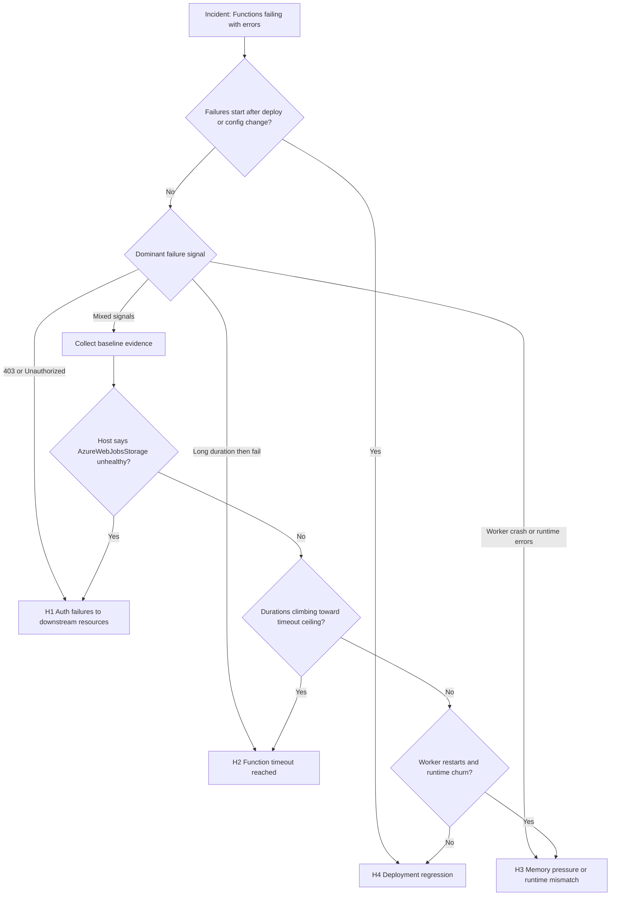

---
content_sources:
  - type: mslearn-adapted
    url: https://learn.microsoft.com/azure/azure-functions/functions-monitoring
  - type: mslearn-adapted
    url: https://learn.microsoft.com/azure/azure-functions/analyze-telemetry-data
  - type: mslearn-adapted
    url: https://learn.microsoft.com/azure/azure-functions/functions-host-json
  - type: mslearn-adapted
    url: https://learn.microsoft.com/azure/role-based-access-control/overview
  - type: mslearn-adapted
    url: https://learn.microsoft.com/azure/data-explorer/kusto/query/
---

# Functions Failing with Errors

## 1. Summary

### Symptom

Function invocations fail repeatedly with `5xx`, listener startup errors, retry storms, or host unhealthy events.

### Troubleshooting decision flow

<!-- diagram-id: troubleshooting-decision-flow -->


## 2. Common Misreadings

- "Retry more" when failures are deterministic (`403`, permission mismatch, startup listener failure).
- "Host unhealthy means platform outage" when host message explicitly identifies storage authorization.
- "Queue backlog means scale only" while listeners are failing to start.
- "Exception count equals failed invocation count" although one invocation can emit wrapper + inner exceptions.

## 3. Competing Hypotheses

### H1: Auth failures to downstream resources

- Managed identity role removed or assigned at wrong scope.
- Secret/connection setting drift causes forbidden or unauthorized calls.
- Storage authorization failure blocks listener startup and cascades failures.

### H2: Function timeout reached

- Invocation durations rise until `functionTimeout` threshold is exceeded.
- Dependency latency + retries consume the full execution budget.
- Queue trigger throughput drops while failed execution duration approaches timeout ceiling.

### H3: Memory pressure or runtime mismatch

- Worker restarts/crashes under load (`code 137`, out-of-memory patterns).
- Runtime stack mismatch after release (language version, extensions, native dependencies).
- Startup appears healthy, then workers terminate during processing.

### H4: Deployment regression

- New artifact introduces deterministic exception path.
- Deployment changed app settings, binding behavior, or extension compatibility.
- Failure slope changes sharply at release time.

## 4. What to Check First

### First-pass checks

1. Top exception type and message trend in the incident window.
2. Per-function failure rate and failed invocation duration distribution.
3. Host traces for listener startup and storage health diagnostics.
4. Deployment/config/identity changes around onset time.

### Portal checks

- **Application Insights -> Failures -> Exception types**: identify dominant error family.
- **Application Insights -> Failures -> Samples**: review `outerMessage`, stack trace, operation correlation.
- **Function App -> Configuration**: inspect identity, app settings, runtime version, and drift.
- **Activity Log**: correlate deployment and configuration operations with failure onset.

### CLI quick checks

```bash
az account show --subscription "$SUBSCRIPTION_ID" --output table
az functionapp show --resource-group "$RG" --name "$APP_NAME" --output table
az functionapp config show --resource-group "$RG" --name "$APP_NAME" --output json
az functionapp identity show --resource-group "$RG" --name "$APP_NAME" --output json
```

## 5. Evidence to Collect

### Required evidence set

- UTC timeline: `start`, `peak`, `mitigation`, `recovery`.
- Top exception clusters (`type`, `outerMessage`, count).
- Function-level success/failure and latency profile.
- Host storage/listener health messages.
- Deployment and configuration activity timeline.

### Sample Log Patterns

```text
# Abnormal: managed identity RBAC failure pattern (real-world style)
[2026-04-04T12:15:42Z] The listener for function 'Functions.scheduled_cleanup' was unable to start.
[2026-04-04T12:17:54Z] Storage operation failed: Status: 403 (AuthorizationPermissionMismatch)
[2026-04-04T12:22:42Z] Process reporting unhealthy: azure.functions.webjobs.storage: Unhealthy
[2026-04-04T12:22:42Z] description="Unable to access AzureWebJobsStorage" errorCode="AuthorizationPermissionMismatch"

# Abnormal: timeout pattern
[2026-04-04T12:31:04Z] Function 'Functions.QueueProcessor' timed out after 00:05:00.
[2026-04-04T12:31:04Z] Microsoft.Azure.WebJobs.Host.FunctionTimeoutException: Timeout value of 00:05:00 exceeded.

# Abnormal: runtime crash pattern
[2026-04-04T12:40:10Z] Worker process started and initialized.
[2026-04-04T12:40:14Z] Worker process exited with code 137.

# Normal: transient error recovered by retry
[2026-04-04T12:50:07Z] Dependency timeout on attempt 1.
[2026-04-04T12:50:09Z] Retry succeeded on attempt 2.
```

!!! tip "How to Read This"
    Repeating `AuthorizationPermissionMismatch` with listener startup failure is deterministic authorization breakage, not transient dependency noise.

### KQL Queries with Example Output

#### Query 1: Function execution summary (success/failure/duration)

```kusto
let appName = "func-myapp-prod";
requests
| where timestamp > ago(1h)
| where cloud_RoleName =~ appName
| where operation_Name startswith "Functions."
| summarize
    Invocations = count(),
    Failures = countif(success == false),
    FailureRatePercent = round(100.0 * countif(success == false) / count(), 2),
    P95Ms = percentile(duration, 95)
  by FunctionName = operation_Name
| order by Failures desc, P95Ms desc
```

**Example Output**

| FunctionName | Invocations | Failures | FailureRatePercent | P95Ms |
|---|---:|---:|---:|---:|
| Functions.ErrorHandler | 15 | 15 | 100.00 | 13730 |
| Functions.scheduled_cleanup | 10 | 10 | 100.00 | 9800 |
| Functions.HttpTrigger | 50 | 1 | 2.00 | 1729 |

#### Query 2: Failed invocations with error details

```kusto
let appName = "func-myapp-prod";
requests
| where timestamp > ago(2h)
| where cloud_RoleName =~ appName
| where operation_Name startswith "Functions."
| where success == false
| project timestamp, operation_Id, FunctionName = operation_Name, resultCode, duration
| join kind=leftouter (
    exceptions
    | where timestamp > ago(2h)
    | where cloud_RoleName =~ appName
    | project operation_Id, ExceptionType = type, ExceptionMessage = outerMessage
) on operation_Id
| order by timestamp desc
```

**Example Output**

| timestamp | operation_Id | FunctionName | resultCode | duration | ExceptionType | ExceptionMessage |
|---|---|---|---:|---:|---|---|
| 2026-04-04T12:17:54Z | xxxxxxxx-xxxx-xxxx-xxxx-xxxxxxxxxxxx | Functions.scheduled_cleanup | 500 | 8023 | System.UnauthorizedAccessException | Storage operation failed: Status: 403 (AuthorizationPermissionMismatch) |
| 2026-04-04T12:17:42Z | xxxxxxxx-xxxx-xxxx-xxxx-xxxxxxxxxxxx | Functions.scheduled_cleanup | 500 | 7988 | Microsoft.Azure.WebJobs.Host.Listeners.FunctionListenerException | The listener for function 'Functions.scheduled_cleanup' was unable to start. |

#### Query 3: Exception trends

```kusto
let appName = "func-myapp-prod";
exceptions
| where timestamp > ago(24h)
| where cloud_RoleName =~ appName
| summarize Count=count() by bin(timestamp, 15m), type
| order by timestamp desc
```

**Example Output**

| timestamp | type | Count |
|---|---|---:|
| 2026-04-04T12:15:00Z | Microsoft.Azure.WebJobs.Host.Listeners.FunctionListenerException | 18 |
| 2026-04-04T12:15:00Z | System.UnauthorizedAccessException | 18 |
| 2026-04-04T12:00:00Z | Microsoft.Azure.WebJobs.Script.Workers.Rpc.RpcException | 3 |

!!! tip "How to Read This"
    Abrupt multi-bin dominance by one exception type indicates a regression window, not random transient activity.

### CLI Investigation Commands

```bash
az monitor log-analytics query --workspace "$WORKSPACE_ID" --analytics-query "exceptions | where timestamp > ago(1h) | where cloud_RoleName =~ '$APP_NAME' | summarize count() by type, outerMessage | order by count_ desc" --output table
az monitor log-analytics query --workspace "$WORKSPACE_ID" --analytics-query "traces | where timestamp > ago(1h) | where cloud_RoleName =~ '$APP_NAME' | where message has_any ('unhealthy','Unable to access AzureWebJobsStorage','AuthorizationPermissionMismatch') | project timestamp, severityLevel, message | order by timestamp desc" --output table
# Note: If the storage account is in a different resource group, adjust $RG accordingly
STORAGE_ID=$(az storage account show --resource-group "$RG" --name "$STORAGE_NAME" --query id --output tsv)
az role assignment list --scope "$STORAGE_ID" --query "[?principalId=='<principal-id>'].{role:roleDefinitionName, scope:scope}" --output table
az monitor activity-log list --subscription "$SUBSCRIPTION_ID" --resource-group "$RG" --max-events 50 --output table
```

**Example Output (sanitized)**

```text
$ az monitor log-analytics query --workspace "$WORKSPACE_ID" --analytics-query "exceptions | where timestamp > ago(1h) | where cloud_RoleName =~ '$APP_NAME' | summarize count() by type, outerMessage | order by count_ desc" --output table
type                                                         outerMessage                                                                    count_
-----------------------------------------------------------  ------------------------------------------------------------------------------  ------
System.UnauthorizedAccessException                           Storage operation failed: Status: 403 (AuthorizationPermissionMismatch)         18
Microsoft.Azure.WebJobs.Host.Listeners.FunctionListenerException  The listener for function 'Functions.scheduled_cleanup' was unable to start.  18

$ STORAGE_ID=$(az storage account show --resource-group "$RG" --name "$STORAGE_NAME" --query id --output tsv)
$ az role assignment list --scope "$STORAGE_ID" --query "[?principalId=='<principal-id>'].{role:roleDefinitionName, scope:scope}" --output table
Role                              Scope
--------------------------------  -------------------------------------------------------------------------------------------------------------
Storage Blob Data Contributor     /subscriptions/<subscription-id>/resourceGroups/rg-app-prod/providers/Microsoft.Storage/storageAccounts/stfuncprod
```

## 6. Validation and Disproof by Hypothesis

### H1: Auth failures to downstream resources

- **Signals that support**
    - `403`, `UnauthorizedAccessException`, or `AuthorizationPermissionMismatch` dominates.
    - Listener startup failures mention storage access.
    - Host unhealthy traces reference `AzureWebJobsStorage` authorization.
- **Signals that weaken**
    - Errors are primarily timeout or worker crash without auth wording.
    - Current role assignments and credential versions are validated and unchanged.

**What to verify with INLINE KQL**

```kusto
let appName = "func-myapp-prod";
traces
| where timestamp > ago(2h)
| where cloud_RoleName =~ appName
| where message has_any ("AuthorizationPermissionMismatch", "Unable to access AzureWebJobsStorage", "unhealthy", "Forbidden", "Unauthorized")
| project timestamp, severityLevel, message
| order by timestamp desc
```

**Example Output**

| timestamp | severityLevel | message |
|---|---:|---|
| 2026-04-04T12:22:42Z | 3 | Process reporting unhealthy: azure.functions.webjobs.storage: Unhealthy |
| 2026-04-04T12:22:42Z | 3 | Unable to access AzureWebJobsStorage. Status: 403 (AuthorizationPermissionMismatch) |
| 2026-04-04T12:17:54Z | 3 | Storage operation failed: Status: 403 (AuthorizationPermissionMismatch) |

!!! tip "How to Read This"
    Repeating host-storage authorization messages confirm a deterministic permission break. Retrying only adds load.

**CLI verification**

```bash
az functionapp identity show --resource-group "$RG" --name "$APP_NAME" --output json
PRINCIPAL_ID=$(az functionapp identity show --resource-group "$RG" --name "$APP_NAME" --query principalId --output tsv)
# Note: If the storage account is in a different resource group, adjust $RG accordingly
STORAGE_ID=$(az storage account show --resource-group "$RG" --name "$STORAGE_NAME" --query id --output tsv)
az role assignment list --scope "$STORAGE_ID" --query "[?principalId=='$PRINCIPAL_ID'].{role:roleDefinitionName, scope:scope}" --output table
```

### H2: Function timeout reached

- **Signals that support**
    - Failed invocations cluster near a fixed duration ceiling.
    - Timeout exception messages increase with dependency latency/retry activity.
    - Queue processing delay and retry volume rise together.
- **Signals that weaken**
    - Failures are short and immediate.
    - Timeout exception text is absent.

**What to verify with INLINE KQL**

```kusto
let appName = "func-myapp-prod";
requests
| where timestamp > ago(2h)
| where cloud_RoleName =~ appName
| where operation_Name startswith "Functions."
| summarize
    Invocations = count(),
    Failures = countif(success == false),
    P95Ms = percentile(duration, 95),
    MaxMs = max(duration)
  by bin(timestamp, 10m), FunctionName = operation_Name
| order by timestamp desc
```

**Example Output**

| timestamp | FunctionName | Invocations | Failures | P95Ms | MaxMs |
|---|---|---:|---:|---:|---:|
| 2026-04-04T12:30:00Z | Functions.QueueProcessor | 120 | 37 | 294000 | 300000 |
| 2026-04-04T12:20:00Z | Functions.QueueProcessor | 118 | 11 | 220000 | 300000 |
| 2026-04-04T12:10:00Z | Functions.QueueProcessor | 110 | 2 | 64000 | 98000 |

!!! tip "How to Read This"
    Rising duration bins followed by failures near one ceiling strongly indicate timeout budget exhaustion.

**CLI verification**

```bash
az functionapp config appsettings list --resource-group "$RG" --name "$APP_NAME" --output table
az functionapp config show --resource-group "$RG" --name "$APP_NAME" --output json
az monitor log-analytics query --workspace "$WORKSPACE_ID" --analytics-query "exceptions | where timestamp > ago(2h) | where cloud_RoleName =~ '$APP_NAME' | where outerMessage has_any ('timed out','FunctionTimeoutException') | summarize count() by type, outerMessage" --output table
```

### H3: Memory pressure or runtime mismatch

- **Signals that support**
    - Worker start/exit churn increases.
    - Failures start after runtime stack or package update.
    - Crash/exit patterns correlate with invocation errors.
- **Signals that weaken**
    - Runtime unchanged and worker lifecycle stable.
    - Error mix is dominated by auth/forbidden signals.

**What to verify with INLINE KQL**

```kusto
let appName = "func-myapp-prod";
traces
| where timestamp > ago(6h)
| where cloud_RoleName =~ appName
| where message has_any ("Worker process started", "Worker process exited", "out of memory", "Host started", "Starting Host")
| summarize Events=count() by bin(timestamp, 15m), message
| order by timestamp desc
```

**Example Output**

| timestamp | message | Events |
|---|---|---:|
| 2026-04-04T12:45:00Z | Worker process exited with code 137 | 6 |
| 2026-04-04T12:45:00Z | Worker process started and initialized. | 6 |
| 2026-04-04T12:30:00Z | Host started (75ms) | 1 |

!!! tip "How to Read This"
    Frequent start-exit cycles over short bins indicate unstable runtime behavior and likely memory or compatibility problems.

**CLI verification**

```bash
az functionapp config show --resource-group "$RG" --name "$APP_NAME" --query "linuxFxVersion" --output tsv
az functionapp config appsettings list --resource-group "$RG" --name "$APP_NAME" --output table
az functionapp log deployment show --resource-group "$RG" --name "$APP_NAME"
```

### H4: Deployment regression

- **Signals that support**
    - Exception and failure rates jump immediately after deployment.
    - New dominant exception type appears in same release window.
    - Rollback lowers failure rate.
- **Signals that weaken**
    - Failure trend predates deployment.
    - No change in release artifact or app configuration.

**What to verify with INLINE KQL**

```kusto
let appName = "func-myapp-prod";
let timeGrain = 1h;
let exceptionTrend = exceptions
| where timestamp > ago(24h)
| where cloud_RoleName =~ appName
| summarize ExceptionCount=count() by bin(timestamp, timeGrain), type;
let requestFailureTrend = requests
| where timestamp > ago(24h)
| where cloud_RoleName =~ appName
| where operation_Name startswith "Functions."
| where success == false
| summarize FailedRequests=count() by bin(timestamp, timeGrain), operation_Name;
exceptionTrend
| join kind=inner requestFailureTrend on timestamp
| project timestamp, operation_Name, type, ExceptionCount, FailedRequests
| order by timestamp desc
```

**Example Output**

| timestamp | operation_Name | type | ExceptionCount | FailedRequests |
|---|---|---|---:|---:|
| 2026-04-04T12:00:00Z | Functions.ErrorHandler | Microsoft.Azure.WebJobs.Script.Workers.Rpc.RpcException | 2 | 1 |
| 2026-04-04T11:00:00Z | Functions.ErrorHandler | Microsoft.Azure.WebJobs.Script.Workers.Rpc.RpcException | 32 | 15 |

!!! tip "How to Read This"
    Hard step-change at release time across exceptions and request failures is strong regression evidence.

**CLI verification**

```bash
az functionapp deployment source show --resource-group "$RG" --name "$APP_NAME" --output json
az functionapp deployment list-publishing-profiles --resource-group "$RG" --name "$APP_NAME" --output table
az monitor activity-log list --subscription "$SUBSCRIPTION_ID" --resource-group "$RG" --max-events 50 --output table
```

### Normal vs Abnormal Comparison

| Signal | Normal | Abnormal | Interpretation |
|---|---|---|---|
| Exception cadence | Sporadic and mixed | Sustained dominance by one type | Deterministic issue likely |
| Host storage health | Healthy or brief transient warning | Repeated `AuthorizationPermissionMismatch` | RBAC/scope break likely |
| Failure onset timing | No release coupling | Sharp increase after deploy/config change | Regression or drift likely |
| Failed duration profile | Mostly short with noise | Clusters near timeout ceiling | Timeout budget exhaustion |
| Worker lifecycle | Infrequent restarts | Frequent start-exit cycles | Memory/runtime mismatch likely |

## 7. Likely Root Cause Patterns

- **Pattern A: Managed identity scope error**
    - Identity exists but lacks required data-plane role at target resource scope.
    - Listener startup and storage-backed functions fail first.
- **Pattern B: Timeout budget overrun**
    - Retry amplification and dependency latency push invocations beyond `functionTimeout`.
- **Pattern C: Runtime drift after deployment**
    - Updated runtime/dependency set creates worker instability.
- **Pattern D: Deterministic code-path regression**
    - New release introduces repeatable failure under common traffic path.

## 8. Immediate Mitigations

- Restore least-privilege RBAC required for failing dependency access.
- Roll back to last known good artifact if deployment regression is strongly indicated.
- Temporarily reduce concurrency pressure by isolating non-critical triggers.
- Adjust timeout only as short-term stabilization with explicit rollback plan.
- Communicate deterministic vs transient classification to prevent ineffective retry storms.

### Example mitigation commands

```bash
az role assignment create --assignee-object-id "<principal-id>" --role "Storage Blob Data Contributor" --scope "/subscriptions/$SUBSCRIPTION_ID/resourceGroups/$RG/providers/Microsoft.Storage/storageAccounts/<storage-account-name>"
az role assignment create --assignee-object-id "<principal-id>" --role "Storage Queue Data Contributor" --scope "/subscriptions/$SUBSCRIPTION_ID/resourceGroups/$RG/providers/Microsoft.Storage/storageAccounts/<storage-account-name>"
az functionapp restart --resource-group "$RG" --name "$APP_NAME"
```

!!! warning "Mitigation discipline"
    Change one variable at a time, then re-check failure rate and dominant exception type before applying the next action.

## 9. Prevention

- Add pre-deploy RBAC validation for all managed identity dependencies.
- Enforce config/runtime drift detection in CI/CD before promotion.
- Alert on sustained `FailureRatePercent`, dominant exception share, and host unhealthy storage signals.
- Load-test timeout budgets with realistic dependency latency and retry behavior.
- Require release guardrails: staged rollout, health gates, and rollback criteria.

### Operational checklist

1. Identity roles validated at exact resource scope.
2. Timeout budgets reviewed against SLA and trigger behavior.
3. Runtime version pinning and extension compatibility verified.
4. Incident workbook contains H1-H4 query panels.

### Related Labs

- [Managed Identity Authentication Lab](../lab-guides/managed-identity-auth.md)
- [Storage Access Failure Lab](../lab-guides/storage-access-failure.md)

## See Also

- [Troubleshooting Methodology](../methodology.md)
- [First 10 Minutes](../first-10-minutes.md)
- [KQL Query Library](../kql.md)
- [Troubleshooting Evidence Map](../evidence-map.md)
- [Troubleshooting Architecture](../architecture.md)

## Sources

- [Monitor Azure Functions](https://learn.microsoft.com/azure/azure-functions/functions-monitoring)
- [Investigate Azure Functions errors with Application Insights](https://learn.microsoft.com/azure/azure-functions/analyze-telemetry-data)
- [Azure Functions host.json reference](https://learn.microsoft.com/azure/azure-functions/functions-host-json)
- [Azure RBAC documentation](https://learn.microsoft.com/azure/role-based-access-control/overview)
- [Kusto Query Language overview](https://learn.microsoft.com/azure/data-explorer/kusto/query/)
