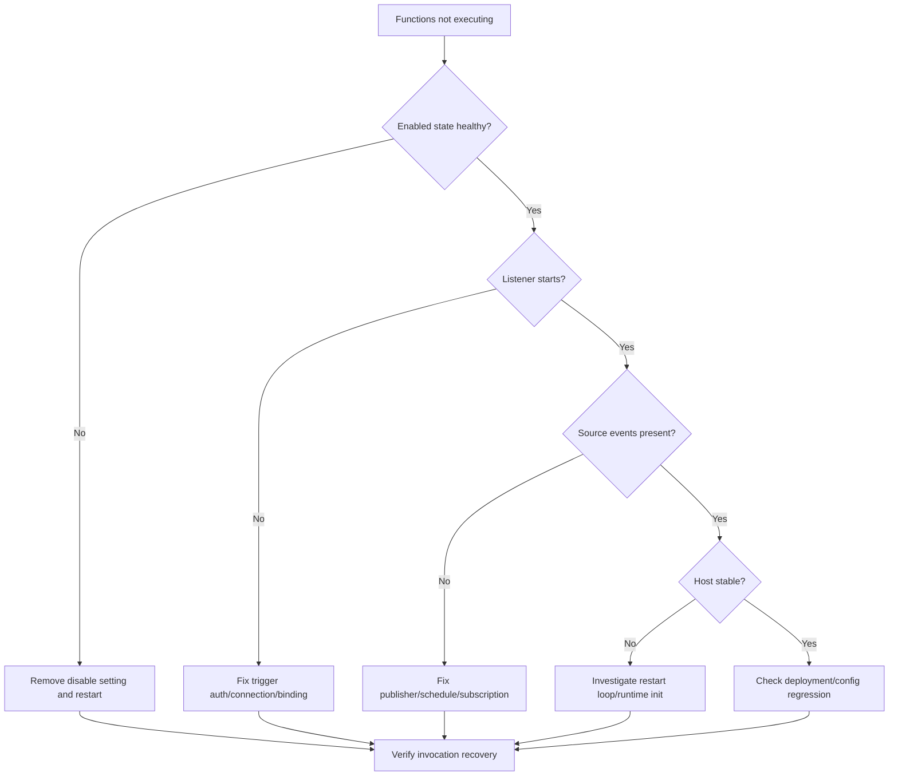

---
content_sources:
  - type: mslearn-adapted
    url: https://learn.microsoft.com/azure/azure-functions/functions-monitoring
  - type: mslearn-adapted
    url: https://learn.microsoft.com/azure/azure-functions/analyze-telemetry-data
  - type: mslearn-adapted
    url: https://learn.microsoft.com/azure/azure-functions/functions-triggers-bindings
  - type: mslearn-adapted
    url: https://learn.microsoft.com/azure/data-explorer/kusto/query/
  - type: mslearn-adapted
    url: https://learn.microsoft.com/azure/azure-monitor/app/data-model-complete
---

# Functions Not Executing
## 1. Summary
Use this playbook when trigger sources are active but one or more Azure Functions are not executing.
Most incidents fall into one of six hypotheses: disabled function, listener startup failure, host restart loop, trigger misbinding, source-side delivery gap, or deployment/runtime regression.
Primary objective: restore safe execution quickly while collecting enough evidence to prevent recurrence.
### Decision Flow
<!-- diagram-id: decision-flow -->

### Severity guidance
| Condition | Severity | Action priority |
|---|---|---|
| Critical business trigger halted | SEV-1 | Immediate mitigation + incident commander |
| Non-critical batch trigger halted | SEV-2 | Restore within current shift |
| Low-impact maintenance trigger halted | SEV-3 | Restore in planned response window |
### Signal snapshot
| Signal | Normal | Incident |
|---|---|---|
| Invocations | Correlate with source events | Near zero on impacted function |
| Listener traces | `Listener started` appears | `unable to start` or missing listener trace |
| Function state | Enabled | Disabled via metadata/app setting |
| Host lifecycle | Stable startup cadence | Frequent restart cycling |

## 2. Common Misreadings
| Misreading | Why incorrect | Correct interpretation |
|---|---|---|
| "App is healthy, so function must run." | App up does not guarantee listener up | Validate listener startup traces |
| "No exceptions means no issue." | Listener failures may exist only in `traces` | Query host/lifecycle logs first |
| "Scale out first." | Scaling does not fix disabled or broken config | Verify control-plane and trigger path |
| "Queue quiet means no work." | Source visibility can lag or be partial | Correlate source metrics and invocations |
| "Always code bug." | Config/RBAC drift often causes this pattern | Validate settings and permissions before rollback |

## 3. Competing Hypotheses
| ID | Hypothesis | Confirming signal | Disproving signal |
|---|---|---|---|
| H1 | Function disabled by setting | `IsDisabled=true` or disable trace | Enabled and no disable trace |
| H2 | Listener startup failure (auth/connection) | `listener ... unable to start` | Listener stable after restart |
| H3 | Host restart loop | Dense start/shutdown timeline | Low restart count and stable host |
| H4 | Binding/extension mismatch | Indexing/binding errors at startup | Clean indexing and active listener |
| H5 | Source not delivering events | No source-side activity | Source active while invocations zero |
| H6 | Deployment/runtime regression | Onset after release/config change | No temporal correlation |

## 4. What to Check First
1. Confirm target function is enabled.
2. Confirm listener startup traces exist after latest host start.
3. Confirm source activity exists in same interval.
4. Confirm host is not cycling.
### Quick portal checks
- Function App -> Functions -> target function: Enabled is `On`.
- Function App -> Monitor: invocation line not flat while source is active.
- Application Insights -> Logs: listener startup and host lifecycle traces present.
### Quick CLI checks
```bash
az functionapp function list --name "$APP_NAME" --resource-group "$RG" --output table
az functionapp config appsettings list --name "$APP_NAME" --resource-group "$RG" --output table
az monitor log-analytics query --workspace "$WORKSPACE_ID" --analytics-query "traces | where timestamp > ago(30m) | where cloud_RoleName =~ '$APP_NAME' | where message has_any ('disabled','listener','Host started','unable to start') | project timestamp, severityLevel, message | order by timestamp desc" --output table
```
### Example output
```text
Name             Trigger    IsDisabled
---------------  ---------  ----------
QueueProcessor   queue      true
health           http       false

Name                                              Value
------------------------------------------------  ----------------------------------------------------------------
AzureWebJobs.QueueProcessor.Disabled              true
AzureWebJobsStorage                               DefaultEndpointsProtocol=https;AccountName=***;AccountKey=***

timestamp                    severityLevel  message
---------------------------  -------------  ---------------------------------------------------------------------------------
2026-04-04T12:22:53.000000Z  3              Process reporting unhealthy: azure.functions.webjobs.storage: Unhealthy (AuthorizationPermissionMismatch)
2026-04-04T12:16:06.000000Z  2              The listener for function 'Functions.scheduled_cleanup' was unable to start.
2026-04-04T12:15:42.000000Z  2              Function 'QueueProcessor' is disabled via app setting 'AzureWebJobs.QueueProcessor.Disabled'.
```

## 5. Evidence to Collect
Collect all artifacts from one bounded time range (`ago(30m)` for triage, `ago(2h)` for verification).
### Minimum evidence pack
| Artifact | Required capture | Purpose |
|---|---|---|
| Function list | CLI table output | Confirm enabled state/trigger type |
| App settings | CLI table output | Find disable and connection issues |
| Listener/host traces | KQL results | Validate startup path |
| Invocation summary | KQL results | Confirm blast radius |
| Source activity | Metrics or producer evidence | Separate source outage from execution outage |
| Change timeline | Deploy/config timestamps | Validate regression hypothesis |
### Sample Log Patterns
```text
# Abnormal: Function disabled
[2024-01-15T10:30:00Z] Function 'QueueProcessor' is disabled via app setting 'AzureWebJobs.QueueProcessor.Disabled'
# Abnormal: Listener startup failure
[2024-01-15T10:30:05Z] Listener for 'QueueTrigger' was unable to start. Microsoft.WindowsAzure.Storage: Connection refused.
# Normal: Healthy listener
[2024-01-15T10:30:00Z] Listener started for function 'QueueProcessor'
[2024-01-15T10:30:00Z] Host started (234ms)
# Real-world: Listener failure from RBAC permission removal (FC1, 2026-04-04)
[2026-04-04T12:15:42Z] The listener for function 'Functions.scheduled_cleanup' was unable to start.
[2026-04-04T12:16:06Z] The listener for function 'Functions.scheduled_cleanup' was unable to start.
[2026-04-04T12:22:53Z] Process reporting unhealthy: azure.functions.webjobs.storage: Unhealthy (AuthorizationPermissionMismatch)
```
### KQL Queries with Example Output
#### Query 1: Function execution summary
```kusto
let appName = "$APP_NAME";
requests
| where timestamp > ago(1h)
| where cloud_RoleName =~ appName
| where operation_Name startswith "Functions."
| summarize
    Invocations = count(),
    Failures = countif(success == false),
    FailureRatePercent = round(100.0 * countif(success == false) / count(), 2),
    P95Ms = percentile(duration, 95)
  by FunctionName = operation_Name
| order by Failures desc, P95Ms desc
```
| FunctionName | Invocations | Failures | FailureRatePercent | P95Ms |
|---|---|---|---|---|
| Functions.health | 50 | 0 | 0.00 | 140 |
| Functions.unhandled_error | 15 | 15 | 100.00 | 410 |
!!! tip "How to Read This"
    A function that is absent from this table while others appear means it received zero invocations — indicating a trigger-path failure, not an app-wide outage.
#### Query 2: Failed invocations with error details
```kusto
let appName = "$APP_NAME";
requests
| where timestamp > ago(2h)
| where cloud_RoleName =~ appName
| where operation_Name startswith "Functions."
| where success == false
| project timestamp, operation_Id, FunctionName = operation_Name, resultCode, duration
| join kind=leftouter (
    exceptions
    | where timestamp > ago(2h)
    | where cloud_RoleName =~ appName
    | project operation_Id, ExceptionType = type, ExceptionMessage = outerMessage
) on operation_Id
| order by timestamp desc
```
| timestamp | operation_Id | FunctionName | resultCode | duration | ExceptionType | ExceptionMessage |
|---|---|---|---|---|---|---|
| 2026-04-04T11:33:00Z | xxxxxxxx-xxxx-xxxx-xxxx-xxxxxxxxxxxx | Functions.ErrorHandler | 500 | 13.092 | Microsoft.Azure.WebJobs.Script.Workers.Rpc.RpcException | Exception while executing function: Functions.ErrorHandler |
| 2026-04-04T11:32:45Z | xxxxxxxx-xxxx-xxxx-xxxx-xxxxxxxxxxxx | Functions.ErrorHandler | 500 | 13.092 | Microsoft.Azure.WebJobs.Script.Workers.Rpc.RpcException | Exception while executing function: Functions.ErrorHandler |
!!! tip "How to Read This"
    Use this to separate true execution failures from non-execution incidents. If this table is empty while source is active, focus on listener/state hypotheses.
#### Query 8: Host startup/shutdown events
```kusto
let appName = "$APP_NAME";
traces
| where timestamp > ago(12h)
| where cloud_RoleName =~ appName
| where message has_any ("Host started", "Job host started", "Host shutdown", "Host is shutting down", "Stopping JobHost", "Host lock lease")
| project timestamp, severityLevel, message
| order by timestamp desc
```
| timestamp | severityLevel | message |
|---|---|---|
| 2026-04-04T11:36:20Z | 1 | Host lock lease acquired by instance ID 'xxxxxxxxxxxxxxxxxxxxxxxxxxxxxxxx' |
| 2026-04-04T11:32:30Z | 1 | Host started (64ms) |
| 2026-04-04T11:32:30Z | 1 | Job host started |
| 2026-04-04T11:32:30Z | 1 | Starting Host (HostId=func-myapp-prod, Version=4.1047.100.26071, InstanceId=xxxxxxxx-xxxx-xxxx-xxxx-xxxxxxxxxxxx) |
!!! tip "How to Read This"
    Repeated startup/shutdown in short intervals weakens listener stability and often explains zero-invocation windows.
### CLI Investigation Commands
```bash
# Function inventory and state
az functionapp function list --name "$APP_NAME" --resource-group "$RG" --output table
# App settings for disable and connection values
az functionapp config appsettings list --name "$APP_NAME" --resource-group "$RG" --output table
# Listener and startup trace scan
az monitor log-analytics query --workspace "$WORKSPACE_ID" --analytics-query "traces | where timestamp > ago(30m) | where cloud_RoleName =~ '$APP_NAME' | where message has_any ('disabled','listener','Host started','unable to start') | project timestamp, message | order by timestamp desc" --output table
# Runtime configuration
az functionapp config show --name "$APP_NAME" --resource-group "$RG" --output json
# Source activity sample (Storage)
az monitor metrics list --resource "/subscriptions/$SUBSCRIPTION_ID/resourceGroups/$RG/providers/Microsoft.Storage/storageAccounts/<storage-account-name>" --metric "Transactions" --interval PT5M --aggregation Total --output table
```
Example command output:
```text
Name                                     Value
---------------------------------------  --------------------------------------------------------------
FUNCTIONS_EXTENSION_VERSION              ~4
FUNCTIONS_WORKER_RUNTIME                 python
AzureWebJobs.QueueProcessor.Disabled     true
QueueConnection                          DefaultEndpointsProtocol=https;AccountName=***;AccountKey=***

timestamp                    message
---------------------------  --------------------------------------------------------------------------------
2026-04-04T12:16:06.000000Z  The listener for function 'Functions.QueueProcessor' was unable to start.
2026-04-04T12:15:42.000000Z  Function 'QueueProcessor' is disabled via app setting 'AzureWebJobs.QueueProcessor.Disabled'.
```
### Normal vs Abnormal Comparison
| Dimension | Normal | Abnormal | Meaning |
|---|---|---|---|
| Function state | Enabled | Disabled | Trigger never starts |
| Listener startup | `Listener started` present | `unable to start` or absent | Trigger path broken |
| Host lifecycle | Stable start pattern | Frequent restart cycling | Runtime instability/regression |
| Source vs invocations | Correlated | Source active but invocations zero | Non-execution incident confirmed |
| Error concentration | Sparse mixed noise | Repeated same auth/config error | Deterministic failure mode |

## 6. Validation and Disproof by Hypothesis
### H1: Function disabled via app setting
**Signals that support**
- `IsDisabled=true` in function list.
- `AzureWebJobs.<FunctionName>.Disabled=true` exists in settings.
- Trace contains explicit disable message.
**Signals that weaken**
- Enabled state and no disable setting.
- Listener starts and function executes in same interval.
**What to verify**
```bash
az functionapp function list --name "$APP_NAME" --resource-group "$RG" --output table
az functionapp config appsettings list --name "$APP_NAME" --resource-group "$RG" --output table
```
```kusto
let appName = "$APP_NAME";
traces
| where timestamp > ago(2h)
| where cloud_RoleName =~ appName
| where message has "is disabled via app setting"
| project timestamp, message
| order by timestamp desc
```
Example output:
| timestamp | message |
|---|---|
| 2026-04-04T12:15:42Z | Function 'QueueProcessor' is disabled via app setting 'AzureWebJobs.QueueProcessor.Disabled'. |
Disproof condition:
- No disable setting and no disable trace in incident window.

### H2: Listener startup failure due to auth/connection
**Signals that support**
- Repeating `listener ... unable to start` trace lines.
- `AuthorizationPermissionMismatch`, DNS, or connection-refused patterns.
- Source events present while invocations remain zero.
**Signals that weaken**
- Listener starts cleanly after restart and remains stable.
- Test event processes successfully.
**What to verify**
```kusto
let appName = "$APP_NAME";
traces
| where timestamp > ago(2h)
| where cloud_RoleName =~ appName
| where message has_any ("listener", "unable to start", "AuthorizationPermissionMismatch", "Connection refused")
| project timestamp, severityLevel, message
| order by timestamp desc
```
```bash
az functionapp config appsettings list --name "$APP_NAME" --resource-group "$RG" --output table
```
Example output:
| timestamp | severityLevel | message |
|---|---|---|
| 2026-04-04T12:22:53Z | 3 | Process reporting unhealthy: azure.functions.webjobs.storage: Unhealthy (AuthorizationPermissionMismatch) |
| 2026-04-04T12:16:06Z | 2 | The listener for function 'Functions.QueueProcessor' was unable to start. |
Disproof condition:
- Startup traces show healthy listener with no recurring auth/connectivity errors.

### H3: Host restart loop suppresses execution
**Signals that support**
- Frequent host start/shutdown within short intervals.
- Startup spikes without matching invocation recovery.
**Signals that weaken**
- Host remains stable through incident window.
- Restart frequency aligns with normal plan behavior only.
**What to verify**
```kusto
let appName = "$APP_NAME";
traces
| where timestamp > ago(12h)
| where cloud_RoleName =~ appName
| where message has_any ("Host started", "Host is shutting down", "Stopping JobHost")
| summarize Starts=countif(message has "Host started"), Stops=countif(message has "shutting down" or message has "Stopping JobHost") by bin(timestamp, 1h)
| order by timestamp desc
```
```bash
az monitor log-analytics query --workspace "$WORKSPACE_ID" --analytics-query "traces | where timestamp > ago(2h) | where cloud_RoleName =~ '$APP_NAME' | where message has_any ('Host started','Host is shutting down') | project timestamp, message | order by timestamp desc" --output table
```
Example output:
| timestamp | Starts | Stops |
|---|---|---|
| 2026-04-04T12:00:00Z | 9 | 8 |
| 2026-04-04T11:00:00Z | 2 | 1 |
Disproof condition:
- Restart count is low and steady; no cycle evidence.

### H4: Trigger misbinding or extension mismatch
**Signals that support**
- `Error indexing method`, `Cannot bind`, or extension startup errors.
- Missing or wrong connection setting names.
**Signals that weaken**
- Clean indexing and expected binding initialization.
- Required settings present and valid.
**What to verify**
```kusto
let appName = "$APP_NAME";
traces
| where timestamp > ago(2h)
| where cloud_RoleName =~ appName
| where message has_any ("Error indexing method", "Cannot bind", "binding", "extension")
| project timestamp, message
| order by timestamp desc
```
```bash
az functionapp config show --name "$APP_NAME" --resource-group "$RG" --output table
az functionapp config appsettings list --name "$APP_NAME" --resource-group "$RG" --output table
```
Example output:
| timestamp | message |
|---|---|
| 2026-04-04T12:11:27Z | Error indexing method 'Functions.QueueProcessor'. Cannot bind parameter 'msg' to type ... |
Disproof condition:
- No binding/indexing failures and listener healthy.

### H5: Source-side delivery gap
**Signals that support**
- Source metrics show no incoming events.
- Producer/scheduler logs indicate halted publishing.
**Signals that weaken**
- Source metrics rise during zero-invocation period.
- Backlog increases while listener is unhealthy.
**What to verify**
```kusto
let appName = "$APP_NAME";
requests
| where timestamp > ago(1h)
| where cloud_RoleName =~ appName
| where operation_Name startswith "Functions."
| summarize Invocations=count() by FunctionName=operation_Name, bin(timestamp, 15m)
| order by timestamp desc
```
```bash
az monitor metrics list --resource "/subscriptions/$SUBSCRIPTION_ID/resourceGroups/$RG/providers/Microsoft.Storage/storageAccounts/<storage-account-name>" --metric "Transactions" --interval PT5M --aggregation Total --output table
```
Example output:
| timestamp | FunctionName | Invocations |
|---|---|---|
| 2026-04-04T12:15:00Z | Functions.health | 22 |
Disproof condition:
- Source activity confirmed while target function remains non-executing.

### H6: Deployment/runtime regression
**Signals that support**
- Incident starts immediately after deployment/config rollout.
- Startup traces show worker initialization failures.
- Rollback restores execution.
**Signals that weaken**
- No recent change event.
- Same artifact healthy in equivalent environment.
**What to verify**
```bash
az monitor log-analytics query --workspace "$WORKSPACE_ID" --analytics-query "traces | where timestamp > ago(2h) | where cloud_RoleName =~ '$APP_NAME' | where message has_any ('Worker process started and initialized','Failed to start language worker process','did not find functions with language','Host started') | project timestamp, message | order by timestamp desc" --output table
az functionapp config show --name "$APP_NAME" --resource-group "$RG" --output json
```
Example output:
```text
timestamp                    message
---------------------------  --------------------------------------------------------------------------------------
2026-04-04T12:30:00.000000Z  Failed to start language worker process for runtime: python.
2026-04-04T12:30:01.000000Z  Host started (64ms)
2026-04-04T12:30:03.000000Z  Host is shutting down.
```
Disproof condition:
- No startup/runtime errors and no timeline correlation.

## 7. Likely Root Cause Patterns
| Pattern | Trigger | Confirming evidence | Typical fix |
|---|---|---|---|
| Disable flag left behind | Maintenance or manual toggle | Disable setting + disable trace | Remove setting and verify |
| Storage/Messaging RBAC drift | Role removed or scope changed | `AuthorizationPermissionMismatch` + listener failure | Restore role assignment |
| Secret/config drift | Rotation mismatch | Connection/auth errors at startup | Update setting and restart |
| Runtime/extension mismatch | Package/runtime change | Binding/indexing errors | Align versions and bindings |
| Host recycle instability | Runtime crash or environment churn | Dense start/shutdown cycles | Stabilize runtime and roll back if needed |
| Upstream publisher outage | Producer stopped | No source-side activity | Restore publisher and replay backlog |
### Related Labs
- [Cold Start Lab](../lab-guides/cold-start.md)
- [Storage Access Failure Lab](../lab-guides/storage-access-failure.md)

## 8. Immediate Mitigations
Apply in order and stop once recovery criteria are met.
1. Remove unintended disable setting(s).
2. Fix trigger connection/auth settings and identity permissions.
3. Restart the Function App to reinitialize listeners.
4. Roll back to last known good artifact when regression is confirmed.
5. Temporarily reduce or pause source publish rate only if downstream risk is growing.
### Mitigation commands
```bash
az functionapp config appsettings delete --name "$APP_NAME" --resource-group "$RG" --setting-names "AzureWebJobs.QueueProcessor.Disabled"
az functionapp config appsettings set --name "$APP_NAME" --resource-group "$RG" --settings "QueueConnection=DefaultEndpointsProtocol=https;AccountName=***;AccountKey=***"
az functionapp restart --name "$APP_NAME" --resource-group "$RG"
```
### Recovery verification
```kusto
let appName = "$APP_NAME";
union isfuzzy=true
(
    traces
    | where timestamp > ago(30m)
    | where cloud_RoleName =~ appName
    | where message has_any ("Listener started", "Host started", "unable to start", "disabled")
    | project timestamp, Kind="trace", Detail=message
),
(
    requests
    | where timestamp > ago(30m)
    | where cloud_RoleName =~ appName
    | where operation_Name startswith "Functions."
    | summarize Invocations=count(), Failures=countif(success == false) by operation_Name
    | project timestamp=now(), Kind="request-summary", Detail=strcat(operation_Name, " invocations=", tostring(Invocations), " failures=", tostring(Failures))
)
| order by timestamp desc
```
Recovery criteria:
- `Listener started` appears with no new `unable to start` entries.
- Target function invocation count rises within expected trigger interval.
- Failures remain below team threshold for 30-60 minutes.

## 9. Prevention
### Configuration guardrails
1. Restrict write access for `AzureWebJobs.*.Disabled` settings.
2. Validate required trigger settings in CI before deployment.
3. Keep connection-setting contracts versioned and reviewed.
### Monitoring guardrails
1. Alert when critical function `Invocations=0` while source activity is non-zero.
2. Alert on repeated listener startup failures in short windows.
3. Alert when host restart frequency exceeds plan baseline.
### Operational guardrails
1. Pair every secret rotation with listener smoke test.
2. Use staged rollout and canary validation for runtime/dependency changes.
3. Run monthly playbook drill for non-executing trigger scenarios.
### Preventive checklist
| Control | Frequency | Owner | Pass condition |
|---|---|---|---|
| Disable-setting audit | Weekly | Platform ops | No unexpected disable flags |
| Trigger smoke test | Weekly | App team | Test event processed end-to-end |
| Host restart trend review | Weekly | SRE | Restart rate within baseline |
| Incident drill | Monthly | Incident commander | End-to-end triage < 15 minutes |

## See Also
- [Troubleshooting Architecture](../architecture.md)
- [First 10 Minutes](../first-10-minutes.md)
- [KQL Query Library](../kql.md)
- [Troubleshooting Methodology](../methodology.md)
- [Troubleshooting Lab Guides](../lab-guides.md)

## Sources
- [Monitor Azure Functions](https://learn.microsoft.com/azure/azure-functions/functions-monitoring)
- [Troubleshoot Azure Functions with Azure Monitor logs](https://learn.microsoft.com/azure/azure-functions/analyze-telemetry-data)
- [Azure Functions trigger and binding concepts](https://learn.microsoft.com/azure/azure-functions/functions-triggers-bindings)
- [Kusto Query Language overview](https://learn.microsoft.com/azure/data-explorer/kusto/query/)
- [Application Insights telemetry data model](https://learn.microsoft.com/azure/azure-monitor/app/data-model-complete)
