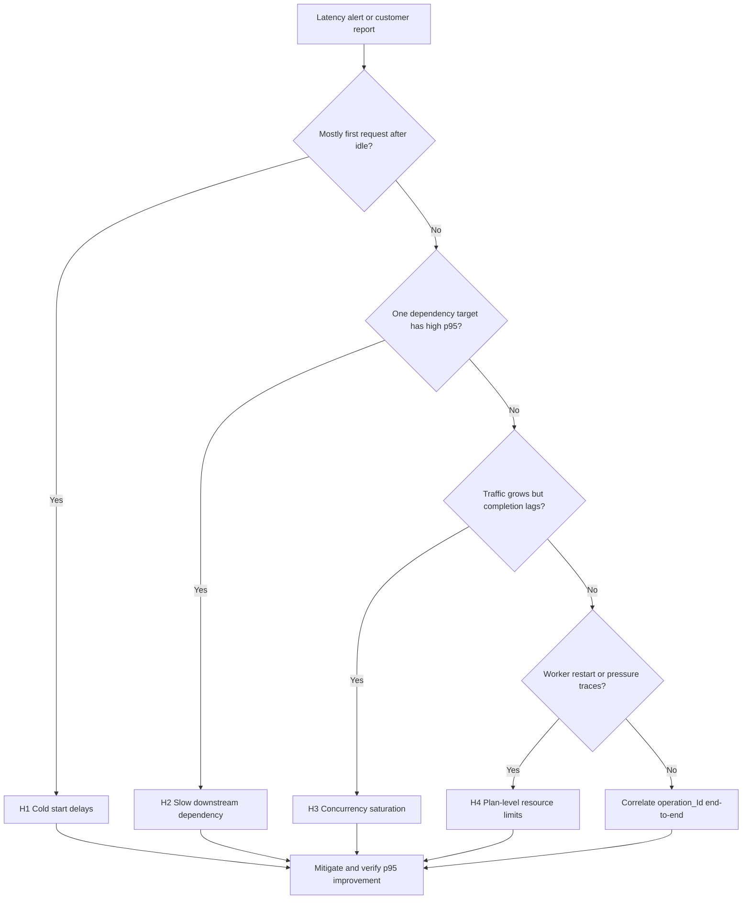

# High Latency / Slow Responses
## 1. Summary
This playbook handles incidents where Azure Functions shows slow responses, elevated p95/p99 latency, and intermittent timeout behavior.
Use it when performance degradation is user-visible, even if failure rate is still low.
### Troubleshooting decision flow

### Scope and severity
| Indicator | Sev 3 | Sev 2 | Sev 1 |
|---|---|---|---|
| HTTP p95 increase vs baseline | < 2x | 2-5x | > 5x |
## 2. Common Misreadings
- Assuming all latency spikes are cold starts without dependency-level evidence.
- Blaming function code before checking whether downstream target p95 dominates duration.
- Running KQL without `cloud_RoleName` filter and mixing unrelated app telemetry.
## 3. Competing Hypotheses
### H1: Cold start delays
- Startup initialization and instance allocation delay first requests after idle or rapid scale-out.
### H2: Slow downstream dependency
- One API/database/storage dependency dominates response time while function code stays stable.
### H3: Concurrency saturation
- In-flight work grows faster than completion throughput, increasing queueing delay and tail latency.
### H4: Plan-level resource limits
- CPU/memory/socket/connection/thread limits cause broad slowness and worker lifecycle churn.
## 4. What to Check First
### First 10-minute checklist
1. Confirm incident window and primary impacted function operation.
2. Compare request p95/p99 trend by function for the same window.
3. Check dependency p95 by `target` to find concentration.
4. Check host startup/scale traces around first latency jump.
5. Check if traffic growth outpaced successful completion.
### Portal checks
- **Application Insights -> Performance -> Operations**: p95/p99 by operation.
- **Application Insights -> Dependencies**: slow targets and failure concentration.
- **Function App -> Diagnose and solve problems**: startup and performance detectors.
### CLI Investigation Commands
```bash
az account set \
  --subscription "$SUBSCRIPTION_ID"
az monitor metrics list \
  --resource "/subscriptions/$SUBSCRIPTION_ID/resourceGroups/$RG/providers/Microsoft.Web/sites/$APP_NAME" \
  --metric "AverageResponseTime" "Requests" "Http5xx" \
  --interval PT1M \
  --aggregation Average Total \
  --offset 2h \
  --output table
az monitor log-analytics query \
  --workspace "$WORKSPACE_ID" \
  --analytics-query "requests | where timestamp > ago(1h) | where cloud_RoleName =~ '$APP_NAME' | summarize P95Ms=percentile(duration,95), Failures=countif(success==false), Invocations=count() by operation_Name | order by P95Ms desc" \
  --output table
az monitor log-analytics query \
  --workspace "$WORKSPACE_ID" \
  --analytics-query "dependencies | where timestamp > ago(1h) | where cloud_RoleName =~ '$APP_NAME' | summarize Calls=count(), Failed=countif(success==false), P95Ms=percentile(duration,95) by target, type | order by P95Ms desc" \
  --output table
```
**Example output:**
```text
MetricName            TimeGrain  Average   Total
--------------------  ---------  --------  ------
AverageResponseTime   PT1M       330       0
AverageResponseTime   PT1M       1420      0
Requests              PT1M       0         158
Http5xx               PT1M       0         15
operation_Name                 P95Ms   Failures   Invocations
-----------------------------  ------  ---------  -----------
Functions.HttpIngress          2458    3          340
target                         type  Calls  Failed  P95Ms
-----------------------------  ----  -----  ------  -----
api.partner.internal           HTTP  328    2       1260
```
### Decision trigger points
- Prioritize H1 when first invocation after idle is consistently slow.
- Prioritize H2 when one dependency target has clear p95 concentration.
- Prioritize H3 when p95 increases with traffic and completion lag.
## 5. Evidence to Collect
### Mandatory artifacts
- Incident timeline with UTC timestamps and deployment/configuration changes.
- Request duration trend (p50/p95/p99) for at least 60 minutes.
- Dependency summary by target/type with p95 and failure rate.
- Host lifecycle traces (startup, shutdown, scale, drain, worker start).
### Sample Log Patterns
```text
# Abnormal: severe cold start
[2026-04-04T11:05:10Z] Host started (12543ms)
# Abnormal: dependency timeout
[2026-04-04T11:16:02Z] Executing 'Functions.HttpIngress' (Id=xxxxxxxx-xxxx-xxxx-xxxx-xxxxxxxxxxxx)
[2026-04-04T11:16:32Z] Dependency call failed: target=api.partner.internal, error=TimeoutException, duration=30011ms
[2026-04-04T11:16:32Z] Executed 'Functions.HttpIngress' (Failed, Duration=30218ms)
# Abnormal: concurrency pressure
[2026-04-04T11:22:45Z] Requests in flight=412, completed per second=25, queued=187
[2026-04-04T11:22:46Z] Function execution delayed due to host concurrency limits.
# Normal: warm baseline
[2026-04-04T11:40:00Z] Host started (200ms)
[2026-04-04T11:40:01Z] Dependency call success: target=api.partner.internal, duration=84ms
```
### KQL Queries with Example Output
#### Query 1: Function execution summary (from kql.md #1)
```kusto
let appName = "func-myapp-prod";
requests
| where timestamp > ago(1h)
| where cloud_RoleName =~ appName
| where operation_Name startswith "Functions."
| summarize
    Invocations = count(),
    Failures = countif(success == false),
    FailureRatePercent = round(100.0 * countif(success == false) / count(), 2),
    P95Ms = percentile(duration, 95)
  by FunctionName = operation_Name
| order by Failures desc, P95Ms desc
```
| FunctionName | Invocations | Failures | FailureRatePercent | P95Ms |
|---|---|---|---|---|
| Functions.HttpIngress | 50 | 0 | 0.00 | 1729.33 |
#### Query 2: Cold start analysis (from kql.md #3)
```kusto
let appName = "func-myapp-prod";
traces
| where timestamp > ago(6h)
| where cloud_RoleName =~ appName
| where message has_any ("Host started", "Initializing Host", "Host lock lease acquired")
| summarize StartupEvents=count() by bin(timestamp, 15m)
| join kind=leftouter (
    requests
    | where timestamp > ago(6h)
    | where cloud_RoleName =~ appName
    | where operation_Name startswith "Functions."
    | summarize FirstInvocation=min(timestamp), FirstDurationMs=arg_min(timestamp, toreal(duration / 1ms)) by bin(timestamp, 15m)
) on timestamp
| order by timestamp desc
```
| timestamp | StartupEvents | FirstInvocation | FirstDurationMs |
|---|---|---|---|
| 2026-04-04T11:30:00Z | 83 | 2026-04-04T11:30:00.003Z | 3024.9 |
#### Query 3: Dependency call failures (from kql.md #4)
```kusto
let appName = "func-myapp-prod";
dependencies
| where timestamp > ago(1h)
| where cloud_RoleName =~ appName
| summarize
    Calls=count(),
    Failed=countif(success == false),
    FailureRatePercent=round(100.0 * countif(success == false) / count(), 2),
    P95Ms=percentile(duration, 95)
  by target, type
| order by Failed desc, P95Ms desc
```
| target | type | Calls | Failed | FailureRatePercent | P95Ms |
|---|---|---|---|---|---|
| api.partner.internal | HTTP | 28 | 0 | 0.00 | 1260 |
### Data quality checks
- Ensure all queries filter `cloud_RoleName` and consistent time windows.
- Confirm IDs are masked (`xxxxxxxx-xxxx-xxxx-xxxx-xxxxxxxxxxxx`).
## 6. Validation and Disproof by Hypothesis
### H1: Cold start delays
#### Signals that support
- Slow requests cluster at idle-to-active transitions.
- Startup events increase near latency spike windows.
#### Signals that weaken
- Latency remains high during sustained warm traffic.
- No startup events near latency windows.
#### What to verify with INLINE KQL
```kusto
let appName = "func-myapp-prod";
traces
| where timestamp > ago(6h)
| where cloud_RoleName =~ appName
| where message has_any ("Host started", "Initializing Host", "Host lock lease acquired")
| summarize StartupEvents=count() by bin(timestamp, 15m)
| join kind=leftouter (
    requests
    | where timestamp > ago(6h)
    | where cloud_RoleName =~ appName
    | where operation_Name startswith "Functions."
    | summarize FirstInvocation=min(timestamp), FirstDurationMs=arg_min(timestamp, toreal(duration / 1ms)) by bin(timestamp, 15m)
) on timestamp
| order by timestamp desc
```
| timestamp | StartupEvents | FirstInvocation | FirstDurationMs |
|---|---|---|---|
| 2026-04-04T11:30:00Z | 83 | 2026-04-04T11:30:00.003Z | 3024.9 |
!!! tip "How to Read This"
    Rising `StartupEvents` together with elevated `FirstDurationMs` supports H1.
    If startup events rise but first duration stays low, H1 is weaker.
#### CLI investigation
```bash
az monitor log-analytics query \
  --workspace "$WORKSPACE_ID" \
  --analytics-query "traces | where timestamp > ago(6h) | where cloud_RoleName =~ '$APP_NAME' | where message has_any ('Host started','Initializing Host','Host lock lease acquired') | summarize StartupEvents=count() by bin(timestamp, 15m) | order by timestamp desc" \
  --output table
```
**Example output:**
```text
timestamp                StartupEvents
-----------------------  -------------
2026-04-04T11:30:00.000Z 83
```
### H2: Slow downstream dependency
#### Signals that support
- One target has sustained high dependency p95.
- Request latency follows that target's latency profile.
#### Signals that weaken
- Dependency p95 is normal while request p95 is high.
- No concentration by `target`.
#### What to verify with INLINE KQL
```kusto
let appName = "func-myapp-prod";
dependencies
| where timestamp > ago(1h)
| where cloud_RoleName =~ appName
| summarize
    Calls=count(),
    Failed=countif(success == false),
    FailureRatePercent=round(100.0 * countif(success == false) / count(), 2),
    P95Ms=percentile(duration, 95)
  by target, type
| order by Failed desc, P95Ms desc
```
| target | type | Calls | Failed | FailureRatePercent | P95Ms |
|---|---|---|---|---|---|
| api.partner.internal | HTTP | 328 | 2 | 0.61 | 1310 |
| sql-prod-eastus.database.windows.net | SQL | 340 | 0 | 0.00 | 88 |
!!! tip "How to Read This"
    A single target with high `P95Ms` and high concentration strongly supports H2.
    Low failure rate does not disprove H2 when latency is dominant.
#### CLI investigation
```bash
az monitor log-analytics query \
  --workspace "$WORKSPACE_ID" \
  --analytics-query "dependencies | where timestamp > ago(1h) | where cloud_RoleName =~ '$APP_NAME' | summarize Calls=count(), Failed=countif(success==false), FailureRatePercent=round(100.0*countif(success==false)/count(),2), P95Ms=percentile(duration,95) by target, type | order by Failed desc, P95Ms desc" \
  --output table
```
**Example output:**
```text
target                          type  Calls  Failed  FailureRatePercent  P95Ms
------------------------------  ----  -----  ------  ------------------  -----
api.partner.internal            HTTP  328    2       0.61                1310
```
### H3: Concurrency saturation
#### Signals that support
- Request volume increases while completion rate plateaus.
- p95 and p99 rise together and remain elevated.
#### Signals that weaken
- Latency spikes during low traffic.
- High latency only on first invocation after idle.
#### What to verify with INLINE KQL
```kusto
let appName = "func-myapp-prod";
requests
| where timestamp > ago(2h)
| where cloud_RoleName =~ appName
| where operation_Name startswith "Functions."
| summarize
    Invocations=count(),
    Failures=countif(success == false),
    FailureRatePercent=round(100.0 * countif(success == false) / count(), 2),
    P95Ms=percentile(duration, 95),
    P99Ms=percentile(duration, 99)
  by FunctionName=operation_Name, bin(timestamp, 5m)
| order by timestamp desc
```
| timestamp | FunctionName | Invocations | Failures | FailureRatePercent | P95Ms | P99Ms |
|---|---|---|---|---|---|---|
| 2026-04-04T11:20:00Z | Functions.HttpIngress | 120 | 3 | 2.50 | 2640 | 4018 |
| 2026-04-04T11:10:00Z | Functions.HttpIngress | 40 | 0 | 0.00 | 5120 | 8125 |
!!! tip "How to Read This"
    Rising load plus sustained p95/p99 growth supports H3.
    Combine with scale/worker traces to separate transient burst from saturation.
#### CLI investigation
```bash
az monitor metrics list \
  --resource "/subscriptions/$SUBSCRIPTION_ID/resourceGroups/$RG/providers/Microsoft.Web/sites/$APP_NAME" \
  --metric "Requests" "AverageResponseTime" \
  --interval PT1M \
  --aggregation Total Average \
  --offset 2h \
  --output table
az monitor log-analytics query \
  --workspace "$WORKSPACE_ID" \
  --analytics-query "traces | where timestamp > ago(2h) | where cloud_RoleName =~ '$APP_NAME' | where message has_any ('worker','instance','concurrency','drain','scale') | project timestamp, severityLevel, message | order by timestamp desc" \
  --output table
```
**Example output:**
```text
MetricName            TimeGrain  Total  Average
--------------------  ---------  -----  -------
Requests              PT1M       164    0
AverageResponseTime   PT1M       0      1490
timestamp                severityLevel  message
-----------------------  -------------  ---------------------------------------------------------
2026-04-04T11:22:46.000Z 1              Function execution delayed due to host concurrency limits.
2026-04-04T11:22:45.000Z 1              Requests in flight=412, completed per second=25, queued=187
```
### H4: Plan-level resource limits
#### Signals that support
- Multiple pressure signals: latency increase, retries, intermittent failures.
- Frequent worker starts, drain events, or host shutdown traces.
#### Signals that weaken
- One dependency fully explains the latency increase.
- No lifecycle or pressure traces during incident window.
#### What to verify with INLINE KQL
```kusto
let appName = "func-myapp-prod";
traces
| where timestamp > ago(6h)
| where cloud_RoleName =~ appName
| where message has_any ("scale", "instance", "worker", "concurrency", "drain", "Host shutdown", "Host is shutting down")
| project timestamp, severityLevel, message
| order by timestamp desc
```
| timestamp | severityLevel | message |
|---|---|---|
| 2026-04-04T11:32:20Z | 1 | Worker process started and initialized. |
| 2026-04-04T11:31:50Z | 1 | Worker process started and initialized. |
| 2026-04-04T11:31:20Z | 1 | Host is shutting down. |
| 2026-04-04T11:30:50Z | 1 | Entering drain mode for instance replacement. |
!!! tip "How to Read This"
    Repeated restart/drain patterns during high latency support H4.
    Validate together with request and dependency trends before final attribution.
#### CLI investigation
```bash
az monitor log-analytics query \
  --workspace "$WORKSPACE_ID" \
  --analytics-query "traces | where timestamp > ago(6h) | where cloud_RoleName =~ '$APP_NAME' | where message has_any ('scale','instance','worker','concurrency','drain','Host shutdown','Host is shutting down') | project timestamp, severityLevel, message | order by timestamp desc" \
  --output table
az functionapp plan show \
  --resource-group "$RG" \
  --name "$APP_NAME" \
  --output json
```
**Example output:**
```text
timestamp                severityLevel  message
-----------------------  -------------  -----------------------------------------------
2026-04-04T11:31:20.000Z 1              Host is shutting down.
{
  "name": "plan-func-prod",
  "sku": {
    "tier": "ElasticPremium",
    "name": "EP1"
  },
  "maximumElasticWorkerCount": 20
}
```
### Correlation query for single slow invocation
Use this when you have a known `operation_Id`.
```kusto
let opId = "<operation-id>";
union isfuzzy=true
(
    requests
    | where operation_Id == opId
    | project timestamp, itemType="request", name=operation_Name, success, resultCode, duration, details=tostring(url)
),
(
    dependencies
    | where operation_Id == opId
    | project timestamp, itemType="dependency", name=target, success, resultCode, duration, details=tostring(data)
),
(
    exceptions
    | where operation_Id == opId
    | project timestamp, itemType="exception", name=type, success=bool(false), resultCode="", duration=timespan(null), details=outerMessage
),
(
    traces
    | where operation_Id == opId
    | project timestamp, itemType="trace", name="trace", success=bool(true), resultCode="", duration=timespan(null), details=message
)
| order by timestamp asc
```
| timestamp | itemType | name | success | resultCode | duration | details |
|---|---|---|---|---|---|---|
| 2026-04-04T11:16:02.000Z | request | Functions.HttpIngress | false | 500 | 30.218 | https://func-myapp-prod.azurewebsites.net/api/orders |
| 2026-04-04T11:16:02.100Z | dependency | api.partner.internal | false | 504 | 30.011 | GET /v1/orders/status |
| 2026-04-04T11:16:32.110Z | exception | System.TimeoutException | false |  |  | The operation has timed out. |
| 2026-04-04T11:16:32.120Z | trace | trace | true |  |  | Executed 'Functions.HttpIngress' (Failed, Duration=30218ms) |
## 7. Likely Root Cause Patterns
### Pattern catalog
| Pattern ID | Symptom cluster | Strongest evidence | Likely root cause |
|---|---|---|---|
| P1 | First invocation slow after idle | Startup events + high first duration | Cold start and instance allocation cost |
| P2 | One dependency dominates latency | Target-level p95 concentration | Downstream API/database bottleneck |
| P3 | Tail latency rises with traffic | Load increase + queueing signals | Concurrency saturation |
| P4 | Broad latency with worker churn | Restart/drain/shutdown traces | Plan-level resource constraints |
### Normal vs Abnormal Comparison
| Signal | Normal | Abnormal | Interpretation |
|---|---|---|---|
| Host startup trace | `Host started (< 1000ms)` | `Host started (> 5000ms)` repeated | Cold start or recycle pressure |
| Dependency p95 by target | Critical targets < 300ms | Single target > 1000ms sustained | Downstream bottleneck likely |
| Request latency distribution | Stable p95 with brief spikes | Sustained p95/p99 growth | Systemic latency degradation |
| Scale and worker lifecycle | Occasional starts under load | Frequent drain/restart loops | Capacity instability |
| Failures with latency | Independent or low failures | Latency and failures rise together | Timeout/retry amplification |
### Common misdiagnoses
- Declaring H1 without checking H2 and H3 evidence.
## 8. Immediate Mitigations
### H1 mitigations
- Enable always-ready/pre-warmed capacity where plan supports it.
- Minimize startup cost with lazy initialization and dependency trimming.
### H2 mitigations
- Apply per-target timeout budgets aligned to end-to-end SLO.
- Use circuit breaker and fallback for unstable dependencies.
### H3 mitigations
- Limit in-flight work and apply backpressure on hot routes.
- Shift blocking operations off synchronous request path.
### H4 mitigations
- Increase capacity tier or scale-out headroom.
- Review connection pools, socket reuse, and outbound call patterns.
### Post-mitigation verification
1. Re-run request/dependency KQL with same granularity and window.
2. Confirm p95/p99 reduction is sustained for at least 30 minutes.
3. Confirm timeout and retry rates decline without backlog growth.
## 9. Prevention
### Engineering controls
- Define SLO alerts for p50, p95, and p99 separately.
- Add synthetic probes for idle-to-first-request latency regression.
- Instrument target-level dependency latency and timeout telemetry.
- Emit metrics for in-flight work, queue delay, and completion throughput.
### Capacity and architecture controls
- Run performance tests with burst, idle, and downstream slowdown scenarios.
- Validate hosting plan choice against concurrency and latency SLO.
### Operational controls
- Maintain baseline workbook with normal startup and dependency signatures.
- Require hypothesis validation/disproof evidence in post-incident reviews.
### Related Labs
- [Cold Start Lab](../lab-guides/cold-start.md)
## See Also
- [First 10 Minutes](../first-10-minutes.md)
- [Troubleshooting Methodology](../methodology.md)
- [KQL Query Library](../kql.md)
- [Troubleshooting Playbooks](../playbooks.md)
## Sources
- [Monitor Azure Functions](https://learn.microsoft.com/azure/azure-functions/functions-monitoring)
- [Application Insights telemetry data model](https://learn.microsoft.com/azure/azure-monitor/app/data-model-complete)
- [Kusto Query Language overview](https://learn.microsoft.com/azure/data-explorer/kusto/query/)
- [Azure Functions hosting options](https://learn.microsoft.com/azure/azure-functions/functions-scale)
