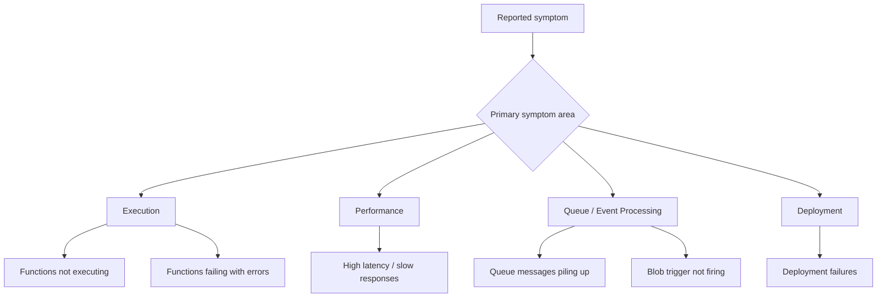

# Incident Playbooks

Symptom-oriented troubleshooting guides for Azure Functions.

Each playbook follows a hypothesis-driven structure: start from the symptom, list competing hypotheses, collect evidence, validate or disprove, and identify the root cause.

---

## Execution

| Playbook | Symptom |
|----------|---------|
| [Functions Not Executing](functions-not-executing.md) | Events arrive but invocation count is near zero |
| [Functions Failing with Errors](functions-failing.md) | Exception count and 5xx increase quickly |

## Performance

| Playbook | Symptom |
|----------|---------|
| [High Latency / Slow Responses](high-latency.md) | P95 latency spikes and timeout rate increases |

## Queue / Event Processing

| Playbook | Symptom |
|----------|---------|
| [Queue Messages Piling Up](queue-piling-up.md) | Queue depth and message age rise steadily |
| [Blob Trigger Not Firing](blob-trigger-not-firing.md) | Blob uploads succeed but invocations never appear |

## Deployment

| Playbook | Symptom |
|----------|---------|
| [Deployment Failures](deployment-failures.md) | Deployment fails or app degrades immediately after release |

---

## How to Use These Playbooks

1. Identify the primary symptom your incident matches.
2. Open the corresponding playbook.
3. Follow the hypothesis-driven workflow: **What you observe → Hypotheses → Checks → Interpretation → Fix**.
4. Use inline KQL queries directly in the playbook — no need to switch to a separate query library.

!!! tip "Troubleshooting Workflow"
    Start with [First 10 Minutes](../first-10-minutes.md), follow [Methodology](../methodology.md), use playbook-embedded KQL queries, and map hands-on practice from [Lab Guides](../lab-guides/index.md).

## See Also

- [First 10 Minutes](../first-10-minutes.md)
- [Methodology](../methodology.md)
- [KQL Query Library](../kql.md)
- [Lab Guides](../lab-guides/index.md)
- [Evidence Map](../evidence-map.md)
