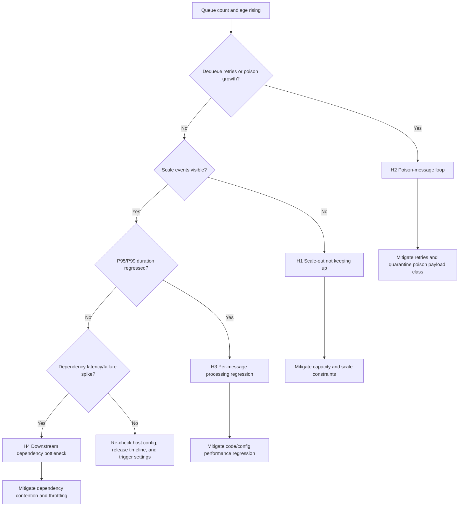

---
content_sources:
  - type: mslearn-adapted
    url: https://learn.microsoft.com/azure/azure-functions/functions-bindings-storage-queue-trigger
  - type: mslearn-adapted
    url: https://learn.microsoft.com/azure/azure-functions/functions-scale
  - type: mslearn-adapted
    url: https://learn.microsoft.com/azure/azure-functions/performance-reliability
  - type: mslearn-adapted
    url: https://learn.microsoft.com/azure/azure-functions/functions-monitoring
  - type: mslearn-adapted
    url: https://learn.microsoft.com/azure/storage/common/monitor-storage
  - type: mslearn-adapted
    url: https://learn.microsoft.com/azure/azure-monitor/app/analytics
content_validation:
  status: verified
  last_reviewed: 2026-04-12
  reviewer: agent
  core_claims:
    - claim: "Queue Messages Piling Up 관련 핵심 진단 절차와 운영 판단 기준"
      source: https://learn.microsoft.com/azure/azure-functions/functions-bindings-storage-queue-trigger
      verified: true
---

# Queue Messages Piling Up
## 1. Summary
| Item | Details |
|---|---|
| Incident | Queue backlog and message age rise faster than dequeue processing. |
| Primary risk | SLA/SLO breach, stale outcomes, and downstream saturation cascades. |
| Typical components | Azure Storage Queue, Azure Functions queue trigger, App Insights, downstream APIs/DBs. |
| First classification decision | Is this H1 scale lag, H2 poison loop, H3 regression, or H4 dependency bottleneck? |
<!-- diagram-id: 1-summary -->

This playbook assumes enqueue is healthy and focuses on why consumers cannot drain.

## 2. Common Misreadings
- Backlog growth always means "add instances"; deterministic retries or dependency throttling may dominate.
- High invocation count means healthy drain; retry storms inflate invocations with low net queue reduction.
- Average duration looks fine so no issue; tail latency (P95/P99) can still collapse throughput.
- Poison queue growth is minor noise; sustained poison growth usually means deterministic payload failure.
- Queue count alone is enough; queue age and dequeue count distribution are required for diagnosis.
- Empty custom metric query means healthy; it may mean missing instrumentation.
- Scaling out always helps; it can worsen downstream bottlenecks.

## 3. Competing Hypotheses
### H1: Scale-out not keeping up
- Enqueue rate exceeds active dequeue capacity for current plan/concurrency constraints.
- Scale events are delayed, absent, or unstable during sustained queue growth.
- Worker churn can occur without net capacity increase.
### H2: Poison-message loop
- A payload class repeatedly fails and retries until poison transfer.
- Retries consume worker time and reduce healthy-message throughput.
- Queue grows even with some scale-out because retry tax absorbs capacity.
### H3: Per-message processing regression
- Processing duration regresses after code/config/runtime change.
- CPU/memory/serialization cost per message rises.
- Failures may stay low while latency-driven throughput deficit grows.
### H4: Downstream dependency bottleneck
- Dependency latency/throttling/errors dominate processor duration.
- Queue workers wait on external APIs or database operations.
- More workers amplify dependency contention.

## 4. What to Check First
1. Confirm queue count and queue age both rise in the same window.
2. Peek active queue messages and inspect `dequeueCount` distribution.
3. Check `<queue-name>-poison` trend for concurrent growth.
4. Compare enqueue trend against completion throughput.
5. Review deployment/config changes before backlog acceleration.
6. Inspect scale traces for missing or delayed worker growth.
7. Validate dependency latency/failure spikes for queue processor path.
8. Determine if failures cluster to a specific payload schema/value set.

## 5. Evidence to Collect
### Scope
- Capture 60-120 minutes spanning baseline, escalation, and mitigation.
- Normalize all timestamps to UTC.
- Correlate by function name, queue name, operation id, and deployment marker.
### Data Sources
- Storage metrics: `QueueMessageCount` with 1-minute interval.
- Requests telemetry: invocation, success, duration.
- Exceptions telemetry: dominant type/message and trend.
- Traces telemetry: scale/instance/drain events.
- Dependencies telemetry: target, result code, latency, failure rate.
- CLI message peek samples from active and poison queues.

### Sample Log Patterns
```text
# Abnormal: repeated retries and poison move
[2026-04-04T09:41:08.115Z] Executing 'Functions.QueueProcessor' (Reason='New queue message detected on <queue-name>.', Id=xxxxxxxx-xxxx-xxxx-xxxx-xxxxxxxxxxxx)
[2026-04-04T09:41:08.972Z] Message has been dequeued '5' time(s).
[2026-04-04T09:41:09.010Z] Function 'QueueProcessor' failed with InvalidOperationException: Unsupported payload schema version.
[2026-04-04T09:41:09.121Z] Moving message to queue '<queue-name>-poison'.

# Abnormal: queue grows with little scale activity
[2026-04-04T09:45:00.004Z] Queue trigger details: BatchSize=16, NewBatchThreshold=8, QueueLength=7420, DequeueCount=1
[2026-04-04T09:46:00.032Z] Queue trigger details: BatchSize=16, NewBatchThreshold=8, QueueLength=8015, DequeueCount=1
[2026-04-04T09:47:00.028Z] Queue trigger details: BatchSize=16, NewBatchThreshold=8, QueueLength=8599, DequeueCount=1

# Abnormal: dependency waits dominate
[2026-04-04T09:52:10.315Z] Executed 'Functions.QueueProcessor' (Succeeded, Duration=48211ms)
[2026-04-04T09:52:10.317Z] Dependency call failed: POST https://api.contoso.internal/orders (429 Too Many Requests)
[2026-04-04T09:52:10.320Z] Retrying dependency call with exponential backoff, attempt=3

# Normal: stable processing
[2026-04-04T09:30:05.442Z] Executed 'Functions.QueueProcessor' (Succeeded, Duration=412ms)
[2026-04-04T09:30:05.446Z] Queue trigger details: QueueLength=28, DequeueCount=1
```

### KQL Queries with Example Output
#### Query 1: Function execution summary (library query 1)
```kusto
let appName = "$APP_NAME";
requests
| where timestamp > ago(1h)
| where cloud_RoleName =~ appName
| where operation_Name startswith "Functions."
| summarize
    Invocations = count(),
    Failures = countif(success == false),
    FailureRatePercent = round(100.0 * countif(success == false) / count(), 2),
    P95Ms = percentile(duration, 95)
  by FunctionName = operation_Name
| order by Failures desc, P95Ms desc
```
| FunctionName | Invocations | Failures | FailureRatePercent | P95Ms |
|---|---|---|---|---|
| Functions.QueueProcessor | 3240 | 278 | 8.58 | 14820 |
| Functions.HealthProbe | 720 | 0 | 0.00 | 120 |
| Functions.HttpWebhook | 1180 | 4 | 0.34 | 920 |

#### Query 5: Queue processing latency (library query 5)
!!! warning "Custom instrumentation required"
    Queue processing metrics (`QueueMessageAgeMs`, `QueueProcessingLatencyMs`, `QueueDequeueDelayMs`) are **not** emitted by the Azure Functions runtime by default. These queries require explicit application instrumentation (for example OpenTelemetry or `TelemetryClient.TrackMetric()`). If instrumentation is missing, results are empty; use Storage queue metrics for built-in visibility.
```kusto
let appName = "$APP_NAME";
customMetrics
| where timestamp > ago(2h)
| where cloud_RoleName =~ appName
| where name in ("QueueMessageAgeMs", "QueueProcessingLatencyMs", "QueueDequeueDelayMs")
| summarize AvgMs=avg(value), P95Ms=percentile(value, 95), MaxMs=max(value) by MetricName=name, bin(timestamp, 5m)
| order by timestamp desc
```
| MetricName | timestamp | AvgMs | P95Ms | MaxMs |
|---|---|---|---|---|
| QueueMessageAgeMs | 2026-04-04T09:55:00Z | 1220000 | 1880000 | 2440000 |
| QueueProcessingLatencyMs | 2026-04-04T09:55:00Z | 35800 | 49100 | 72200 |
| QueueDequeueDelayMs | 2026-04-04T09:55:00Z | 890000 | 1210000 | 1550000 |

#### Query 7: Scaling events timeline (library query 7)
```kusto
let appName = "$APP_NAME";
traces
| where timestamp > ago(6h)
| where cloud_RoleName =~ appName
| where message has_any ("scale", "instance", "worker", "concurrency", "drain")
| project timestamp, severityLevel, message
| order by timestamp desc
```
| timestamp | severityLevel | message |
|---|---|---|
| 2026-04-04T09:32:20Z | 1 | Worker process started and initialized. |
| 2026-04-04T09:29:10Z | 1 | Scaling out worker count from 2 to 4. |
| 2026-04-04T09:28:40Z | 2 | Drain mode enabled for instance xxxxxxxx-xxxx-xxxx-xxxx-xxxxxxxxxxxx. |

### CLI Investigation Commands
```bash
az storage message peek \
    --account-name "<storage-account-name>" \
    --queue-name "<queue-name>" \
    --num-messages 5 \
    --auth-mode login

az monitor metrics list \
    --resource "/subscriptions/$SUBSCRIPTION_ID/resourceGroups/$RG/providers/Microsoft.Storage/storageAccounts/<storage-account-name>" \
    --metric "QueueMessageCount" \
    --interval PT1M \
    --aggregation Average \
    --offset 1h \
    --output table

az monitor log-analytics query \
    --workspace "$WORKSPACE_ID" \
    --analytics-query "requests | where timestamp > ago(30m) | where operation_Name startswith 'Functions.QueueProcessor' | summarize Invocations=count(), Failures=countif(success == false), P95Ms=percentile(duration,95)"

az monitor log-analytics query \
    --workspace "$WORKSPACE_ID" \
    --analytics-query "traces | where timestamp > ago(30m) | where message has_any ('scale','worker','drain') | project timestamp, message | order by timestamp desc"
```
**Example output (`az storage message peek`):**
```json
[
  {
    "messageId": "xxxxxxxx-xxxx-xxxx-xxxx-xxxxxxxxxxxx",
    "insertionTime": "2026-04-04T09:10:00+00:00",
    "expirationTime": "2026-04-11T09:10:00+00:00",
    "dequeueCount": "5",
    "messageText": "{\"orderId\":\"ORD-***\",\"schemaVersion\":\"3\"}"
  },
  {
    "messageId": "xxxxxxxx-xxxx-xxxx-xxxx-xxxxxxxxxxxx",
    "insertionTime": "2026-04-04T09:11:00+00:00",
    "expirationTime": "2026-04-11T09:11:00+00:00",
    "dequeueCount": "1",
    "messageText": "{\"orderId\":\"ORD-***\",\"schemaVersion\":\"4\"}"
  }
]
```
**Example output (`QueueMessageCount`):**
```text
TimeStamp                    Average
---------------------------  -------
2026-04-04T09:20:00.000000Z  1211
2026-04-04T09:30:00.000000Z  3988
2026-04-04T09:40:00.000000Z  7420
2026-04-04T09:50:00.000000Z  10994
```

### Normal vs Abnormal Comparison
| Signal | Normal | Abnormal | Interpretation |
|---|---|---|---|
| Queue count | Drains after burst | Monotonic growth for 15-30+ minutes | Throughput deficit exists |
| Queue age | Low and stable | Continuously increasing P95 | Consumers lag producers |
| Dequeue count | Mostly 1-2 | Significant cluster >= 5 | Retry/poison loop pressure |
| Poison queue | Flat | Continuous growth | Deterministic payload failure likely |
| Function duration | Stable tail latency | P95/P99 surge | Per-message throughput regression |
| Scale traces | Timely scale-out + new workers | Missing/delayed/churn-only | Capacity not increasing effectively |
| Dependency telemetry | Stable latency, low failures | Latency spikes and 429/5xx | External bottleneck |

## 6. Validation and Disproof by Hypothesis
### H1: Scale-out not keeping up
**Signals that support**
- Queue count and age rise while failure rate remains relatively low.
- Invocation throughput remains flat despite higher enqueue.
- Scale traces sparse or dominated by drain/recycle without net new workers.
**Signals that weaken**
- Workers scale and throughput rises but backlog still grows.
- Retry/poison indicators clearly dominate processing cost.
- Dependency bottleneck strongly correlates with backlog timeline.
**What to verify with inline KQL queries**
```kusto
let appName = "$APP_NAME";
traces
| where timestamp > ago(6h)
| where cloud_RoleName =~ appName
| where message has_any ("scale", "instance", "worker", "concurrency", "drain")
| project timestamp, severityLevel, message
| order by timestamp desc
```
| timestamp | severityLevel | message |
|---|---|---|
| 2026-04-04T09:58:20Z | 1 | Worker process started and initialized. |
| 2026-04-04T09:41:02Z | 1 | Worker process started and initialized. |
| 2026-04-04T09:20:00Z | 2 | Drain mode enabled for instance xxxxxxxx-xxxx-xxxx-xxxx-xxxxxxxxxxxx. |
!!! tip "How to Read This"
    Few scale events during sustained growth indicate scale lag or constraints. Drain/recycle without stable worker increase means capacity churn.
**CLI check**
```bash
az monitor metrics list \
    --resource "/subscriptions/$SUBSCRIPTION_ID/resourceGroups/$RG/providers/Microsoft.Storage/storageAccounts/<storage-account-name>" \
    --metric "QueueMessageCount" \
    --interval PT1M \
    --aggregation Average \
    --offset 1h \
    --output table
```

### H2: Poison-message loop
**Signals that support**
- Message samples show high `dequeueCount` (commonly >= 5).
- Poison queue growth correlates with retry failures.
- Exception signature clusters around specific schema/payload class.
**Signals that weaken**
- Dequeue counts mostly 1-2 and poison queue remains flat.
- Exception signatures are broad/random without concentration.
- Backlog remains after isolating the failing payload class.
**What to verify with inline KQL queries**
```kusto
let appName = "$APP_NAME";
requests
| where timestamp > ago(2h)
| where cloud_RoleName =~ appName
| where operation_Name startswith "Functions.QueueProcessor"
| where success == false
| summarize Failures=count(), P95Ms=percentile(duration,95) by bin(timestamp,5m), resultCode
| order by timestamp desc
```
| timestamp | resultCode | Failures | P95Ms |
|---|---|---|---|
| 2026-04-04T09:55:00Z | 0 | 84 | 12100 |
| 2026-04-04T09:50:00Z | 0 | 79 | 11840 |
| 2026-04-04T09:45:00Z | 0 | 77 | 11290 |
!!! tip "How to Read This"
    Sustained failure-heavy bins imply repeated unsuccessful processing attempts, often retry loop behavior.
**CLI checks**
```bash
az storage message peek \
    --account-name "<storage-account-name>" \
    --queue-name "<queue-name>" \
    --num-messages 10 \
    --auth-mode login

az storage message peek \
    --account-name "<storage-account-name>" \
    --queue-name "<queue-name>-poison" \
    --num-messages 10 \
    --auth-mode login
```

### H3: Per-message processing regression
**Signals that support**
- P95/P99 duration increase after release/config/runtime change.
- Failure rate remains modest but queue age accelerates.
- Compute-heavy path changes align with incident onset.
**Signals that weaken**
- Duration stable while throughput drop is scale-related.
- Incident disappears when downstream dependency is stubbed.
- Backlog persists after rollback of suspected change.
**What to verify with inline KQL queries**
```kusto
let appName = "$APP_NAME";
requests
| where timestamp > ago(6h)
| where cloud_RoleName =~ appName
| where operation_Name startswith "Functions.QueueProcessor"
| summarize
    Invocations=count(),
    FailureRatePercent=round(100.0 * countif(success == false) / count(), 2),
    AvgMs=avg(duration),
    P95Ms=percentile(duration,95),
    P99Ms=percentile(duration,99)
  by bin(timestamp, 15m)
| order by timestamp asc
```
| timestamp | Invocations | FailureRatePercent | AvgMs | P95Ms | P99Ms |
|---|---|---|---|---|---|
| 2026-04-04T08:45:00Z | 900 | 0.20 | 420 | 920 | 1500 |
| 2026-04-04T09:00:00Z | 870 | 0.31 | 1380 | 5520 | 10900 |
| 2026-04-04T09:15:00Z | 840 | 0.28 | 2090 | 11820 | 24210 |
!!! tip "How to Read This"
    Tail latency growth with low failure-rate change indicates throughput collapse from slow successes, not only failures.
**CLI check**
```bash
az monitor log-analytics query \
    --workspace "$WORKSPACE_ID" \
    --analytics-query "requests | where timestamp > ago(6h) | where operation_Name startswith 'Functions.QueueProcessor' | summarize AvgMs=avg(duration), P95Ms=percentile(duration,95), P99Ms=percentile(duration,99) by bin(timestamp,15m)"
```

### H4: Downstream dependency bottleneck
**Signals that support**
- Dependency failure rate and latency rise with backlog growth.
- 429/503/timeout patterns dominate dependency calls.
- Queue processor duration tracks dependency duration trend.
**Signals that weaken**
- Dependency telemetry remains stable while queue slows.
- Failures are low and not time-aligned with backlog growth.
- Backlog persists even when dependency pressure is reduced.
**What to verify with inline KQL queries**
```kusto
let appName = "$APP_NAME";
dependencies
| where timestamp > ago(2h)
| where cloud_RoleName =~ appName
| summarize
    Calls=count(),
    Failures=countif(success == false),
    FailureRatePercent=round(100.0 * countif(success == false) / count(), 2),
    P95Ms=percentile(duration,95)
  by target, type, resultCode, bin(timestamp,5m)
| order by timestamp desc
```
| timestamp | target | type | resultCode | Calls | Failures | FailureRatePercent | P95Ms |
|---|---|---|---|---|---|---|---|
| 2026-04-04T09:55:00Z | api.contoso.internal | Http | 429 | 1200 | 430 | 35.83 | 8220 |
| 2026-04-04T09:55:00Z | sql-orders-prod | SQL | 0 | 1200 | 12 | 1.00 | 3200 |
| 2026-04-04T09:50:00Z | api.contoso.internal | Http | 503 | 1170 | 290 | 24.79 | 7400 |
!!! tip "How to Read This"
    A dependency target with high failure rate and high P95 during backlog growth strongly supports H4.
**CLI check**
```bash
az monitor log-analytics query \
    --workspace "$WORKSPACE_ID" \
    --analytics-query "dependencies | where timestamp > ago(1h) | summarize Calls=count(), Failures=countif(success == false), P95Ms=percentile(duration,95) by target, resultCode"
```

## 7. Likely Root Cause Patterns
1. Scale lag under burst + conservative host concurrency limits.
2. Schema/payload incompatibility causing poison-loop retries.
3. Performance regression in parsing, serialization, or synchronous blocking.
4. Downstream throttling (`429`) or intermittent unavailability (`503`, timeout).
5. Instance churn (drain/recycle) without stable net worker growth.
6. Mixed-mode incidents where small regressions combine with dependency slowdown.

## 8. Immediate Mitigations
- Quarantine known-bad payload class and preserve poison evidence for replay.
- Reduce retry tax by fixing deterministic parsing/validation failures.
- If H1 dominates, increase effective consumer capacity and verify real worker activation.
- If H3 dominates, rollback recent regression or disable expensive path.
- If H4 dominates, apply backoff/circuit shaping to dependency calls.
- Add temporary alerts on queue age slope and poison queue growth rate.
### Fast rollback guardrails
1. Do not delete backlog messages blindly.
2. Replay poison queue only after validation fix.
3. Apply one major mitigation at a time when feasible.
4. Measure queue-drain half-life after each change.

## 9. Prevention
### Engineering controls
- Instrument `QueueMessageAgeMs`, `QueueProcessingLatencyMs`, and `QueueDequeueDelayMs`.
- Enforce schema version contract checks before expensive processing.
- Configure bounded retries and dead-letter strategy.
- Use idempotency keys for safe replay and deduplication.
- Run periodic load/perf tests with representative payload mixes.
### Observability controls
- Dashboard queue count, queue age, invocation throughput, failure rate, and dependency P95 together.
- Alert on queue-age slope and poison-queue growth, not queue count alone.
- Add deployment markers to telemetry for rapid regression correlation.
- Capture processing outcome class (`success`, `retry`, `poison`, `dependency-throttle`).
### Operational controls
- Run recurring backlog surge and poison-loop game days.
- Maintain tested replay runbook for poison queue recovery.
- Reassess hosting limits versus burst profile quarterly.
- Coordinate dependency SLO and throttling behavior with downstream owners.
### Related Labs
- [Queue Backlog Scaling Lab](../lab-guides/queue-backlog-scaling.md)

## See Also
- [Troubleshooting Playbooks](../playbooks/index.md)
- [KQL Query Library](../kql/index.md)
- [Troubleshooting Methodology](../methodology.md)
- [Troubleshooting Lab Guides](../lab-guides/index.md)
- [Queue Backlog Scaling Lab](../lab-guides/queue-backlog-scaling.md)

## Sources
- [Azure Functions queue trigger](https://learn.microsoft.com/azure/azure-functions/functions-bindings-storage-queue-trigger)
- [Azure Functions scaling and hosting](https://learn.microsoft.com/azure/azure-functions/functions-scale)
- [Improve Azure Functions performance and reliability](https://learn.microsoft.com/azure/azure-functions/performance-reliability)
- [Monitor Azure Functions](https://learn.microsoft.com/azure/azure-functions/functions-monitoring)
- [Monitor Azure Storage with Azure Monitor metrics](https://learn.microsoft.com/azure/storage/common/monitor-storage)
- [Analyze telemetry in Application Insights](https://learn.microsoft.com/azure/azure-monitor/app/analytics)
