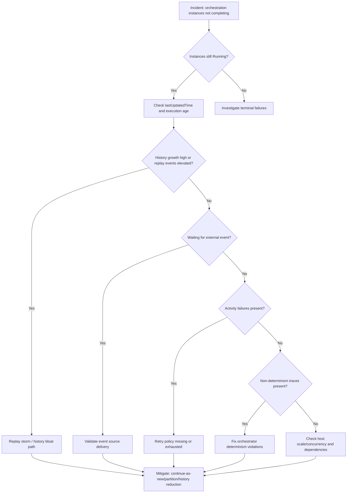
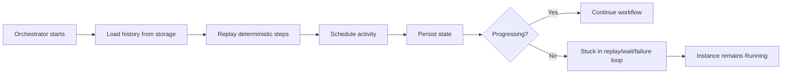
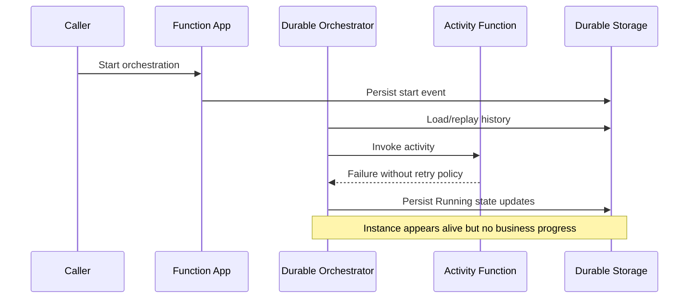
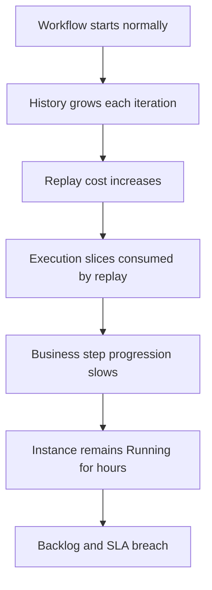

# Durable Functions Orchestration Stuck Playbook

## 1. Summary
This playbook addresses incidents where Durable Functions orchestration instances stay in `Running` (or appear hung) far longer than expected, with little or no forward progress. Typical drivers include replay storms, oversized orchestration history, non-deterministic orchestrator code, failed activities without explicit retries, and workflows waiting forever for external events.

Stuck orchestrations are often misclassified as platform outages. In many cases, storage/provider health is normal and the issue is orchestration logic or execution shape. Fast triage requires separating "no progress" from "slow progress," then proving whether the bottleneck is replay, deterministic violations, dependency failure, or missing external signal.

### Decision Flow


### Severity guidance
| Condition | Severity | Action priority |
|---|---|---|
| Single business flow delayed with manual workaround available | Sev3 | Respond during business hours |
| Multiple high-volume orchestrations in Running with backlog growth | Sev2 | Begin mitigation within 30 minutes |
| Mission-critical orchestration tier blocked and downstream SLA breach | Sev1 | Immediate incident response |

### Signal snapshot
| Signal | Normal | Incident |
|---|---|---|
| Orchestration age distribution | Most complete near SLO | Long tail of very old Running instances |
| Replay/rehydration traces | Low and bounded | Frequent repeated replay messages |
| Activity success ratio | High, with transient retries | Sustained failure or repeated timeout |
| External event receipt | Event arrives before timeout | Wait state never fulfilled |
| Requests/dependencies latency | Stable | Spikes aligned with orchestration stalls |





## 2. Common Misreadings
| Misreading | Why incorrect | Correct interpretation |
|---|---|---|
| "Running means healthy progress" | Running only reflects non-terminal state | Validate step advancement and timestamps |
| "No failures in portal means no problem" | Failures may be retried/replayed without obvious portal error | Inspect traces and orchestration status history |
| "Scale out will always fix stuck workflows" | Replay/history or logic bugs scale poorly and may worsen load | Fix deterministic logic and history shape first |
| "Durable is eventually consistent; just wait" | Infinite waits occur when external events never arrive | Add timeout/compensation and verify event pipeline |
| "Activity errors are harmless if orchestrator survives" | Repeated activity failure can block completion forever | Define retry policy and terminal fault handling |

## 3. Competing Hypotheses
| ID | Hypothesis | Confirming signal | Disproving signal |
|---|---|---|---|
| H1 | Replay storm from oversized orchestration history | Repeated replay traces and high execution age | Small history with normal replay counts |
| H2 | Non-deterministic orchestrator code causes re-execution instability | Traces indicate nondeterministic behavior and replay mismatch | Deterministic APIs used and no mismatch logs |
| H3 | Activity failures without retry/compensation stall workflow | Activity exceptions repeat with no progression | Activities succeed and orchestration still blocked |
| H4 | External event is never delivered | Instances wait on event beyond expected timeout | Event receipt traces exist before timeout |
| H5 | Dependency latency/timeouts prevent task completion | Dependencies show high p95 and failures during stall | Dependencies healthy while orchestration stuck |
| H6 | Host concurrency/scale limits starve orchestration workers | High queue age, low throughput, stable code path | Adequate throughput and idle capacity observed |

## 4. What to Check First
1. Identify affected orchestration names, age, count in `Running`, and oldest `lastUpdatedTime`.
2. Verify whether the workflow is replaying, waiting for external events, or repeatedly failing activities.
3. Confirm if a recent deployment introduced orchestrator logic changes.
4. Determine whether immediate containment requires controlled restarts, instance termination, or selective replay reduction.

### Quick portal checks
- In Application Insights, inspect traces for replay, deterministic violations, and waiting-event messages.
- In Durable monitoring view, list oldest `Running` instances and compare to expected execution duration.
- In Metrics, correlate dependency latency/failures with orchestration stalls.

### Quick CLI checks
```bash
az functionapp show --name $APP_NAME --resource-group $RG --output table
az rest --method get --url "https://$APP_NAME.azurewebsites.net/runtime/webhooks/durabletask/instances/$INSTANCE_ID?taskHub=$TASK_HUB&connection=Storage&code=$DURABLE_API_KEY&showHistory=true&showHistoryOutput=true" --output json
az monitor log-analytics query --workspace "$WORKSPACE_ID" --analytics-query "traces | where timestamp > ago(30m) | where message has_any ('Durable', 'orchestration', 'replay', 'nondeterministic') | project timestamp, operation_Id, message" --output table
az monitor log-analytics query --workspace "$WORKSPACE_ID" --analytics-query "requests | where timestamp > ago(30m) | where name has_any ('orchestrator','activity') | summarize total=count(), failed=countif(success == false), p95=percentile(duration,95) by name" --output table
```

### Example output
```text
Name                ResourceGroup          State    RuntimeVersion    DefaultHostName
------------------  ---------------------  -------  ----------------  ----------------------------------------
func-prod-workflow  rg-functions-prod      Running  ~4                func-prod-workflow.azurewebsites.net

{
  "name": "OrderSagaOrchestrator",
  "instanceId": "xxxxxxxx-xxxx-xxxx-xxxx-xxxxxxxxxxxx",
  "runtimeStatus": "Running",
  "createdTime": "2026-04-05T01:55:20.114Z",
  "lastUpdatedTime": "2026-04-05T03:40:51.909Z",
  "input": "{\"orderId\":\"ORD-102948\"}",
  "customStatus": "WaitingForPaymentConfirmed",
  "historyEventCount": 18462
}

timestamp                   operation_Id                           message
--------------------------  ------------------------------------   -------------------------------------------------------------
2026-04-05T03:39:30.204Z    xxxxxxxx-xxxx-xxxx-xxxx-xxxxxxxxxxxx   DurableTask replaying orchestrator OrderSagaOrchestrator
2026-04-05T03:40:05.987Z    xxxxxxxx-xxxx-xxxx-xxxx-xxxxxxxxxxxx   Waiting for external event PaymentConfirmed

name                          total   failed   p95
---------------------------   -----   ------   -----------
OrderSagaOrchestrator         2920    0        00:00:08.221
ChargePaymentActivity         540     217      00:00:04.118
```

## 5. Evidence to Collect
!!! note "KQL Table Names"
    Most queries use Application Insights table names (`traces`, `requests`, `dependencies`) with classic columns (`timestamp`, `duration`). The `AppMetrics` table is a Log Analytics-only table and uses `TimeGenerated` instead of `timestamp`.

| Source | Query/Command | Purpose |
|---|---|---|
| Durable status API (`az rest`) | Retrieve `runtimeStatus`, `lastUpdatedTime`, history depth | Verify true stuck vs active progression |
| `traces` | Filter for replay, non-determinism, event wait, activity failure | Classify failure mode quickly |
| `requests` | Orchestrator and activity request outcomes and durations | Quantify throughput and stall location |
| `dependencies` | Storage/HTTP/DB latency and failure around stuck windows | Identify external bottleneck contribution |
| `traces` | Host startup, listener, task hub operational events | Detect host-level processing gaps |
| `AppMetrics` | Throughput, queue age, execution count trends | Confirm starvation or replay amplification |
| Release metadata | Deployment timestamp and changed function code | Correlate issue onset with code/config changes |
| App settings / `host.json` | Durable task and concurrency settings | Validate configuration risks and throttles |

## 6. Validation and Disproof by Hypothesis
### H1: Replay storm from oversized orchestration history
#### Confirming KQL
```kusto
traces
| where timestamp > ago(12h)
| where message has_any ("replay", "Replaying", "DurableTask")
| extend instanceId = coalesce(tostring(customDimensions["prop__InstanceId"]), tostring(customDimensions["InstanceId"]))
| summarize replayEvents=count(), firstSeen=min(timestamp), lastSeen=max(timestamp) by instanceId, operation_Name
| join kind=leftouter (
    requests
    | where timestamp > ago(12h)
    | where name has "orchestrator"
    | extend instanceId = coalesce(tostring(customDimensions["prop__InstanceId"]), tostring(customDimensions["InstanceId"]))
    | summarize orchestrationRequests=count(), p95Duration=percentile(duration,95) by instanceId
) on instanceId
| order by replayEvents desc
```

#### Expected output
```text
instanceId                              operation_Name              replayEvents   firstSeen                   lastSeen                    orchestrationRequests   p95Duration
------------------------------------    -------------------------   ------------   -------------------------   -------------------------   ----------------------   -----------
xxxxxxxx-xxxx-xxxx-xxxx-xxxxxxxxxxxx    OrderSagaOrchestrator       2350           2026-04-05T01:58:09.110Z   2026-04-05T03:41:18.402Z   2289                    00:00:08.481
xxxxxxxx-xxxx-xxxx-xxxx-xxxxxxxxxxxx    RenewalOrchestrator         1794           2026-04-05T02:10:10.901Z   2026-04-05T03:39:02.335Z   1702                    00:00:06.992
```

#### Disproving check
If replay events remain low and history size is modest while instances still stall, replay storm is not primary. Evaluate missing external events or dependency failures next.

Secondary verification query:

```kusto
requests
| where timestamp > ago(6h)
| where name has "orchestrator"
| extend instanceId = tostring(customDimensions["InstanceId"])
| summarize runs=count(), avgDuration=avg(duration), p95Duration=percentile(duration,95) by instanceId, name
| order by p95Duration desc
```

Use this to confirm whether long orchestrator slices are systemic or isolated to a few instances.

### H2: Non-deterministic orchestrator code causes replay mismatch
#### Confirming KQL
```kusto
traces
| where timestamp > ago(24h)
| where message has_any ("Non-Deterministic", "nondeterministic", "deterministic", "replay mismatch")
| extend functionName = tostring(customDimensions["FunctionName"])
| extend instanceId = tostring(customDimensions["InstanceId"])
| project timestamp, functionName, instanceId, severityLevel, message
| order by timestamp desc
```

#### Expected output
```text
timestamp                   functionName             instanceId                              severityLevel   message
--------------------------  ----------------------   ------------------------------------    -------------   -----------------------------------------------------------------------
2026-04-05T03:11:22.090Z    OrderSagaOrchestrator   xxxxxxxx-xxxx-xxxx-xxxx-xxxxxxxxxxxx   3               Non-Deterministic workflow detected: Guid.NewGuid used in orchestrator
2026-04-05T03:11:22.115Z    OrderSagaOrchestrator   xxxxxxxx-xxxx-xxxx-xxxx-xxxxxxxxxxxx   3               Replay mismatch at step ValidatePaymentState
```

#### Disproving check
If no deterministic violation traces appear and code review confirms orchestrator uses deterministic APIs (`context.CurrentUtcDateTime`, `context.NewGuid`), deprioritize this hypothesis.

Code-level anti-pattern checklist:
- Direct calls to current clock APIs inside orchestrator logic.
- Direct GUID generation inside orchestrator logic.
- Random number generation or unordered dictionary iteration used to branch.
- Network I/O in orchestrator body instead of activity functions.

### H3: Activity failures without retry/compensation stall workflow
#### Confirming KQL
```kusto
requests
| where timestamp > ago(12h)
| where name has "Activity"
| summarize total=count(), failed=countif(success == false), p95=percentile(duration,95) by name, operation_Id
| where failed > 0
| join kind=leftouter (
    traces
    | where timestamp > ago(12h)
    | where message has_any ("Retry", "TaskFailed", "Unhandled exception", "activity")
    | project operation_Id, traceMessage=message, traceTime=timestamp
) on operation_Id
| project name, operation_Id, total, failed, p95, traceTime, traceMessage
| order by failed desc
```

#### Expected output
```text
name                          operation_Id                           total   failed   p95          traceTime                    traceMessage
---------------------------   ------------------------------------   -----   ------   ----------   --------------------------   -------------------------------------------------------------
ChargePaymentActivity         xxxxxxxx-xxxx-xxxx-xxxx-xxxxxxxxxxxx   11      11       00:00:04.118 2026-04-05T03:18:20.002Z    TaskFailedException in ChargePaymentActivity; no retry policy
ReserveInventoryActivity      xxxxxxxx-xxxx-xxxx-xxxx-xxxxxxxxxxxx   8       8        00:00:02.904 2026-04-05T03:18:31.443Z    Unhandled exception from dependency timeout
```

#### Disproving check
If activity calls are succeeding with normal latency yet orchestration remains Running, the stall is likely at event waiting or replay/logic layers.

Escalation signal:
When failed activity count exceeds successful count for the same operation over multiple 10-minute bins, treat this as probable blocker rather than transient noise.

### H4: External event is never delivered
#### Confirming KQL
```kusto
traces
| where timestamp > ago(12h)
| where message has_any ("Waiting for external event", "RaiseEvent", "ExternalEvent")
| extend instanceId = tostring(customDimensions["InstanceId"])
| extend eventName = tostring(customDimensions["EventName"])
| summarize waitCount=countif(message has "Waiting for external event"), receivedCount=countif(message has_any ("RaiseEvent", "received external event")), first=min(timestamp), last=max(timestamp) by instanceId, eventName
| order by waitCount desc
```

#### Expected output
```text
instanceId                              eventName              waitCount   receivedCount   first                        last
------------------------------------    -------------------    ---------   -------------   -------------------------    -------------------------
xxxxxxxx-xxxx-xxxx-xxxx-xxxxxxxxxxxx    PaymentConfirmed       420         0               2026-04-05T02:05:21.110Z    2026-04-05T03:42:30.009Z
xxxxxxxx-xxxx-xxxx-xxxx-xxxxxxxxxxxx    ShipmentAssigned       187         0               2026-04-05T02:40:33.220Z    2026-04-05T03:41:54.719Z
```

#### Disproving check
If corresponding `RaiseEvent` messages are present with matched instance IDs and event names before timeout, missing event delivery is unlikely.

Event contract validation checklist:
- Event name matches exact casing expected by orchestrator.
- Instance ID used by publisher matches orchestrator instance ID.
- Event source confirms publish acknowledgment in the same window.
- No filtering rule in middleware drops late or duplicate events.

### H5: Dependency latency/timeouts prevent orchestrator progress
#### Confirming KQL
```kusto
dependencies
| where timestamp > ago(12h)
| summarize depCount=count(), failed=countif(success == false), p95=percentile(duration,95), p99=percentile(duration,99) by target, type, bin(timestamp, 10m)
| order by timestamp desc
```

#### Expected output
```text
target                        type       timestamp                   depCount   failed   p95          p99
---------------------------   --------   --------------------------  --------   ------   ----------   ----------
payments-api.internal         HTTP       2026-04-05T03:20:00.000Z   620        143      00:00:03.921 00:00:06.314
state-store.table.core        Azure table 2026-04-05T03:20:00.000Z  1250       96       00:00:02.104 00:00:04.002
```

#### Disproving check
If dependencies are healthy during stuck windows, deprioritize external bottlenecks and focus on orchestration logic, eventing, and history/replay effects.

Normal vs abnormal dependency profile:

| Condition | p95 dependency latency | Failure ratio |
|---|---|---|
| Normal processing | Under 500 ms | Under 1% |
| Degraded but progressing | 500 ms to 2 s | 1% to 5% |
| Blocking stall likelihood | Above 2 s | Above 5% |

### H6: Host concurrency/scale limits starve orchestration workers
#### Confirming KQL
```kusto
AppMetrics
| where TimeGenerated > ago(12h)
| where Name in ("FunctionExecutionCount", "FunctionExecutionUnits", "RequestsInQueue")
| summarize avgValue=avg(Value), maxValue=max(Value) by Name, bin(TimeGenerated, 10m)
| order by TimeGenerated asc
```

#### Expected output
```text
Name                    TimeGenerated               avgValue   maxValue
---------------------   --------------------------  --------   --------
FunctionExecutionCount  2026-04-05T03:00:00.000Z   210        260
FunctionExecutionCount  2026-04-05T03:10:00.000Z   182        201
RequestsInQueue         2026-04-05T03:00:00.000Z   820        980
RequestsInQueue         2026-04-05T03:10:00.000Z   1150       1390
```

#### Disproving check
If queue age and backlog remain low with healthy execution throughput, starvation is not primary; investigate code-level deterministic/replay/event issues.

Capacity tuning hints:
- Raise worker count only after confirming replay storm is not primary.
- Prefer reducing per-instance contention before broad scale-out.
- Validate task hub storage latency before concurrency increases.

## 7. Likely Root Cause Patterns
| Pattern | Evidence signature | Frequency |
|---|---|---|
| Oversized orchestration history | High replay counts, long Running age, dense state transitions | High |
| Non-deterministic orchestrator code | Replay mismatch and deterministic violation traces | High |
| Activity failure loop without robust retry | Repeated failed activity requests, same step never advances | Medium |
| Missing external event contract | Wait-state traces with zero receive confirmations | Medium |
| Dependency instability masking as orchestration stall | p95/p99 spikes and timeout clusters during stalls | Medium |



## 8. Immediate Mitigations
1. Check runtime status for oldest instances and terminate or restart only those violating execution SLO.
   ```bash
   az rest --method get --url "https://$APP_NAME.azurewebsites.net/runtime/webhooks/durabletask/instances/$INSTANCE_ID?taskHub=$TASK_HUB&connection=Storage&code=$DURABLE_API_KEY" --output json
   az rest --method post --url "https://$APP_NAME.azurewebsites.net/runtime/webhooks/durabletask/instances/$INSTANCE_ID/terminate?reason=stuck-instance-mitigation&taskHub=$TASK_HUB&connection=Storage&code=$DURABLE_API_KEY" --output json
   ```
2. Reduce replay pressure by introducing `ContinueAsNew` in long-running orchestrations and redeploy.
   ```bash
   az functionapp deployment source config-zip --name $APP_NAME --resource-group $RG --src ./deployments/durable-continue-as-new-hotfix.zip --output table
   ```
3. Add explicit retry policy for critical activity calls in code. Durable Functions retries are defined per `CallActivityWithRetryAsync` in the orchestrator, not via app settings.
   ```bash
   # Redeploy with retry policy added to orchestrator code
   az functionapp deployment source config-zip --name $APP_NAME --resource-group $RG --src ./deployments/durable-retry-policy-hotfix.zip --output table
   ```
4. Validate host and plan settings to avoid worker starvation and under-provisioned execution.
   ```bash
   az functionapp show --name $APP_NAME --resource-group $RG --query "{state:state,plan:serverFarmId,kind:kind}" --output json
   az functionapp plan update --name $PLAN_NAME --resource-group $RG --number-of-workers 2 --output table
   ```
5. If external events are missing, replay from upstream message source or use the Durable HTTP API to raise the event manually.
   ```bash
   az rest --method post --url "https://$APP_NAME.azurewebsites.net/runtime/webhooks/durabletask/instances/$INSTANCE_ID/raiseEvent/$EVENT_NAME?taskHub=$TASK_HUB&connection=Storage&code=$DURABLE_API_KEY" --body '{"status":"compensated"}' --output json
   ```
6. Restart host only after status snapshots are captured so forensic data is preserved.
   ```bash
   az functionapp restart --name $APP_NAME --resource-group $RG
   ```

## 9. Prevention
1. Keep orchestrator code deterministic: use context-provided time/ID APIs, never direct `DateTime.Now` or `Guid.NewGuid` inside orchestrators.
2. Use `ContinueAsNew` and state compaction patterns to cap orchestration history growth.
3. Define activity retries with bounded attempts, exponential backoff, and explicit compensation on failure.
4. Wrap external event waits with deadlines and fallback branches to avoid indefinite `Running` state.
5. Add proactive alerts for long-running instance age, replay volume, and activity failure ratio.

## See Also
- [Troubleshooting architecture](../../architecture.md)
- [Troubleshooting methodology](../../methodology.md)
- [Troubleshooting KQL guide](../../kql.md)
- [Durable replay storm lab guide](../../lab-guides/durable-replay-storm.md)
- [Out of memory / worker crash playbook](./out-of-memory-worker-crash.md)

## Sources
- [Durable Functions overview](https://learn.microsoft.com/azure/azure-functions/durable/durable-functions-overview)
- [Durable orchestrations and deterministic code constraints](https://learn.microsoft.com/azure/azure-functions/durable/durable-functions-code-constraints)
- [Durable Functions instance management APIs](https://learn.microsoft.com/azure/azure-functions/durable/durable-functions-http-api)
- [Diagnose and troubleshoot Durable Functions](https://learn.microsoft.com/azure/azure-functions/durable/durable-functions-troubleshooting-guide)
- [Azure Functions scale and hosting guidance](https://learn.microsoft.com/azure/azure-functions/functions-scale)
