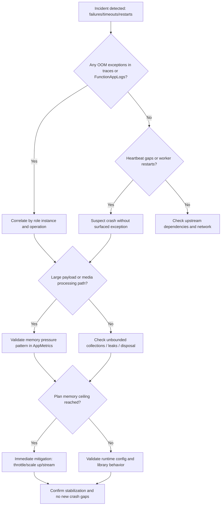
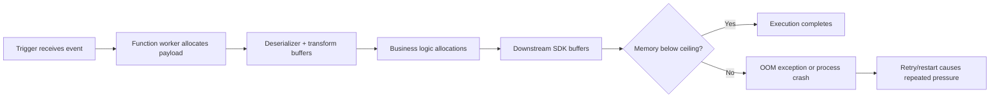
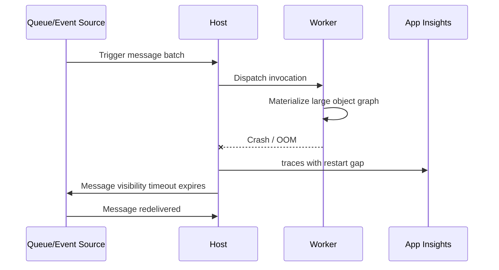
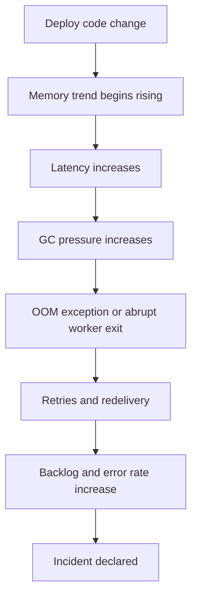

---
content_sources:
  - type: mslearn-adapted
    url: https://learn.microsoft.com/azure/azure-functions/functions-scale
  - type: mslearn-adapted
    url: https://learn.microsoft.com/azure/azure-functions/functions-best-practices
  - type: mslearn-adapted
    url: https://learn.microsoft.com/azure/azure-functions/analyze-telemetry-data
  - type: mslearn-adapted
    url: https://learn.microsoft.com/azure/azure-monitor/logs/log-query-overview
  - type: mslearn-adapted
    url: https://learn.microsoft.com/azure/azure-functions/performance-reliability
---

# Out of Memory / Worker Crash Playbook

## 1. Summary
This playbook is for incidents where Azure Functions executions fail, restart, or disappear under load because worker memory is exhausted. It is most common in workloads that materialize large payloads in memory, read blobs fully instead of streaming, hold unbounded collections, or run CPU-heavy media operations that allocate large temporary buffers.

On Azure Functions, memory ceilings are plan-dependent and hard in practice: Consumption is typically limited to about 1.5 GB per instance, Premium EP1 to about 3.5 GB, EP2 to about 7 GB, and EP3 to about 14 GB. When allocations spike beyond available memory, workers can throw `System.OutOfMemoryException`, trigger process recycling, and leave heartbeat gaps that appear as random cold starts or transient availability loss.

### Decision Flow
<!-- diagram-id: decision-flow -->


### Severity guidance
| Condition | Severity | Action priority |
|---|---|---|
| OOM exceptions on single app instance with auto-recovery in under 5 minutes | Sev3 | Start triage within 60 minutes |
| Repeated worker crashes across multiple instances causing queue growth or API errors | Sev2 | Start mitigation within 15 minutes |
| Broad outage with sustained crash loops and customer-visible failure | Sev1 | Immediate response and incident command |

### Signal snapshot
| Signal | Normal | Incident |
|---|---|---|
| `traces` containing `System.OutOfMemoryException` | None or very rare | Bursts aligned with failed requests |
| `AppMetrics` working set trend | Stable sawtooth with release | Stair-step growth with no return |
| Host heartbeat continuity | Regular heartbeat cadence | Gaps during crash/recycle windows |
| Request success rate | >99% for steady workload | Drops with 5xx and timeout spikes |
| Queue backlog | Bounded and catches up | Persistent growth during restarts |

<!-- diagram-id: signal-snapshot -->


<!-- diagram-id: signal-snapshot-2 -->


## 2. Common Misreadings
| Misreading | Why incorrect | Correct interpretation |
|---|---|---|
| "No OOM exception means memory is fine" | Hard crashes can terminate before managed exception logging | Use heartbeat gaps, restarts, and abrupt request drops as corroboration |
| "CPU is low, so memory cannot be the issue" | Memory exhaustion can happen with modest CPU | Track working set and allocation bursts independently |
| "Only large files cause OOM" | Many medium objects plus retention can exceed limits | Check cumulative allocations and object lifetime |
| "Premium always prevents OOM" | Plan upgrade raises ceiling but does not remove leaks or spikes | Fix memory behavior and then right-size plan |
| "Retries fix transient crash loops" | Retries can amplify pressure by repeating allocations | Add backoff, lower concurrency, and reduce payload footprint |

## 3. Competing Hypotheses
| ID | Hypothesis | Confirming signal | Disproving signal |
|---|---|---|---|
| H1 | Large payloads are fully buffered in memory | OOMs correlate with large request/body size operations | OOMs happen on tiny payload paths |
| H2 | Blob/content downloads are materialized rather than streamed | OOMs correlate with blob read operations and high bytes read | Blob operations absent near failure windows |
| H3 | Unbounded collections or cache growth in worker process | Working set grows monotonically across invocations | Memory returns to baseline after each batch |
| H4 | EF or DB resources are not disposed causing retention | Long-lived contexts/connections around failed windows | No correlation with DB activity and objects released promptly |
| H5 | Image/PDF processing library spikes temporary allocations | Failures cluster on media conversion endpoints | Media pipeline inactive during incidents |
| H6 | Plan memory ceiling is too low for legitimate workload | OOM near stable peak load with efficient code path | Same load succeeds after code-level optimization without scaling |

## 4. What to Check First
1. Confirm whether failures align with memory-intensive functions, payload types, and event sizes.
2. Check for crash signatures: OOM traces, heartbeat gaps, and sudden worker restarts.
3. Compare memory trend and request success trend in the same 30-minute window.
4. Determine if immediate containment needs concurrency reduction or temporary scale-up.

### Quick portal checks
- In Application Insights, search `traces` for `System.OutOfMemoryException` and restart markers.
- In Metrics, overlay memory working set and failed requests for the same time range.
- In Function App logs, inspect crash windows for host heartbeat discontinuity.

### Quick CLI checks
```bash
az functionapp show --name $APP_NAME --resource-group $RG --output table
az monitor log-analytics query --workspace "$WORKSPACE_ID" --analytics-query "traces | where timestamp > ago(30m) | where message contains 'OutOfMemory' | project timestamp, cloud_RoleInstance, operation_Id, message" --output table
az monitor log-analytics query --workspace "$WORKSPACE_ID" --analytics-query "AppMetrics | where TimeGenerated > ago(30m) | where Name in ('WorkingSet','PrivateBytes') | summarize avg(Value), max(Value) by Name, bin(TimeGenerated, 5m)" --output table
```

### Example output
```text
Name                ResourceGroup        State    RuntimeVersion    LinuxFxVersion
------------------  -------------------  -------  ----------------  --------------------
func-prod-orders    rg-functions-prod    Running  ~4                PYTHON|3.11

timestamp                   cloud_RoleInstance              operation_Id                           message
--------------------------  ------------------------------  ------------------------------------   --------------------------------------------------------------
2026-04-05T03:10:11.220Z    RD281878D4A1C2                 xxxxxxxx-xxxx-xxxx-xxxx-xxxxxxxxxxxx   System.OutOfMemoryException: Exception of type...
2026-04-05T03:10:11.907Z    RD281878D4A1C2                 xxxxxxxx-xxxx-xxxx-xxxx-xxxxxxxxxxxx   Worker process terminated due to memory pressure

Name         TimeGenerated               avg_Value      max_Value
-----------  --------------------------  ------------   ------------
WorkingSet   2026-04-05T03:05:00.000Z   1287348224     1499822080
WorkingSet   2026-04-05T03:10:00.000Z   1519804416     1602242560
```

## 5. Evidence to Collect
!!! note "KQL Table Names"
    Most queries use Application Insights table names (`traces`, `requests`, `dependencies`) with classic columns (`timestamp`, `duration`). The `AppMetrics` table is a Log Analytics-only table and uses `TimeGenerated` instead of `timestamp`.

| Source | Query/Command | Purpose |
|---|---|---|
| `traces` | Search for `System.OutOfMemoryException`, `worker process`, `recycle` | Establish explicit crash/error signatures |
| `traces` | Filter by host/worker restart events | Confirm process-level disruption timeline |
| `AppMetrics` | WorkingSet, PrivateBytes, GC metrics by 1-5 minute bins | Measure memory growth and saturation trend |
| `AppMetrics` | Analyze GC pause and allocation counters by role instance | Distinguish leak-like growth from bursty allocations |
| `requests` | Failed/timeout requests per operation | Quantify customer impact and hot endpoints |
| `dependencies` | High latency or failed downstream calls around OOM windows | Rule out external dependency primary failure |
| Deployment history | Runtime/library version changes before incident | Detect regressions introduced by release |
| Function config | `host.json` concurrency and batching settings | Identify configuration amplifying memory pressure |
| Hosting plan details | SKU/instance memory envelope | Validate if ceiling is structurally insufficient |

## 6. Validation and Disproof by Hypothesis
### H1: Large payloads are fully buffered in memory
#### Confirming KQL
```kusto
traces
| where timestamp > ago(6h)
| where message has_any ("OutOfMemoryException", "OutOfMemory", "worker process")
| project oomTime=timestamp, operation_Id, cloud_RoleInstance, message
| join kind=leftouter (
    requests
    | where timestamp > ago(6h)
    | extend requestBytes = tolong(customDimensions["RequestBodyBytes"])
    | project operation_Id, reqTime=timestamp, name, resultCode, requestBytes
) on operation_Id
| where isnotempty(requestBytes)
| summarize incidents=count(), p95RequestBytes=percentile(requestBytes,95), maxRequestBytes=max(requestBytes) by name
| order by incidents desc
```

#### Expected output
```text
name                          incidents   p95RequestBytes   maxRequestBytes
---------------------------   ---------   ---------------   ---------------
ProcessOrderHttpTrigger       41          52428800          104857600
ImportCatalogHttpTrigger      13          73400320          125829120
```

#### Disproving check
If OOM windows show low or missing request payload sizes and the same operations fail with tiny payloads, this hypothesis weakens. Shift focus to retained state or library allocation spikes.

### H2: Blob/content downloads are materialized rather than streamed
#### Confirming KQL
```kusto
dependencies
| where timestamp > ago(6h)
| where type =~ "Azure blob"
| extend bytes = tolong(customDimensions["ContentLengthBytes"])
| summarize blobOps=count(), maxBytes=max(bytes), p95Bytes=percentile(bytes,95) by operation_Id
| join kind=inner (
    traces
    | where timestamp > ago(6h)
    | where message has_any ("OutOfMemory", "worker process terminated", "System.OutOfMemoryException")
    | project operation_Id, oomMessage=message, oomTime=timestamp
) on operation_Id
| project oomTime, operation_Id, blobOps, p95Bytes, maxBytes, oomMessage
| order by oomTime desc
```

#### Expected output
```text
oomTime                     operation_Id                           blobOps   p95Bytes    maxBytes    oomMessage
-------------------------   ------------------------------------   -------   ---------   ---------   -------------------------------------------------
2026-04-05T03:10:11.220Z    xxxxxxxx-xxxx-xxxx-xxxx-xxxxxxxxxxxx  4         67108864    83886080    System.OutOfMemoryException: Exception of type...
2026-04-05T03:28:02.114Z    xxxxxxxx-xxxx-xxxx-xxxx-xxxxxxxxxxxx  3         50331648    67108864    Worker process terminated due to memory pressure
```

#### Disproving check
If blob dependencies are small, infrequent, or absent around crash periods, bulk materialization of blob content is unlikely to be primary.

### H3: Unbounded collections or cache growth in worker process
#### Confirming KQL
```kusto
AppMetrics
| where TimeGenerated > ago(12h)
| where Name in ("WorkingSet", "PrivateBytes")
| summarize avgValue=avg(Value), maxValue=max(Value) by Name, cloud_RoleInstance, bin(TimeGenerated, 10m)
| order by cloud_RoleInstance asc, TimeGenerated asc
```

#### Expected output
```text
Name         cloud_RoleInstance   TimeGenerated               avgValue      maxValue
-----------  -------------------  --------------------------  ------------  ------------
WorkingSet   RD281878D4A1C2       2026-04-05T02:40:00.000Z   1042284544    1090519040
WorkingSet   RD281878D4A1C2       2026-04-05T02:50:00.000Z   1170837504    1222311936
WorkingSet   RD281878D4A1C2       2026-04-05T03:00:00.000Z   1329594368    1388314624
WorkingSet   RD281878D4A1C2       2026-04-05T03:10:00.000Z   1528823808    1602242560
PrivateBytes RD281878D4A1C2       2026-04-05T02:40:00.000Z   950534144     1003126784
PrivateBytes RD281878D4A1C2       2026-04-05T03:10:00.000Z   1468006400    1539316275
```

#### Disproving check
If memory exhibits healthy sawtooth behavior with periodic drops after GC and workload drain, persistent retention is less likely. Re-examine event-size bursts or one-off media tasks.

### H4: EF or database resources are not disposed causing retention
#### Confirming KQL
```kusto
dependencies
| where timestamp > ago(6h)
| where type in~ ("SQL", "Azure SQL")
| summarize depCount=count(), failed=countif(success == false), p95Duration=percentile(duration,95) by operation_Id
| join kind=leftouter (
    traces
    | where timestamp > ago(6h)
    | where message has_any ("OutOfMemory", "DbContext", "connection pool")
    | project operation_Id, traceMsg=message
) on operation_Id
| where isnotempty(traceMsg)
| project operation_Id, depCount, failed, p95Duration, traceMsg
| order by depCount desc
```

#### Expected output
```text
operation_Id                           depCount   failed   p95Duration     traceMsg
------------------------------------   --------   ------   -------------   ------------------------------------------------------------
xxxxxxxx-xxxx-xxxx-xxxx-xxxxxxxxxxxx   184        12       00:00:01.214    DbContext retained across invocations; memory pressure rising
xxxxxxxx-xxxx-xxxx-xxxx-xxxxxxxxxxxx   171        8        00:00:01.009    System.OutOfMemoryException after repeated query materialization
```

#### Disproving check
If DB dependency counts and durations remain normal and no retention indicators appear in traces, EF/context disposal is less likely than payload or media buffering.

### H5: Image/PDF processing spikes temporary allocations
#### Confirming KQL
```kusto
requests
| where timestamp > ago(6h)
| where name has_any ("Image", "Pdf", "Render", "Thumbnail")
| summarize mediaCalls=count(), failed=countif(success == false), p95Duration=percentile(duration,95) by operation_Id, name
| join kind=inner (
    traces
    | where timestamp > ago(6h)
    | where message has_any ("OutOfMemory", "bitmap", "PDF", "buffer")
    | project operation_Id, oomMessage=message, oomTime=timestamp
) on operation_Id
| project oomTime, name, mediaCalls, failed, p95Duration, oomMessage
| order by oomTime desc
```

#### Expected output
```text
oomTime                     name                     mediaCalls   failed   p95Duration   oomMessage
-------------------------   ----------------------   ----------   ------   -----------   ------------------------------------------------------
2026-04-05T04:02:45.110Z    RenderPdfActivity        1            1        00:00:22.919  System.OutOfMemoryException during page rasterization
2026-04-05T04:06:31.442Z    GenerateThumbnail        1            1        00:00:08.305  Worker process terminated while processing image buffer
```

#### Disproving check
If media-related requests are absent or successful during failure windows, prioritize hypotheses around generic payload buffering and retained collections.

### H6: Plan memory ceiling is too low for legitimate workload
#### Confirming KQL
```kusto
AppMetrics
| where TimeGenerated > ago(24h)
| where Name == "WorkingSet"
| summarize p95=percentile(Value,95), p99=percentile(Value,99), peak=max(Value) by cloud_RoleInstance, bin(TimeGenerated, 1h)
| order by TimeGenerated desc
```

#### Expected output
```text
cloud_RoleInstance   TimeGenerated               p95          p99          peak
-------------------  --------------------------  -----------  -----------  -----------
RD281878D4A1C2       2026-04-05T03:00:00.000Z   1459617792   1542449152   1602242560
RD281878D4A1C2       2026-04-05T04:00:00.000Z   1480589312   1559238656   1601048576
```

#### Disproving check
If code changes (streaming, batching, disposal fixes) materially reduce peak memory below the same plan limit, a pure sizing issue is disproved and optimization is primary.

Cross-check result interpretation:
- If p95 is consistently within 5-10% of the plan ceiling, short bursts can trigger recurring crash loops.
- If p95 remains far below the ceiling but isolated peaks crash workers, investigate single-operation allocation spikes.
- If multiple instances show the same pattern at similar utilization, capacity is likely a structural bottleneck.

## 7. Likely Root Cause Patterns
| Pattern | Evidence signature | Frequency |
|---|---|---|
| Full in-memory payload deserialization | OOMs tied to endpoints with high request bytes | High |
| Blob download then process in-memory | Blob dependencies with large content lengths near OOM | High |
| Unbounded in-process cache/list growth | WorkingSet climbs steadily between invocations | Medium |
| Resource lifecycle leak (DB context/object graph) | Long-lived references and rising PrivateBytes | Medium |
| Media conversion buffer amplification | Crashes clustered around PDF/image handlers | Medium |

<!-- diagram-id: 7-likely-root-cause-patterns -->


## 8. Immediate Mitigations
1. Reduce concurrency and batch size in `host.json`, then restart the app to reduce per-instance memory pressure.
   ```bash
   az functionapp config appsettings set --name $APP_NAME --resource-group $RG --settings "AzureFunctionsJobHost__extensions__queues__batchSize=8" "AzureFunctionsJobHost__extensions__queues__newBatchThreshold=4" --output table
   ```
2. Switch blob handling to streaming patterns and avoid loading entire content into byte arrays before processing.
   ```bash
   az functionapp deployment source config-zip --name $APP_NAME --resource-group $RG --src ./deployments/streaming-hotfix.zip --output table
   ```
3. Temporarily scale to a higher Premium SKU when sustained peaks approach current plan limits.
   ```bash
   az functionapp plan update --name $PLAN_NAME --resource-group $RG --sku EP2 --number-of-workers 2 --output table
   ```
4. Apply guardrails for payload size at the application level. Validate incoming payload size in function code and reject oversized items before buffering.
   ```bash
   # Redeploy with payload validation guards added to function handlers
   az functionapp deployment source config-zip --name $APP_NAME --resource-group $RG --src ./deployments/payload-guard-hotfix.zip --output table
   ```
5. Configure queue poison-queue threshold and retry interval via `host.json` extensions so repeated crash retries do not amplify memory pressure. Messages exceeding `maxDequeueCount` are moved to the poison queue; `visibilityTimeout` controls the delay between retry attempts.
   ```json
   {
     "version": "2.0",
     "extensions": {
       "queues": {
         "maxDequeueCount": 5,
         "visibilityTimeout": "00:01:00"
       }
     }
   }
   ```
6. Confirm `host.json` memory-sensitive settings are explicit and aligned with runtime behavior.

Example `host.json` excerpt for controlled throughput:

```json
{
  "version": "2.0",
  "extensions": {
    "queues": {
      "batchSize": 8,
      "newBatchThreshold": 4,
      "maxDequeueCount": 5
    },
    "serviceBus": {
      "prefetchCount": 0,
      "messageHandlerOptions": {
        "maxConcurrentCalls": 8,
        "autoCompleteMessages": false
      }
    }
  },
  "concurrency": {
    "dynamicConcurrencyEnabled": true,
    "snapshotPersistenceEnabled": true
  }
}
```

Plan memory guidance for escalation decisions:

| Plan | Typical memory ceiling per instance | Use when |
|---|---|---|
| Consumption | 1.5 GB | Lightweight, bursty, memory-efficient handlers |
| Premium EP1 | 3.5 GB | Moderate memory workloads and reduced cold starts |
| Premium EP2 | 7 GB | Heavy payload transforms and media processing |
| Premium EP3 | 14 GB | Very large in-memory pipelines after optimization |

## 9. Prevention
1. Enforce streaming I/O for blob/file paths and prohibit full-buffer helper usage in code review.
2. Add payload-size budgets per trigger and reject or split work items that exceed thresholds.
3. Instrument memory telemetry (`WorkingSet`, `PrivateBytes`) with alerts at 75%, 85%, and 95% of plan ceiling.
4. Dispose EF/DB contexts and large object graphs deterministically; avoid static caches without eviction.
5. Load test with production-like payload distributions before release, then validate no monotonic memory growth.

## See Also
- [Troubleshooting architecture](../../architecture.md)
- [Troubleshooting methodology](../../methodology.md)
- [Troubleshooting KQL guide](../../kql/index.md)
- [Out of memory crash lab guide](../../lab-guides/out-of-memory-crash.md)
- [Durable orchestration stuck playbook](./durable-orchestration-stuck.md)

## Sources
- [Azure Functions hosting options](https://learn.microsoft.com/azure/azure-functions/functions-scale)
- [Azure Functions best practices](https://learn.microsoft.com/azure/azure-functions/functions-best-practices)
- [Monitor Azure Functions](https://learn.microsoft.com/azure/azure-functions/analyze-telemetry-data)
- [Azure Monitor Logs query in Application Insights](https://learn.microsoft.com/azure/azure-monitor/logs/log-query-overview)
- [Performance and reliability for Azure Functions](https://learn.microsoft.com/azure/azure-functions/performance-reliability)
