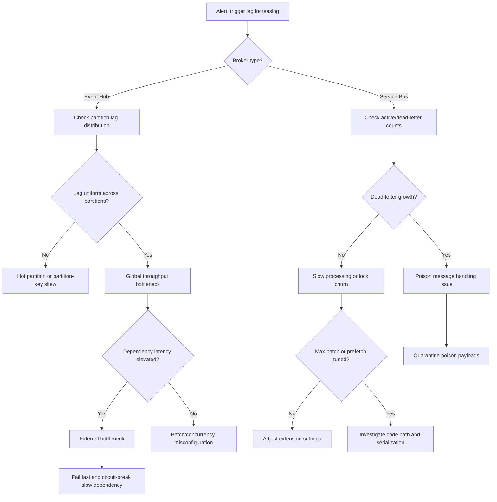
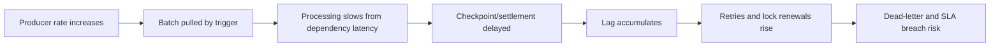
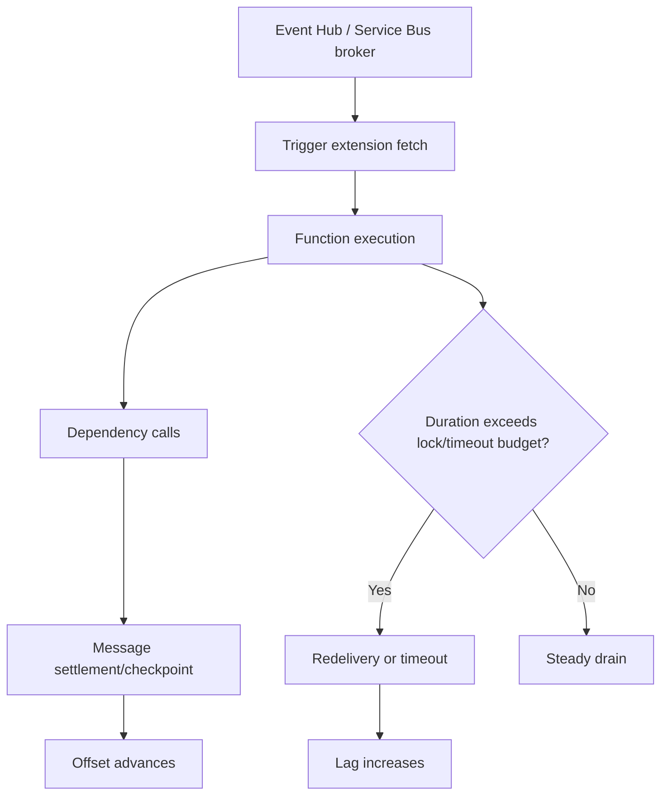

---
content_sources:
  - type: mslearn-adapted
    url: https://learn.microsoft.com/azure/azure-functions/functions-bindings-event-hubs
  - type: mslearn-adapted
    url: https://learn.microsoft.com/azure/azure-functions/functions-bindings-service-bus
  - type: mslearn-adapted
    url: https://learn.microsoft.com/azure/azure-functions/analyze-telemetry-data
  - type: mslearn-adapted
    url: https://learn.microsoft.com/azure/event-hubs/event-hubs-features
  - type: mslearn-adapted
    url: https://learn.microsoft.com/azure/service-bus-messaging/service-bus-messaging-exceptions
---

# Event Hub / Service Bus Trigger Lag
## 1. Summary
Trigger lag incidents happen when ingestion rate outpaces effective processing throughput, causing Event Hub partition backlog or Service Bus queue/subscription depth to grow over time. Lag is not only a scale problem; it is often a checkpoint progression problem where functions pull messages but fail to complete fast enough, fail to settle messages, or repeatedly reprocess poison payloads.

This playbook separates broker-side pressure from function-side bottlenecks, then validates whether lag originates from partition imbalance, lock renewal issues, dependency latency, host extension misconfiguration, or poison-message loops. It emphasizes evidence-driven triage so responders avoid over-scaling compute when the bottleneck is downstream I/O or message-level faults.

### Decision Flow
<!-- diagram-id: decision-flow -->


### Severity guidance
| Condition | Severity | Action priority |
|---|---|---|
| Lag within warning threshold, no customer-visible delay | Sev3 | Investigate in same day and tune config safely |
| Sustained lag growth >30 minutes, delayed processing SLO breach | Sev2 | Mitigate within 30 minutes and protect downstream |
| Critical workflow delay with contractual impact or message loss risk | Sev1 | Immediate containment, incident bridge, controlled throttle |

### Signal snapshot
| Signal | Normal | Incident |
|---|---|---|
| Event Hub partition lag | Bounded, oscillating around steady state | One or more partitions continuously increasing |
| Service Bus active message count | Drains between producer bursts | Queue/subscription depth increases monotonically |
| Function processing duration (`FunctionAppLogs` / `requests`) | Stable p95 and bounded max | p95/p99 climb with periodic timeout/retry |
| Dependency latency (`dependencies`) | Low variance, low failure | High tail latency, transient network errors |
| Dead-letter / poison count | Rare and isolated | Sharp increase with repeated same message pattern |

## 2. Common Misreadings
| Misreading | Why incorrect | Correct interpretation |
|---|---|---|
| "Lag means we only need more instances" | Scaling out does not help if checkpoint does not advance or dependency is bottlenecked | Confirm checkpoint, lock, and dependency health before scaling |
| "No dead-letter means no bad messages" | Poison loops can occur before dead-letter thresholds are reached | Inspect delivery count distribution and repeated exception signatures |
| "Equal CPU usage means healthy consumers" | CPU can stay moderate while waiting on network/database calls | Combine compute metrics with `dependencies` latency and settlement time |
| "Large batch size always improves throughput" | Oversized batches increase per-invocation duration and lock-renew risk | Tune batch and concurrency to keep per-message latency bounded |
| "Partition lag is random noise" | Persistent skew usually indicates key distribution or partition hot spots | Compare partition-level lag trend and key cardinality |

## 3. Competing Hypotheses
| ID | Hypothesis | Confirming signal | Disproving signal |
|---|---|---|---|
| H1 | Consumer throughput too low due to `maxBatchSize`/concurrency misconfiguration | Processing duration increases with low message completion per execution | Throughput remains high and stable despite lag growth |
| H2 | Poison messages repeatedly fail and block checkpoint progression | Repeated exceptions for same message IDs, rising delivery count/dead-letter | No repeated IDs and low exception recurrence |
| H3 | Dependency/network latency to broker or downstream service slows settlement | `dependencies` p95/p99 spikes coincide with lag increase | Dependency latency stable during lag window |
| H4 | Event Hub partition imbalance causes localized backlog growth | One partition dominates lag while others drain | Lag uniformly distributed with no hot partition |
| H5 | Service Bus lock renewal/settlement issues trigger redelivery | Lock lost or settlement errors in `traces`/`FunctionAppLogs` | No lock-related errors and successful completion ratio remains high |
| H6 | Function timeout or long-running handler prevents checkpoint progress | Timeout and cancellation logs coincide with lag acceleration | No timeout/cancellation and fast completion per batch |

## 4. What to Check First
1. Confirm whether lag increase is global or isolated (partition, queue, subscription, consumer group).
2. Check processing duration trend and exception rate in Application Insights over the same period.
3. Validate extension settings in `host.json` for Event Hub/Service Bus batch, prefetch, and concurrency.
4. Inspect dead-letter and delivery count indicators for poison-message behavior.

### Quick portal checks
- In Event Hub or Service Bus metrics, compare incoming rate versus completed/processed rate.
- In Function App monitor view, identify top failing trigger functions and recent execution duration drift.
- In Application Insights, inspect `dependencies` latency to broker and downstream services.

### Quick CLI checks
```bash
az eventhubs eventhub show --name <event-hub-name> --namespace-name <event-hubs-namespace> --resource-group <resource-group> --output table
az servicebus queue show --name <queue-name> --namespace-name <service-bus-namespace> --resource-group <resource-group> --output table
az monitor log-analytics query --workspace "$WORKSPACE_ID" --analytics-query "FunctionAppLogs | where TimeGenerated > ago(30m) | where Message has_any ('lag','checkpoint','lock lost','dead-letter','timeout') | project TimeGenerated, Level, Message | take 30" --output table
```

### Example output
```text
Name                 PartitionCount    MessageRetentionInDays
-------------------  ----------------  ----------------------
orders-telemetry     8                 3

Name                 CountDetailsActiveMessageCount  CountDetailsDeadLetterMessageCount
-------------------  ------------------------------  ---------------------------------
orders-processing    187420                           821

TimeGenerated                 Level    Message
----------------------------  -------  ---------------------------------------------------------------------------
2026-04-05T03:25:12Z          Warning  EventHub trigger lag increasing for partition 5; checkpoint delay exceeded threshold
2026-04-05T03:25:20Z          Error    ServiceBusException: MessageLockLost while completing message xxxxxxxx-xxxx-xxxx-xxxx-xxxxxxxxxxxx
2026-04-05T03:25:41Z          Warning  Processing duration exceeded expected envelope for batch size 512
```

## 5. Evidence to Collect
!!! note "KQL Table Names"
    Most queries use Application Insights table names (`traces`, `requests`, `dependencies`) with classic columns (`timestamp`, `duration`). `FunctionAppLogs` and `AppMetrics` are Log Analytics tables and use `TimeGenerated`.

| Source | Query/Command | Purpose |
|---|---|---|
| `FunctionAppLogs` | Trigger execution duration, batch size, checkpoint and lock messages | Detect processing slowdown and settlement failures |
| `dependencies` | Broker/downstream latency and result code trend | Confirm external latency bottleneck |
| `traces` | Exception signatures, lock lost, retry behavior | Identify poison loop and lock renewal patterns |
| `requests` | Invocation duration percentiles by function | Quantify runtime impact window |
| `AppMetrics` | Custom lag metrics by partition/subscription | Measure lag slope and hotspot distribution |
| Event Hub metrics | Incoming messages, outgoing messages, throttle indicators | Distinguish producer burst from consumer shortfall |
| Service Bus metrics | Active, dead-letter, scheduled, transfer dead-letter counts | Validate queue health and poison escalation |
| `host.json` in deployment artifact | Effective extension settings for batch/prefetch/concurrency | Validate tuning assumptions |

## 6. Validation and Disproof by Hypothesis
### H1: Batch and concurrency settings limit effective throughput
#### Confirming KQL
```kusto
FunctionAppLogs
| where TimeGenerated > ago(6h)
| where Message has_any ("EventHubTrigger", "ServiceBusTrigger", "Processed", "batch")
| extend BatchSize = toint(extract("batch.*?(\\d+)", 1, Message))
| extend DurationMs = toreal(extract("duration.*?(\\d+\\.?\\d*)", 1, Message))
| summarize AvgBatch=avg(BatchSize), P95Duration=percentile(DurationMs, 95), Runs=count() by FunctionName, bin(TimeGenerated, 15m)
| order by P95Duration desc
```

#### Expected output
```text
FunctionName                 TimeGenerated            AvgBatch  P95Duration  Runs
---------------------------  -----------------------  --------  -----------  ----
ProcessOrdersEventHub        2026-04-05T03:15:00Z    512       187000       124
ProcessOrdersEventHub        2026-04-05T03:30:00Z    512       194500       118
ApplyPaymentsServiceBus      2026-04-05T03:30:00Z    256       142200       96
```

#### Disproving check
If duration stays low while lag grows, misconfiguration is less likely. Shift analysis to partition skew, poison loops, or upstream producer surge.

### H2: Poison message retries block forward progress
#### Confirming KQL
```kusto
traces
| where timestamp > ago(6h)
| where message has_any ("dead-letter", "poison", "DeliveryCount", "MessageLockLost", "Abandon")
| extend FunctionName=tostring(customDimensions.FunctionName)
| extend MessageId=tostring(customDimensions.MessageId)
| summarize Attempts=count(), FirstSeen=min(timestamp), LastSeen=max(timestamp) by FunctionName, MessageId
| where Attempts >= 3
| order by Attempts desc
```

#### Expected output
```text
FunctionName              MessageId                               Attempts  FirstSeen                 LastSeen
------------------------  --------------------------------------  --------  ------------------------  ------------------------
ApplyPaymentsServiceBus   xxxxxxxx-xxxx-xxxx-xxxx-xxxxxxxxxxxx    19        2026-04-05T02:40:03Z      2026-04-05T03:31:17Z
ApplyPaymentsServiceBus   xxxxxxxx-xxxx-xxxx-xxxx-xxxxxxxxxxxx    14        2026-04-05T02:51:50Z      2026-04-05T03:26:09Z
```

#### Disproving check
If repeated message IDs are absent and dead-letter remains flat, poison-message loops are unlikely primary; evaluate throughput and dependency latency hypotheses.

### H3: Dependency and broker latency regression slows processing
#### Confirming KQL
```kusto
dependencies
| where timestamp > ago(6h)
| where target has_any ("servicebus.windows.net", "eventhub.windows.net", "database.windows.net", "vault.azure.net")
| summarize Count=count(), Failures=countif(success == false), P95=percentile(duration, 95), P99=percentile(duration, 99) by target, name, bin(timestamp, 15m)
| order by P99 desc
```

#### Expected output
```text
target                                  name              Count  Failures  P95     P99
--------------------------------------  ----------------  -----  --------  ------  ------
contoso-bus.servicebus.windows.net      CompleteMessage   1820   96        48000   111000
contoso-hub.servicebus.windows.net      ReceiveMessages   2410   131       39000   94000
contoso-sql.database.windows.net        ExecuteReader     920    67        61000   149000
```

#### Disproving check
If dependency latency and failures remain steady across incident windows, external systems are less likely root cause; inspect in-process serialization cost or checkpoint logic.

### H4: Event Hub partition skew creates hot partitions
#### Confirming KQL
```kusto
AppMetrics
| where TimeGenerated > ago(6h)
| where Name has "eventhub_partition_lag"
| extend PartitionId=tostring(Properties.PartitionId)
| summarize AvgLag=avg(Value), MaxLag=max(Value) by PartitionId, bin(TimeGenerated, 15m)
| order by MaxLag desc
```

#### Expected output
```text
PartitionId  TimeGenerated            AvgLag   MaxLag
-----------  -----------------------  -------  -------
5            2026-04-05T03:15:00Z    18422    23381
5            2026-04-05T03:30:00Z    19641    24810
2            2026-04-05T03:30:00Z    1211     1922
7            2026-04-05T03:30:00Z    944      1510
```

#### Disproving check
If lag is uniform across partitions with similar growth rates, partition skew is not the lead cause; inspect global throughput, dependency bottlenecks, or throttling.

### H5: Service Bus lock renewal and settlement failures cause redelivery churn
#### Confirming KQL
```kusto
FunctionAppLogs
| where TimeGenerated > ago(6h)
| where Message has_any ("MessageLockLost", "lock expired", "CompleteAsync", "Abandon", "RenewLock")
| extend FunctionName = tostring(FunctionName)
| summarize LockErrors=count(), DistinctOps=dcount(FunctionInvocationId) by FunctionName, bin(TimeGenerated, 15m)
| order by LockErrors desc
```

#### Expected output
```text
FunctionName              TimeGenerated            LockErrors  DistinctOps
------------------------  -----------------------  ----------  -----------
ApplyPaymentsServiceBus   2026-04-05T03:15:00Z    84          63
ApplyPaymentsServiceBus   2026-04-05T03:30:00Z    96          71
```

#### Disproving check
If lock-related errors are negligible and completion succeeds consistently, settlement churn is unlikely and focus should return to batch and dependency constraints.

### H6: Trigger handler timeout prevents checkpoint advancement
#### Confirming KQL
```kusto
FunctionAppLogs
| where TimeGenerated > ago(6h)
| where Message has_any ("FunctionTimeoutException", "Execution was canceled")
| summarize TimeoutCount=count(), LastSeen=max(TimeGenerated) by FunctionName
| order by TimeoutCount desc
```

#### Expected output
```text
FunctionName               TimeoutCount  LastSeen
-------------------------  ------------  ------------------------
ProcessOrdersEventHub      51            2026-04-05T03:43:09Z
ApplyPaymentsServiceBus    28            2026-04-05T03:41:55Z
```

#### Disproving check
If no timeout/cancellation signatures appear, checkpoint blockage likely originates from message-level failures or lock handling rather than runtime timeout boundary.

### Failure Progression Timeline
<!-- diagram-id: failure-progression-timeline -->


### Broker-to-Function Bottleneck Map
<!-- diagram-id: broker-to-function-bottleneck-map -->


### Correlation Queries for Fast Triage
#### Lag slope versus processing duration
```kusto
let lagSeries = AppMetrics
| where TimeGenerated > ago(3h)
| where Name has_any ("eventhub_partition_lag", "servicebus_queue_lag")
| summarize LagValue=avg(Value) by bin(TimeGenerated, 5m);
let durationSeries = requests
| where timestamp > ago(3h)
| summarize P95Duration=percentile(duration,95) by bin(timestamp, 5m);
lagSeries
| join kind=inner durationSeries on $left.TimeGenerated == $right.timestamp
| project TimeGenerated, LagValue, P95Duration
| order by TimeGenerated asc
```

```text
TimeGenerated            LagValue  P95Duration
----------------------   --------  -----------
2026-04-05T03:10:00Z     8221      111000
2026-04-05T03:15:00Z     9304      129000
2026-04-05T03:20:00Z     10980     148000
2026-04-05T03:25:00Z     12410     171000
```

#### Service Bus lock failures by instance
```kusto
FunctionAppLogs
| where TimeGenerated > ago(3h)
| where Message has_any ("MessageLockLost", "lock expired", "RenewLock")
| summarize LockErrors=count() by RoleInstance, bin(TimeGenerated, 5m)
| order by TimeGenerated desc
```

```text
RoleInstance     TimeGenerated            LockErrors
---------------  -----------------------  ----------
instance-01      2026-04-05T03:30:00Z    17
instance-01      2026-04-05T03:25:00Z    14
instance-03      2026-04-05T03:25:00Z    5
```

#### Dependency failures during lag acceleration
```kusto
dependencies
| where timestamp > ago(3h)
| where target has_any ("servicebus.windows.net", "eventhub.windows.net", "database.windows.net")
| summarize Failures=countif(success == false), P99=percentile(duration,99) by target, bin(timestamp, 5m)
| order by timestamp desc
```

```text
target                                  timestamp                Failures  P99
--------------------------------------  -----------------------  --------  ------
contoso-bus.servicebus.windows.net      2026-04-05T03:30:00Z    22        118000
contoso-hub.servicebus.windows.net      2026-04-05T03:30:00Z    19        97000
contoso-sql.database.windows.net        2026-04-05T03:30:00Z    11        146000
```

#### Interpretation
When lag slope and p95 duration rise together, throughput is constrained by processing latency. If lock errors concentrate on a subset of instances, prioritize instance-level diagnostics and lock-renew tuning before global scaling.

## 7. Likely Root Cause Patterns
| Pattern | Evidence signature | Frequency |
|---|---|---|
| Overlarge batch size with insufficient concurrency | High per-run duration and low completion throughput | High |
| Poison message loop before dead-letter threshold | Repeated exception with same `MessageId` and growing delivery count | High |
| Dependency tail latency or intermittent network errors | `dependencies` p99 surge with correlated lag slope increase | Medium |
| Event Hub partition key skew / hot partition | One partition lag dominates while others remain near baseline | Medium |
| Lock lost and settlement churn in Service Bus | `MessageLockLost` spikes and high redelivery | Medium |

## 8. Immediate Mitigations
1. Reduce per-invocation processing time by right-sizing batch and concurrency in `host.json` and redeploy quickly.

```json
{
  "version": "2.0",
  "extensions": {
    "eventHubs": {
      "maxBatchSize": 256,
      "prefetchCount": 512,
      "batchCheckpointFrequency": 1
    },
    "serviceBus": {
      "maxConcurrentCalls": 32,
      "prefetchCount": 256,
      "maxAutoLockRenewalDuration": "00:10:00"
    }
  }
}
```

2. Quarantine poison messages: for Service Bus, configure `maxDeliveryCount` to dead-letter repeated failures quickly. For Event Hub, add application-level exception handling to skip poison payloads and log them for offline analysis.

   ```bash
   # Check Service Bus dead-letter count and queue health
   az servicebus queue show --name <queue-name> --namespace-name <service-bus-namespace> --resource-group <resource-group> --query "{activeMessageCount:countDetails.activeMessageCount, deadLetterMessageCount:countDetails.deadLetterMessageCount}" --output table
   ```

3. Validate broker and downstream latency before scaling out consumers blindly:

```bash
az monitor log-analytics query --workspace "$WORKSPACE_ID" --analytics-query "dependencies | where timestamp > ago(30m) | summarize p95=percentile(duration,95), failures=countif(success == false) by target" --output table
```

4. Temporarily throttle producer throughput or apply backpressure policy to stop uncontrolled lag growth while draining backlog.

```bash
az eventhubs eventhub authorization-rule keys list --name <rule-name> --eventhub-name <event-hub-name> --namespace-name <event-hubs-namespace> --resource-group <resource-group> --output table
```

!!! note
    Producer throttling is application-specific. The auth key listed above is for connection verification, not throttling. Coordinate with the upstream producer team to reduce send rate.

5. Increase partition count only when partition skew and sustained producer throughput justify repartitioning plan.

```bash
az eventhubs eventhub update --name <event-hub-name> --namespace-name <event-hubs-namespace> --resource-group <resource-group> --partition-count 16 --output table
```

6. Redeploy with validated extension settings and monitor lag slope every 5 minutes until stable decline is confirmed.

```bash
az functionapp deployment source config-zip --name <app-name> --resource-group <resource-group> --src <path-to-package.zip>
```

## 9. Prevention
1. Set explicit lag SLOs (partition, queue, subscription) and alert on slope, not only absolute depth.
2. Treat poison handling as first-class design: classify non-retryable exceptions and dead-letter quickly.
3. Keep processing idempotent and checkpoint-safe so retries do not block progress or duplicate effects.
4. Baseline dependency p95/p99 and enforce timeout budgets so batch runs stay within lock and execution envelopes.
5. Validate `host.json` extension tuning in load tests for realistic producer bursts before release.

## See Also
- [Troubleshooting Architecture](../../architecture.md)
- [Troubleshooting Methodology](../../methodology.md)
- [Troubleshooting KQL Guide](../../kql.md)
- [Event Hub checkpoint lag lab guide](../../lab-guides/event-hub-checkpoint-lag.md)
- [Timeout / Execution Time Limit Exceeded](./timeout-execution-limit.md)

## Sources
- [Azure Functions Event Hubs trigger and bindings](https://learn.microsoft.com/azure/azure-functions/functions-bindings-event-hubs)
- [Azure Functions Service Bus trigger and bindings](https://learn.microsoft.com/azure/azure-functions/functions-bindings-service-bus)
- [Monitor Azure Functions](https://learn.microsoft.com/azure/azure-functions/analyze-telemetry-data)
- [Azure Event Hubs features and performance](https://learn.microsoft.com/azure/event-hubs/event-hubs-features)
- [Azure Service Bus messaging exceptions and handling](https://learn.microsoft.com/azure/service-bus-messaging/service-bus-messaging-exceptions)
