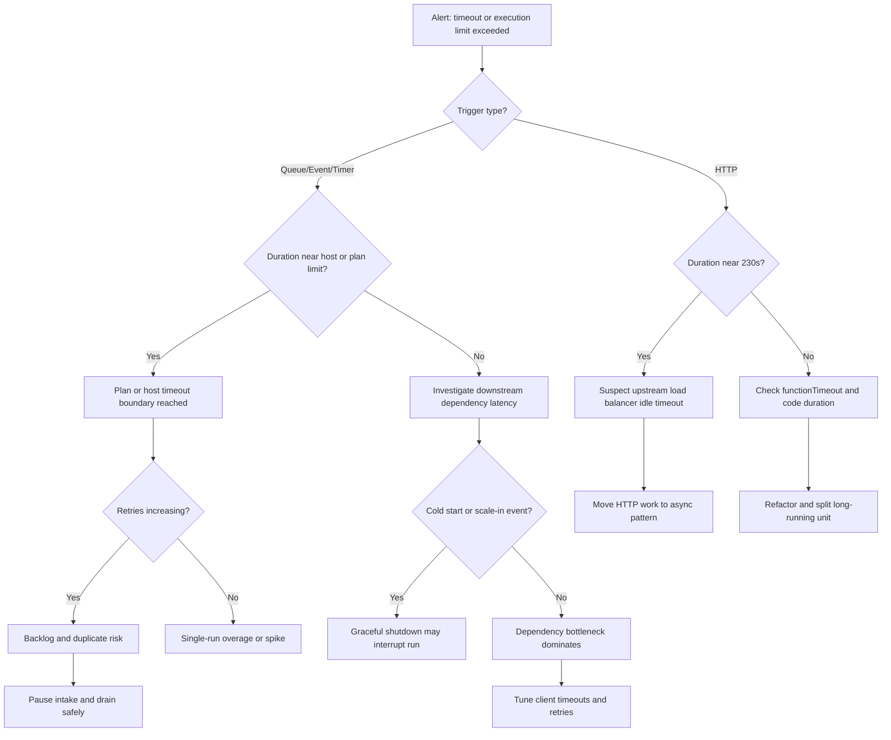
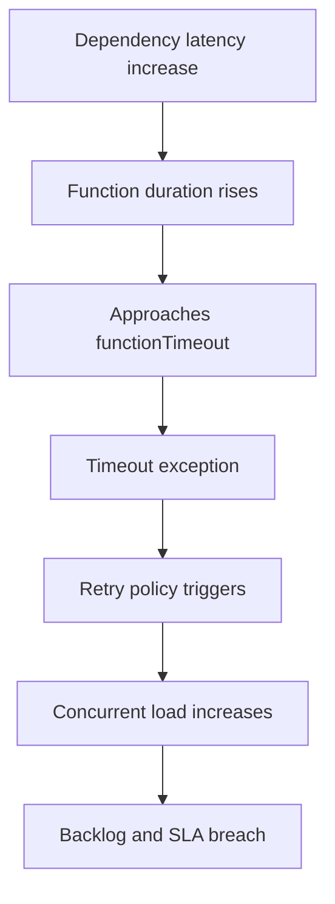
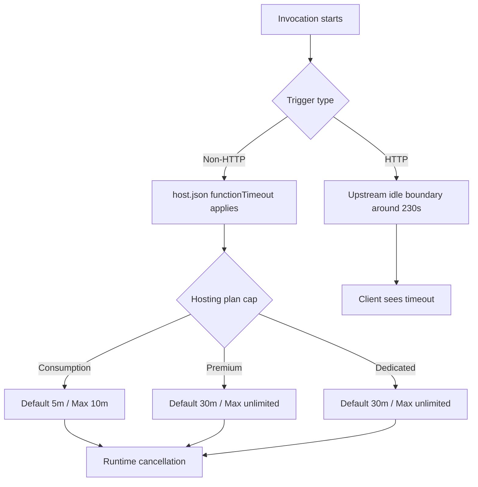

---
content_sources:
  - type: mslearn-adapted
    url: https://learn.microsoft.com/azure/azure-functions/functions-scale
  - type: mslearn-adapted
    url: https://learn.microsoft.com/azure/azure-functions/functions-host-json
  - type: mslearn-adapted
    url: https://learn.microsoft.com/azure/azure-functions/performance-reliability
  - type: mslearn-adapted
    url: https://learn.microsoft.com/azure/azure-functions/functions-bindings-http-webhook-trigger
  - type: mslearn-adapted
    url: https://learn.microsoft.com/azure/azure-functions/analyze-telemetry-data
content_validation:
  status: verified
  last_reviewed: 2026-04-12
  reviewer: agent
  core_claims:
    - claim: "Timeout / Execution Time Limit Exceeded 관련 핵심 진단 절차와 운영 판단 기준"
      source: https://learn.microsoft.com/azure/azure-functions/functions-scale
      verified: true
---

# Timeout / Execution Time Limit Exceeded
## 1. Summary
Timeout incidents occur when function execution exceeds platform, host, or upstream gateway limits, leading to abrupt termination, retries, partial side effects, and backlog growth. In Azure Functions, the effective limit is the minimum across hosting plan limits, `host.json` `functionTimeout`, trigger protocol behavior, and any front-door/load-balancer idle timeout in front of HTTP triggers.

This playbook isolates whether the timeout is caused by hard platform enforcement, host-level configuration, workload regression, orchestration misuse, dependency slowness, or HTTP request path constraints. It also distinguishes graceful cancellation from hard process termination so responders can choose fast mitigation without introducing duplicate processing or data corruption.

### Decision Flow
<!-- diagram-id: decision-flow -->


### Severity guidance
| Condition | Severity | Action priority |
|---|---|---|
| Single function timing out intermittently, no backlog growth, no business SLA impact | Sev3 | Diagnose within business hours; gather baseline evidence before changes |
| Repeated timeout errors with retry storm and growing queue/event lag | Sev2 | Start mitigation in <30 minutes; reduce pressure and protect downstream |
| Critical workflow unavailable, customer-facing HTTP failures, data loss risk | Sev1 | Execute immediate containment; shift to async/degraded mode and incident bridge |

### Signal snapshot
| Signal | Normal | Incident |
|---|---|---|
| `FunctionAppLogs` timeout messages | None or rare deployment transient | Frequent `FunctionTimeoutException`, execution canceled, host threshold exceeded |
| `requests` duration p95/p99 | Stable under workload envelope | Step increase near fixed ceiling (for HTTP often ~230s) |
| `dependencies` duration and failure rate | Bounded latency with low failures | Tail latency spikes and timeout failures propagate to function runtime |
| Retry count per invocation path | Near zero for idempotent workload | Burst retries with duplicate side effects or dead-letter growth |
| Queue/Event lag (`AppMetrics` custom lag metric) | Within SLO target window | Sustained lag increase even when compute scales |

## 2. Common Misreadings
| Misreading | Why incorrect | Correct interpretation |
|---|---|---|
| "Timeout means CPU saturation only" | CPU can be normal while waiting on I/O, lock contention, or throttled dependency | Timeout is elapsed wall-clock; profile dependency, serialization, and wait states |
| "Increasing retries will resolve timeouts" | Retries can amplify load and increase end-to-end duration | Reduce work per invocation and gate retries with backoff and dead-letter policy |
| "Premium always removes timeout risk" | Premium has default and maximum host timeout constraints unless configured appropriately | Validate plan limits and `functionTimeout` alignment with workload behavior |
| "HTTP trigger timeout equals function host timeout" | HTTP request path may be terminated by upstream/load balancer before host timeout | 230-second boundary often indicates gateway idle timeout, not host limit |
| "No exception in app code means function completed" | Host can terminate execution during scale-in or hard timeout without custom catch block | Use platform logs and invocation status to verify completion semantics |

## 3. Competing Hypotheses
| ID | Hypothesis | Confirming signal | Disproving signal |
|---|---|---|---|
| H1 | `host.json` `functionTimeout` too low for current workload profile | Timeout events cluster close to configured threshold | Actual durations far below configured threshold |
| H2 | Plan-level hard ceiling reached (Consumption/Premium/Dedicated behavior mismatch) | Timeouts align with plan boundary and scale profile | Same code succeeds on plan with higher effective limit without other changes |
| H3 | HTTP request path terminated by 230s load balancer idle timeout | HTTP requests fail near 230s while background execution may continue | Non-HTTP triggers show identical boundary and failure signature |
| H4 | Dependency latency regression drives over-limit execution | `dependencies` p95/p99 spike before timeout events | Dependency latency stable while function duration spikes from compute-only path |
| H5 | Long-running orchestrations/activities not partitioned correctly | Durable or workflow steps exceed safe unit duration repeatedly | Step-level metrics show short bounded activities with no long tail |
| H6 | Scale-in or shutdown interrupts execution before completion | Logs show host shutdown/cancellation near timeout window | No shutdown markers; only deterministic workload-duration overrun |

## 4. What to Check First
1. Confirm trigger type and user impact scope (HTTP error rate, queue lag, event lag, duplicate effects).
2. Verify hosting plan, current `host.json` `functionTimeout`, and whether deployment recently changed timeout-related settings.
3. Correlate timeout timestamps with dependency latency, retries, and scale events.
4. Determine whether failures are hard kills, graceful cancellations, or upstream HTTP path cutoffs.

### Quick portal checks
- In Function App -> Diagnose and solve problems, review "Function execution and errors" for timeout spike timing.
- In Application Insights -> Failures and Performance, compare request duration p95 versus timeout incidents.
- In Configuration and App Files view, validate currently deployed `host.json` contains expected `functionTimeout` value.

### Quick CLI checks
```bash
az functionapp show --name <app-name> --resource-group <resource-group> --query "{kind:kind,state:state,defaultHostName:defaultHostName}" --output table
az functionapp config appsettings list --name <app-name> --resource-group <resource-group> --output table
az monitor log-analytics query --workspace "$WORKSPACE_ID" --analytics-query "FunctionAppLogs | where TimeGenerated > ago(30m) | where Message has_any ('timeout','FunctionTimeoutException','Execution was canceled') | project TimeGenerated, Level, Message | take 20" --output table
```

### Example output
```text
Name                          Value
----------------------------  ---------------------------------------------
kind                          functionapp,linux
state                         Running
defaultHostName               contoso-func-timeout.azurewebsites.net

Name                          Value
----------------------------  ---------------------------------------------
FUNCTIONS_WORKER_RUNTIME      python
FUNCTIONS_EXTENSION_VERSION   ~4
WEBSITE_RUN_FROM_PACKAGE      1
APPINSIGHTS_INSTRUMENTATIONKEY xxxxxxxx-xxxx-xxxx-xxxx-xxxxxxxxxxxx

TimeGenerated                 Level    Message
----------------------------  -------  --------------------------------------------------------------------
2026-04-05T02:11:06Z          Error    FunctionTimeoutException: Timeout value of 00:10:00 exceeded by function ProcessInvoiceBatch
2026-04-05T02:11:06Z          Warning  Execution was canceled by host runtime due to timeout threshold
2026-04-05T02:13:40Z          Error    Request execution exceeded configured timeout for function ProcessInvoiceBatch
```

## 5. Evidence to Collect
!!! note "KQL Table Names"
    Most queries use Application Insights table names (`traces`, `requests`, `dependencies`) with classic columns (`timestamp`, `duration`). `FunctionAppLogs` and `AppMetrics` are Log Analytics tables and use `TimeGenerated`.

| Source | Query/Command | Purpose |
|---|---|---|
| `FunctionAppLogs` | Timeout/error pattern query by function name and operation ID | Identify exact timeout signature and impacted handlers |
| `requests` | Duration trend and percentile window around incident | Distinguish broad latency increase vs fixed-threshold cutoff |
| `dependencies` | Outbound call duration/failure correlation | Verify upstream dependency regression as root cause candidate |
| `traces` | Host lifecycle events (`stopping`, `shutdown`, cancellation) | Separate graceful shutdown interruption from hard timeout |
| `AppMetrics` | Custom lag/backlog metrics from queue/event pipeline | Quantify downstream impact and mitigation urgency |
| Azure Activity Log | Deployment/configuration updates within incident window | Correlate behavior change with release/config drift |
| `host.json` artifact | Runtime timeout and extension settings from deployed package | Validate intended versus effective runtime constraints |
| Dead-letter or poison queue count | Queue/topic inspection command and metrics | Confirm timeout-induced retries and poisoned workloads |

## 6. Validation and Disproof by Hypothesis
### H1: `functionTimeout` configuration is too low for current workload
#### Confirming KQL
```kusto
FunctionAppLogs
| where TimeGenerated > ago(6h)
| where Message has_any ("FunctionTimeoutException", "Timeout value", "Execution was canceled")
| summarize TimeoutCount=count(), FirstSeen=min(TimeGenerated), LastSeen=max(TimeGenerated) by FunctionName
| order by TimeoutCount desc
```

#### Expected output
```text
FunctionName            TimeoutCount  FirstSeen                 LastSeen
----------------------  ------------  ------------------------  ------------------------
ProcessInvoiceBatch     43            2026-04-05T00:04:11Z      2026-04-05T05:56:20Z
ReconcileOrders         17            2026-04-05T01:20:34Z      2026-04-05T05:44:51Z
```

#### Disproving check
If timeout events are absent or durations remain comfortably below the configured threshold, inspect dependency and lock contention hypotheses before changing `functionTimeout`.

### H2: Hosting plan limit is the active boundary
#### Confirming KQL
```kusto
requests
| where timestamp > ago(6h)
| where cloud_RoleName =~ "contoso-func-timeout"
| summarize p50=percentile(duration, 50), p95=percentile(duration, 95), p99=percentile(duration, 99), max=max(duration) by bin(timestamp, 15m)
| order by timestamp asc
```

#### Expected output
```text
timestamp                p50     p95      p99      max
----------------------   ------  -------  -------  -------
2026-04-05T01:00:00Z     1200    284000   598000   600000
2026-04-05T01:15:00Z     1300    289500   599400   600000
2026-04-05T01:30:00Z     1250    291000   600000   600000
```

#### Disproving check
If max duration varies widely and does not cluster near known boundaries (for example 600000 ms for 10 minutes), plan ceiling is unlikely primary; investigate workload variance or dependency stalls.

### H3: HTTP trigger path is cut off around 230 seconds by upstream boundary
#### Confirming KQL
```kusto
requests
| where timestamp > ago(6h)
| where name startswith "POST /api/"
| summarize Failures=countif(success == false), p95=percentile(duration, 95), p99=percentile(duration, 99), near230=countif(duration >= 225000 and duration < 235000) by name
| order by near230 desc
```

#### Expected output
```text
name                               Failures  p95      p99      near230
---------------------------------  --------  -------  -------  -------
POST /api/generate-report          128       229400   230100   119
POST /api/sync-catalog             42        227900   230050   37
```

#### Disproving check
If failures occur at diverse durations and non-HTTP triggers fail similarly, do not anchor on the 230-second gateway theory; proceed to shared runtime or dependency analysis.

### H4: Dependency slowdown causes execution to overrun timeout
#### Confirming KQL
```kusto
dependencies
| where timestamp > ago(6h)
| where target has_any ("database.windows.net", "servicebus.windows.net", "blob.core.windows.net")
| summarize depCount=count(), depFail=countif(success == false), depP95=percentile(duration, 95), depP99=percentile(duration, 99) by name, target, bin(timestamp, 15m)
| order by depP99 desc
```

#### Expected output
```text
name                 target                       depCount  depFail  depP95   depP99
-------------------  ---------------------------  --------  -------  -------  -------
ExecuteReader        contoso-sql.database.windows.net  932      67       84000    168000
SendMessage          contoso-bus.servicebus.windows.net  1210     84       54000    121000
GetBlobProperties    contosodata.blob.core.windows.net  760      19       39000    89000
```

#### Disproving check
If dependency p95/p99 remains stable during the incident while function runtime expands, investigate in-process CPU saturation, serialization bloat, or lock contention in the function code path.

### H5: Durable orchestration/activity granularity is too coarse
#### Confirming KQL
```kusto
traces
| where timestamp > ago(6h)
| where message has_any ("Durable", "orchestrator", "activity")
| extend FunctionName=tostring(customDimensions.FunctionName)
| summarize LongSteps=countif(tolong(customDimensions.DurationMs) > 300000), TotalSteps=count() by FunctionName
| extend LongStepRatio=toreal(LongSteps) / iif(TotalSteps == 0, 1.0, toreal(TotalSteps))
| order by LongStepRatio desc
```

#### Expected output
```text
FunctionName                 LongSteps  TotalSteps  LongStepRatio
---------------------------  ---------  ----------  -------------
InvoiceOrchestrator          215        388         0.554
SettlementOrchestrator       72         310         0.232
```

#### Disproving check
If step-level durations are short and evenly distributed, orchestration granularity is likely adequate; continue with throughput and dependency-latency hypotheses.

### H6: Host shutdown/scale-in interrupts execution near timeout window
#### Confirming KQL
```kusto
traces
| where timestamp > ago(6h)
| where message has_any ("Host is shutting down", "Stopping JobHost", "Cancellation requested", "Drain mode")
| project timestamp, severityLevel, message, operation_Id, cloud_RoleInstance
| order by timestamp desc
```

#### Expected output
```text
timestamp                     severityLevel  message                                      operation_Id                            cloud_RoleInstance
---------------------------   -------------  -------------------------------------------  --------------------------------------  ----------------------
2026-04-05T03:14:22Z          2              Host is shutting down                        xxxxxxxx-xxxx-xxxx-xxxx-xxxxxxxxxxxx    instance-04
2026-04-05T03:14:22Z          2              Cancellation requested for running invocation xxxxxxxx-xxxx-xxxx-xxxx-xxxxxxxxxxxx   instance-04
2026-04-05T03:14:23Z          1              Stopping JobHost                             xxxxxxxx-xxxx-xxxx-xxxx-xxxxxxxxxxxx    instance-04
```

#### Disproving check
If shutdown markers are not present near failed invocations, interruption is more likely from deterministic timeout boundaries rather than scale-in lifecycle events.

### Failure Progression Timeline
<!-- diagram-id: failure-progression-timeline -->


### Timeout Boundary Map
<!-- diagram-id: timeout-boundary-map -->


### Correlation Queries for Fast Triage
#### Timeout burst by operation and instance
```kusto
FunctionAppLogs
| where TimeGenerated > ago(3h)
| where Message has_any ("FunctionTimeoutException", "Execution was canceled", "Timeout value")
| summarize TimeoutCount=count() by bin(TimeGenerated, 5m), FunctionName, RoleInstance
| order by TimeGenerated desc
```

```text
TimeGenerated            FunctionName                              RoleInstance     TimeoutCount
----------------------   --------------------------------------    ---------------  ------------
2026-04-05T03:40:00Z     ProcessInvoiceBatch                       instance-02      7
2026-04-05T03:35:00Z     ProcessInvoiceBatch                       instance-04      6
2026-04-05T03:30:00Z     ReconcileOrders                           instance-02      5
```

#### Requests and dependency join for timeout windows
```kusto
let timeoutOps = FunctionAppLogs
| where TimeGenerated > ago(3h)
| where Message has_any ("FunctionTimeoutException", "Execution was canceled")
| distinct FunctionInvocationId;
requests
| where timestamp > ago(3h)
| join kind=leftouter (
    dependencies
    | where timestamp > ago(3h)
    | summarize depP95=percentile(duration,95), depFail=countif(success == false) by operation_Id
) on $left.operation_Id == $right.operation_Id
| where operation_Id in (timeoutOps)
| project timestamp, name, duration, success, depP95, depFail, operation_Id
| order by timestamp desc
```

```text
timestamp                     name                         duration    success  depP95  depFail  operation_Id
---------------------------   ---------------------------  ----------  -------  ------  -------  --------------------------------------
2026-04-05T03:43:09Z          ProcessInvoiceBatch          600000      false    112000  4        xxxxxxxx-xxxx-xxxx-xxxx-xxxxxxxxxxxx
2026-04-05T03:42:11Z          ReconcileOrders              600000      false    98600   3        xxxxxxxx-xxxx-xxxx-xxxx-xxxxxxxxxxxx
```

#### Host lifecycle check for graceful shutdown overlap
```kusto
traces
| where timestamp > ago(3h)
| where message has_any ("Host is shutting down", "Stopping JobHost", "Drain mode")
| summarize LifecycleEvents=count(), First=min(timestamp), Last=max(timestamp) by cloud_RoleInstance
| order by LifecycleEvents desc
```

```text
cloud_RoleInstance  LifecycleEvents  First                     Last
---------------  ---------------  ------------------------  ------------------------
instance-04      12               2026-04-05T02:58:03Z      2026-04-05T03:36:14Z
instance-02      3                2026-04-05T03:11:40Z      2026-04-05T03:19:08Z
```

#### Interpretation
Use these three queries together when initial evidence is conflicting. If timeout bursts align to a small set of instances and lifecycle events, prioritize scale-transition handling. If timeout bursts align to high dependency p95 with stable lifecycle events, prioritize downstream performance mitigation.

## 7. Likely Root Cause Patterns
| Pattern | Evidence signature | Frequency |
|---|---|---|
| Underestimated runtime with strict `functionTimeout` | Consistent timeout count near exact configured threshold | High |
| HTTP long-running request path misuse | Request failures concentrate near ~230s with front-door/load-balancer path | High |
| Dependency tail-latency regression | `dependencies` p99 surge precedes timeout spikes | Medium |
| Large unchunked orchestration/activity unit | Durable traces show long steps and repeated cancellation | Medium |
| Shutdown overlap during scale transitions | `traces` include host stop/drain markers near failed runs | Low |

## 8. Immediate Mitigations
1. Reduce request-path blast radius for HTTP: return `202 Accepted` quickly and move heavy work to queue/orchestration pipeline, then monitor status asynchronously.
2. Validate and adjust `functionTimeout` only after confirming idempotency and workload shape. Example `host.json` patterns:

```json
{
  "version": "2.0",
  "functionTimeout": "00:10:00"
}
```

```json
{
  "version": "2.0",
  "functionTimeout": "00:30:00"
}
```

```json
{
  "version": "2.0",
  "functionTimeout": "-1"
}
```

!!! warning "Plan restriction"
    `functionTimeout: "-1"` (unlimited) applies only to Premium and Dedicated plans.
    Consumption plans have a hard 10-minute maximum; Flex Consumption allows up to 4 hours.

3. Cap per-invocation work size (batch splitting, pagination, checkpoint boundaries) so each unit finishes well below timeout envelope.
4. Execute rapid dependency health check and fail fast for slow downstream calls to avoid consuming full timeout budget:

```bash
az monitor log-analytics query --workspace "$WORKSPACE_ID" --analytics-query "dependencies | where timestamp > ago(30m) | summarize p95=percentile(duration,95), fail=countif(success == false) by target" --output table
```

5. If retries amplify incident, temporarily reduce intake by scaling upstream producers or pausing non-critical schedules:

```bash
az functionapp config appsettings set --name <app-name> --resource-group <resource-group> --settings "AzureWebJobs.NonCriticalTimer.Disabled=true" --output table
```

6. Capture current config and rollout a controlled mitigation deployment with explicit timeout and retry settings:

```bash
az functionapp deployment source config-zip --name <app-name> --resource-group <resource-group> --src <path-to-package.zip>
```

## 9. Prevention
1. Design every trigger path with explicit time budget and allocate budget per stage (deserialize, business logic, dependency calls, commit).
2. Keep HTTP functions thin; use async handoff for operations that can exceed interactive request windows.
3. Enforce idempotency keys and checkpoint-safe processing so timeout retries do not duplicate side effects.
4. Track p95/p99 duration SLOs and timeout-near-miss metrics in `AppMetrics` with alerting before hard threshold breach.
5. Validate `host.json` timeout values per environment and plan type during CI/CD policy checks.

## See Also
- [Troubleshooting Architecture](../../architecture.md)
- [Troubleshooting Methodology](../../methodology.md)
- [Troubleshooting KQL Guide](../../kql/index.md)
- [Troubleshooting Lab Guides](../../lab-guides/index.md)
- [Event Hub / Service Bus Trigger Lag](./event-hub-service-bus-lag.md)

## Sources
- [Azure Functions hosting options](https://learn.microsoft.com/azure/azure-functions/functions-scale)
- [Azure Functions host.json reference](https://learn.microsoft.com/azure/azure-functions/functions-host-json)
- [Improve performance and reliability of Azure Functions](https://learn.microsoft.com/azure/azure-functions/performance-reliability)
- [Azure Functions HTTP trigger and bindings](https://learn.microsoft.com/azure/azure-functions/functions-bindings-http-webhook-trigger)
- [Monitor Azure Functions](https://learn.microsoft.com/azure/azure-functions/analyze-telemetry-data)
