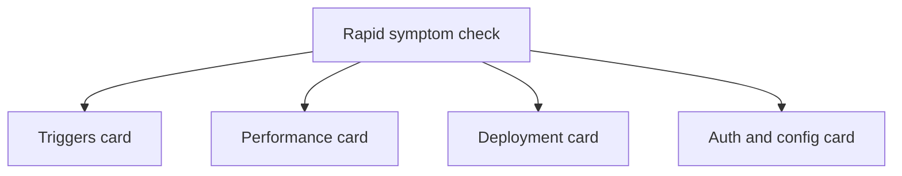
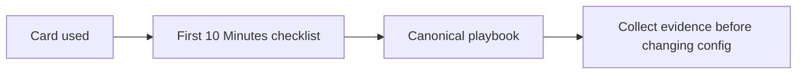

# Quick Diagnosis Cards

Use these cards when you need to route an Azure Functions incident quickly without reading the full playbooks first.

## Rapid triage map

## Card 1: Triggers Not Firing

| If you see | Check first | Then open |
|---|---|---|
| HTTP trigger returns 404 | Function app state, function list, route config | [Functions Not Executing](playbooks/functions-not-executing.md) |
| Queue messages piling up | Connection string, queue name, host.json batch settings | [Queue Piling Up](playbooks/queue-piling-up.md) |
| Blob trigger not firing | Event Grid vs polling mode, storage event subscription | [Blob Trigger Not Firing](playbooks/blob-trigger-not-firing.md) |
| Timer trigger skipping schedules | CRON expression, singleton lock, time zone | [Triggers: Timer Issues](playbooks/triggers/timeout-execution-limit.md) |

## Card 2: Performance and Latency

| If you see | Check first | Then open |
|---|---|---|
| High latency on first request | Cold start, hosting plan type, pre-warming config | [High Latency](playbooks/high-latency.md) |
| Function execution timeout | `functionTimeout` in host.json, hosting plan limits | [Triggers: Timeout](playbooks/triggers/timeout-execution-limit.md) |
| Out of memory or worker crash | Memory usage metrics, large payload handling | [Scaling: OOM Crash](playbooks/scaling/out-of-memory-worker-crash.md) |
| Durable orchestration stuck | History size, replay events, external event wait | [Scaling: Durable Stuck](playbooks/scaling/durable-orchestration-stuck.md) |

## Card 3: Deployment Failures

| If you see | Check first | Then open |
|---|---|---|
| Deployment failed | Activity Log, deployment task output, RBAC | [Deployment Failures](playbooks/deployment-failures.md) |
| Functions not discovered after deploy | Package structure, function.json, worker indexing | [Functions Not Executing](playbooks/functions-not-executing.md) |
| Slot swap issues | Slot-specific settings, sticky config, health check | [Deployment Failures](playbooks/deployment-failures.md) |
| App starts but functions error | Runtime version mismatch, extension bundle version | [Functions Failing](playbooks/functions-failing.md) |

## Card 4: Auth and Configuration

| If you see | Check first | Then open |
|---|---|---|
| Managed identity RBAC failure | Role assignment, scope, identity type | [Auth: MI RBAC Failure](playbooks/auth-config/managed-identity-rbac-failure.md) |
| Connection string errors | App settings, Key Vault reference, slot settings | [Auth: App Settings](playbooks/auth-config/app-settings-misconfiguration.md) |
| 401/403 on HTTP trigger | Auth level, function keys, EasyAuth config | [Functions Failing](playbooks/functions-failing.md) |
| Binding connection failures | Identity-based vs connection-string config | [Auth: App Settings](playbooks/auth-config/app-settings-misconfiguration.md) |

## Escalation rule

## See Also

- [Decision Tree](decision-tree.md)
- [First 10 Minutes](first-10-minutes/index.md)
- [Playbooks](playbooks/index.md)
- [Evidence Map](evidence-map.md)

## Sources

- [Azure Functions documentation](https://learn.microsoft.com/azure/azure-functions/)
- [Troubleshoot Azure Functions](https://learn.microsoft.com/azure/azure-functions/functions-recover-storage-account)
- [Monitor Azure Functions](https://learn.microsoft.com/azure/azure-functions/functions-monitoring)
