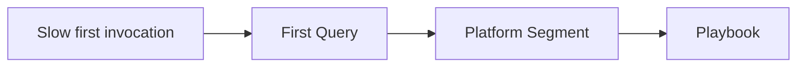
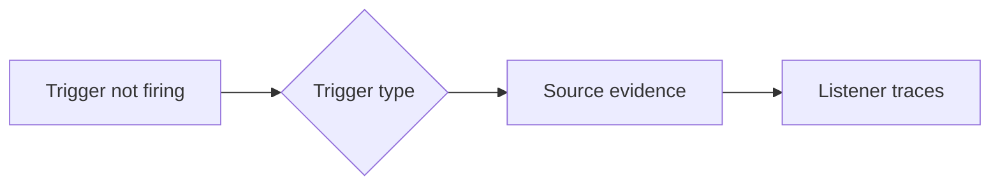
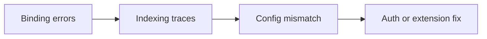
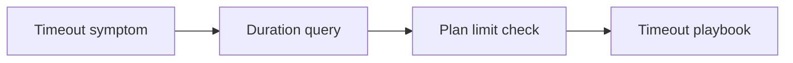
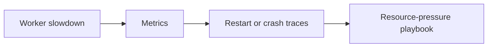
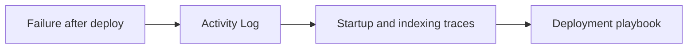
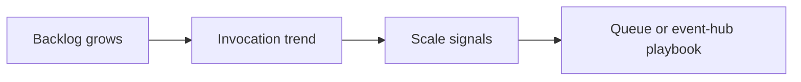

---
content_sources:
  - type: mslearn-adapted
    url: https://learn.microsoft.com/azure/azure-functions/functions-diagnostics
  - type: mslearn-adapted
    url: https://learn.microsoft.com/azure/azure-functions/functions-monitoring
  - type: mslearn-adapted
    url: https://learn.microsoft.com/azure/azure-functions/configure-monitoring
  - type: mslearn-adapted
    url: https://learn.microsoft.com/azure/azure-functions/functions-scale
  - type: mslearn-adapted
    url: https://learn.microsoft.com/azure/azure-functions/functions-triggers-bindings
  - type: mslearn-adapted
    url: https://learn.microsoft.com/azure/azure-functions/functions-host-json
  - type: mslearn-adapted
    url: https://learn.microsoft.com/azure/azure-functions/functions-recover-storage-account
---

# Quick Diagnosis Cards

One-page reference cards for rapid Azure Functions incident triage. Each card maps: **Symptom → First Query → Platform Segment → Playbook**.

Use these when you have 60 seconds to classify the failure before opening the deeper playbooks.

---

## Card 1: Slow First Invocation / Cold Start

<!-- diagram-id: card-1-slow-first-invocation-cold-start -->


| Step | Action |
|---|---|
| **Symptom** | First HTTP request or first trigger execution after idle/restart takes seconds longer than steady-state traffic |
| **First Query** | `AppTraces \| where TimeGenerated > ago(2h) \| where AppRoleName =~ "func-myapp-prod" \| where Message has_any ("Host started", "Initializing Host", "Host lock lease acquired") \| project TimeGenerated, Message \| order by TimeGenerated desc` |
| **What to Look For** | Repeated host startups, large startup gaps before first invocation, or high first-request duration after scale-out |
| **Platform Segment** | Startup / Performance |
| **Playbook** | [High Latency](playbooks/high-latency.md) |

**Quick KQL Check:**

```kusto
let appName = "func-myapp-prod";
traces
| where timestamp > ago(6h)
| where cloud_RoleName =~ appName
| where message has_any ("Host started", "Initializing Host", "Host lock lease acquired")
| summarize StartupEvents=count() by bin(timestamp, 15m)
| join kind=leftouter (
    requests
    | where timestamp > ago(6h)
    | where cloud_RoleName =~ appName
    | where operation_Name startswith "Functions."
    | summarize FirstInvocation=min(timestamp), MinDurationMs=min(toreal(duration / 1ms)) by bin(timestamp, 15m)
) on timestamp
| order by timestamp desc
```

**Quick CLI Check:**

```bash
az monitor log-analytics query --workspace "$WORKSPACE_ID" --analytics-query "AppTraces | where TimeGenerated > ago(2h) | where AppRoleName =~ '$APP_NAME' | where Message has_any ('Host started','Initializing Host','Host lock lease acquired') | project TimeGenerated, Message | order by TimeGenerated desc" --output table
```

---

## Card 2: Trigger Failures by Trigger Type

<!-- diagram-id: card-2-trigger-failures-by-trigger-type -->


| Step | Action |
|---|---|
| **Symptom** | HTTP, Timer, Queue, Event Hub, Blob, or Cosmos DB trigger stops executing while the app still appears available |
| **First Query** | `AppRequests \| where TimeGenerated > ago(1h) \| where AppRoleName =~ "func-myapp-prod" \| where OperationName startswith "Functions." \| summarize Invocations=count(), Failures=countif(Success == false) by OperationName \| order by Invocations asc` |
| **What to Look For** | HTTP: 404/401/5xx patterns. Timer: missing schedule traces or `isPastDue`. Queue: backlog rising while invocations stay flat. Event Hub: checkpoint lag. Blob: missing Event Grid subscription or listener startup. Cosmos DB: lease/checkpoint errors or connection failures. |
| **Platform Segment** | Trigger Listener / Source Delivery |
| **Playbook** | [Functions Not Executing](playbooks/functions-not-executing.md) |

**Quick KQL Check:**

```kusto
let appName = "func-myapp-prod";
let recentInvocations =
requests
| where timestamp > ago(1h)
| where cloud_RoleName =~ appName
| where operation_Name startswith "Functions."
| summarize Invocations=count(), Failures=countif(success == false) by FunctionName=operation_Name;
let recentTriggerTraces =
traces
| where timestamp > ago(1h)
| where cloud_RoleName =~ appName
| where tostring(customDimensions.Category) startswith "Function" or operation_Name startswith "Functions."
| where message has_any ("listener", "Timer", "Blob", "Queue", "EventHub", "Cosmos", "unable to start", "isPastDue")
| summarize TraceHits=count() by FunctionName=operation_Name;
recentInvocations
| join kind=leftouter recentTriggerTraces on FunctionName
| order by Invocations asc, Failures desc
```

> `traces.operation_Name` can include non-function traces. The function-category filter above reduces false matches in trigger-correlation joins.

**Quick CLI Check:**

```bash
az functionapp function list --resource-group "$RG" --name "$APP_NAME" --output table
az monitor log-analytics query --workspace "$WORKSPACE_ID" --analytics-query "AppTraces | where TimeGenerated > ago(1h) | where AppRoleName =~ '$APP_NAME' | where Message has_any ('listener','unable to start','Timer','Blob','Queue','EventHub','Cosmos','isPastDue') | project TimeGenerated, Message | order by TimeGenerated desc" --output table
```

---

## Card 3: Binding and Extension Errors

<!-- diagram-id: card-3-binding-and-extension-errors -->


| Step | Action |
|---|---|
| **Symptom** | Functions fail during host startup or invocation with binding, indexing, serialization, or extension-bundle errors |
| **First Query** | `AppTraces \| where TimeGenerated > ago(2h) \| where AppRoleName =~ "func-myapp-prod" \| where Message has_any ("Error indexing method", "binding", "extension", "Unable to resolve app setting", "Storage account connection string") \| project TimeGenerated, Message \| order by TimeGenerated desc` |
| **What to Look For** | `Error indexing method`, missing app setting names, unsupported binding attributes, wrong extension bundle version, or identity-based connection settings that do not match the binding configuration |
| **Platform Segment** | Runtime / Bindings |
| **Playbook** | [App Settings Misconfiguration](playbooks/auth-config/app-settings-misconfiguration.md) |

**Quick KQL Check:**

```kusto
let appName = "func-myapp-prod";
traces
| where timestamp > ago(2h)
| where cloud_RoleName =~ appName
| where message has_any (
    "Error indexing method",
    "binding",
    "extension",
    "Unable to resolve app setting",
    "Storage account connection string",
    "Microsoft.Azure.WebJobs"
)
| project timestamp, severityLevel, message
| order by timestamp desc
```

**Quick CLI Check:**

```bash
az functionapp config appsettings list --resource-group "$RG" --name "$APP_NAME" --output table
az functionapp config show --resource-group "$RG" --name "$APP_NAME" --output json
```

---

## Card 4: Timeout / Execution Limit Exceeded

<!-- diagram-id: card-4-timeout-execution-limit-exceeded -->


| Step | Action |
|---|---|
| **Symptom** | Invocations end with timeout errors, 230-second HTTP cutoff behavior, or long-running trigger executions that never complete |
| **First Query** | `AppRequests \| where TimeGenerated > ago(2h) \| where AppRoleName =~ "func-myapp-prod" \| where OperationName startswith "Functions." \| summarize P95Ms=percentile(DurationMs, 95), MaxMs=max(DurationMs), Failures=countif(Success == false) by OperationName \| order by MaxMs desc` |
| **What to Look For** | Duration clustering near plan limit, requests ending with timeout-related exceptions, HTTP triggers failing at the front-end timeout boundary, or durable/orchestrated work incorrectly running inside a regular function |
| **Platform Segment** | Execution / Limits |
| **Playbook** | [Timeout / Execution Limit Exceeded](playbooks/triggers/timeout-execution-limit.md) |

**Quick KQL Check:**

```kusto
let appName = "func-myapp-prod";
requests
| where timestamp > ago(2h)
| where cloud_RoleName =~ appName
| where operation_Name startswith "Functions."
| summarize
    Invocations=count(),
    Failures=countif(success == false),
    P95Ms=percentile(duration, 95),
    MaxMs=max(duration)
  by FunctionName=operation_Name
| order by MaxMs desc
```

**Quick CLI Check:**

```bash
az functionapp config appsettings list --resource-group "$RG" --name "$APP_NAME" --output table
az monitor log-analytics query --workspace "$WORKSPACE_ID" --analytics-query "AppExceptions | where TimeGenerated > ago(2h) | where AppRoleName =~ '$APP_NAME' | where OuterMessage has_any ('timeout','timed out','execution time') | project TimeGenerated, ExceptionType, OuterMessage | order by TimeGenerated desc" --output table
```

---

## Card 5: Memory or CPU Exhaustion

<!-- diagram-id: card-5-memory-or-cpu-exhaustion -->


| Step | Action |
|---|---|
| **Symptom** | Throughput drops, worker restarts, OOM kills appear, or CPU-bound functions cause broad latency across multiple triggers |
| **First Query** | `AppTraces \| where TimeGenerated > ago(6h) \| where AppRoleName =~ "func-myapp-prod" \| where Message has_any ("OOM", "OutOfMemory", "worker process started and initialized", "Host is shutting down", "restarting", "health check") \| project TimeGenerated, Message \| order by TimeGenerated desc` |
| **What to Look For** | Restart storms, OOM signatures, high latency across unrelated functions, dependency noise caused by saturation, or queue backlog growth with stable upstream volume |
| **Platform Segment** | Compute / Worker Health |
| **Playbook** | [Out of Memory / Worker Crash](playbooks/scaling/out-of-memory-worker-crash.md) |

**Quick KQL Check:**

```kusto
let appName = "func-myapp-prod";
traces
| where timestamp > ago(6h)
| where cloud_RoleName =~ appName
| where message has_any (
    "OOM",
    "OutOfMemory",
    "worker process started and initialized",
    "Host is shutting down",
    "restarting",
    "health check"
)
| project timestamp, severityLevel, message
| order by timestamp desc
```

**Quick CLI Check:**

```bash
az monitor metrics list --resource "/subscriptions/$SUBSCRIPTION_ID/resourceGroups/$RG/providers/Microsoft.Web/sites/$APP_NAME" --metric "CpuPercentage" "MemoryWorkingSet" "Requests" --interval PT1M --aggregation Average Maximum Total --output table
```

---

## Card 6: Deployment Succeeded but Functions Broke

<!-- diagram-id: card-6-deployment-succeeded-but-functions-broke -->


| Step | Action |
|---|---|
| **Symptom** | Release completed, but functions are missing, returning errors, or no longer processing events immediately afterward |
| **First Query** | `AppTraces \| where TimeGenerated > ago(6h) \| where AppRoleName =~ "func-myapp-prod" \| where Message has_any ("Host started", "Generating", "No job functions found", "Error indexing method", "Syncing triggers") \| project TimeGenerated, Message \| order by TimeGenerated desc` |
| **What to Look For** | `No job functions found`, broken package structure, runtime mismatch, extension load errors, or trigger sync problems introduced at deployment time |
| **Platform Segment** | Deployment / Startup |
| **Playbook** | [Deployment Failures](playbooks/deployment-failures.md) |

**Quick KQL Check:**

```kusto
let appName = "func-myapp-prod";
traces
| where timestamp > ago(6h)
| where cloud_RoleName =~ appName
| where message has_any (
    "Host started",
    "Generating",
    "No job functions found",
    "Error indexing method",
    "Syncing triggers",
    "Worker process started and initialized"
)
| project timestamp, severityLevel, message
| order by timestamp desc
```

**Quick CLI Check:**

```bash
az monitor activity-log list --resource-group "$RG" --offset 6h --max-events 20 --output table
az functionapp function list --resource-group "$RG" --name "$APP_NAME" --output table
az functionapp config appsettings list --resource-group "$RG" --name "$APP_NAME" --output table
```

---

## Card 7: Scale Out Not Keeping Up

<!-- diagram-id: card-7-scale-out-not-keeping-up -->


| Step | Action |
|---|---|
| **Symptom** | Queue depth, Event Hub lag, or pending work grows faster than completions even though the function app is still executing some work |
| **First Query** | `AppRequests \| where TimeGenerated > ago(2h) \| where AppRoleName =~ "func-myapp-prod" \| where OperationName startswith "Functions." \| summarize Invocations=count(), Failures=countif(Success == false), P95Ms=percentile(DurationMs, 95) by bin(TimeGenerated, 5m), OperationName \| order by TimeGenerated asc` |
| **What to Look For** | Flat or weak invocation growth while source volume rises, repeated scale-controller or listener warnings, partition imbalance, checkpoint lag, or one hot partition blocking the rest of the workload |
| **Platform Segment** | Scaling / Throughput |
| **Playbook** | [Queue Piling Up](playbooks/queue-piling-up.md) and [Event Hub / Service Bus Lag](playbooks/triggers/event-hub-service-bus-lag.md) |

**Quick KQL Check:**

```kusto
let appName = "func-myapp-prod";
requests
| where timestamp > ago(2h)
| where cloud_RoleName =~ appName
| where operation_Name startswith "Functions."
| summarize Invocations=count(), Failures=countif(success == false), P95Ms=percentile(duration, 95) by bin(timestamp, 5m), FunctionName=operation_Name
| order by timestamp asc
```

**Quick CLI Check:**

```bash
az monitor metrics list --resource "/subscriptions/$SUBSCRIPTION_ID/resourceGroups/$RG/providers/Microsoft.Web/sites/$APP_NAME" --metric "FunctionExecutionCount" "FunctionExecutionUnits" "Requests" --interval PT5M --aggregation Total Average --output table
az monitor log-analytics query --workspace "$WORKSPACE_ID" --analytics-query "AppTraces | where TimeGenerated > ago(2h) | where AppRoleName =~ '$APP_NAME' | where Message has_any ('scale','partition','checkpoint','listener','backlog') | project TimeGenerated, Message | order by TimeGenerated desc" --output table
```

---

## Universal First 3 Queries

When you do not know where to start, run these three queries first to establish the failure domain.

### Query 1: Function Execution Trend

```kusto
let appName = "func-myapp-prod";
requests
| where timestamp > ago(2h)
| where cloud_RoleName =~ appName
| where operation_Name startswith "Functions."
| summarize total=count(), failed=countif(success == false), p95=percentile(duration, 95) by bin(timestamp, 5m), operation_Name
| order by timestamp asc
```

### Query 2: Host and Listener Events

```kusto
let appName = "func-myapp-prod";
traces
| where timestamp > ago(24h)
| where cloud_RoleName =~ appName
| where message has_any ("Host started", "Host shutdown", "listener", "unable to start", "Error indexing method", "Syncing triggers", "scale")
| project timestamp, severityLevel, message
| order by timestamp desc
```

### Query 3: Dominant Exceptions and Dependencies

```kusto
let appName = "func-myapp-prod";
exceptions
| where timestamp > ago(6h)
| where cloud_RoleName =~ appName
| summarize ExceptionCount=count() by type, outerMessage
| order by ExceptionCount desc
```

---

## Decision Matrix

| Observation | Most Likely Card | Confidence |
|---|---|---|
| First invocation slow after idle or scale event | Card 1 (Cold Start) | High |
| HTTP/Timer/Queue/Event Hub/Blob/Cosmos trigger not firing | Card 2 (Trigger Failures) | High |
| Host startup logs mention indexing, binding, or extension issues | Card 3 (Binding Errors) | High |
| Durations cluster near timeout boundary | Card 4 (Timeout) | High |
| Slowdown followed by worker recycle or OOM traces | Card 5 (Memory/CPU Exhaustion) | High |
| Incident begins right after deployment or trigger sync | Card 6 (Deployment Failures) | High |
| Backlog or lag grows while invocations rise too slowly | Card 7 (Scale Out Problems) | Medium-High |

## See Also

- [Decision Tree](decision-tree.md)
- [Evidence Map](evidence-map.md)
- [First 10 Minutes](first-10-minutes/index.md)
- [Playbooks](playbooks/index.md)
- [KQL Query Library](kql/index.md)

## Sources

- [Azure Functions diagnostics](https://learn.microsoft.com/azure/azure-functions/functions-diagnostics)
- [Monitor Azure Functions](https://learn.microsoft.com/azure/azure-functions/functions-monitoring)
- [Configure monitoring for Azure Functions](https://learn.microsoft.com/azure/azure-functions/configure-monitoring)
- [Azure Functions scale and hosting options](https://learn.microsoft.com/azure/azure-functions/functions-scale)
- [Azure Functions triggers and bindings concepts](https://learn.microsoft.com/azure/azure-functions/functions-triggers-bindings)
- [Azure Functions host.json reference](https://learn.microsoft.com/azure/azure-functions/functions-host-json)
- [Recover Azure Functions from errors related to an inaccessible storage account](https://learn.microsoft.com/azure/azure-functions/functions-recover-storage-account)
