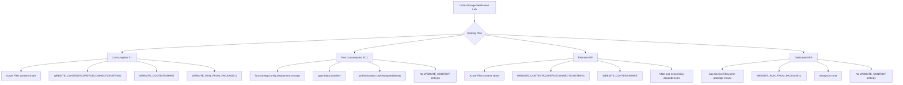

# Lab: Code Storage Verification (All Hosting Plans)

## Objective
Validate that Azure Functions code storage and deployment configuration is correct for all four hosting plans: Consumption (Y1), Flex Consumption (FC1), Premium (EP), and Dedicated (ASP).
Prove that each plan has a distinct storage contract and produces plan-specific failure signatures when misconfigured.

## Prerequisites
- Azure subscription with permission to create resource groups, role assignments, and Function Apps
- Azure CLI installed and authenticated
- Bash shell environment (Cloud Shell or local terminal)
- Access to deploy Bicep templates from the repository `infra/` directory

## Scenario
This lab verifies that Azure Functions does not use one universal code storage model across all hosting plans.
Each plan expects a different configuration contract (Azure Files, blob deployment descriptor, or App Service package mount), and drift in that contract causes predictable startup or trigger failures.
You will deploy all four plans, verify baseline settings, induce controlled misconfigurations (A-S), and restore service by applying plan-correct settings.

## Architecture Overview


## Variables
Use canonical variable names from the lab guide.

```bash
LOCATION="koreacentral"
SUBSCRIPTION_ID="<subscription-id>"

RG_Y1="rg-func-codeverify-y1"
RG_FC1="rg-func-codeverify-fc1"
RG_EP="rg-func-codeverify-ep"
RG_ASP="rg-func-codeverify-asp"

BASE_Y1="codeverifyy1"
BASE_FC1="codeverifyfc1"
BASE_EP="codeverifyep"
BASE_ASP="codeverifyasp"

APP_Y1="${BASE_Y1}-func"
APP_FC1="${BASE_FC1}-func"
APP_EP="${BASE_EP}-func"
APP_ASP="${BASE_ASP}-func"

PLAN_Y1="${BASE_Y1}-plan"
PLAN_FC1="${BASE_FC1}-plan"
PLAN_EP="${BASE_EP}-plan"
PLAN_ASP="${BASE_ASP}-plan"

STORAGE_Y1="${BASE_Y1}storage"
STORAGE_FC1="${BASE_FC1}storage"
STORAGE_EP="${BASE_EP}storage"
STORAGE_ASP="${BASE_ASP}storage"
```

## Steps

### Phase 1: Deploy All Four Plans
1. Verify your Azure context.
   ```bash
   az account show --output table
   az account set --subscription "$SUBSCRIPTION_ID"
   ```
2. Deploy Consumption (Y1).
   ```bash
   az group create \
     --name "$RG_Y1" \
     --location "$LOCATION"

   az deployment group create \
     --resource-group "$RG_Y1" \
     --template-file "infra/consumption/main.bicep" \
     --parameters "baseName=$BASE_Y1" "location=$LOCATION"
   ```
3. Deploy Flex Consumption (FC1).
   ```bash
   az group create \
     --name "$RG_FC1" \
     --location "$LOCATION"

   az deployment group create \
     --resource-group "$RG_FC1" \
     --template-file "infra/flex-consumption/main.bicep" \
     --parameters "baseName=$BASE_FC1" "location=$LOCATION"
   ```
4. Deploy Premium (EP).
   ```bash
   az group create \
     --name "$RG_EP" \
     --location "$LOCATION"

   az deployment group create \
     --resource-group "$RG_EP" \
     --template-file "infra/premium/main.bicep" \
     --parameters "baseName=$BASE_EP" "location=$LOCATION"
   ```
5. Deploy Dedicated (ASP).
   ```bash
   az group create \
     --name "$RG_ASP" \
     --location "$LOCATION"

   az deployment group create \
     --resource-group "$RG_ASP" \
     --template-file "infra/dedicated/main.bicep" \
     --parameters "baseName=$BASE_ASP" "location=$LOCATION"
   ```

### Phase 2: Baseline Verification
1. Verify app settings for each Function App.
   ```bash
   az functionapp config appsettings list \
     --resource-group "$RG_Y1" \
     --name "$APP_Y1" \
     --output json

   az functionapp config appsettings list \
     --resource-group "$RG_FC1" \
     --name "$APP_FC1" \
     --output json

   az functionapp config appsettings list \
     --resource-group "$RG_EP" \
     --name "$APP_EP" \
     --output json

   az functionapp config appsettings list \
     --resource-group "$RG_ASP" \
     --name "$APP_ASP" \
     --output json
   ```
2. Verify Flex Consumption deployment configuration.
   ```bash
   az functionapp show \
     --resource-group "$RG_FC1" \
     --name "$APP_FC1" \
     --query "functionAppConfig" \
     --output json
   ```
3. Verify managed identities.
   For Y1, EP, and ASP (system-assigned identity):
   ```bash
   az functionapp identity show --resource-group "$RG_Y1" --name "$APP_Y1" --output json
   az functionapp identity show --resource-group "$RG_EP" --name "$APP_EP" --output json
   az functionapp identity show --resource-group "$RG_ASP" --name "$APP_ASP" --output json
   ```
   For FC1 (user-assigned identity), extract the principal ID from the `userAssignedIdentities` map:
   ```bash
   az functionapp identity show \
     --resource-group "$RG_FC1" \
     --name "$APP_FC1" \
     --query "userAssignedIdentities.*.principalId | [0]" \
     --output tsv
   ```
4. Verify role assignments for each app identity against storage scope.
   ```bash
   az role assignment list --assignee "<principal-id>" --scope "<storage-resource-id>" --output table
   ```
5. Record baseline results before any drift injection.

### Phase 3: Misconfiguration Scenarios
Run one scenario at a time, capture behavior, then restore before moving to the next scenario.

| Scenario | Plan | What to break | Expected symptom |
|---|---|---|---|
| A | Y1 | Remove `WEBSITE_CONTENTSHARE` | Startup/content resolution errors, listener initialization issues |
| B | FC1 | Use wrong blob deployment path in `functionAppConfig` | Deployment package resolution failure, startup degradation |
| C | EP | Remove `WEBSITE_CONTENTAZUREFILECONNECTIONSTRING` | Azure Files content path failure during startup |
| D | ASP | Remove `WEBSITE_RUN_FROM_PACKAGE` | Stale or missing package behavior, inconsistent startup |
| E | Y1 (cross-plan) | Remove `AzureWebJobsStorage__accountName` | Host storage initialization failure |
| F | EP (cross-plan) | Set `AzureWebJobsStorage__credential` to invalid value | Managed identity storage auth failure |
| G | Y1 (cross-plan) | Remove all required RBAC role assignments | Authorization failures to storage resources |
| H | FC1 (cross-plan) | Point `AzureWebJobsStorage__accountName` to non-existent account | Endpoint/name resolution and storage access errors |
| I | Y1 | Remove `WEBSITE_CONTENTAZUREFILECONNECTIONSTRING` | Content share mount/config failures |
| J | Y1 | Set `WEBSITE_CONTENTSHARE` to non-existent share | File share not found and startup retries |
| K | Y1 | Set `WEBSITE_RUN_FROM_PACKAGE=0` | Package loading model mismatch and host instability |
| L | FC1 | Remove `AzureWebJobsStorage__clientId` | UAI reference missing; auth and startup issues |
| M | FC1 | Set deployment auth to `SystemAssigned` (mismatch) | Deployment storage authentication mismatch |
| N | FC1 | Add legacy `WEBSITE_CONTENT*` settings | Configuration drift; misleading and unsupported contract |
| O | FC1 | Set `allowSharedKeyAccess=true` | Security baseline drift from FC1 expected posture |
| P | EP | Remove `WEBSITE_CONTENTSHARE` | Azure Files content share resolution failure |
| Q | EP | Remove VNet integration | Network path failures to dependent resources |
| R | ASP | Set `alwaysOn=false` | Timer/listener cadence drift, delayed cold starts |
| S | ASP | Add `WEBSITE_CONTENT*` settings | Wrong-plan configuration drift and ambiguous behavior |

!!! note "Scenario execution guidance"
    See the full lab guide for exact command-level procedures, evidence checkpoints, and interpretation logic.
    Use this README as the operational quick-start and scenario index.

### Phase 4: Recovery
1. Restore the exact plan-specific setting or identity/RBAC contract changed in each scenario.
2. Restart only the affected Function App when required.
3. Re-run baseline verification commands (`appsettings`, `functionAppConfig`, `identity`, and `role assignment`) and confirm expected values.
4. Confirm trigger startup and execution cadence return to baseline.

## Quick Verification Script
Use the helper script after deployment and after each recovery action:

```bash
bash "labs/code-storage-verification/scripts/verify-storage.sh"
```

The script is expected to validate plan-specific storage contracts and report drift candidates quickly.

## Expected Behavior
- Baseline state shows plan-correct settings for Y1, FC1, EP, and ASP with no contradictory storage model settings.
- FC1 validation confirms `functionAppConfig.deployment.storage` uses `blobContainer` with `UserAssignedIdentity`.
- Y1 and EP fail predictably when Azure Files content settings drift, then recover after exact settings are restored.
- ASP fails predictably when package mount or `alwaysOn` posture drifts, then recovers with `WEBSITE_RUN_FROM_PACKAGE=1` and `alwaysOn=true`.
- Cross-plan identity and RBAC misconfigurations produce storage authorization or startup failures until role and credential contracts are restored.

## Key Observations
- Hosting plan classification is the first troubleshooting decision; applying the wrong storage model increases incident duration.
- `WEBSITE_CONTENT*` settings are required for Y1 and EP, invalid/noise for FC1 and ASP baseline.
- FC1 is uniquely dependent on `functionAppConfig.deployment.storage` semantics and user-assigned identity alignment.
- ASP reliability is strongly tied to package mount consistency and `alwaysOn`; it does not require Azure Files content settings.
- Identity and RBAC drift can look like generic runtime faults but are deterministic when traced against the plan contract.
- Recovery is deterministic when operators restore the exact missing or mismatched contract rather than broad restart loops.

## Cleanup
Delete all lab resource groups after completing validation.

```bash
az group delete --name "$RG_Y1" --yes --no-wait
az group delete --name "$RG_FC1" --yes --no-wait
az group delete --name "$RG_EP" --yes --no-wait
az group delete --name "$RG_ASP" --yes --no-wait
```

## See Also
- [Code Storage Verification Lab Guide](../../docs/troubleshooting/lab-guides/code-storage-verification.md)
- [Azure Functions Hosting Plans](../../docs/platform/hosting.md)
- [Storage Access Failure Lab](../storage-access-failure/README.md)
